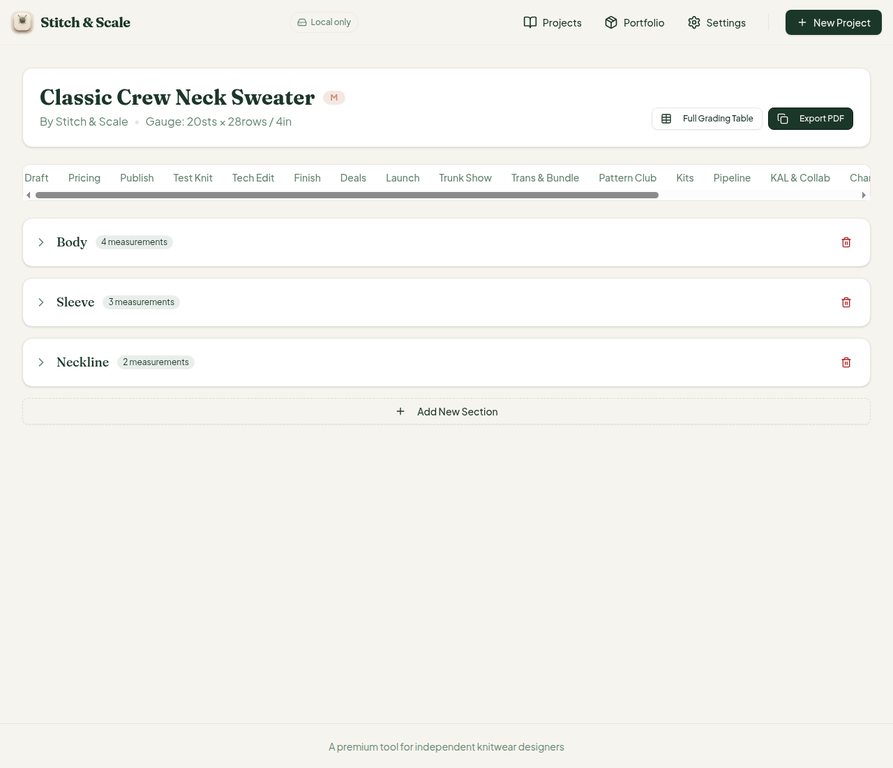
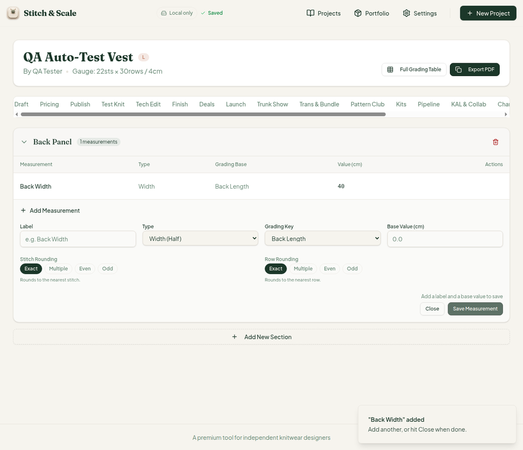
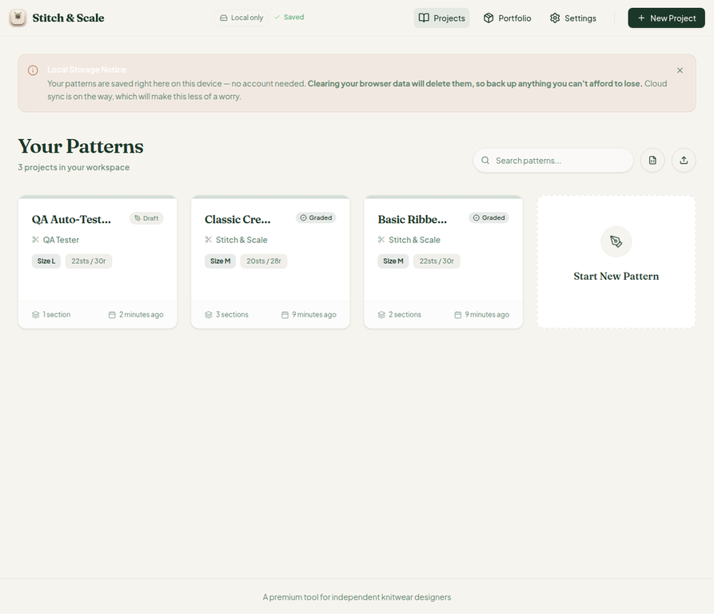
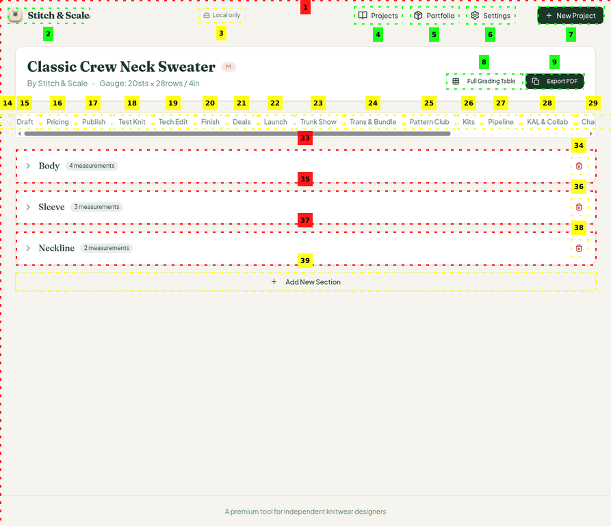
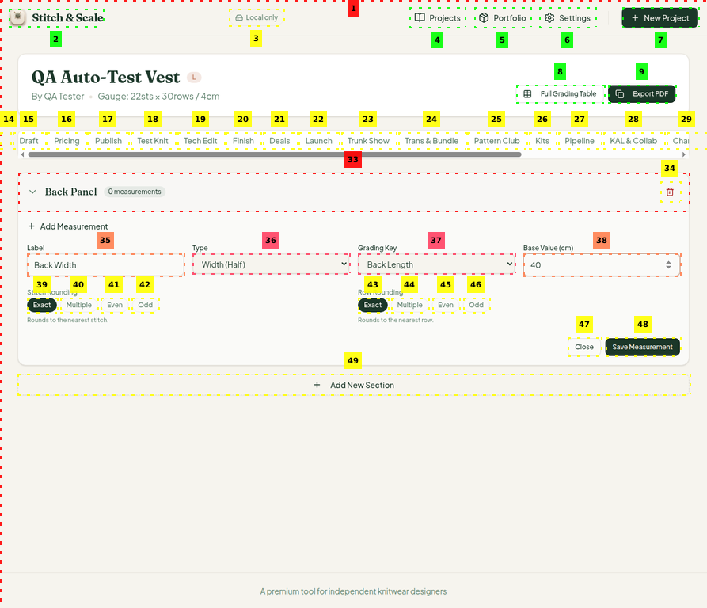

# Stitch & Scale — QA Test Report

**Scope:** Full end-to-end QA of `artifacts/stitch-and-scale` (hosted locally, exercised in a real browser). No source code was modified during this session.
**Date:** 2026-08-14
**Tester:** Manus QA (third role: host + user-level functional tester)
**Baseline commit:** current `main` of `stitch-and-scale-pro` (no code changes made — baseline verified before and after the session)

> **This report is addressed to the Reviewer.** It contains verified findings from hands-on use of the application. The Coder should not act on any item below; the Reviewer should assess each finding and decide whether to open implementation work (and if so, hand it to the Coder). Per the protocol, this report does not touch `src/` or any code path.

## 1. Summary

The application is fundamentally healthy. The workspace baseline is green (typecheck, **397/397 tests**, production build), the grading engine computes internally consistent results across all 9 sizes, all 23 workspace tool tabs render non-empty panels with real interactive controls, the 7-step onboarding flows cleanly, and data persists correctly through a simulated crash.

Two issues stand out. The first is **critical**: a measurement can be deleted with a single click, no confirmation, and no undo, and there is no edit path for existing measurements. The second is **medium**: the Publish checklist's gauge-plausibility warning displays a units-mismatched range. Three minor cosmetics and two content-level questions for the Reviewer round out the list.

| Severity | Count | Item |
| --- | --- | --- |
| Critical | 1 | Instant measurement delete, no confirmation or undo |
| Major | 1 | No edit path for existing measurements |
| Medium | 1 | Gauge plausibility warning range uses wrong units |
| Minor | 2 | Gauge unit suffix `per 4cm` static in inches mode; quote glitch in Launch milestone copy |
| Informational | 3 | Yarn estimator lace-yardage model; new pattern defaults to lace yarn in Portfolio; toast Close ambiguity |
| Unverifiable | 2 | `window.print` paths (Print Sheet, Export PDF) cannot be exercised in the sandbox browser — recommend Reviewer spot-check in a real browser |

## 2. Detailed Findings

### F1 — Measurement delete is instant and irreversible (CRITICAL)

`handleDeleteMeasurement` in `src/pages/project-workspace.tsx` (~line 234) filters the measurement out immediately on click. In a real browser session, clicking the trash icon in the Actions cell removed the "Back Width" measurement the instant the click fired — no `AlertDialog` (which exists in the codebase as `src/components/ui/alert-dialog.tsx`) is wired to it. The section counter flipped from 1 to 0 measurements with no toast confirmation and no undo affordance.

Combined with the absence of any edit flow (see F2), one misclick can permanently destroy a manually entered measurement. Suggested direction for the Reviewer: wire `AlertDialogTrigger` around the trash button (the delete *section* button has the same gap at line 388) and consider a soft-delete/undo toast for a session.

### F2 — No edit flow for existing measurements (MAJOR)

The measurement row's Actions cell contains only the delete button. Typos in base values, types, or grading keys currently require delete-and-recreate, which also loses the measurement id and any downstream references. An inline edit (the `Edit2` icon is already imported at the top of the file but unused) would close the most common failure mode for manual data entry.

### F3 — Gauge plausibility warning shows a units-mismatched range (MEDIUM)

The Publish tab's gauge check flags the sample project with: "Gauge 20 sts / 28 rows over 4in sits outside the expected range for Worsted (4) (~0.4–8.5 sts)." A gauge of 20 sts/4in is 5 sts/in, squarely inside typical worsted territory. The printed range `~0.4–8.5` matches a **per-centimetre** interpretation (5 sts/in ≈ 1.97 sts/cm, which is inside 0.4–8.5) — so either the comparison or the label is mixing units. The check still passes; the label text is what needs review.

### F4 — Gauge unit suffix is static (MINOR)

In the New Project wizard, step 3 shows `per 4cm` under both the Stitches and Rows inputs even when the workspace unit is Inches (the section heading says "per 4 inches (10 cm)"). The per-field suffix should follow the selected unit.

### F5 — Quote glitch in Launch milestone copy (MINOR)

The D-2 launch milestone text contains a stray quote mid-string: `"…XS–5XL sizes, Worsted (4\"…"`. Cosmetic text bug in `LaunchCampaignCard`.

### F6 — Yarn estimator yardage model for fine weights (INFORMATIONAL)

`yardagePer100g` uses lace = 450 yd (CYC midpoint is closer to 870) and total yardage scales with the square of the gauge ratio, producing 7,288 yd for lace vs 2,624 yd for worsted for the same garment — physically counterintuitive (finer yarns knit a denser fabric, but not ~3× the yardage). The model is internally consistent and documented, but the Reviewer should sanity-check the reference table against published CYC values.

### F7 — New pattern inherits "lace" yarn weight in Portfolio (INFORMATIONAL)

A brand-new pattern with no yarn data appears as "lace" in the Portfolio launch ranking, which affects readiness-derived KPIs (readiness 50/100, catalogue value). The Portfolio should either leave yarn weight unset or derive a neutral default.

### F8 — Toast Close ambiguity (INFORMATIONAL)

The add-measurement toast says "hit Close when done", but the Close button belongs to the form, not the toast. Minor UX ambiguity.

## 3. Verified Working (highlights)

The following were exercised hands-on and confirmed working. The grading engine is mathematically sound: every tested cell's stitch count, "exact" value, and physical length are internally consistent (e.g., 87 sts at 22 sts/4in = 40.2 cm ✓). All 23 tool tabs activate and render substantive panels (Notes through Hire vs Self), with real interactivity verified in Launch (date-driven KAL timeline regeneration, gates system), Publish (12-check readiness, 92/100 credibility score), Income (platform net comparison), and Pricing (cost-plus floor arithmetic verified: 20h × $25 / 150 = $3.33 ✓). The PDF export page's four templates, accent color picker, include-switches, and filename memory all behave correctly; `Copy TSV` and CSV download produce data matching the on-screen table. Settings changes (units, theme) persist across reloads; the JSON backup export is valid and complete; the crash-recovery banner ("Your work is safe…") correctly appeared and data survived a killed session. The 7-step onboarding, new-project wizard, section/measurement creation, and portfolio ranking all flow end to end. Post-session baseline: typecheck clean, 397/397 tests pass, production build succeeds — no regressions.

## 4. Test Environment Notes

Browser testing ran against `localhost:5173` (Vite dev server, fresh browser profile). Two verification constraints are inherent to the environment, not to the app: `window.print` destinations (Grading "Print Sheet" and "Export PDF" print dialog) open an OS-level dialog that the headless browser cannot complete, and clipboard writes (`Copy TSV`) were confirmed via the success toast only. A human Reviewer click-through in a real browser would close the remaining print-path coverage gap.

## 5. QA Screenshots (appendix)
Visual evidence from the hands-on browser session. Original timestamps preserved in filenames.

