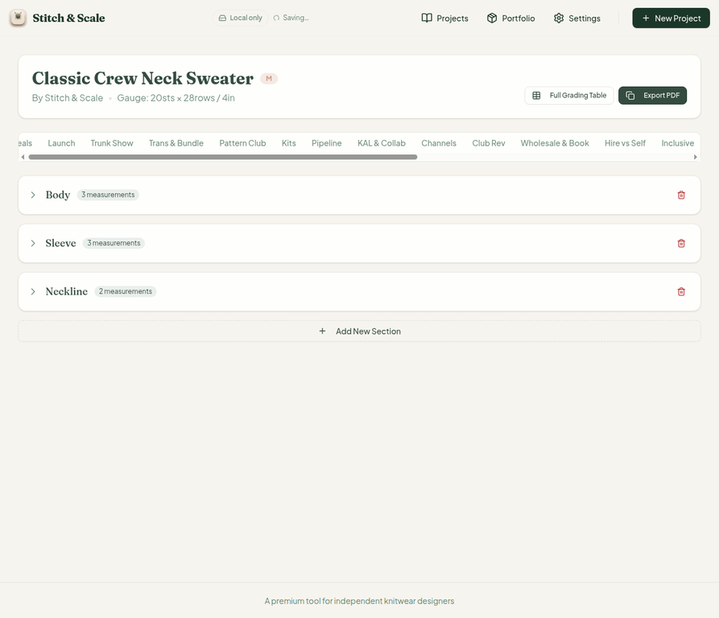
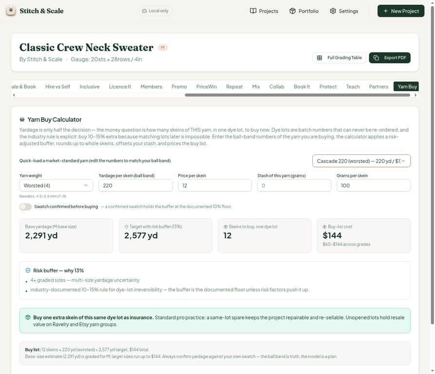
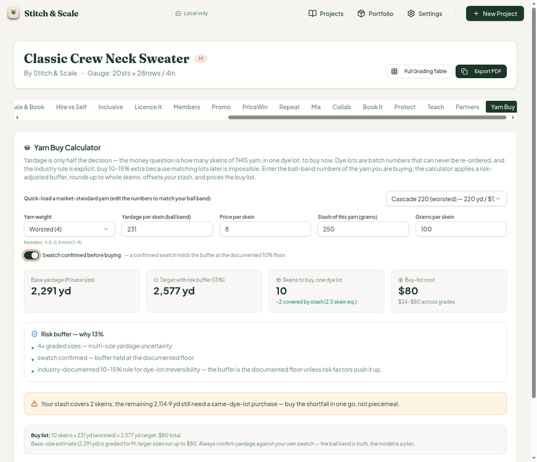
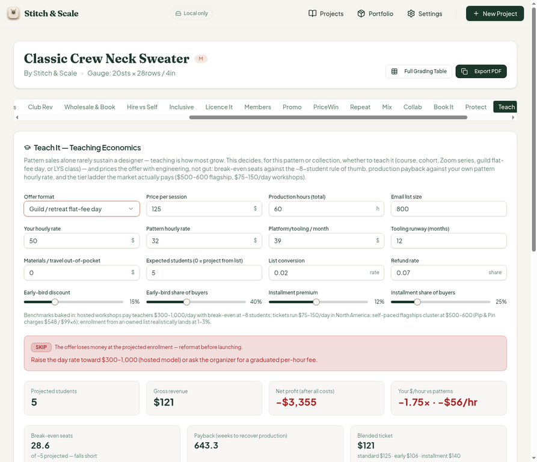
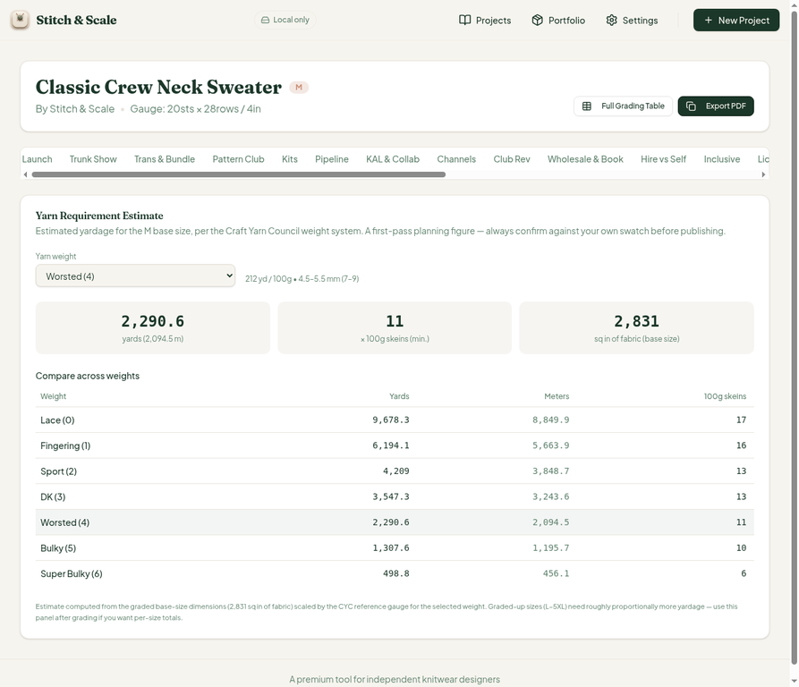
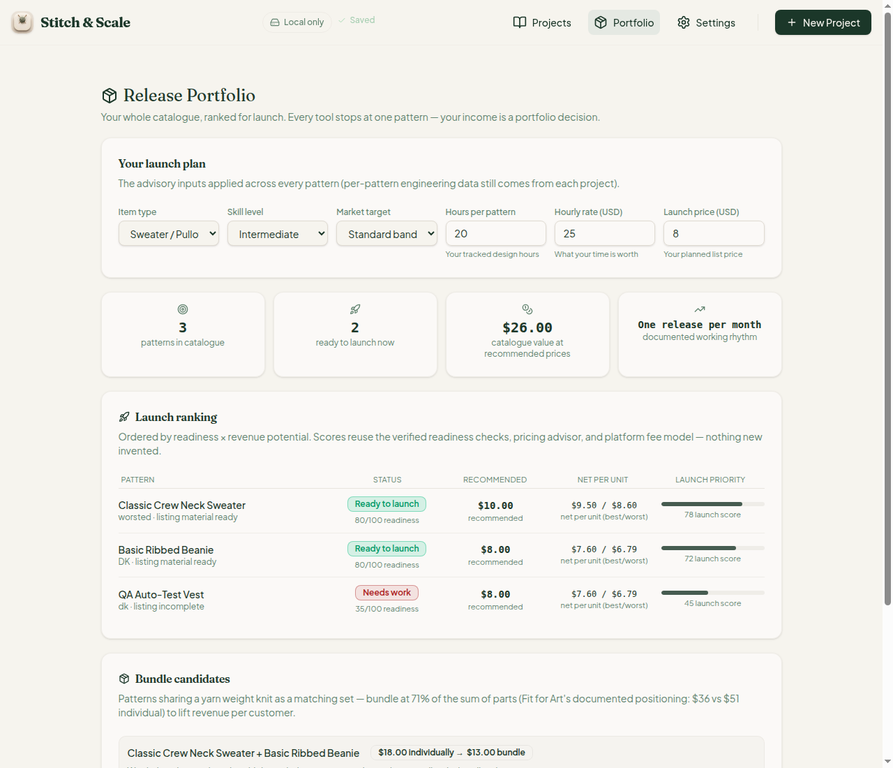
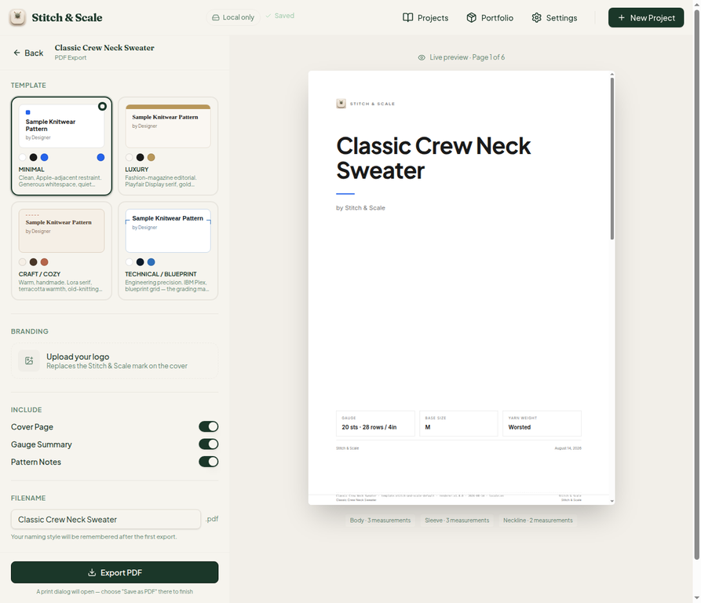
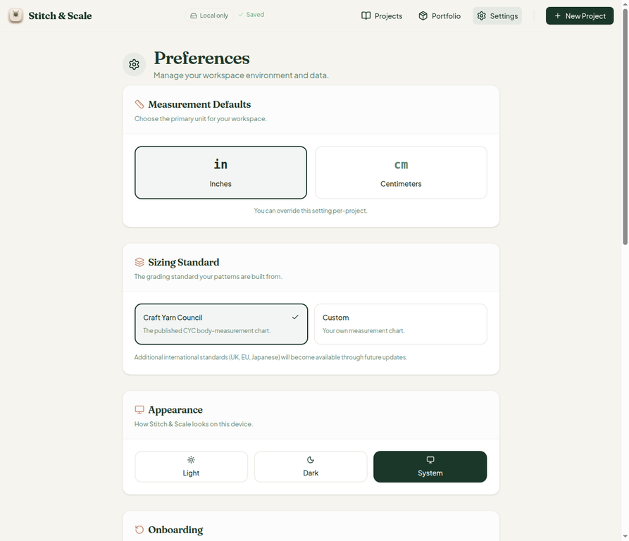
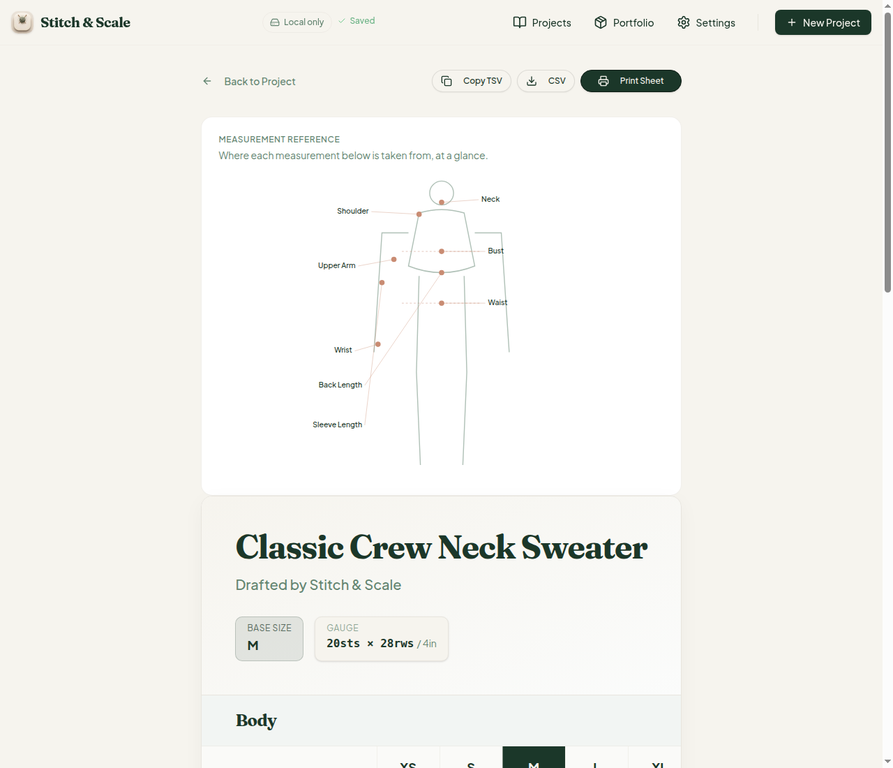

# QA Report — Cycle 11 (CHK-037)

**Repo:** `plastic-dude/stitch-and-scale-pro` · **Branch reviewed:** `main` · **HEAD:** `7db66cc` (code commit `396c1c9`, "CHK-037: storage-seam sweep, CYC yardage/gauge fixes #11, portfolio lace-inference fix #12, royalty double-count fix, PDF provenance footer, Yarn Buy Calculator (36th tab)") · **Date:** 2026-08-14 · **Author:** Manus QA

> **This report is addressed to the Reviewer. The Coder should not act on this report without the Reviewer's assessment.** All QA artifacts live in the `qa/` branch namespace; no application code was modified.

## 1. Change scope and baseline

The cycle compared origin/main against the last-reviewed marker (`4e143cd`), detected new code, and ran the full playbook: `pnpm install`, TypeScript typecheck, the Vitest suite, and a production build, followed by a killed-and-restarted dev server before any browser work.

| Baseline gate | Result |
| --- | --- |
| Typecheck (all 3 workspaces) | Clean — no errors |
| Vitest | **646/646 passing** (38 files, up from 623/37) |
| Production build (`pnpm build`) | Green, 6.55 s |
| Dev server (Vite 7.3.6, port 5173) | Fresh restart after pull, HTTP 200 |

CHK-037 delivered five changes: the storage-seam sweep (project-scoped `projectStorage` with legacy bare-key cards refactored and legacy keys folded in then removed), the CYC yardage/gauge fixes (#11), the portfolio lace-inference fix (#12), a royalty double-count fix in the yarn-company deal engine, the PDF provenance footer (publishing-system proposal P0), and the brand-new **Yarn Buy Calculator** — the 36th workspace tab, shipping with 13 dedicated tests.

## 2. New feature: Yarn Buy Calculator (tab 36 of 36)

The tab loads cleanly after a hard reload and renders its full flow: an intro citing the published 10–15% dye-lot buffer rule, a seven-yarn quick-load selector (Shibui Silk Cloud, KnitPicks Stroll, Madelinetosh Tosh Sport, Berroco Vintage DK, Cascade 220, Malabrigo Rasta, Lion Brand Wool-Ease Thick & Quick), per-skein yardage/price inputs, stash grams and grams-per-skein offset, a swatch-confirmed switch, and a computed plan.

**Math verification — Cascade 220, worsted, no stash.** Base 2,291 yd; buffer 10% + 2.5% (4+ graded sizes) = 12.5% → target 2,577 yd; ceil(2,577.4/220) = 12 skeins; cost $144; grade range $60–$144; insurance skein recommended. Every figure checked by hand against `estimateYarn` and the buy-plan formula.

**Math verification — KnitPicks Stroll, stash offset.** With 250 g stash at 100 g/skein: gross 12 skeins − floor(2.5) = 2 covered → **buy 10 skeins at $80**, shortfall 2,114.9 yd. The floor-to-whole-skein stash rule ("a partial skein still requires a full same-lot purchase") is applied correctly, and the insurance-skein card correctly disappears when stash is present.

## 3. Findings

### Finding #27 (MAJOR) — Yarn Buy "swatch confirmed" switch is cosmetic

The panel promises: *"Swatch confirmed before buying — a confirmed swatch holds the buffer at the documented 10% floor."* The reasons list repeats: *"swatch confirmed — buffer held at the documented floor."* In reality, `bufferFor()` in `yarn-buy-calculator.ts` only **appends that reason string** when the switch is on — it never lowers the percentage. With the 4+ graded-sizes increment, the buffer stays at 12.5% regardless of the switch state; toggling on/off changed only the reasons list while base/target/skeins/cost stayed identical (2,291 yd → 2,577 yd → 10 skeins → $80 in both states). A user who has actually swatched is shown the same over-buying they paid to avoid, in direct contradiction of the on-panel promise.

**Fix direction:** clamp `pct` to the base buffer when `swatchConfirmed` is true, e.g. `pct = swatchConfirmed ? BASE_BUFFER : BASE_BUFFER + increments` (clamped to MAX), and consider showing the buffer to one decimal ("12.5%") so the label and the reasons agree.

### Finding #28 (MINOR) — Buffer displayed as "13%" while computed as 12.5%

The risk-buffer cards show `0.125` rounded to "13%" ("Risk buffer — why 13%"), while the reasons list correctly itemizes 10% + 2.5% = 12.5%. The skein count is unaffected in the tested scenarios, but the rounded label can mislead a reader into re-checking arithmetic that appears to disagree with the stated reasons — a small consistency issue the Reviewer may want the Coder to resolve alongside #27 (e.g., display one decimal place).

A related observation, not a bug: the shortfall figure (2,114.9 yd) is internally consistent — it uses the unrounded base yardage in the target while the base card displays the rounded 2,291. The two card values agree to the displayed precision; flagging only for completeness.

### Regression: Teach flat-fee UI leak (#25) still present on the new HEAD

The guild format switch still leaves the per-student ticket ladder (early-bird/installment sliders, blended ticket $121, tier copy block) visible, and the economics cards still drive headline math from per-student ticket arithmetic in a flat-fee-day mode — projected "Gross revenue $121" against a $3,355 loss for a guild format priced per day. Noted to the Reviewer: **#25 remains open and unremediated**; CHK-037 did not touch the Teach engine.

## 4. Fix verification (CHK-037 claims)

| Fix | Check | Result |
| --- | --- | --- |
| #11 CYC yardage | Yarn estimator now shows 212 yd/100g for worsted (was 185 at the range floor); cross-weight table's skein counts verify (worsted 2,290.6/212 = 10.8 → 11; lace 9,678.3/600 = 16.13 → 17) | **PASS** |
| #11 gauge matching | 20 sts/4in now resolves to worsted (5/in vs 4.5/in midpoint) instead of the old lace mispick | **PASS** |
| #12 portfolio lace | Portfolio now labels the sweater "worsted · listing material ready" | **PASS** |
| Royalty double-count | Library-level fix (`net = royalties + max(base,0)`) read from code; new vitest assertions green (646/646 incl. the S015 gross-vs-net and strong-royalty "take" tests). The `royalty_no_exclusivity` deal type is not exposed in the UI Select (UI types: yarn support, IDP listing, lump sum, exclusivity window, LYS Day, KAL host) — the fix is currently exercised only via tests/library paths | **PASS** (with note) |
| Storage seam | Settings shows browser storage and offline cache both holding 3 projects, "Stores in sync"; backup date current; dual-copy health intact after the rekeying | **PASS** |
| PDF provenance footer | The renderer's identity string (pattern · template · renderer v1.0.0 · date · locale) now renders in the live PDF preview footer; all four templates render | **PASS** (full print dialog remains untestable headless — documented caveat, cf. #13) |

## 5. Regressions spot-check

The full grading table renders all nine sizes XS–5XL with per-cell stitch/row/inch precision and Copy TSV / CSV / Print Sheet intact (unchanged values vs. previous cycles). The PDF page renders all four templates (Minimal, Luxury, Craft/Cozy, Technical/Blueprint) with the new footer. Dashboard, portfolio, and all three projects remain intact. No regressions attributable to CHK-037 were found.

## 6. Test-harness observation (dev server stale page)

After pulling, a normal same-URL browser navigation kept the old 35-tab strip (Yarn Buy absent) until a hard reload — the Vite dev server serves the transformed HTML shell once per navigation. Users of a redeployed production site get fresh HTML automatically, so this is **dev-server behavior, not a production defect** (flagged INFO only). Nothing to fix on the app.

## 7. Summary

| Metric | Value |
| --- | --- |
| Baseline | typecheck clean · 646/646 vitest · build green |
| New feature deep-tested | Yarn Buy Calculator (36th tab) — math verified |
| New findings | **#27 MAJOR** (cosmetic swatch switch), **#28 MINOR** (13% vs 12.5% label) |
| Fix verifications | #11, #12, royalty double-count, storage seam, provenance footer — all pass |
| Regressions | None attributable to CHK-037; **#25/#26 (Teach) remain open** |
| Artifacts | `qa/manus-2026-08-14-cycle11` branch, 10 screenshots |

All screenshots are in `qa-shots-cycle11/` on the `qa/manus-2026-08-14-cycle11` branch. No pushes were made to `main`, and no `src/` code was modified.
