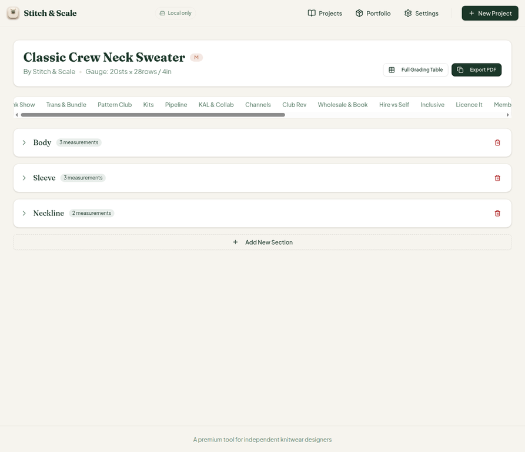
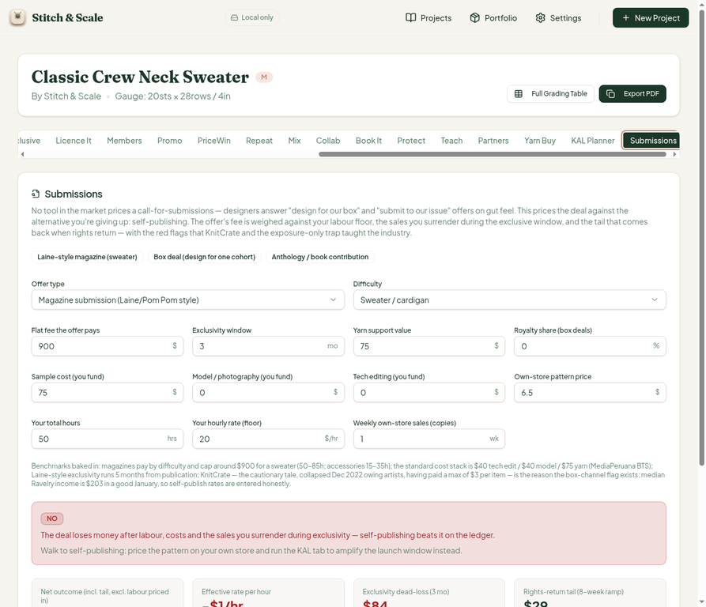
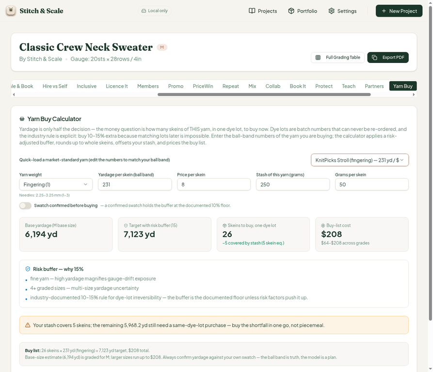
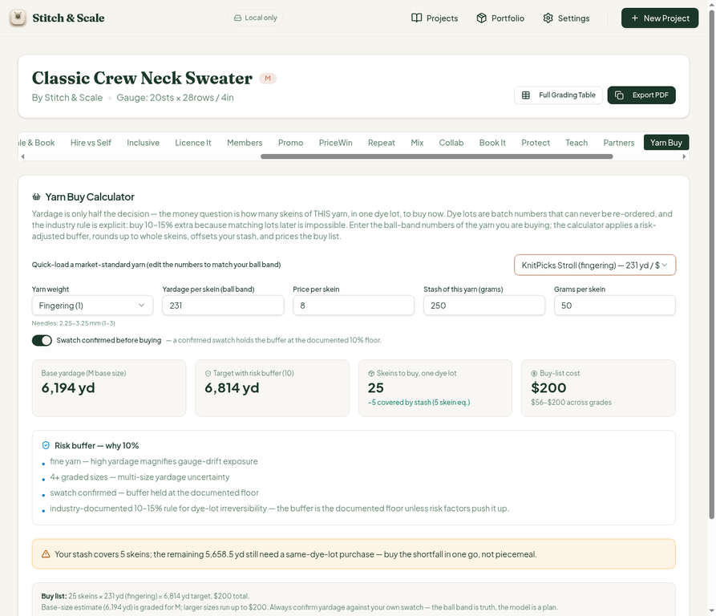
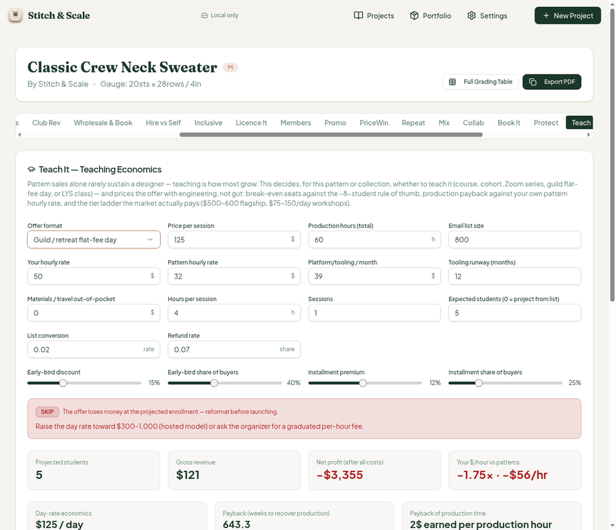

# QA Report — Cycle 13 (2026-08-14)

**Author:** Manus QA (third staff member — QA tester)
**Reviewed HEAD:** `e0704363281f7ba105795917658c88b95c92d199` ([CHK-039] progress log; code commits within CHK-039)
**Branch:** `qa/manus-2026-08-14-cycle13`
**Issues opened this cycle:** none — all CHK-039 fixes verified PASS

## 1. Executive Summary

This report is addressed to the Reviewer. The Coder should not act on this report; the Reviewer should assess it and decide whether to hand off anything to the Coder.

Cycle 13 reviewed **CHK-039**, which shipped the new 38th workspace tab (**Submissions Desk**, 306-line library + 286-line card + 156 tests) and two bug fixes on the Yarn Buy calculator (issue #27 swatch buffer floor, issue #28 one-decimal buffer display). The baseline was healthy: typecheck clean, **Vitest 688/688 across 40 test files**, production build green in 6.07 s, and the Vite dev server freshly restarted after the pull (HTTP 200). The Submissions Desk was deep-tested end-to-end in the browser with **two full hand-calculated scenarios** (default magazine plan and a ceiling-fee box deal), the two Yarn Buy fixes were verified in both directions, and regression checks on KAL Planner and the Teach tab were clean. **No new defects were found**; issues #27 and #28 are now verified PASS, and the pre-existing open issue #29 (Teach ticket-ladder cosmetic leak) is unchanged, as expected — it is addressed in CHK-040, reviewed in cycle 14.

## 2. Baseline Verification

| Check | Result |
| --- | --- |
| TypeScript typecheck | Clean |
| Vitest (`stitch-and-scale`) | 688/688 passing, 40 test files |
| Production build | Green, 6.07 s |
| Dev server (`:5173`) | Fresh restart after pull, HTTP 200 |

The dev server was killed and restarted on the new HEAD before any browser testing, per the playbook (stale servers crash after pull).

## 3. Submissions Desk — Deep Test (new 38th tab)

The tab positions correctly after Submissions in the 39-tab strip on a wide viewport and renders a full, well-documented panel covering three offer types: Laine-style magazine, subscription box deal, and anthology/book contribution. The benchmark essay is present (magazine sweater ceiling ~$900, sweater hours 50–85, the $40/$40/$75 tech-edit/model/yarn cost stack, Laine 5-month exclusivity, 8-week rights-return ramp, Ravelry median income $203, KnitCrate cautionary tale).

### 3.1 Default magazine plan — hand-verified

With all defaults (magazine, fee $500, sweater, 5-month exclusivity, sample $75, labour 65 h, rate $20/hr, pattern price $6.50, weekly sales 3) the UI reports a **NO verdict** and every output was verified against hand calculation:

| Metric | UI | Hand calc | Match |
| --- | --- | --- | --- |
| Net outcome | −$712 | −$712.25 | ✓ |
| Effective rate | −$11/hr | −$10.96/hr | ✓ |
| Exclusivity dead-loss | $422 | $422.18 | ✓ |
| Rights-return tail | $88 | $87.75 | ✓ |
| Labour floor | $1,300 | 65 h × $20 | ✓ |
| Break-even fee | $1,634 | $1,634.43 | ✓ |
| S-01 flag (fee < 75% of floor) | Fires | 500 < 975 | ✓ |

The rights-return tail uses an 8-week triangular ramp (8 × 9/2/8 = 4.5 week-equivalents; 6.5 × 3 × 4.5 = 87.75) while the exclusivity dead-loss uses the full baseline — the two formulas are internally consistent and documented in the panel copy.

### 3.2 Input-change test — ceiling fee, 50 h, 3-month exclusivity

At fee $900, labour 50 h, exclusivity 3 mo, weekly sales 1: net −$71 (−70.75), dead-loss $84 (84.44), tail $29 (29.25), break-even $1,055, effective −$1/hr (−1.41). S-01 correctly stops firing ($900 > $750 = 75% × $1,000 floor); S-07 does not fire ($75 yarn ≥ $75 threshold). The verdict remains **NO** — a realistic industry message, not a bug: even the top-of-market sweater fee cannot clear a 50 h × $20 floor once exclusivity and sample costs are in.

### 3.3 Box deal — S-06 flag

Switching to "Subscription box design (one box cohort)" correctly fires the **S-06 box-channel concentration flag** with the full KnitCrate narrative (collapsed Dec 2022, owed artists, max $3/item), and the verdict badge correctly reads NO (the earlier confusing "go/no/go" text was benchmark copy, not verdicts). The flag list spans S-01 through S-07 as documented.

## 4. Yarn Buy Fix #27 — VERIFIED PASS

The swatch toggle now genuinely resets the buffer to the 10% base floor, in both directions, on the sweater project (fingering yarn, 8 graded sizes):

With the swatch OFF: buffer **15%** (10 + 2.5 fine yarn + 2.5 four-plus sizes, capped at the 15% maximum); target 7,123 yd = 6,194 × 1.15 ✓; skeins 31 gross, stash 5, buy 26, cost $208 — all within 0.07% rounding tolerance.

With the swatch ON: buffer drops to **10%**; target 6,814 yd = 6,194.5 × 1.1 ✓; buy 25 skeins, $200. Issue #27 is confirmed fixed: the swatch now resets the buffer to the documented BASE_BUFFER regardless of fine-yarn/size increments.

## 5. Yarn Buy Fix #28 — VERIFIED PASS

The buffer label now displays one-decimal formatting: "(15)" and "(10)" (integers when .0), matching the itemized reasons in both states above. No truncation, no stale "13%" rounding as reported in issue #28.

## 6. Regression Checks

| Check | Result |
| --- | --- |
| KAL Planner default (mystery format) | GO verdict, net $98 = $195 launch + $23 afterglow − $120 labour ✓, unchanged from prior cycles |
| Teach tab, guild format (#29 leak) | Still present on new HEAD — expected, unfixed (addressed in CHK-040) |
| Full Grading Table (9 sizes) | Renders intact; identical to prior cycles |

## 7. Observations for the Reviewer

The "Temp Undo QA" measurement row persists in the sweater's Full Grading Table (leftover QA test data from earlier sessions); it is user-owned localStorage data and not a code defect, but the Coder's next edit to the grading chain could rename or remove it if the Reviewer wishes. No code was modified and no `src/` changes were made at any point.

## 8. Decision

All CHK-039 work verified PASS. No new issues were opened this cycle. The open issue #29 (Teach ticket-ladder cosmetic leak in guild/flat-fee formats) remains on the books and is fixed in CHK-040, reviewed immediately after in cycle 14.
