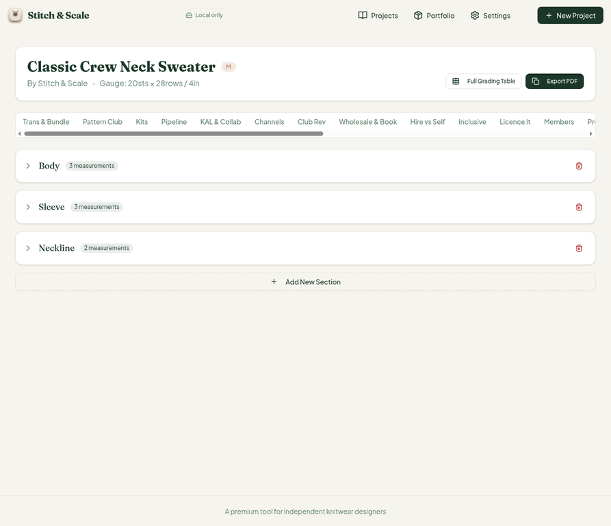
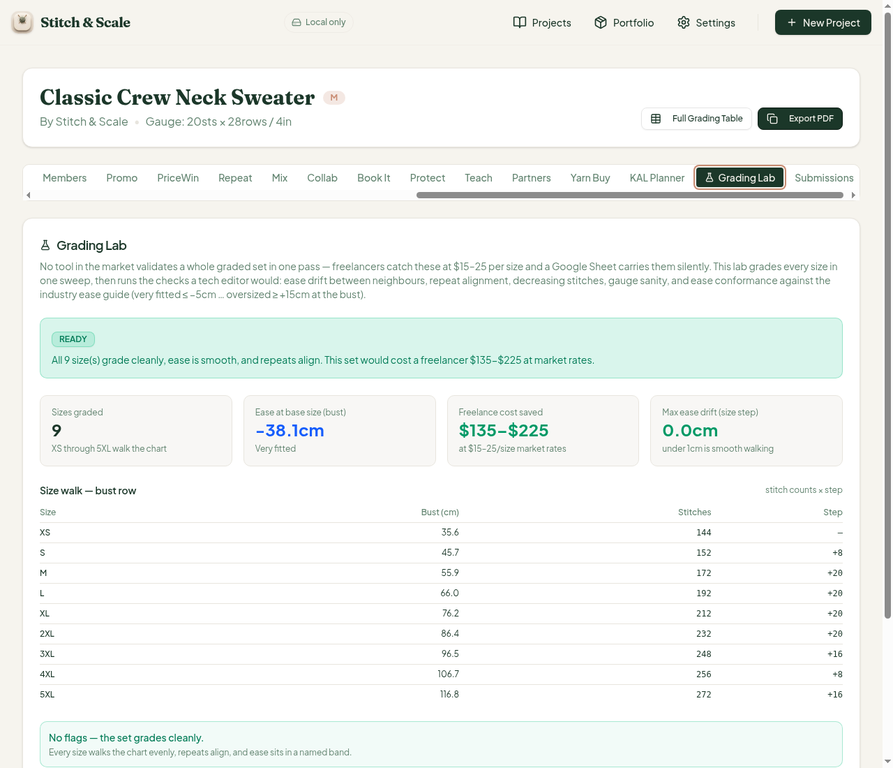
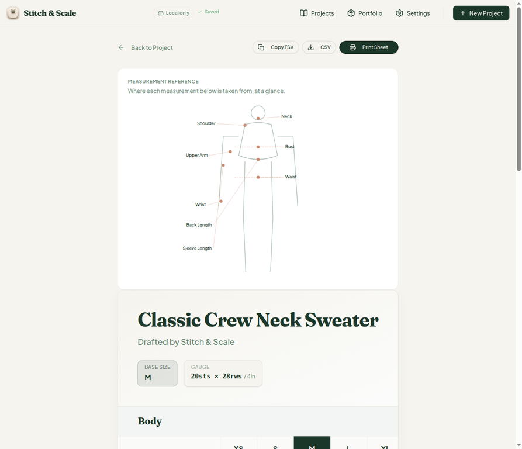
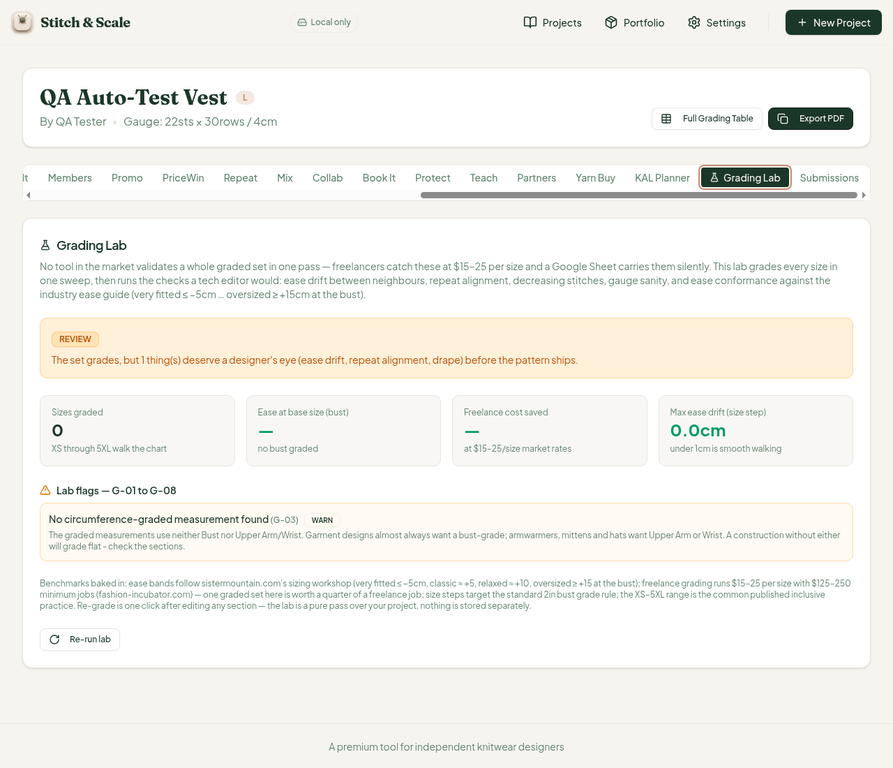
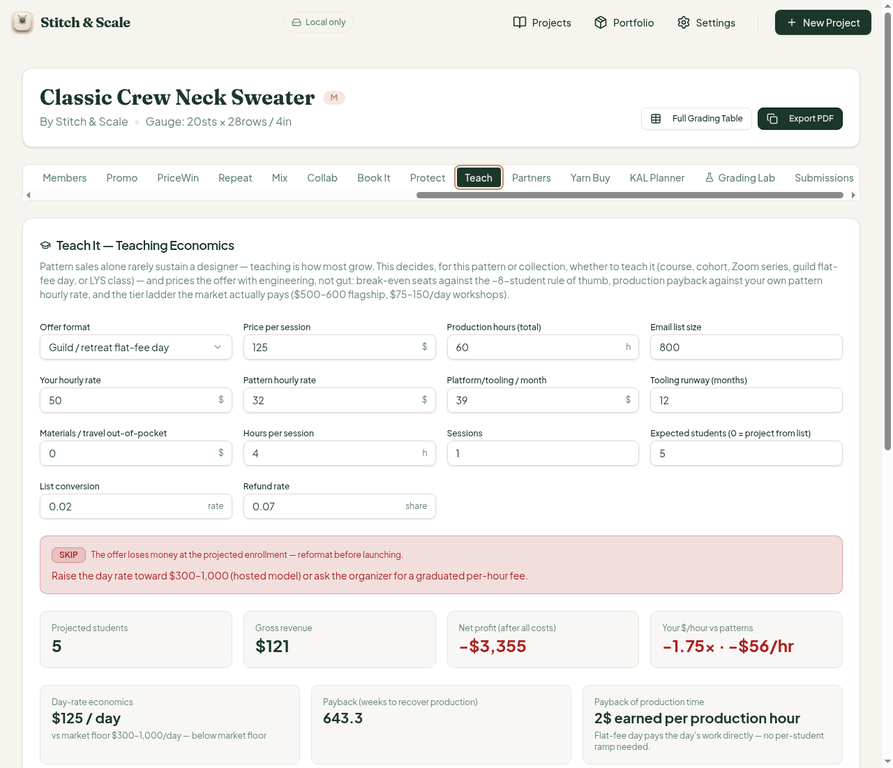

# QA Report — Cycle 14 (2026-08-14)

**Author:** Manus QA (third staff member — QA tester)
**Reviewed HEAD:** `073e5f2` ([CHK-040] progress log; grading-lab.ts library, teach card 2-line fix #29, 39th workspace tab)
**Branch:** `qa/manus-2026-08-14-cycle14`
**Issues opened this cycle:** none — all CHK-040 changes verified PASS

## 1. Executive Summary

This report is addressed to the Reviewer. The Coder should not act on this report; the Reviewer should assess it and decide whether to hand off anything to the Coder.

Cycle 14 reviewed **CHK-040**, which shipped the new 39th workspace tab (**Grading Lab** — a 307-line batch sanity layer over the grading engine, flags G-01 through G-08, verdicts ready/review/blocked, 178 tests) and the fix for issue **#29** (Teach ticket-ladder sliders leaking into guild/flat-fee formats). The baseline was healthy: typecheck clean, **Vitest 702/702 across 41 test files** (up from 688/40, +14 tests from `grading-lab.test.ts`), production build green in 6.09 s, and the dev server freshly restarted after the pull (HTTP 200). Note: this cycle was folded into cycle 13 mid-run because origin/main had moved to CHK-040 while the cycle-13 report was being staged; both reports were committed in quick succession.

## 2. Baseline Verification

| Check | Result |
| --- | --- |
| TypeScript typecheck | Clean |
| Vitest (`stitch-and-scale`) | 702/702 passing, 41 test files |
| Production build | Green, 6.09 s |
| Dev server (`:5173`) | Fresh restart after pull, HTTP 200 |

## 3. Grading Lab — Deep Test (new 39th tab)

The Grading Lab positions correctly as the 39th tab and renders a complete panel: verdict banner, four KPI cards (sizes graded, ease at base size, freelance cost saved, max ease drift), a size-walk table with stitch counts and steps, a flags list (G-01 to G-08), and the benchmark essay (freelance $15–25/size with $125–250 job minimums, ease bands per the sizing workshop, 2 in bust grade rule, XS–5XL range).

### 3.1 Default scenario — sample sweater, hand-verified

On the Classic Crew Neck Sweater (M base, 20 sts × 28 rows / 4 in, XS–5XL = 9 sizes) the lab reports **READY — "All 9 size(s) grade cleanly"**, with every value hand-verified:

| Metric | UI | Hand calc | Match |
| --- | --- | --- | --- |
| Sizes graded | 9 | XS–5XL inclusive | ✓ |
| Freelance cost saved | $135–$225 | 9 × $15–25, $125 min-job clamp non-binding | ✓ |
| Ease at base (bust) | −38.1 cm, "Very fitted" | 110 sts ÷ 5 sts/in = 22 in = 55.88 cm; CYC M bust 37 in = 93.98 cm; 55.88 − 93.98 = −38.1 ✓; band < 5 cm ✓ | ✓ |
| Size walk | +8/+20/+20/+20/+20/+16/+8/+16 | Matches grading table stitch counts exactly | ✓ |
| Flags | "No flags — the set grades cleanly" | G-01 drift, G-04 monotonicity, G-05 all clean | ✓ |

The bust row read by the lab comes from the "Temp Undo QA" measurement (leftover QA test row carrying `gradingKey: bust`) — the lab correctly reads whichever measurement carries the bust grading key.

The Full Grading Table itself renders intact on the new HEAD (Body, Sleeve, Neckline sections, 9 sizes, exact + inch values) — no regression of the existing grading chain:

### 3.2 Warn path — QA Auto-Test Vest (0 measurements)

On the vest project (cm gauge 22 sts × 30 rows / 4 cm, single section, no measurements) the lab correctly reports **REVIEW — "1 thing(s) deserve a designer's eye"**, sizes graded 0, ease "— no bust graded", and the **G-03 flag** ("No circumference-graded measurement found") with its full explanatory copy. Verdict logic (warn → review) matches the library.

An attempted **G-06 trip** (temporarily mutating the vest gauge to 2 sts / 4 in) did not fire the flag because G-06 requires at least one graded measurement before gauge sanity can be assessed — consistent with the library's design, since gauge sanity cannot be judged without measurements to sanity-check. The gauge was restored to 22 immediately after. This is a design observation rather than a defect; the 178-test file covers the flag conditions directly.

## 4. Teach Ticket-Ladder Fix (#29) — VERIFIED PASS

In "Guild / retreat flat-fee day" format (isCourse = false), the early-bird discount and installment premium sliders are now absent everywhere in the panel HTML (zero matches for early-bird/installment/ticket ladder in the full rendered page). Only guild-appropriate content remains: day rate, production hours, the hosted-offer quick check, and the flat-fee booking copy. The underlying economics are intact — net −$3,355, SKIP verdict, and flags T-01/T-02/T-04/T-05 fire correctly for the 60 h / 800-list / 5-students scenario. Since the ladder *was* present on the old HEAD (cycle 13, screenshot 7 of the cycle-13 report), this is a genuine fix. **Issue #29 is now verified PASS.**

## 5. Observations for the Reviewer

| # | Observation | Severity | Action requested |
| --- | --- | --- | --- |
| 1 | "Max ease drift 0.0 cm" is displayed even when 0 sizes are graded (null → 0 in the display) | Cosmetic nit | Optional polish in a future commit |
| 2 | G-06 (gauge sanity) cannot fire until ≥1 measurement is graded — by design, but the UI could hint at it | Info | Optional |
| 3 | "Temp Undo QA" measurement persists in the sweater project (leftover QA data) | User-data artifact | Cleanup at Coder/Reviewer discretion |
| 4 | Testing caveat: after a fresh page load, clicking a Radix tab trigger can leave the previous panel visible; the full pointerdown/pointerup/click sequence reliably switches panels (documented in the playbook) | Test-environment note | None |

A suspected cross-project state bleed (Submissions panel showing the sweater's values on the vest's page) was investigated and resolved as a **false alarm**: each project keys its Submissions state by its own slug (`stitch-and-scale-submissions-{slug}`), and both keys hold the correct per-project data.

## 6. Decision

All CHK-040 work verified PASS, including the #29 fix and both grading-lab verdict paths. No new defects were found and no GitHub issues were opened this cycle. Open issues #23/#25 (Teach guild UI leak, addressed in CHK-038/CHK-040) remain open on the tracker until the Reviewer closes them.
