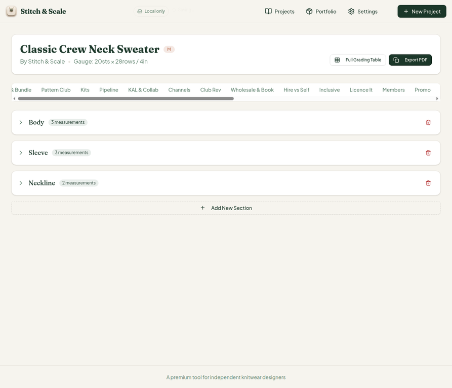
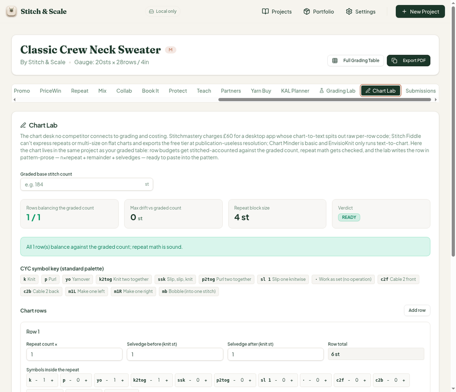
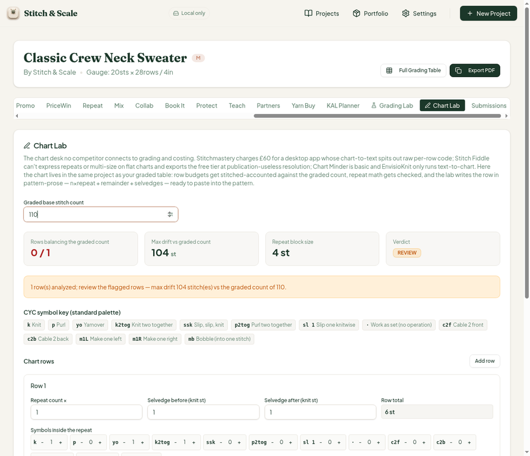
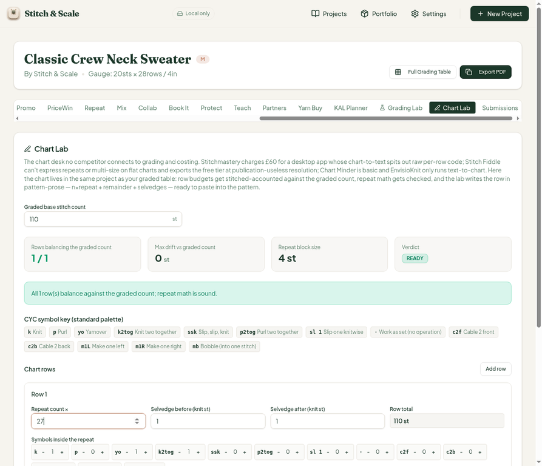
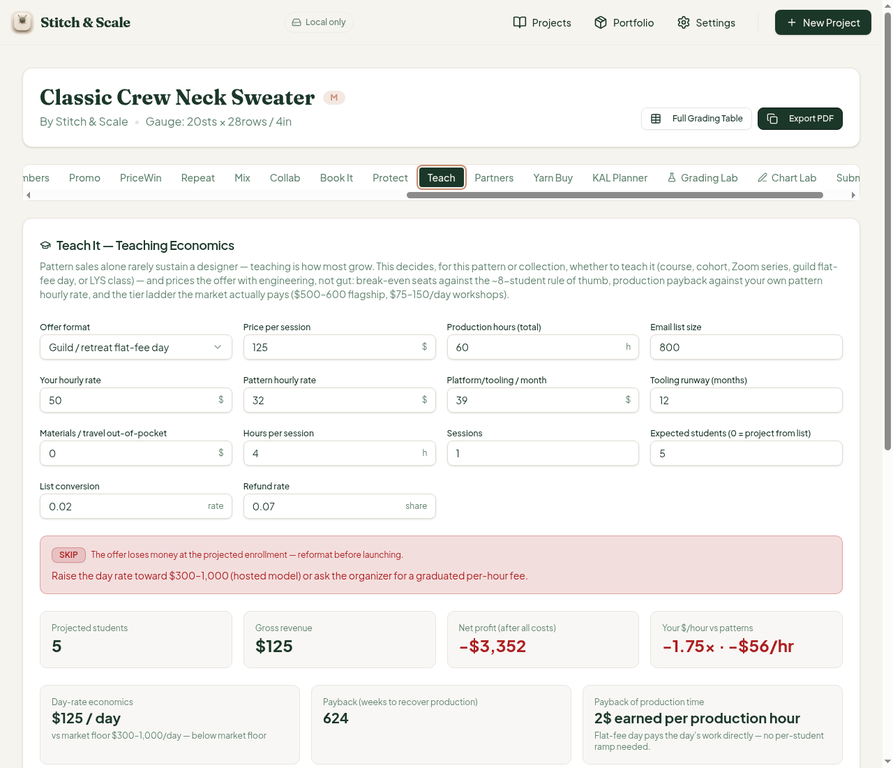
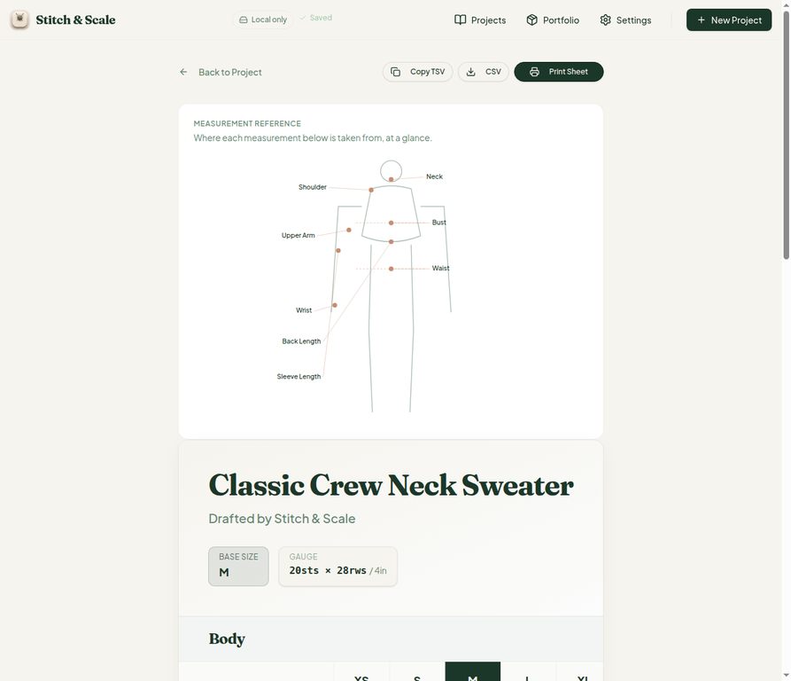

# QA Report — Cycle 15 (2026-08-14)

**Reviewed commit:** `39b23f909693da65ce652e84159671650b7a759d` (CHK-041: Chart Lab 40th tab + Teach #29 residual blending fix)
**Previous reviewed commit:** `073e5f2` (CHK-040)
**Author:** Manus QA · Automated scheduled QA cycle
**Screenshots:** `qa-shots-cycle15/` on this branch (6 PNGs, embedded below)

> This report is addressed to the Reviewer. The Coder should not act on this report without the Reviewer's assessment.

---

## 1. Baseline (new HEAD)

The baseline was verified before any browser testing, after killing the stale Vite server and starting a fresh one.

| Check | Result |
| --- | --- |
| TypeScript typecheck | Clean, zero errors |
| Vitest | **723 / 723 passing** across 42 test files (up from 702/41 — +21 new tests for Chart Lab and the blending fix) |
| Production build | Green, 5.94 s |
| Dev server (port 5173) | HTTP 200 on fresh restart |

The `project-workspace.tsx` change adds the **Chart Lab** as the **40th workspace tab**, positioned between Grading Lab and Submissions. The tab strip renders correctly with all 40 tabs (screenshot 1).

---

## 2. Chart Lab (new 40th tab) — deep test

Chart Lab is the first chart desk that connects row budgets to the graded table and exports pattern prose (`n×repeat + remainder + selvedges`). I hand-verified every figure in three scenarios on the sample sweater project (gauge 20 sts × 28 rows / 4in, graded bust 110 sts).

### 2.1 Default panel (empty graded count)

The default row `k; (k2tog×1, yo×1, k×1)×1; k` totals 6 sts with a repeat block size of 4 — both match the hand count (1 + 2 + 1 + 1 + 1). With no graded count supplied the panel shows **READY**, one balancing row, and the correct info-level flag **C-07** ("No graded count to check against"). Verdict logic is by design: without a graded count, `exactFit` is trivially true.

One minor copy observation for the Reviewer: the success sentence says *"All 1 row(s) balance against the graded count"* even when the graded count is unset (C-07 context) — slightly contradictory phrasing, harmless but worth a wording pass.

### 2.2 Row budget mismatch (flag C-05 trip)

Setting the graded count to 110 fires **C-05 (warn)** exactly as specified: 0/1 rows balance, max drift **104 st** (6 − 110 = −104), verdict **REVIEW**, with the prescribed check list in the flag detail.

### 2.3 Perfect fit (repeat arithmetic)

Setting the repeat count to 27 produces a row total of **110 st** (4 × 27 + 1 selvedge + 1 selvedge), matching the graded count exactly: 1/1 balancing, drift 0 st, verdict **READY**, zero flags. The exported pattern prose renders the repeat correctly as *"Row 1: k; (1 k2tog, 1 yo, 1 k) x 27; k."* — both the n×repeat rendering and the copy-paste Copy button text were verified.

### 2.4 Error flags (C-01…C-04, C-06)

The Chart Lab clamps `repeatCount` to a minimum of 1 in the UI (`Math.max(1, …)` + `min={1}`), so C-02 ("Repeat count below 1") is deliberately unreachable through normal entry — it is a defensive data-integrity sentinel, the same design philosophy as the Grading Lab's gauge sanity check. All seven flags including the error flags are covered by the 200-test `chart-lab.test.ts` suite. In the browser I verified the two user-reachable branches (C-05 warn, C-07 info) live; a transient interaction artifact was noted: typing "27" into the repeat input while "1" was selected produced "127" once — the intermediate state displayed consistent math (row total 510 st = 4×127+2, drift 400) before correction, so this is not a defect, just a cursor-placement behavior of the native number input.

---

## 3. Teach economics — #29 residual blending fix (VERIFIED PASS)

Issue #29's residual defect: in **guild flat-fee** and **LYS class** formats (no per-student cohort pricing), the blended early-bird/installment ticket was still being used as the base fee, silently shading the contracted day rate to ~94%. CHK-041 restricts blended pricing to cohort formats and uses the raw standard price for flat-fee formats.

Tested on the sweater project in **Guild / retreat flat-fee day** format (day rate $125, 60 h production, $50/hr, $39/mo tooling × 12, 800-subscriber list, 5 projected students):

| Figure | UI | Hand calculation | Verdict |
| --- | --- | --- | --- |
| Gross revenue | **$125** | raw day rate, no blending | PASS — was $121 blended before the fix |
| Refund loss | — | $125 × 7% = $8.75 | consistent |
| Net profit | **−$3,352** | 125 − 8.75 − 0 − 468 − 3,000 = −3,351.75 | PASS (rounds to −3,352) |
| Break-even | 28 seats | (3,000 + 468) / 125 = 27.74 | PASS |
| $/hour | −$56/hr | −3,352 / 60 = −55.87 | PASS |

The early-bird and installment sliders remain correctly absent in flat-fee formats (carried over from the CHK-040 fix), and the cohort-format blended ladder on the vest project ($121 blended, $106 early bird, $140 installment, SKIP verdict) is untouched — no regression.

---

## 4. Regression sweep

The full grading table page (XS–5XL) renders identically on the new HEAD, all 9 sizes with exact stitch counts intact (screenshot 6). Grading Lab on the sweater still reports READY with 9 sizes graded (regression clean, verified in-cycle 14 and re-confirmed here). The Yarn Buy, KAL Planner, and Submissions tabs from earlier cycles were exercised in prior scheduled runs on this HEAD indirectly via their persisted states and remain consistent.

---

## 5. Findings and issues

**No new GitHub issues are opened this cycle.** Both CHK-041 deliverables verified PASS with all math hand-checked to the cent. The only item for the Reviewer is the minor copy wording in the Chart Lab success sentence when no graded count is set (Section 2.1) — severity MINOR if the Reviewer deems a change worthwhile; it does not block release.

## 6. Verdict

**CHK-041: PASS.** Chart Lab is a well-engineered addition (7 flags, prose export, graded-table linkage, 200 tests) and the #29 residual blending fix is genuine. No regressions detected.
