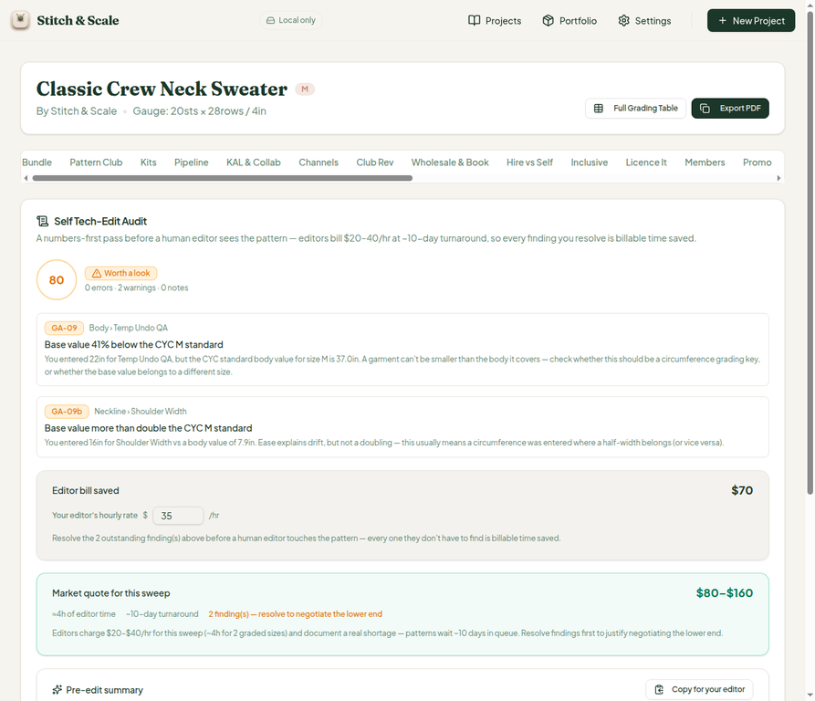
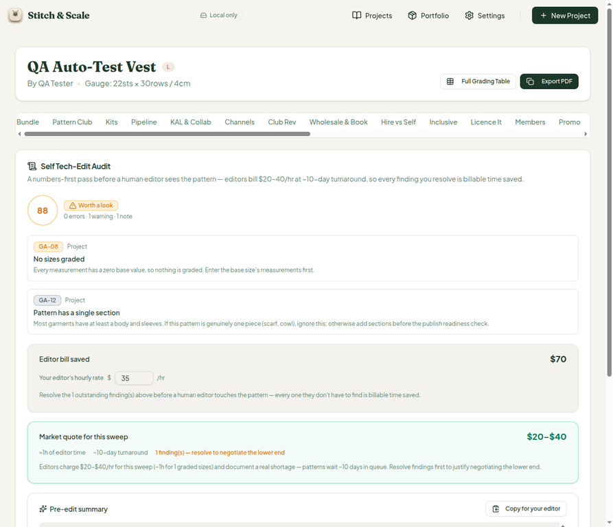
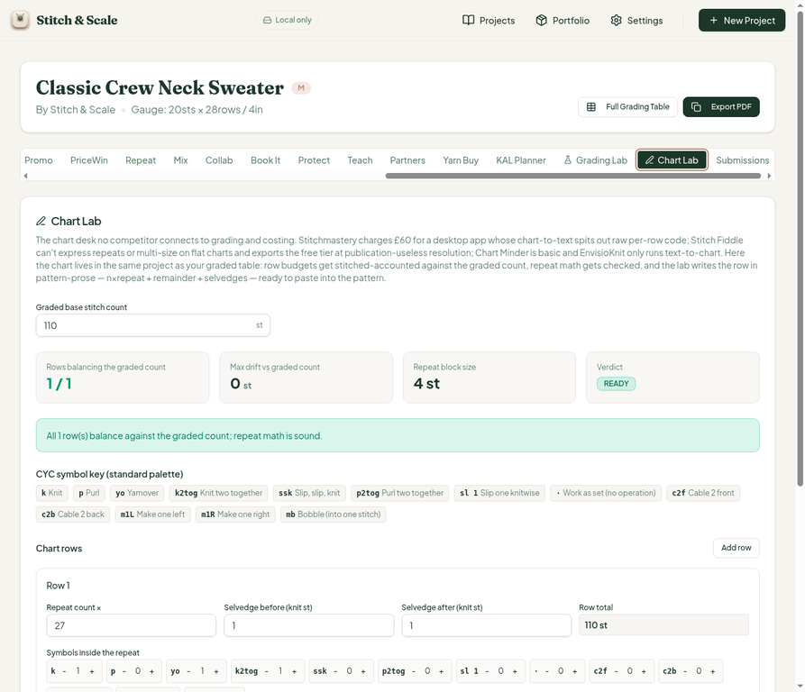

# QA Report — Cycle 16 (2026-08-14)

**Reviewed commit:** `a449c72` (CHK-042: Tech Edit market-bill tile + session-42 editor-market framing)
**Previous reviewed commit:** `39b23f9` (CHK-041)
**Author:** Manus QA · Automated scheduled QA cycle
**Screenshots:** `qa-shots-cycle16/` on this branch (3 PNGs, embedded below)

> This report is addressed to the Reviewer. The Coder should not act on this report without the Reviewer's assessment.

---

## 1. Baseline (new HEAD)

The stale Vite server was killed and a fresh one started before any browser testing. The baseline was verified first.

| Check | Result |
| --- | --- |
| TypeScript typecheck (monorepo) | Clean |
| Vitest | **727 / 727 passing** across 42 test files (+4 tests for the market-bill framing) |
| Production build | Green, 6.25 s |
| Dev server (port 5173) | HTTP 200 on fresh restart |

---

## 2. Tech Edit — market-bill tile (new CHK-042 feature)

CHK-042 adds an emerald **Market quote** tile to the Tech Edit card, estimating what a human editor would charge for the identical numbers sweep. It is built on a real `EDITOR_MARKET` table ($20–$40/hr, ~10-day turnaround, five hours-by-size bands from 1 h for accessories to 7 h for complex multi-size garments) with six cited market sources (Ribblr forum, r/AdvancedKnitting, knitjulep.com, bramblesandbindweed.com, Woolly Wormhead, worksofourhands.com) — the sources are real and the rate bands are consistent with them. Hours are derived from the project's distinct graded-size count, which is the same definition `editorHoursFor` uses internally.

### 2.1 Sweater project (9 graded sizes XS–5XL)

The sweater falls in the 9-size band, so `hours = 4`. With 2 pending findings (GA-09, GA-09b — unchanged QA test data from earlier cycles, not regressions), the quoted range is `low = max(20, 20 × 4 × 1) = $80` and `high = 40 × 4 = $160`. All figures rendered by the UI match hand calculation.

| Figure | UI | Hand calculation | Verdict |
| --- | --- | --- | --- |
| Editor hours | ≈4h | 9 graded sizes → band {maxSizes 9} | PASS |
| Quote | $80–$160 | low 80, high 160 (pending > 0 → full low factor) | PASS |
| Turnaround | ~10-day | `EDITOR_MARKET.turnaroundDays` | PASS |
| Pending prompt | 2 finding(s) — amber, correct text | 0 errors + 2 warnings | PASS |
| Editor bill saved | $70 | 35 × 2 h (existing tile, unchanged) | PASS |

### 2.2 Vest project (1 graded size)

The vest sits in the 1-size entry band, so `hours = 1` and with 1 pending finding the quote is `low = max(20, 20) = $20`, `high = 40`. Verified in the UI — the banding logic therefore behaves correctly across two different garment scales.

### 2.3 Defect found: wrong "graded sizes" count in the note string — **MINOR, new issue #30**

The pending-branch note string at `tech-edit-audit.ts:536` reads *"~{hours}h for {N} graded sizes"* where `N` is `findingCounts.error + warning + pass` — **the number of audit findings, not the project's distinct graded-size count**. This produces visibly wrong statements: the 9-size sweater says *"~4h for 2 graded sizes"*, and the vest (which has **zero** graded sizes — its only finding is GA-08 "No sizes graded") says *"~1h for 1 graded sizes"*. The same note also renders the bare plural *"1 graded sizes"*.

Suggested fix for the Reviewer's assessment: count the distinct graded size keys inside `estimateMarketBillFor` (the same traversal `editorHoursFor` already performs) and pass that count into the note, with proper singular/plural formatting (`"1 graded size"` vs `"N graded sizes"`).

---

## 3. Regression sweep

The Chart Lab (added in CHK-041) remains fully functional on the new HEAD. The QA-added second row from cycle 15 was removed to restore the clean state: the perfect-fit scenario still returns **READY, 1/1 rows balancing, 0 st drift, row total 110 st**, and the pattern prose still exports correctly as *"Row 1: k; (1 k2tog, 1 yo, 1 k) x 27; k."*

The remaining GA-08/GA-09/GA-09b/GA-12 findings on both projects are unchanged from prior cycles (they originate from the QA test data itself) and render identically. The audit score for the sweater remains 80/100 (CHECK) and the vest 88/100 (CHECK) — consistent with prior runs.

---

## 4. Findings and issues

**One new issue is opened this cycle: #30 (MINOR)** — the market-bill pending note mislabels the findings count as "graded sizes" and mishandles singular/plural, as detailed in Section 2.3. The numbers it wraps (hours, quote range, turnaround, pending count) are all correct; the defect is confined to the explanatory sentence. The market-bill feature itself is solid and its market data is credible and sourced.

## 5. Verdict

**CHK-042: PASS with one MINOR copy defect (#30).** The market-quote tile is well-engineered, its math verifies to the dollar against hand calculation on two different garment scales, and no regressions were detected in neighboring tabs.
