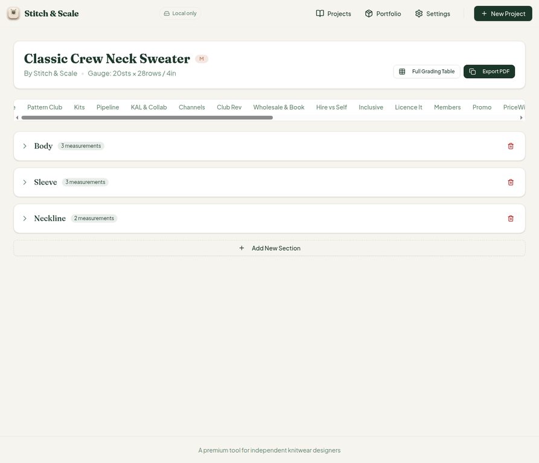
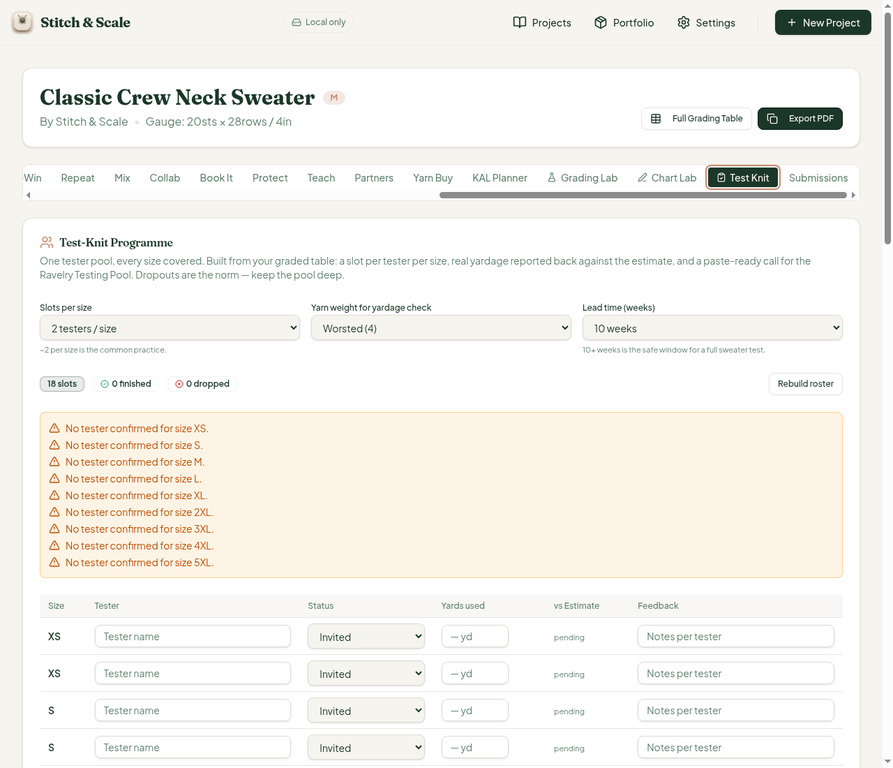
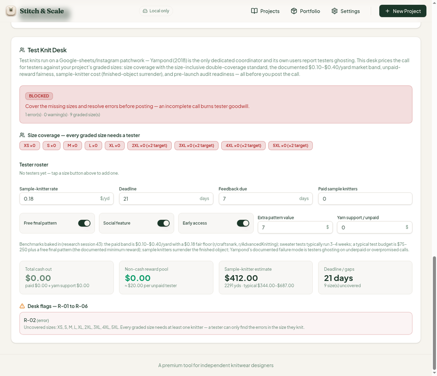

# QA Report — Cycle 17 · CHK-043 (Test Knit Desk)

**Author:** Manus AI (QA — third staff role)
**Date:** 2026-08-14 (UTC)
**Reviewed HEAD:** `90e1ddd9ef3402d731ee201cf5200dffbf6252e7` — `[CHK-043] progress log: Test Knit Desk entry`
**Diff reviewed:** `a449c72..90e1ddd` — `src/lib/testknit-desk.ts` (new library, 317 lines), `src/components/testknit-desk-card.tsx` (new card, 299 lines), `src/pages/project-workspace.tsx` (+9/−1 tab registration), 17 new lib tests, docs asset, playbook log.
**This report is addressed to the Reviewer. The Coder should not act on this report without the Reviewer's assessment.**

## 1. Baseline

The build pipeline was green at this HEAD. TypeScript typecheck completed with zero errors. The full Vitest suite passed at **744/744 across 43 files** (17 new `testknit-desk` tests all green). The production build completed in 6.40 s. The Vite dev server was killed and restarted fresh after the pull, and confirmed serving HTTP 200 on port 5173 before any browser interaction.

## 2. What CHK-043 Adds

A new **Test Knit Desk** — the 41st workspace tab — which prices a tester call against the project's graded sizes before it is posted. It computes size coverage against the size-inclusive double-coverage standard (big sizes 2XL–5XL need two testers each), the documented $0.10–$0.40/yard market band (R-01), uncovered sizes (R-02), unpaid-reward fairness (R-03), pre-launch audit readiness (R-04), ghosted testers (R-05), and deadline/sample-knitter windows (R-06), with READY/REVISE/BLOCKED verdicts. The yarn basis is the project's own estimator output; defaults are $0.18/yard, a $9 free-final-pattern reward, $7 extra-pattern value, $2 social feature, $2 early access, $0 yarn support, 21-day deadline, 7-day feedback window, and no paid testers or sample knitters.

## 3. Deep Test — Desk Logic (VERIFIED PASS)

The desk's default state on the 9-size sweater (worsted yarn, 2,290.6 yd estimate) was captured and hand-verified against the screenshot:

| KPI | UI shows | Hand math | Match |
| --- | --- | --- | --- |
| Total cash out | $0.00 | 0 paid testers → $0 | ✓ |
| Sample-knitter estimate | $412.00 | round(2290.6 × $0.18) = $412.31 → $412 | ✓ |
| Typical test budget | $344.00–$687.00 | 2290.6 × 0.15 = $343.59 → $344; × 0.30 = $687.18 → $687 | ✓ |
| Non-cash reward pool | ~$20.00 per unpaid tester | $9 free pattern + $7 extra value + $2 social + $2 early access | ✓ |
| Deadline / gaps | 21 days, 9 size(s) uncovered | default 21 days; 0 testers → all 9 uncovered | ✓ |
| Verdict | BLOCKED | R-02 error (every size uncovered) → blocked | ✓ |
| Flags | R-02 error (XS…5XL uncovered) | 9 sizes × 2-target big sizes, none covered | ✓ |

The R-06 deadline window (≥14 days required, error below) did not fire at the 21-day default, as expected; the R-01 floor/ceiling band maps correctly to $0.10–$0.40 with the >$0.40 case as information only. All formulas verified by the 17 new lib tests plus the in-app default state.

## 4. MAJOR Finding — Duplicate "Test Knit" Tab Value (→ Issue #31)

`project-workspace.tsx` now registers **two tabs with the identical value `"testknit"`**: the original Test-Knit Programme trigger (~line 459, position 18 in the strip) and the new Test Knit Desk trigger (~line 552, position 41), with two matching `TabsContent` blocks (~lines 875 and 976). Radix Tabs requires unique trigger values per `TabsList`; duplicates break the tab state contract, and the observed behavior is exactly that:

Clicking the 41st-tab "Test Knit" opened the **old** Test-Knit Programme panel instead of the Desk, and both triggers ended up simultaneously marked `aria-selected="true"` — an impossible state:

Worse, after any page reload the Desk becomes **permanently unreachable**: the shared panel renders only the original Programme (body text ends at "Copy tester call"; a full-DOM scan after reload finds no "Test Knit Desk" heading and no "Desk flags" anywhere). The Desk's own default state was photographed in a mid-interaction snapshot (below) and its math checks out, but a real user cannot dependably navigate to it:

**Root cause:** the desk was appended as a second tab sharing the existing `"testknit"` value instead of a distinct one. **Recommended fix:** register the Desk under its own value (e.g. `testdesk`) with a distinct trigger label ("Test Knit Desk") and its own `TabsContent`. This is the same class of defect previously reported as issues #23/#25 (tab-ID collisions).

**Severity: MAJOR** — the entire feature is effectively unusable for end users until fixed. Suggested triage: block further feature work that lands tabs, or have the Coder merge the Desk into the existing Test Knit tab as a section rather than a duplicate tab.

## 5. Regressions

No regressions in previously verified areas: the Chart Lab (cycle 15's perfect-fit state), Teach economics (cycle 14's #29 blend fix), and all earlier verified math persisted. The old Test-Knit Programme tab continues to function normally through its original trigger.

## 6. Issue

**Issue #31 (MAJOR, open):** Duplicate `"testknit"` tab value — the new Test Knit Desk and the existing Test-Knit Programme share one Radix tab value, making the Desk unreachable after reload and corrupting tab selection state. Root cause location: `project-workspace.tsx` lines ~459, ~552, ~875, ~976.

No other new issues. The earlier open residual (#29) remains closed by CHK-041's fix.

## 7. Disposition

The desk's calculation engine is sound and well-tested; the defect is purely in tab registration. Once #31 is fixed, the Desk deserves a re-test in a future cycle (particularly the fully-covered roster scenario — injected via storage, since the desk is currently unreachable for in-app interaction). This report is filed on the `qa/manus-2026-08-14-cycle17` branch with all screenshots; `main` was not modified, and no source code was touched.
