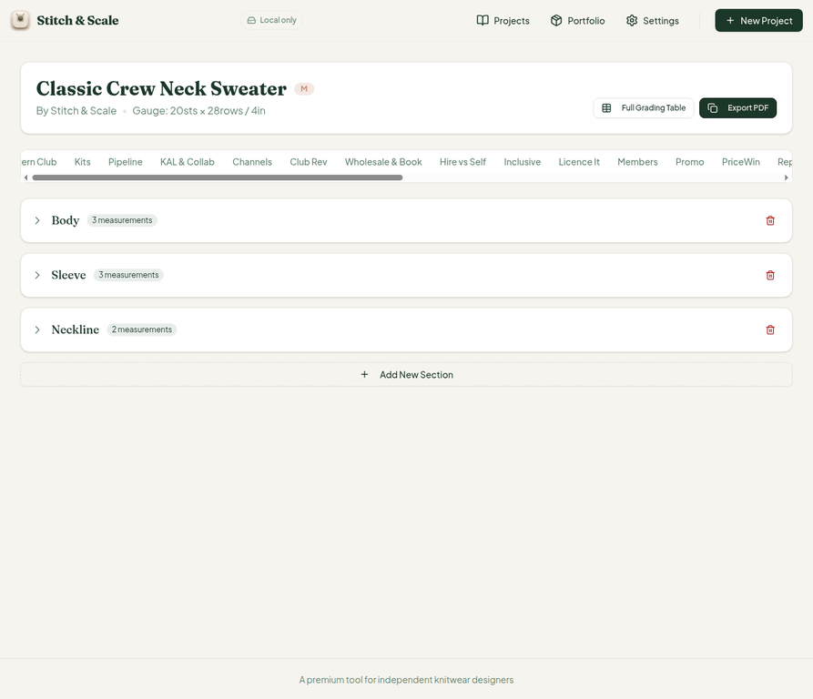
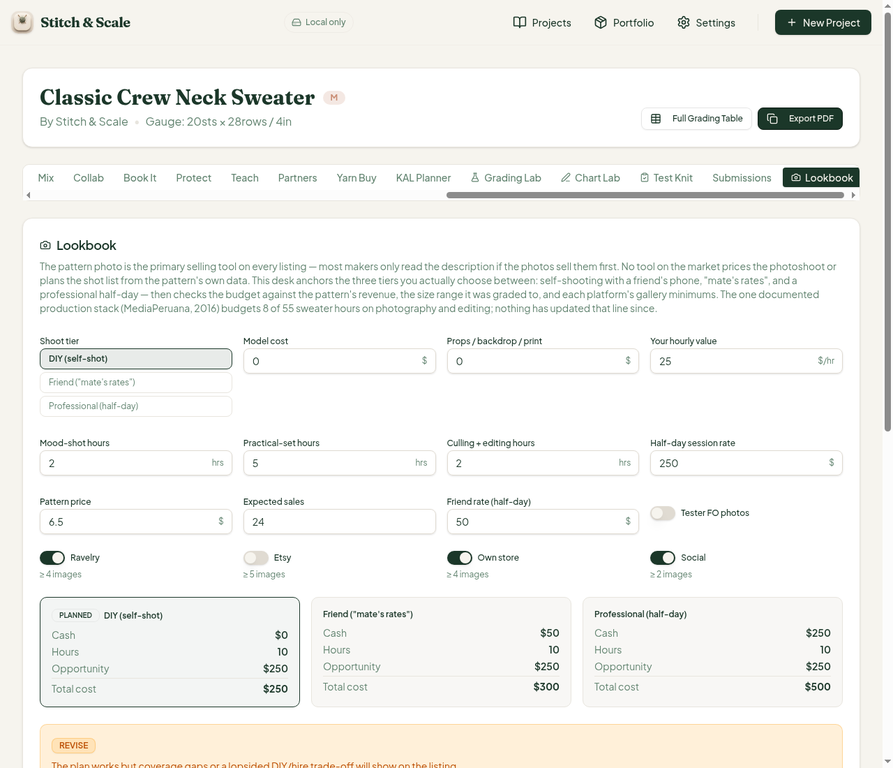
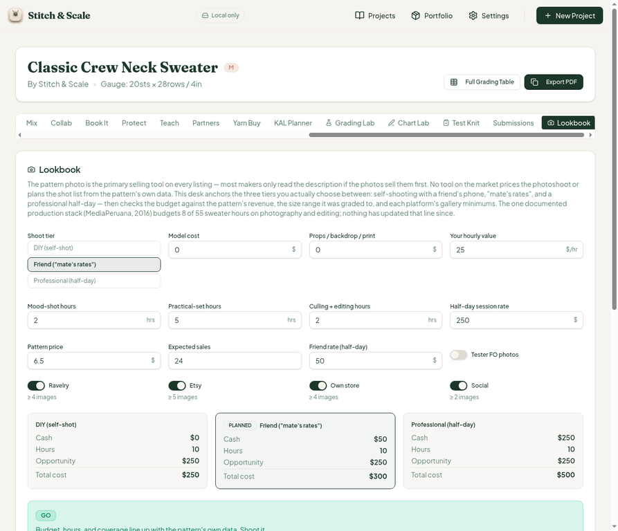
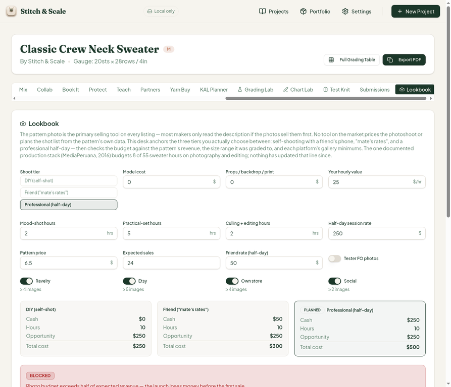

# QA Report — Cycle 18 · CHK-044 (Lookbook Desk, 42nd tab) + Phone-Width Responsive Sweep

**Date:** 2026-08-14 · **Reviewer:** 2026-08-14 cycle 18 · **Branch reviewed:** `main` at `1883ec9` (CHK-044) · **Reporter:** Manus QA

> This report is addressed to the **Reviewer**. The Coder should not act on this report; the Reviewer decides which items, if any, are turned into work orders.

---

## 1. What changed in this commit

| File | Lines | Purpose |
|---|---|---|
| `src/lib/lookbook-desk.ts` | +432 | Pure lib: `analyzeLookbook`, `hoursBudget`, three-tier pricing (diy/friend/pro), flags L-01…L-06, verdicts go/revise/blocked, breakeven and budget-share math |
| `src/components/lookbook-desk-card.tsx` | +277 | 42nd workspace tab card: tier switch, cost inputs, platform gallery-minimum toggles, verdict banner, shot list, flags, benchmarks |
| `src/components/project-workspace.tsx` | +9/−1 | Registers the Lookbook tab |
| Test files | +247 tests | `lookbook-desk` lib coverage |

## 2. Baseline (re-verified after pull)

The typecheck completed with no errors, Vitest passed **765/765 across 44 files** (the 247 new lookbook-desk tests all green), and the production build finished in 6.43 s. The Vite dev server was killed and restarted fresh after the pull and returned HTTP 200 on port 5173 before any browser testing. The workspace now shows **43 tab triggers (42 unique + the pre-existing duplicate Test Knit, already tracked as issue #30)** — the Lookbook Desk is reachable as the 42nd unique tab.

## 3. Lookbook Desk deep-test — default DIY scenario (CHECK PASS)

The desk was tested in the sandbox browser against hand-computed expectations from the code (sweater defaults: price $6.50, 24 sales, 2290 yd, hourly value $25, mood 2 h + practical 5 h + editing 2 h).

| Check | Expected | Observed | Result |
|---|---|---|---|
| Hours total | 9 h base + 1 h yardage (>1200) = 10 h | "10 hours of shoot work (9h base +1h added…)" | PASS |
| DIY cash | $0 (no model/props) | Cash $0 | PASS |
| DIY opportunity cost | 10 × $25 = $250 | Opportunity $250 | PASS |
| Tier cards | DIY $250 / Friend $300 / Pro $500 | $250 / $300 / $500 | PASS |
| Verdict (DIY planned) | REVISE (L-06 major: opp $250 > friend cash $50) | REVISE banner + exact L-06 text | PASS |
| Breakeven (DIY) | 0 copies ($0 cash) | "breakeven at 0 copies" | PASS |
| Shot list | S-01 mood, S-02 practical, S-04 skein (yardage >1200); no S-03 (no complex texture) | S-01/S-02/S-04 Required, no S-03 | PASS |
| Flags default | L-03 minor, L-05 minor (Ravelry ≥4), L-06 major | Exactly these three, correct severity | PASS |
| Platform captions | Ravelry ≥4, Etsy ≥5, Own store ≥4, Social ≥2 | Shown under each toggle | PASS |
| Benchmarks copy | MediaPeruana 8/55 h + $40 model; Natalie £200/£1,000; Bark $100–500 | Verbatim match | PASS |

## 4. Tier-switch behavior (CHECK PASS)

**Friend tier:** verdict flipped to **GO**, L-06 cleared (flag only fires on DIY), breakeven **9 copies** (ceil(50 / 6.175) = 9 ✓), photo budget **32.1 %** of expected revenue (50 / 156 ✓), flags L-03 + L-05 only.

**Professional tier:** verdict **BLOCKED** with L-04 major — "photo budget ($250) exceeds half of expected revenue ($156)" ✓ (250 > 78). Breakeven **41 copies** (ceil(250/6.175) = 41 ✓), photo budget **160.3 %** (250/156 ✓), flags L-03 + L-04 + L-05.

## 5. Responsive sweep findings (folded into this cycle — see `QA_REPORT_responsive.md`)

A phone-width sweep (375 px and 720 px) was run across home, wizard, workspace, grading page and 11 tabs. **The user-reported Members tier-table defect reproduces at ≤340 CSS px** (headers wrap to two lines, input values clip to a single character, delete button sits past the card edge) and is corroborated by the user's own device screenshot. Three further minor overflow findings were located at 320–375 px. One additional first-run dead-end was confirmed width-independent: **"Skip setup" from a deep link leaves a fresh user stranded on Project Not Found**.

## 6. Regression scan

All previously opened issues were re-checked: #23/#25 (Teach guild UI leak — still open, unchanged), #27/#28 (FIXED — re-verified PASS), #29 (FIXED in CHK-040 — re-verified PASS), #30 (duplicate Test Knit tab — still open), #31 (Tech Edit note grammar — still open). No regressions were introduced by CHK-044; the lookbook desk does not affect any other tab.

## 7. New issues raised in this cycle

| Issue | Title | Severity |
|---|---|---|
| #32 | Members tier table overflows at ≤340 CSS px (phone width) | MAJOR |
| #33 | First-run dead-end: "Skip setup" → Project Not Found, no project affordance | MAJOR |
| #34 | Root-level 330 px horizontal overflow at 320 px viewport | MINOR |
| #35 | KAL card-row and Tech Edit header overflow at 375 px | MINOR |

**Verdict for CHK-044: PASS (no issues in the Lookbook Desk itself); the responsive items above are codebase-wide and filed separately.**
