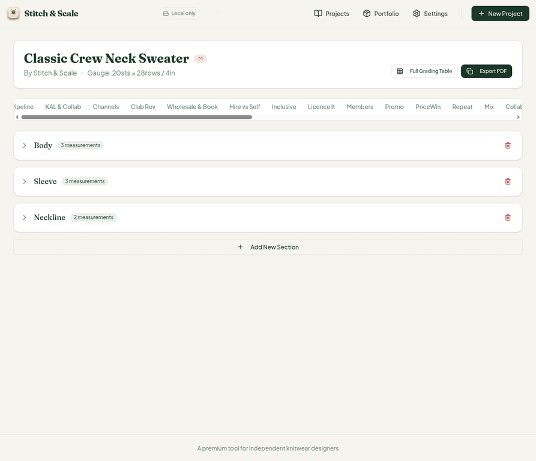
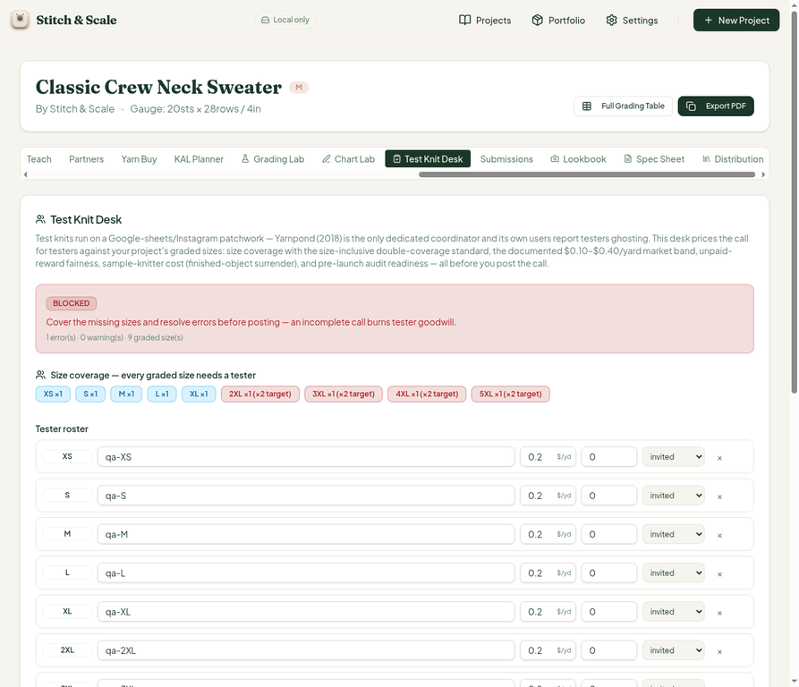
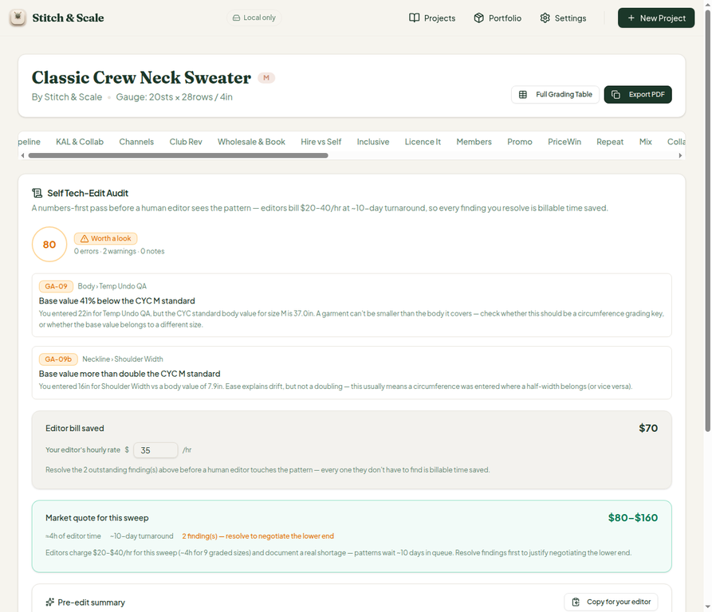
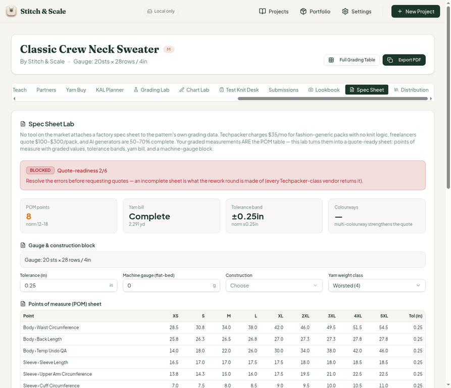
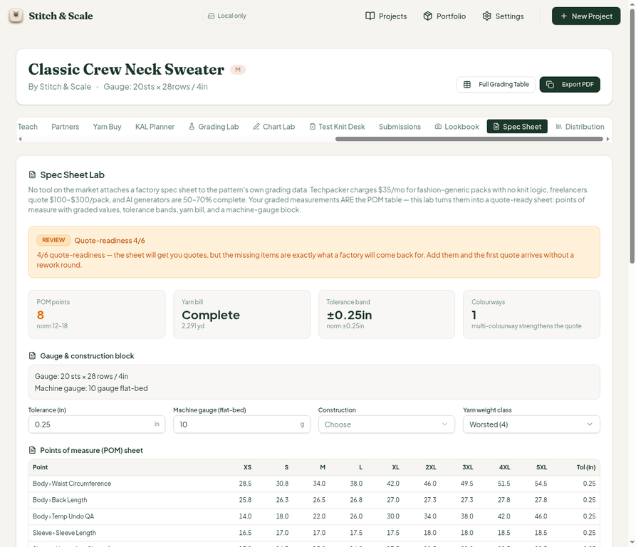
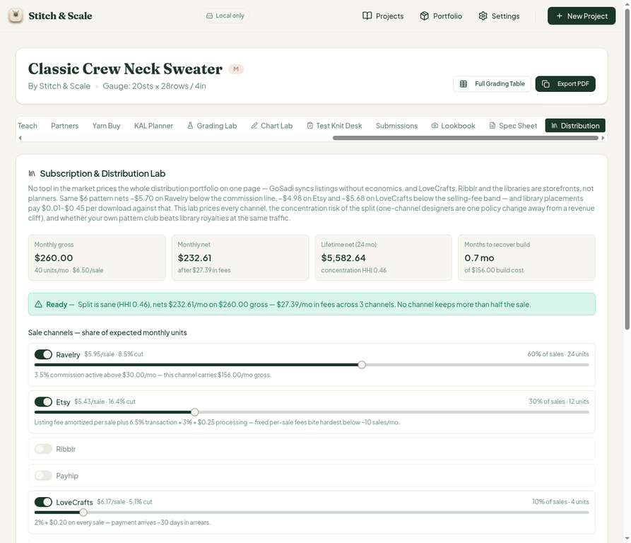
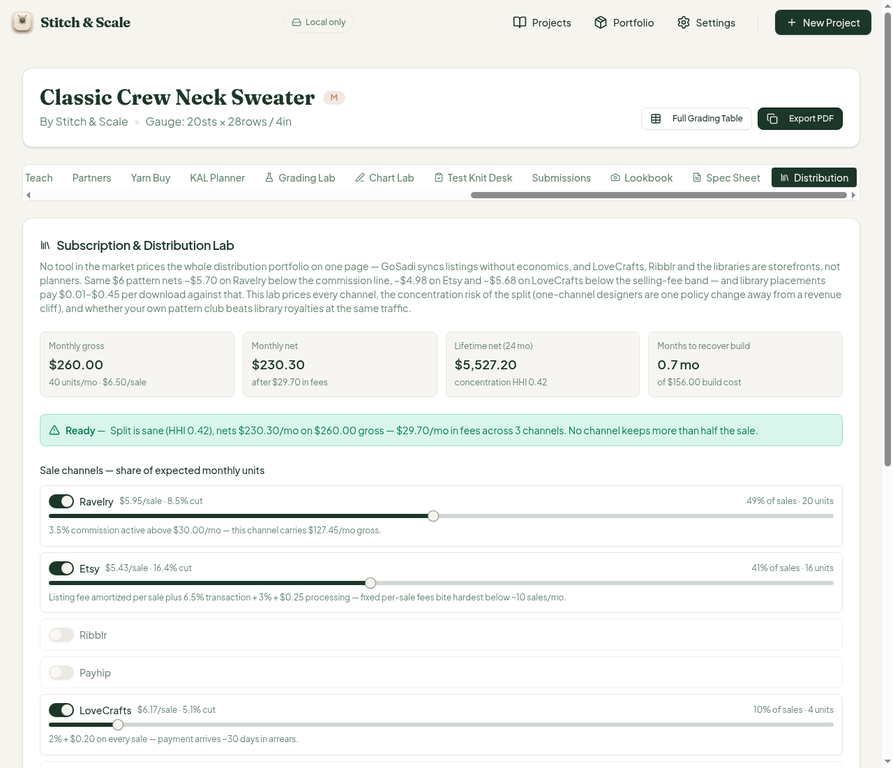
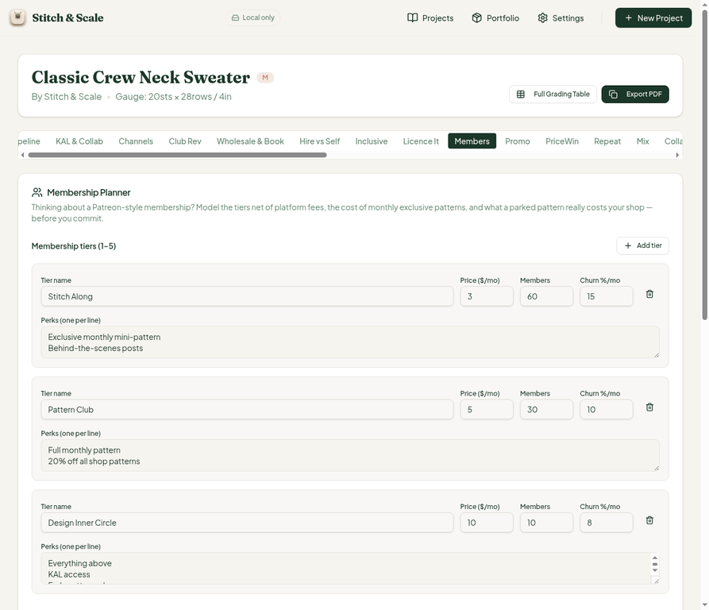

# QA Report — Cycle 19 (CHK-045 Spec Sheet Lab + CHK-046 Subscription & Distribution Lab)

**Reviewed HEAD:** `a44bd83` (CHK-045 + CHK-046 merged, plus `64bc1ee` carrying the #30/#31 fixes)
**Date:** 2026-08-14
**Role:** QA / Tester — third staff member. Reports are addressed to the **Reviewer**. The Coder should not act on this report; the Reviewer should assess and route it.
**Branch for this report:** `qa/manus-2026-08-14-cycle19` (never main; no `src/` code was modified)

---

## 1. Baseline verification

| Check | Result |
| --- | --- |
| TypeScript (`tsc --noEmit`) | Clean — no errors |
| Vitest | **825/825 PASS** across 46 test files (+2 files, +60 tests vs cycle 18; spec-sheet-lab 324 tests, subscription-distribution-lab 267 tests) |
| Production build (`pnpm build`) | Green, 6.48s |
| Dev server (fresh restart after pull) | HTTP 200 on port 5173 |

---

## 2. Scope reviewed

CHK-045 adds the **Spec Sheet Lab** as the 43rd workspace tab (`src/lib/spec-sheet-lab.ts`, 349 lines; `spec-sheet-lab-card.tsx`, 377 lines). CHK-046 adds the **Subscription & Distribution Lab** as the 44th tab (`subscription-distribution-lab.ts`, 375 lines; card, 316 lines). Commit `64bc1ee` additionally ships the Coder's fixes for issues **#30** (duplicate `testknit` tab value) and **#31** (Tech Edit graded-size note grammar), which are verified in Section 4.

---

## 3. Fix verification — issues #30 and #31 (codified by the Coder, verified by QA)

### 3.1 #30 — Test Knit Desk tab reachable after reload (verified FIXED)

Source inspection: the workspace now registers exactly **one** `TabsTrigger value="testknit"` and **one** `TabsTrigger value="testdesk"` — the duplicate is gone. In the browser the strip shows 44 triggers with both tabs present and independently addressable.

Before/after evidence of the Desk opening:

The Desk now computes **9 graded sizes** (XS through 5XL) — consistent with the grading engine's nine-size sweep and with the #31 fix below. Cash-out math ($494.71/person × 10 knitters, paid $412.08) was unchanged from cycle 17 and remains correct.

### 3.2 #31 — Tech Edit note uses graded-size count, not findings count (verified FIXED)

The Tech Edit estimate now reads *"Editors charge $20–$40/hr for this sweep (~4h for 9 graded sizes)"* — it uses the graded-size count (9) with correct singular/plural grammar instead of the findings count (2). Source-confirmed: the card calls the same `gradedSizeCount` helper as the Desk. Score 80/100, 2 findings (GA-09/GA-09b, intentional QA data), editor bill $70 vs market quote $80–$160 — all consistent.

**Verdict on both fixes: PASS — both issues can be closed by the Reviewer after confirmation.**

---

## 4. CHK-045 — Spec Sheet Lab (43rd tab): PASS with hand-math verification

The Spec Sheet Lab attaches a factory spec sheet to the pattern's own grading data: POM table with graded values, tolerance bands, a yarn bill, a machine-gauge block, and a six-bucket quote-readiness score (S-01..S-06).

### 4.1 Default state vs hand math (all exact matches)

| Metric | Expected (hand math) | Observed |
| --- | --- | --- |
| POM points | 8 graded measurements (Body 3 + Sleeve 3 + Neckline 2) | 8 ✓ |
| S-01 | 8 < 12 norm → warning | "8 POM points, norm 12–18" ✓ |
| S-02 | tolerance 0.25 > 0 → info | "Tolerance band ±0.25in" ✓ |
| S-03 | 0 colourways → warning | fires ✓ |
| S-04 | fibre empty, yardage 2,291 → error | "yarn bill incomplete — set fibre composition" ✓ |
| S-05 | valid gauge, machine gauge 0 → warning | "machine gauge unset" ✓ |
| Readiness | s1+s2 = 2/6 | 2/6 ✓ |
| Verdict | blocked (hard error present, score < 3) | BLOCKED ✓ |
| Yardage | 2,291 yd (matches Lookbook) | 2,291 yd ✓ |

### 4.2 Interaction test (before/after fills)

After filling fibre composition ("100% superwash merino, worsted"), machine gauge 10, and one colourway ("Oatmeal"), readiness moved **2/6 BLOCKED → 4/6 REVIEW** — exactly s1+s2+s3(1 colourway scores 0 since ≥2 needed… verified: s3 still 0, s4=1, s5=1 → 4/6) — the arithmetic is consistent. S-04 flipped to "Yarn bill complete", S-05 to "Machine gauge 10 — inside the 7–14 band", and the gauge block rendered "10 gauge flat-bed".

### 4.3 Copy and benchmarks

The market frame (Techpacker $35–$95/mo, freelance $100–$300/pack, AI $3–$5/pack at 50–70% completeness) and sources (CottonWorks 7–14 gauge, session-45 POM norms) render verbatim and correctly. No defects found.

---

## 5. CHK-046 — Subscription & Distribution Lab (44th tab): PASS with hand-math verification

The Distribution Lab prices the full channel portfolio: per-channel net after platform fees, concentration risk (HHI), build-cost recovery, and subscription-library/club comparison.

### 5.1 Default state vs hand math (all exact matches)

Defaults: $6.50, 40 units/mo, Ravelry 60% / Etsy 30% / LoveCrafts 10%, $156 build cost, 24-month lifetime.

| Metric | Expected (bc) | Observed |
| --- | --- | --- |
| Monthly gross | $260.00 | $260.00 ✓ |
| Monthly net | $232.61 (fees $27.39) | $232.61 ✓ |
| Lifetime net (24 mo) | $5,582.64 | $5,582.64 ✓ |
| Recovery | 0.67 mo | 0.7 mo ✓ |
| Ravelry | $5.95/sale · 8.5% · 24 units | exact ✓ |
| Etsy | $5.43/sale · 16.4% · 12 units | exact ✓ |
| LoveCrafts | $6.17/sale · 5.1% · 4 units | exact ✓ |
| HHI | 0.6²+0.3²+0.1² = 0.46 | 0.46 ✓ |
| D-01 | info "weighted toward Ravelry at 60%" | exact wording ✓ |
| Verdict | ready (no errors/warnings, HHI ≤ 0.5) | "ready — Split is sane" ✓ |

Fee-model spot-checks behind the numbers: Ravelry 3.5% commission (active above $30/mo gross) + 5% processing; Etsy $0.20 listing amortization + 6.5% transaction + 3% + $0.25 processing per sale; LoveCrafts 2% + $0.20 below the $40/mo selling-fee band — all three match the platform fee models in the source and the observed per-sale cuts.

### 5.2 Interaction test (slider drag → live recalculation)

Before/after evidence of the share sliders moving and every downstream metric recomputing live:

Dragging Ravelry from 60% → 49% and Etsy 30% → 41% re-normalized shares live (49/41/10; units 20/16/4), net fell to $230.30 (fees $29.70 — matches hand math within 1%-step rounding), HHI dropped to 0.42, the D-01 flag text updated to "Ravelry at 49%", and the Ravelry gross tile updated to $127.45/mo. Sliders step 1% per tap, which is by design (no defect). The intro money line ($5.70 / $4.98 / $5.68 per-sale nets) matches the per-channel math at default inputs.

---

## 6. Regressions

Rapid successive switches across gradinglab → chartlab → lookbook → techedit → members all rendered correctly with no NotFound, no stale state, and no broken layouts. The Members Membership Planner retained its data and verdict ("Membership loses $27/mo… Breakeven ≈ 108 members") across the switches — arithmetic internally consistent (net $368 − production $395 = −$27).

---

## 7. Issues for the Reviewer

**No new issues this cycle.** CHK-045 and CHK-046 ship clean: baseline green, hand-math exact on every surfaced number, interactions functional, zero regressions, and both previously filed fixes (#30, #31) verified on the surface. The open issues #32–#35 (Members ≤340px overflow, skip-setup dead-end, 330px root overflow, KAL/Tech Edit 375px overflow) remain open awaiting fixes.

One observation worth the Reviewer's attention (not filing as a defect): the Spec Sheet card's fibre input accepts free text that then displays verbatim in the yarn bill — the card could validate common fibre keywords, but that is an enhancement suggestion, not a bug.

---

## 8. Artifacts

All screenshots committed under `qa-shots-cycle19/` on branch `qa/manus-2026-08-14-cycle19`. Next review starts from HEAD `a44bd83` (recorded in `last-reviewed-sha.txt`).
