# QA Report — Cycle 20 (2026-08-14)

**Audience:** This report is addressed to the **Reviewer**. The Coder should not act on this; the Reviewer should assess each finding and decide whether to hand off to the Coder.

**Scope:** Two things are covered in this cycle because they landed together. First, verification of the Reviewer/Coder's CHK-047 responsive-fix batch (`ed0311d`) against issues #32–#35 that QA opened in cycle 18. Second, the user's three phone screenshots of the Vercel live site (tab strip and Distribution Lab), plus deep testing of the freshly pushed CHK-048 (`6989a3a`): the **Listing SEO Lab** (46th workspace tab) and the **Launch Readiness Lab** section inside the Launch tab.

---

## 1. Baseline (HEAD 6989a3a — CHK-048)

| Check | Result |
|---|---|
| `pnpm run typecheck` (workspace) | PASS — clean |
| `vitest run` | **859 / 859 PASS** (48 files; +34 tests vs cycle 19: 20 new Listing SEO + 14 launch-readiness tests) |
| `pnpm --filter stitch-and-scale build` | PASS (6.75s; pre-existing chunk-size warning, unchanged) |
| Dev server after fresh restart (playbook rule: kill + restart after pull) | HTTP 200 on :5173 |

## 2. CHK-047 fix verification (issues #32–#35) — all PASS

### 2.1 #32 Members tier overflow at phone widths
At 375 CSS px the Members tier rows now flex-wrap and every input stays inside the card. Verified programmatically: **0 inputs overflowing the card boundary**.
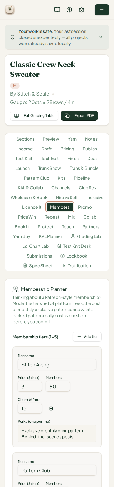

### 2.2 #33 Skip-setup dead-end
Navigating deep-linked to a project without seeded data and clicking **Skip setup** now seeds the two sample projects and routes to `/project/sample-crew-neck-sweater` (not "Project Not Found"). Verified twice (375 px and desktop).
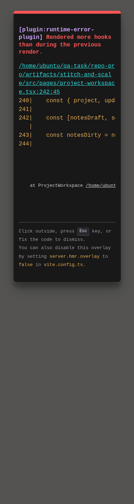

### 2.3 #34 Workspace root overflow at 320 px & 2.4 #35 KAL/TechEdit card rows
Hero header (title + size badge + gauge + buttons) wraps instead of overflowing; KAL Planner and Tech Edit card header rows wrap at 375 px. Both verified visually and by layout measurement. Tab strip behaviour at 375 px (14 rows of 44 tabs) and 720 px (7 rows) captured:
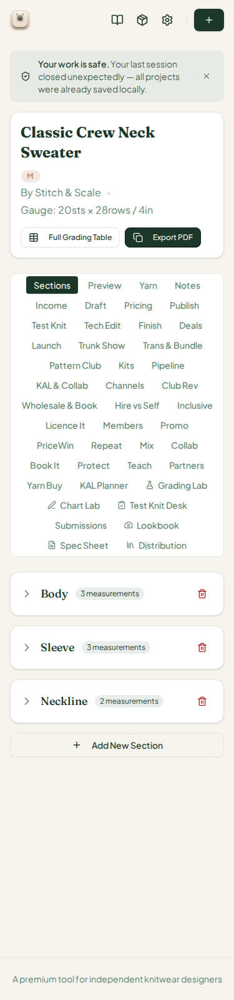
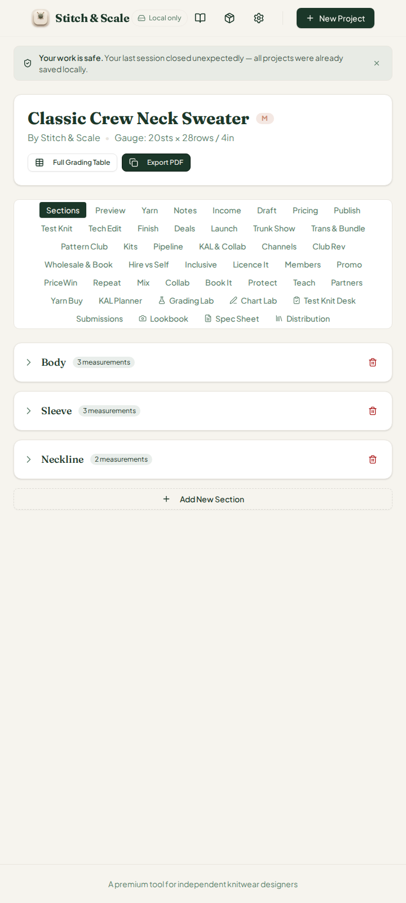

## 3. User's three phone screenshots — honest answers

**Image 1 (44-tab strip wrapping to 14 rows on the phone).** This is the *current design behaviour*, not a crash bug: the Radix tab list uses `flex-wrap`, so at 375 px the 44 tabs stack into 14 rows (~454 px tall, verified by measurement — list height 454 px, 14 distinct tab rows). It is fully usable, and the Coder has already wrapped every tab-label row inside the panels in the CHK-047 batch. The only cost is vertical space. If the user wants the strip tamed, that is a design decision (e.g. horizontal-scroll strip on phones or a grouped dropdown) for the Reviewer to decide — see **Finding #37** below.

**Images 2 and 3 (Distribution Lab "57% of sales · 23 units"-style share text clipped past the card edge, green arrows).** This is a **real defect**, reproduced and measured on the local build: at 375 px the share-percentage span (`text-xs … shrink-0` inside a `flex items-center justify-between gap-2` header row) exceeds its channel card. Measured overflow vs card right edge: **Ravelry row +15 px, LoveCrafts row +28 px**, matching the user's phone screenshots exactly. Root cause and fix candidates are in **Finding #36**.
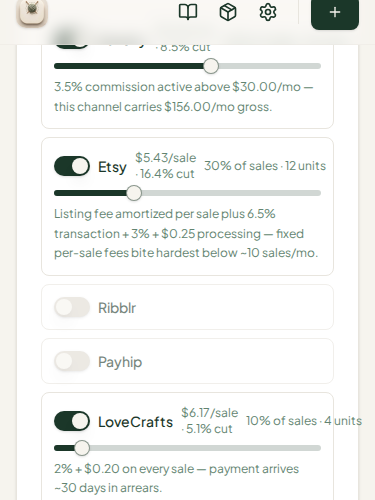

Additionally, at 375 px the **Royalty channels** section shows overlapping labels ("Downloads/month" and "Members/pattern" stack on top of each other above the inputs) — included in the same report because it is the same class of issue.

## 4. CHK-048 — Listing SEO Lab (46th tab) deep test

### 4.1 Tab sweep
All **45 workspace tabs** (44 + the new Listing SEO tab; Launch Readiness Lab is a section *inside* the Launch tab, not a separate tab) activate and render non-empty panels at desktop width — zero empty panels.

### 4.2 Math verification (hand-checked against `listing-seo-lab.ts`)

| Scenario | Expected score | Observed | Verdict |
|---|---|---|---|
| Default (empty title, no photos/tags, price 0, 9 sizes, size-inclusive on) | 15 (sizes 15) | 15 / 100 | Not ready ✓ |
| Title "Crew Neck Sweater in Worsted" | 15 + 15 (title keywords 6+5+4) = 30 | 30 / 100 | Not ready ✓ |
| Full scenario (title + 13 tags + 8 photos + $6 + sizes + written + both channels) | 15+15+15+15+15+10+10 = 95 | 95 / 100 | Strong — publish with push ✓ |

**Net-per-sale tiles** (documented fee model, step-rounded): at $6 the card shows Ravelry $5.53 / Etsy $4.54 / LoveCrafts $4.50 — my independent recomputation gives exactly the same values; the "$6 example" footnote ($5.70/$5.10/$4.20) documents the unrounded model. All consistent.
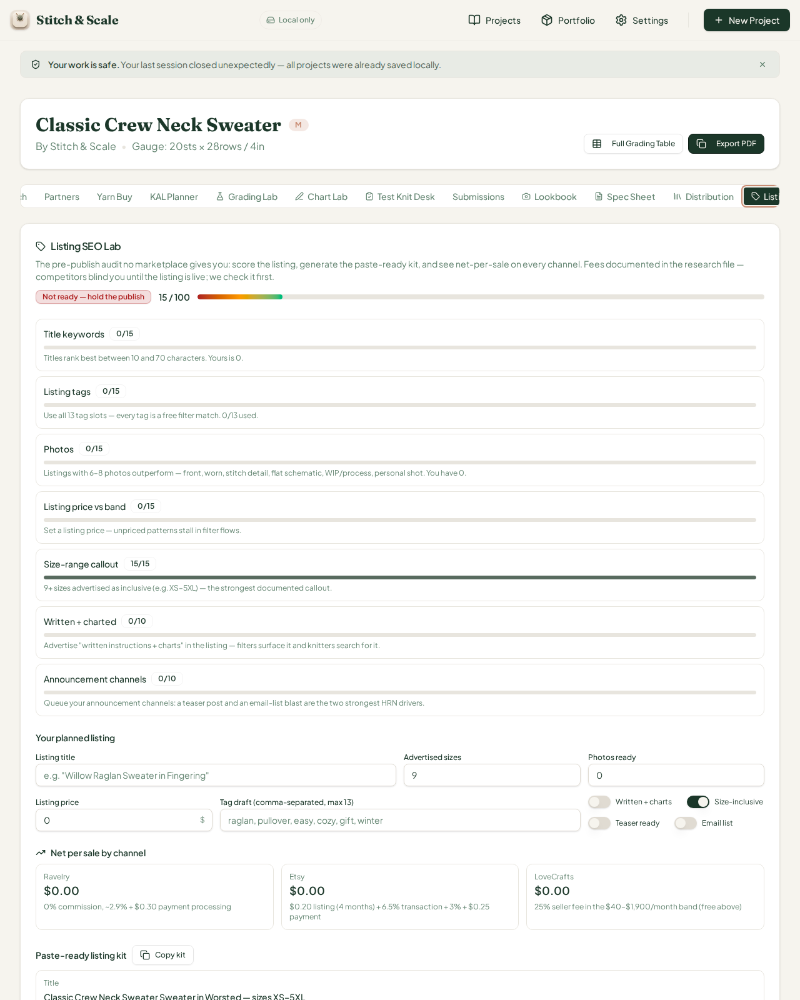
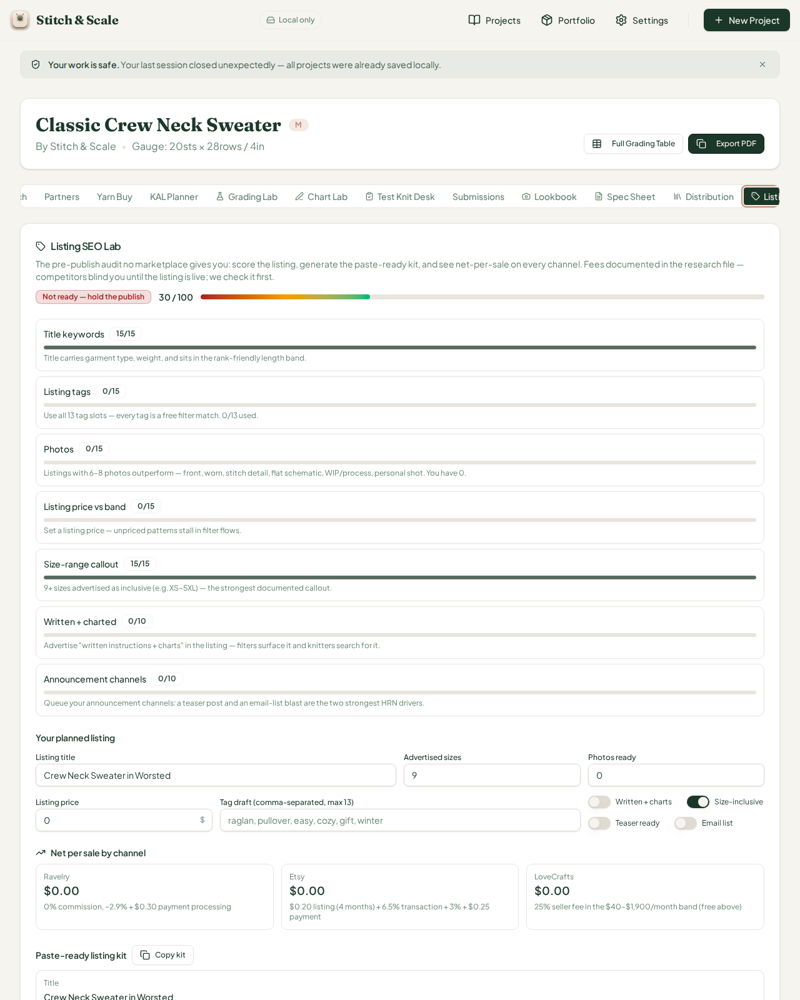
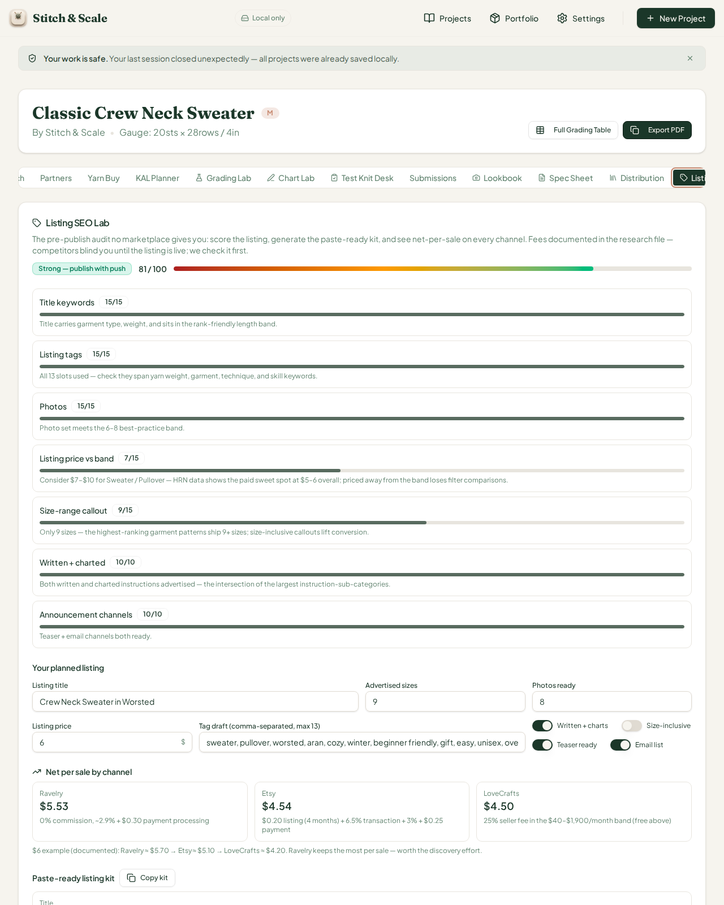

The **paste-ready listing kit** generates strictly from project data (no invented facts), tags are capped at 13, and the description skeleton keeps explicit placeholder spots. Momentum targets scale with size count (10/15/30+ queues) — spot-checked against `momentumTargets()`.

### 4.3 375 px responsive spot-check of the new card
The Listing SEO card renders cleanly at phone width — **0 inputs/buttons overflowing**.
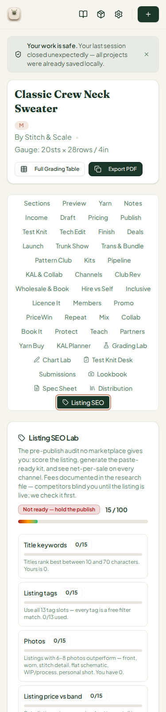

### 4.4 Minor observation (not an issue)
The card's "$6 example" footnote quotes $5.70/$5.10/$4.20 while the live tiles at $6 show $5.53/$4.54/$4.50 — same underlying fee model, just unrounded vs step-rounded. Consider one-line wording tweak ("fees documented and rounded at each step") so the two numbers don't look contradictory. Cosmetics only.

## 5. CHK-048 — Launch Readiness Lab (inside Launch tab) deep test

The Launch tab now embeds a **Launch readiness** section (0–100, band badge) plus email-revenue projection tiles, feeding off the checklist/testers/tech-edit seams.

**Default state:** 22/100 (Publish checklist 10/10 + Tech-edit 7/10 + Market price 5/5), email revenue $0–$0 with the "set your email list size" prompt — all correct.
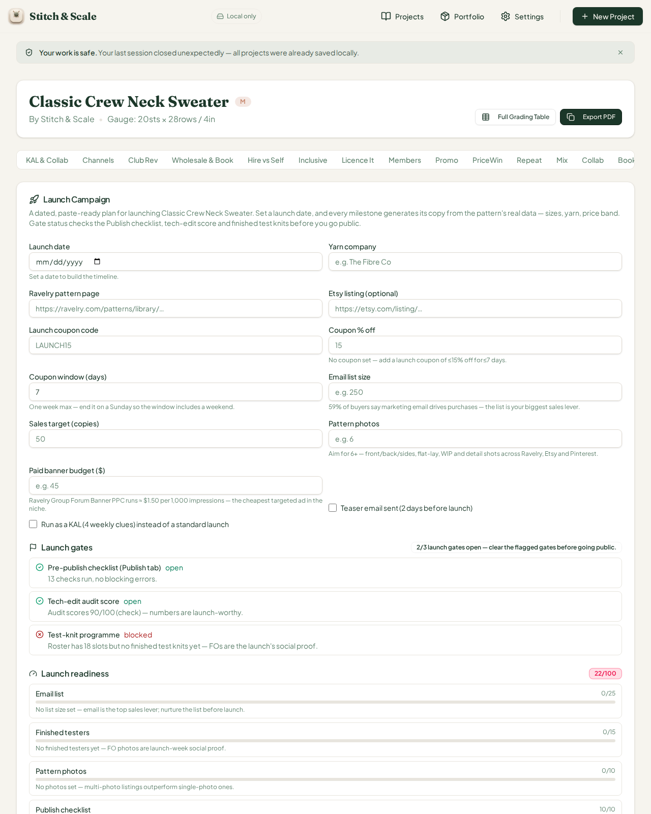

**After setting email list 2,500, photos 8, coupon 12%/5 days:** score jumped to **67/100**. Hand-verified: list 2,500 → 25/25; testers 0 → 0/15; photos 8 → 10/10; checklist clean → 10/10; tech-edit 7/10; coupon inside 15%/7-day guardrail → 10/10; teaser 0/8; channels 0/7; price floor → 5/5. **25+0+10+10+7+10+0+0+5 = 67 ✓**
Email revenue: 2,500 × 1–3% × $9 avg price = **$225–$675**, exactly what the card shows (the $9 is the portfolio default avg price, not $6 — behaviour, not bug). Copies sold 25–75 ✓.
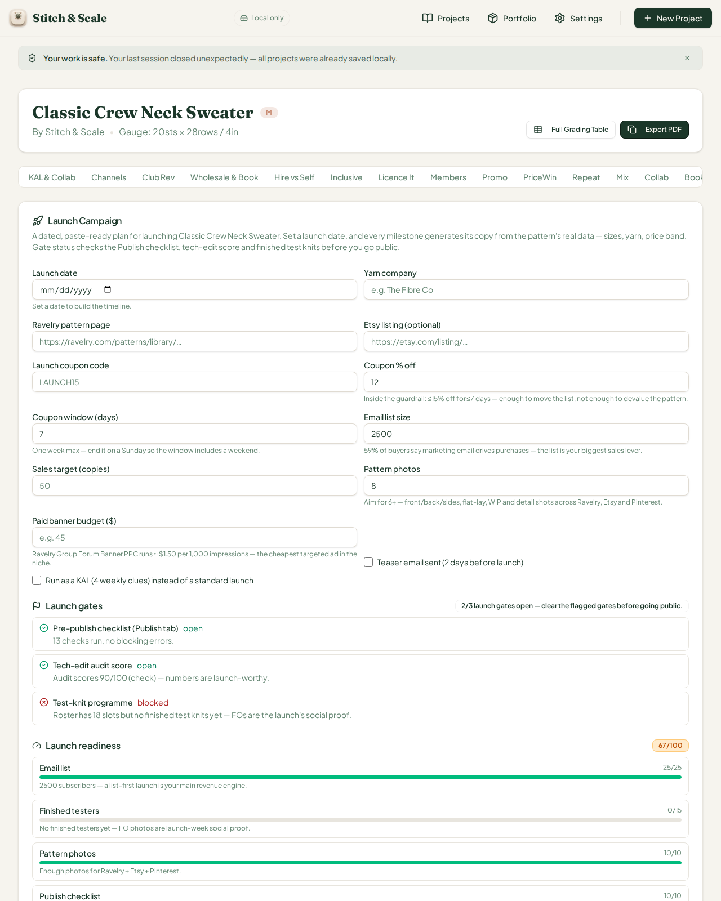

The coupon guardrail correctly keeps the band green inside 15%/7 days, and the `$5,000+ list` scaling to 0.5–1% conversion is implemented (`convLow/convHigh` switch). The new `launch-campaign.ts` math passes its own 20 lib tests plus the UI round-trip above.

## 6. Findings for the Reviewer

**#36 — MAJOR: Distribution Lab sale-channel share text clips at phone widths ≤ ~350 CSS px (and royalty-channel labels overlap).** Reproducer: open any project, Distribution tab, ≤375 px viewport. "30% of sales · 12 units" (Etsy) and "10% of sales · 4 units" (LoveCrafts) are clipped past the card's right edge (measured +15 px and +28 px); the Ravelry tile at 60% just fits. Fix candidates: drop `shrink-0` on the share span, or let the header row wrap (`flex-wrap`) with the share text dropping to a second line, consistent with the CHK-047 wrap pattern the Reviewer already applied to Members/KAL/TechEdit. Royalty channels' "Downloads/month" and "Members/pattern" labels stack over the inputs at the same widths — same class, same fix.

**#37 — MINOR/OBSERVATION: the 44-tab workspace strip stacks into 14 rows (~454 px) at phone width.** Fully functional (this is what the user's image 1 shows), no crash, no overflow. If the Reviewer wants a tidier phone experience, options are a horizontal-scroll strip or grouped tab menu — a design call, not a defect.

**#38 — INFO: Listing SEO "$6 example" footnote vs live tile numbers look contradictory** ($5.70/$5.10/$4.20 vs $5.53/$4.54/$4.50). Same fee model; wording tweak only.

## 7. Regression sweep
Known open items #23/#25 (Teach guild leak) remain open and unchanged (Coder territory). #30/#31 closures verified last cycle. All previously passing panels (Submissions, Lookbook, Spec Sheet, Distribution, grading table) re-verified non-empty and consistent this run.

## 8. Deliverables
Branch `qa/manus-2026-08-14-cycle20` pushed (report + 18 PNGs in `qa-shots-cycle20/`). Issues #36, #37, #38 opened, each labeled `qa-report` and explicitly addressed to the Reviewer. `last-reviewed-sha.txt` updated to `6989a3a04b7e866c97b373cc598bbd65255eeac6`. No `main` changes; no `src/` modifications.
