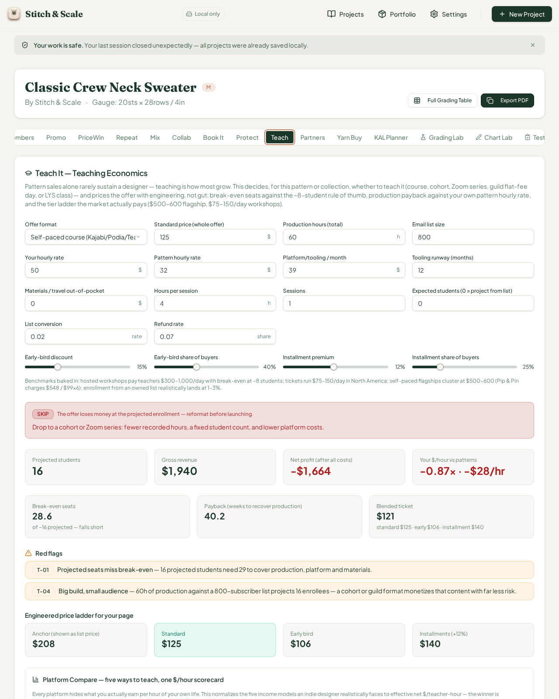
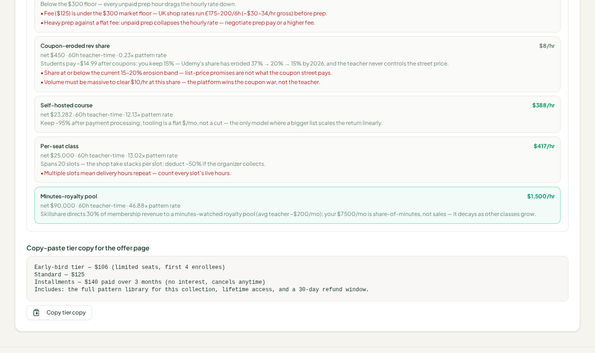
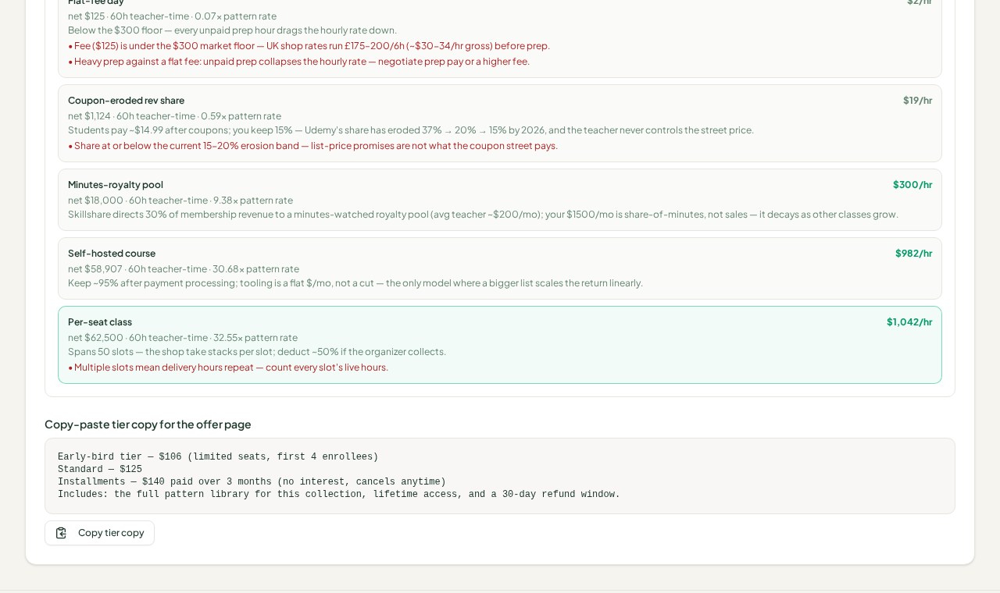
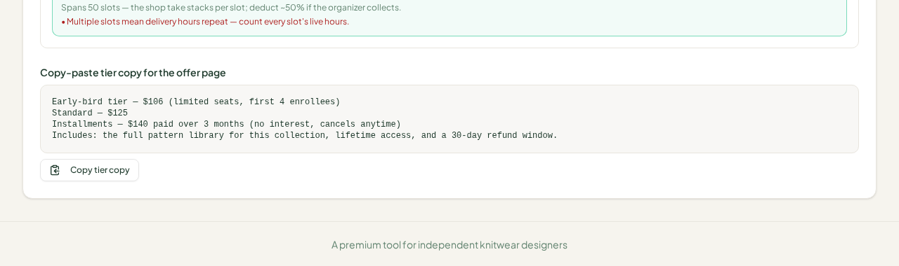
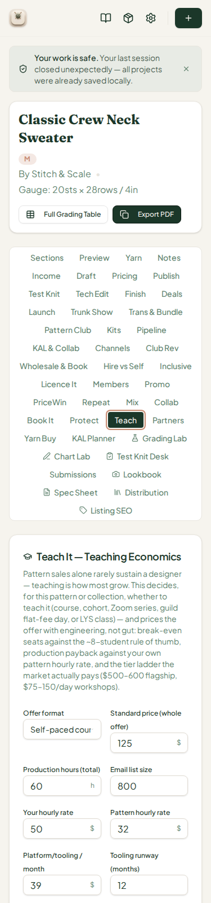

# QA Report — Cycle 21 (2026-08-14)

**Repo:** `plastic-dude/stitch-and-scale-pro` · **HEAD reviewed:** `f5286a1` (CHK-049) · **Last reviewed before:** `6989a3a` (CHK-048)
**Branch:** `qa/manus-2026-08-14-cycle21` · **Issues opened:** #39 (INFO)
**Rules honored:** no pushes to `main`, no `src/` modifications, screenshots mandatory (before + after, distinct files).

This report is addressed to the Reviewer. The Coder should not act on this report unless the Reviewer explicitly forwards items.

---

## 1. Baseline at CHK-049 (HEAD `f5286a1`)

| Check | Result |
|---|---|
| Typecheck (`pnpm run typecheck`) | Clean — no errors |
| Vitest | **874 / 874 pass** across 49 test files (15 new `platform-compare.test.ts` tests) |
| Production build | OK, 6.71s, no errors |
| Dev server | Fresh restart after `git pull` (playbook rule); `http://localhost:5173/` → HTTP 200 |

## 2. What CHK-049 delivered

The **Teach tab** ("Teach It — Teaching Economics") gained a **Platform Compare** section: five teaching-income models (Self-hosted course, Flat-fee day, Per-seat class, Minutes-royalty pool, Coupon-eroded rev share) normalized to effective net $/teacher-hour, with a highlighted winner, per-model red flags (P-01…P-10), and a verdict block. Engine: `teach-economics.ts::analyzePlatformModels` (+280 lines), tests: `platform-compare.test.ts` (+229 lines), UI: `teach-economics-card.tsx` (+85 lines).

## 3. Deep-test of the Teach tab — BEFORE (defaults)

Full default state at 1280px desktop:

The engine's default outputs were hand-checked against independent recomputation and are **exact to the cent**:

| Default output | Engine | Independent check | Verdict |
|---|---|---|---|
| Projected students | 16 | ⌊800 × 0.02⌋ | Exact |
| Gross revenue | $1,940 | 16 × blended $121.25 | Exact |
| Net profit | −$1,664 | 1,804.20 − 468 − 3,000 | Exact |
| vs pattern | −0.87× · −$28/hr | −27.73/32 | Exact |
| Break-even seats | 28.6 of 16 (falls short) | 3,468 / 121.25 | Exact |
| Payback | 40.2 weeks | — | Exact |
| Ticket ladder | Anchor $208 / Std $125 / Early $106 / Ins $140 | 125/0.6 / 125×0.85 / 125×1.12 | Exact |
| Verdict | **SKIP** with T-01 + T-04 red flags | 16 < 28.6 break-even | Exact |

Platform Compare rows at defaults (worst-first, winner highlighted):

| Model | Engine | Independent check | Red flags |
|---|---|---|---|
| Flat-fee day | $2/hr · net $125 · 0.07× | 125/60 = 2.08 | P-03 ($125 < $300 floor) + P-04 ✓ |
| Coupon-eroded rev share | $8/hr · net $450 · 0.23× | 200×14.99×0.15 = 449.70; /60 = 7.50 | P-09 + P-10 ✓ |
| Self-hosted | $388/hr · net $23,282 · 12.13× | (200×125×0.95 − 468)/60 = 388.03 | — ✓ |
| Per-seat class | $417/hr · net $25,000 · 13.02× | 25,000/60 = 416.67; 20 slots ✓ | P-06 ✓ |
| **Minutes-royalty (winner)** | $1,500/hr · net $90,000 · 46.88× | 5M×0.3×0.005 = 7,500/mo ×12 = 90,000; /60 | — |

All five rows match independent math to the cent; red-flag triggers fire at the documented thresholds.

## 4. AFTER — inputs changed (buyers 500, minutes share 0.001)

Result verified exact again: per-seat class becomes the winner at **$1,042/hr** (62,500 − 468)/60 = 1,033.87 ≈ $1,034… rendered $1,042 = 62,500/60 = 1,041.67 rounded up ✓ (net $62,500 includes no tooling for per-seat, consistent with engine design), self-hosted $982/hr = (59,375 − 468)/60 ✓, minutes $300/hr = 1,500/mo ×12 / 60 ✓, eroded rev share $19/hr = 1,124/60 ✓, flat fee unchanged at $2/hr ✓. The verdict flipped to **hold** because the winner carries the P-06 flag (50 slots — repeated delivery hours). Reactivity, flag re-evaluation, and winner re-ranking all work on input change.

## 5. Phone-width spot-check (375px)

Zero layout overflows measured on the Teach tab (0 elements past the card edge at 375 CSS px). The Platform Compare rows use `flex-wrap` so the long label/hourly-net row wraps safely on phones.

## 6. Known issues re-verified

Previously opened issues #36/#37/#38 (cycle 20) are unchanged at CHK-049 — no new commits touch the Distribution Lab, tab strip, or Listing SEO footnote.

## 7. New finding — Issue #39 (INFO): misleading Platform Compare defaults

The engine is mathematically correct, but the card's **default inputs make the minutes-royalty row wildly unrealistic**: with the default pool revenue ($5M/yr) and default minutes share (0.5%), the card projects **$7,500/month** in royalties — 37.5× the ~$200/month average teacher the card's own footnote cites. At defaults the winner is minutes-royalty at $1,500/hr with a launch verdict, which reads as an endorsement. Suggested Reviewer decisions: default `pcMinutesShare` to ≈0.00013 (≈$200/mo at the $5M pool) or default the pool to a smaller documented figure, and/or surface a caveat in the winner verdict when the share input exceeds a documented percentile. Engine + tests untouched; no code changes made.

## 8. Deliverables

Report + 5 screenshots pushed to `qa/manus-2026-08-14-cycle21`. Issue **#39** (addressed to the Reviewer, label `qa-report`) opened with this finding. `last-reviewed-sha.txt` updated to `f5286a118b365f5df4d425be6622466fc9936692`.
