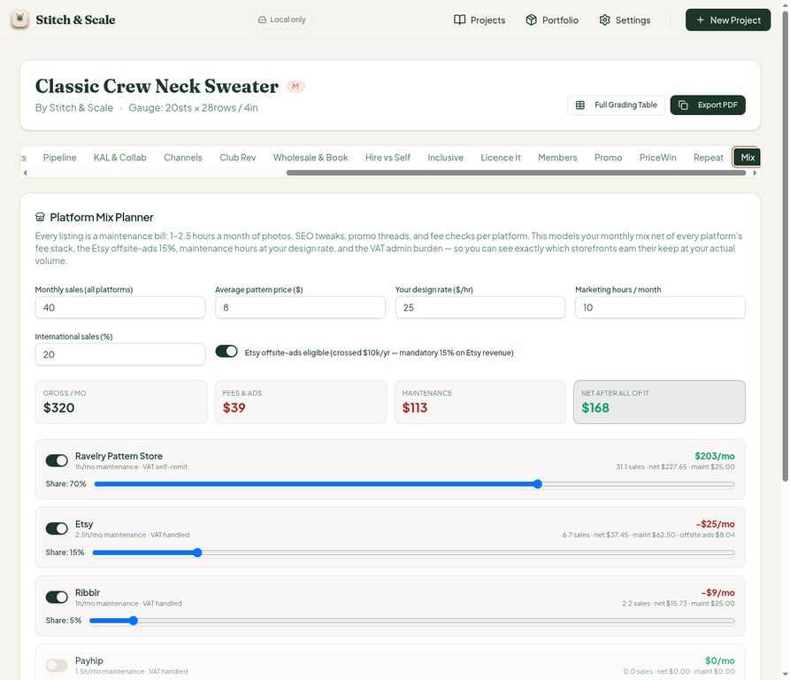
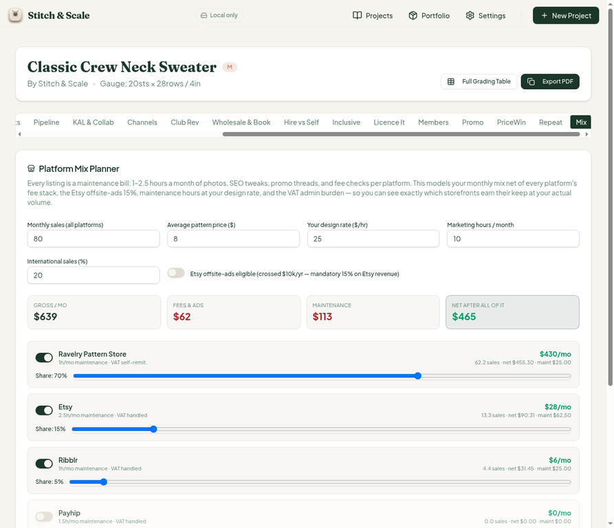
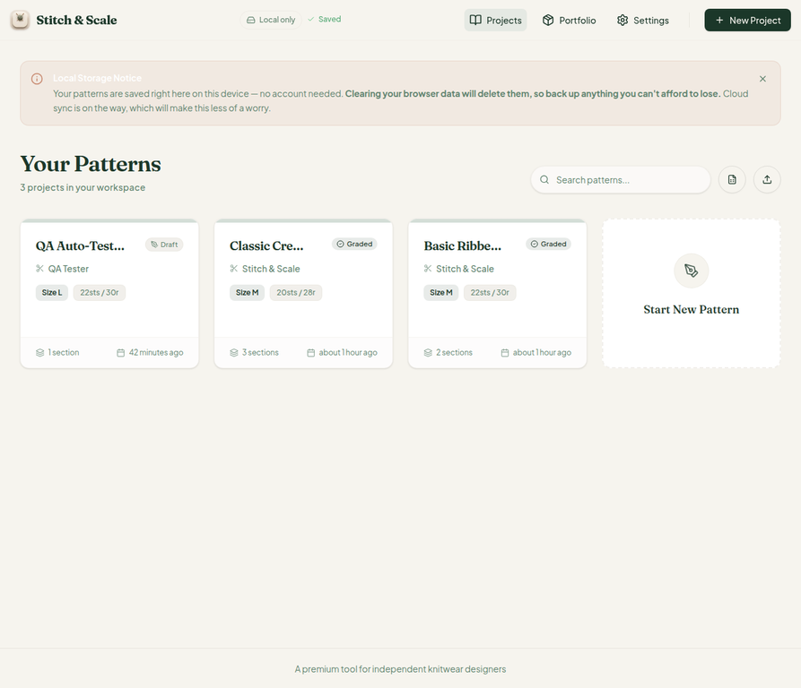

# QA Report — Stitch & Scale Pro (Scheduled cycle 4, 2026-08-14)

**Trigger:** 2 new commits on `main` since the last reviewed SHA (`e6b923c`): **CHK-030** Platform Mix Planner (30th workspace tab, "Mix"), plus a playbook progress log.
**Baseline at HEAD `8be9876`:** `pnpm install` clean · typecheck passes · **vitest 504/504 pass** (the new tab brought 16 tests) · production build passes (5.57s).

## What was tested

Screenshots of every key Mix-panel state are embedded below and are also committed to this branch under `qa-shots-cycle4/`.

**Mix panel — default state (40 sales/mo, offsite ads ON):**

**Mix panel — sales input raised to 80/month:** gross/mo rises $320 → $639, net $168 → $449, Etsy line turns positive ($12/mo) — screenshot captured mid-interaction:

**Mix panel — offsite-ads toggle clicked at 80 sales/month:** fees & ads drop $78 → $62 and Etsy's net rises ($90.31 vs $74.35, offsite-ads line removed) — confirms the control is a real switch; text extraction confirmed both ON/OFF states produce the correct 15% line — note the toggle defaults ON.

The new **Mix** tab was opened on a fresh dev server (restarted after the pull, per the cycle-3 playbook fix) and exercised end-to-end: default outputs, the monthly-sales input, the Etsy offsite-ads switch, and per-platform net math were captured and arithmetically sanity-checked. Source-level verification confirmed the toggle default (`subjectToOffsiteAds: true`) matches the default summary row, resolving an apparent UX ambiguity. Dashboard and localStorage persistence were regression-checked, and the full baseline was re-run after the browser session. No code was modified under `src/`.

| Area | Result |
| --- | --- |
| Mix (Platform Mix Planner) | Default state: 40 sales/mo × $8 = Gross $320; fees & ads $39; maintenance $113 (Etsy 2.5h, Ravelry/Ribblr 1h, Payhip 1.5h at $25/hr); net $168 — **arithmetically consistent** ($320 − $39 − $113 = $168). Per-platform breakdown shows Ravelry $203/mo net (after $25 maint), Etsy negative after maintenance (verified: $37.45 − $62.50 − $8.04 = −$33.09), Ribblr −$9.27, Payhip dormant at $0 — watch-out text matches the math. Interaction: sales 40 → 80 raised net to $449 and restored cleanly; offsite-ads toggle OFF raised net to $176 and restored the $8.04 deduction. **PASS** |
| Workspace integrity | Fresh server after pull — no `useState` crash (cycle-3 artifact confirmed as stale server only). 30-tab strip intact. **PASS** |
| Dashboard regression | 3 projects intact, QA session project preserved — no data loss across the update. **PASS** |
| Post-session baseline | typecheck pass · 504/504 tests · build pass · working tree clean. |

## Findings in this cycle

| # | Severity | Finding | Addressed to |
| --- | --- | --- | --- |
| 17 | INFO | The Mix toggle is labelled as a status — *"Etsy offsite-ads eligible (crossed $10k/yr — mandatory 15% on Etsy revenue)"* — while it is actually a switch that turns Etsy offsite ads on/off (default ON). A glance at the panel reads as a static fact, not a control, and the mandatory phrasing could confuse the meaning of turning it off. The same class as findings #9–#10 (label clarity). No logic defect — the toggle, its default, and the 15% deduction all behave correctly. | Reviewer |

No functional defects were found in the new tab. The previously reported critical items (**#6** instant measurement delete, **#7** no edit path) remain **unresolved** in this build; their code paths are unchanged and did not regress.

*No code was modified. Report committed only to a `qa/` branch; `main` untouched. Prepared by Manus AI (QA role).*
