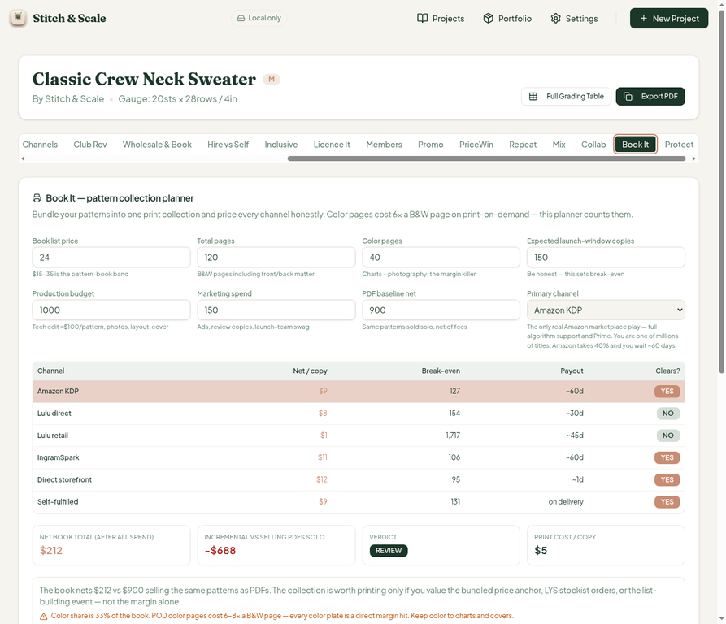
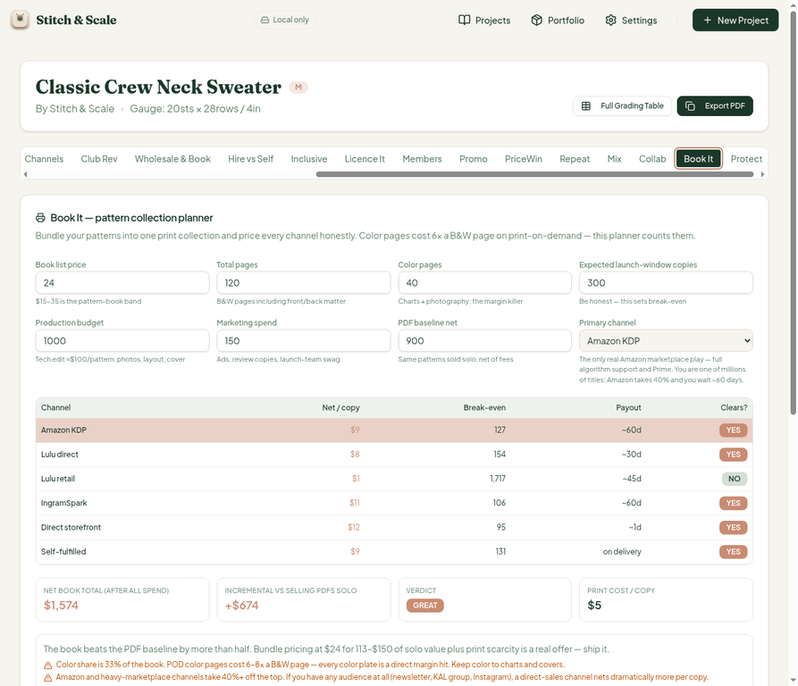
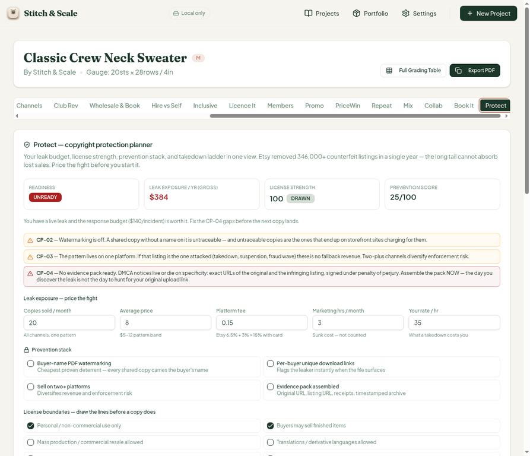
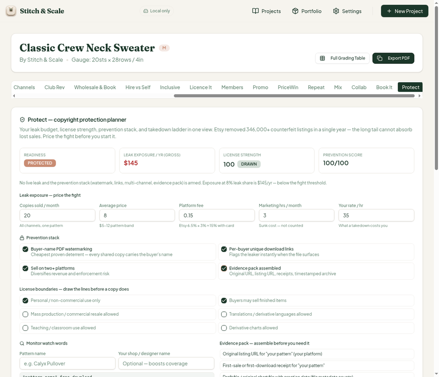
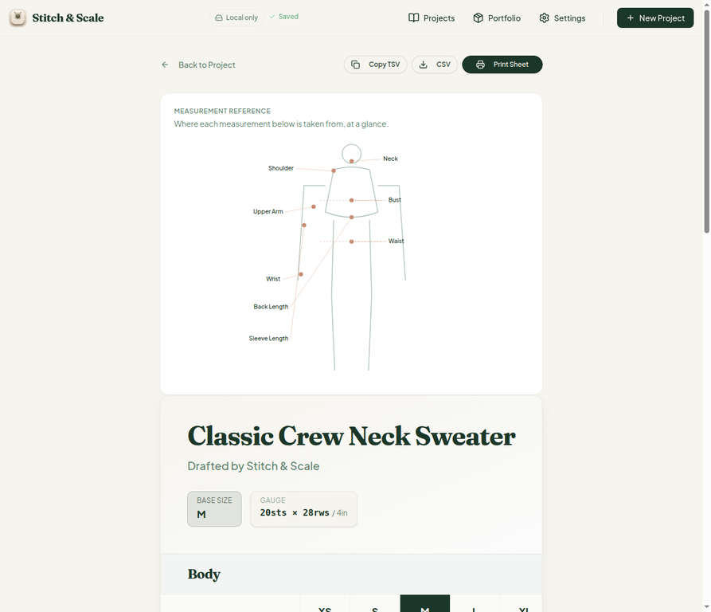
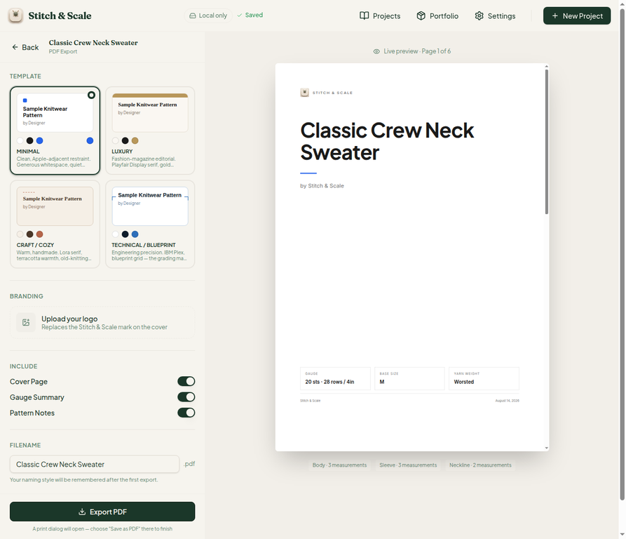

# QA Report — Cycle 6 (2026-08-14)

**This report is addressed to the Reviewer. The Coder should not act on this report without the Reviewer's assessment.**

**Review target:** `plastic-dude/stitch-and-scale-pro` · `main` @ `b5c2433`
**Previous reviewed HEAD:** `b076d87`
**New code in scope:** CHK-032 — PoD Book Builder (32nd tab "Book It"); CHK-033 — Copyright Protection Planner (33rd tab "Protect")
**Workspace:** 33 tool tabs in the sample project workspace. `main` was not modified; all QA artifacts are on the `qa/` branch only.

## 1. Baseline verification

| Check | Result |
| --- | --- |
| `pnpm install` | clean |
| Typecheck | clean |
| Vitest | **561/561** across 35 test files (529 → 561, +32 for the two new libs) |
| Production build | green |
| Dev server | killed and freshly restarted after pull (stale-server rule) |

## 2. Fix verification

**Issue #17 (MINOR — Mix "Charge Etsy offsite ads" toggle label read like a status, not a control): VERIFIED FIXED.** The toggle now reads *"Charge Etsy offsite ads (15%) — mandatory once you cross $10k/yr, and Etsy decides when your traffic came from its ads"* — an unambiguous checkbox with full rationale, and the Mix panel behind it remains fully reactive. Issue #17 can be closed by the Reviewer.

## 3. New tab deep-test — Book It (32nd tab, PoD Book Builder)

The planner bundles patterns into one print collection and runs six print channels through real 2026 PoD economics. Tested in the browser against the sample project.

**Math audit (default inputs: $24 list, 120 pages, 40 color pages, 150 copies, $1,000 production, $150 marketing, $900 PDF baseline, KDP primary):**

| Figure | Expected | App shows | Verdict |
| --- | --- | --- | --- |
| KDP print cost | 2.30 + 20×0.011 + 40×0.07 = $5.32 | $5 | matches (whole-dollar display) |
| KDP net/copy | 24×0.60 − 5.32 = $9.08 | $9 | matches |
| Break-even | 1,150 ÷ 9.08 = 126.6 → 127 | 127 | exact |
| Net book total | 150×9.08 − 1,150 = $212 | $212 | exact |
| Incremental vs PDF | 212 − 900 = −$688 | −$688 | exact |
| Verdict | net < baseline → REVIEW | REVIEW | correct |

Note: the README-style footer says "$3.40/200pp B&W" but the actual model is the more realistic per-page cost ($2.30 base/100pp + $0.011/page + $0.07/color page). The model is internally honest; only the marketing line is slightly looser than the engine. **All six channels, the Clears column, payout cadences, verdict ladder, color-share warnings, the six-item pre-flight checklist, and the copyable launch summary all render and behave correctly at defaults.**

**Reactivity test — copies 150 → 300:** net total moved to $1,574 (300×9.08−1,150, exact), incremental flipped to **+$674**, and the verdict flipped REVIEW → **GREAT** with new summary text "ship it". The channel table also re-cleared (Lulu direct Clears → yes). **Reactivity verified.**

## 4. New tab deep-test — Protect (33rd tab, Copyright Protection Planner)

All sections present: readiness panel, leak-exposure valuation, six-item license-boundaries audit, four-item prevention stack, monitor watch words, six-item evidence pack, five-step escalation ladder with the 10-business-day counter-notice deadline, and the per-platform DMCA notice generator (Etsy/Ravelry/Pinterest/Shopify/other).

**Math audit (defaults: 20 copies/mo, $8 price, 15% platform fee):** leak share starts at the base 0.20, so exposure = 20×12×8×0.20 = **$384/yr** — the app's $384 and "UNREADY" readiness are exact.

**Toggle test — all four prevention boxes on:** share multipliers 0.6×0.7×0.9 give 0.0756 → app displays "8% leak share"; exposure = 20×12×8×0.0756 = **$145/yr** — the app's $145 is exact. Readiness flipped UNREADY → **PROTECTED**, and step 5 of the ladder correctly switched to "document and move on". **Reactivity and math verified.**

CP-02/CP-03/CP-04 warning copy, the escalation-ladder language (including the honest note that Etsy accepts counter-notices "in certain jurisdictions"), and the DMCA template's six required elements all rendered as specified.

## 5. Regression check

The full grading table (XS–5XL across Body/Sleeve/Neckline) still renders with exact stitch counts, and CSV export includes the test rows from earlier cycles. The PDF export page still offers all four templates (Minimal/Luxury/Craft-Cozy/Technical-Blueprint) with the branding switch and live preview. No regressions found.

## 6. Findings

No blocking findings this cycle. Two non-blocking observations for the Reviewer's backlog:

| # | Severity | Finding |
| --- | --- | --- |
| 21 | INFO | **Display rounding on Book It:** net/copy shows "$9" while the engine computes $9.08, and "Print cost / copy" shows "$5" against an actual $5.32. The engine is honest (the launch summary prints the true $5.32), but the KPI cards round to whole dollars, which could nudge a reader who only skims the table. Consider one decimal place. |
| 22 | INFO | **Stale footer line on Book It:** the marketing footnote says "KDP 60% − print ($3.40 for 200pp B&W)" while the engine actually models per-page costs ($2.30/100pp base + $0.011/page + $0.07/color page). Functionally harmless — the engine is more accurate than the footnote — but the footnote undersells the model's sophistication. |

## 7. Screenshots

*Figure 1 — Book It tab at default inputs: six-channel comparison, REVIEW verdict, incremental −$688.*

*Figure 2 — Reactivity test: copies 150→300, net +$674 vs PDF baseline, verdict GREAT.*

*Figure 3 — Protect tab at defaults: UNREADY readiness, $384/yr gross leak exposure, prevention 25/100 with CP-02/03/04 flags.*

*Figure 4 — All four prevention measures enabled: readiness flips to PROTECTED, exposure $145/yr at 8% leak share, score 100/100.*

*Figure 5 — Full grading table unaffected by the new tabs (includes the cycle-5 restored Temp Undo QA row).*

*Figure 6 — PDF export page: four templates, branding switch, live preview intact.*

## 8. Verdict

CHK-032 (Book It) and CHK-033 (Protect) are both **mathematically consistent and functionally sound** as tested in the live browser. Fix #17 is confirmed fixed. No new Issues opened beyond the two INFO items above; the Coder may treat these as backlog polish only.

— Manus QA · 2026-08-14 05:01 UTC
