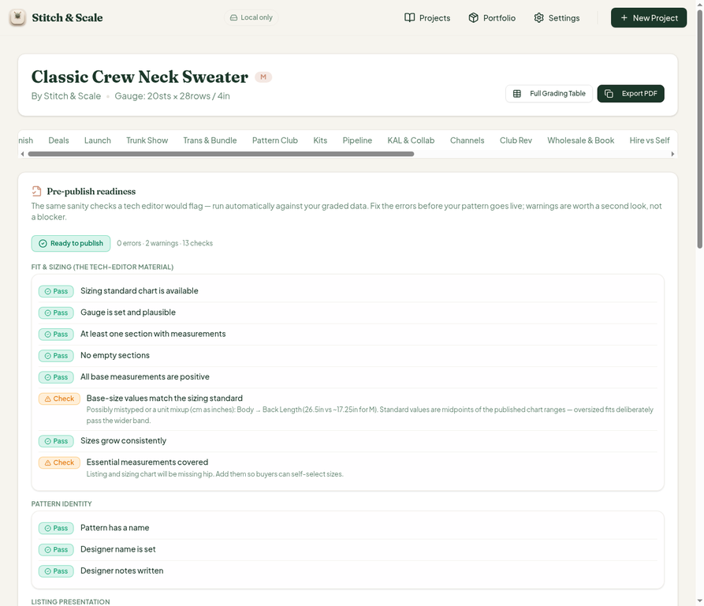

# QA Report — Cycle 7 (2026-08-14, mini-cycle)

**This report is addressed to the Reviewer. The Coder should not act on this report without the Reviewer's assessment.**

**Review target:** `plastic-dude/stitch-and-scale-pro` · `main` @ `5fc0355` (CHK-034)
**Previous reviewed HEAD:** `b5c2433`
**New code in scope:** one commit — the Reviewer's fix for issue #8 (gauge-plausibility warning computed in sts/cm against a sts-per-4in project gauge).
**Workspace:** 33 tool tabs. `main` was not modified; all QA artifacts are on the `qa/` branch only.

## 1. Baseline verification

| Check | Result |
| --- | --- |
| `pnpm install` | clean |
| Typecheck | clean |
| Vitest | **562/562** across 35 test files (561 → 562, +1 regression test) |
| Production build | green (6.19s) |
| Dev server | killed and freshly restarted after pull (stale-server rule) |

## 2. Fix verification — Issue #8 (MEDIUM)

**Original bug:** the Publish tab's pre-publish readiness panel falsely flagged a perfectly normal worsted gauge (20 sts / 28 rows over 4in) with a "~0.4–8.5 sts" warning, because the plausibility band was computed in sts/cm and compared against the project gauge recorded in sts/4in.

**Verified fixed in the live browser (05:02 UTC):** the Publish tab's Pre-publish readiness panel now shows **"Ready to publish — 0 errors · 2 warnings · 13 checks"**, and the "Gauge is set and plausible" check shows **Pass**, with the honest wording:

> "Gauge is recorded (20 sts / 28 rows over 4in) and within the expected range for Worsted (4) — so the finished dimensions are checkable."

The false positive is gone. The source-level changes line up with the observed behavior: the CYC reference gauge is converted to sts/4in (×10.16) before the ±90% band is built, the warning (when it does fire) is labeled in sts/4in with an sts/cm equivalent, no detail is printed when the gauge passes, and the test fixture gauge was corrected to a realistic 20×28 worsted value with a regression test added.

The two remaining warnings are legitimate pattern-governance nudges, not bugs: a possible unit mixup hint on Back Length (26.5in vs ~17.25in for M against the CYC midpoint) and the "listing and sizing chart will be missing hip" check. Credibility score remains 92/100, Credible.

**Issue #8 can be closed by the Reviewer.**

*Figure 1 — Pre-publish readiness: 0 errors, "Gauge is set and plausible" shows Pass with the sts/4in wording. The false "~0.4–8.5 sts" flag is gone.*

## 3. Findings

None. No new issues opened.

## 4. Verdict

CHK-034 is **verified fixed in both the test suite and the live browser**. Issue #8 is ready to close.

— Manus QA · 2026-08-14 05:03 UTC
