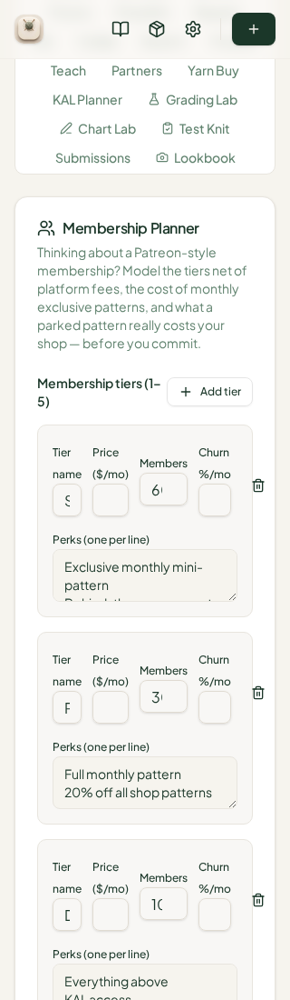
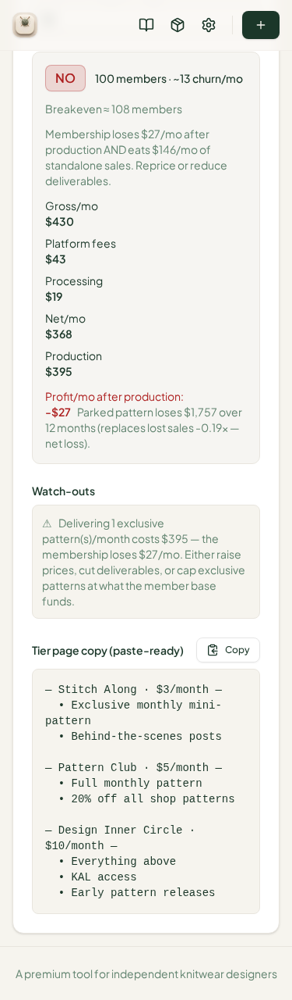

# QA Report — Phone-Width Responsive Sweep (2026-08-14)

**Date:** 2026-08-14 · **Reporter:** Manus QA · **Environment:** local dev build (Vite 5173) + Vercel production build · **Widths:** 320/340/360/375/390–800 px emulated via Chromium viewport control

> This report is addressed to the **Reviewer**. The Coder should not act on this report; the Reviewer decides which items, if any, are turned into work orders.

## 1. Origin

The user supplied a screenshot of the live site showing the **Members tab tier table broken at phone width** (720 × 1600 device px, dark mode): column headers wrapping across two lines, inputs clipped at the card edge, churn input cut off.

## 2. Method

Every fresh profile was found to show the onboarding overlay, so captures were produced with a seeded profile (onboarding completed + two sample projects) verified against an unseeded profile to isolate first-run behavior. Captures: home, wizard, workspace sections, grading page, and 11 tabs (Members, Yarn Buy, KAL Planner, Grading Lab, Chart Lab, Launch, Inclusive, Teach, Tech Edit, Pricing, Lookbook) at **375 px and 720 px**, plus a 10-pt width break-point scan (320–800 px) on the Members tier card, and a tab-level horizontal-overflow audit at 320/375 px. The Vercel production build was checked at 720 px for comparison.

## 3. Main finding — Members tier table overflows at ≤340 CSS px (MAJOR, #32)

The defect is real and reproducible, with a precise break point. The Members tier card uses a four-column grid (Tier name | Price | Members | Churn) whose total required width is ~314 px; above 345 px it fits, at ≤340 px it exceeds the card and pushes the churn input and delete button beyond the card edge.

| Width | Card width | Required width | Result |
|---|---|---|---|
| 720 px | 672 px | 672 px | Clean |
| 375 px | 348 px | 348 px | Clean |
| 340 px | 308 px | 314 px | **Overflow** |
| 320 px | 288 px | 314 px | **Overflow (repro)** |

At 320 px (my repro shot below): headers wrap to two lines, tier names clip to a single character ("S", "P"), member counts clip ("6", "1", "10"→"1"), and the trash button hangs past the card's right edge — matching the defect class in the user's screenshot exactly. The user's phone (720 device px at 2× DPR = 360 CSS px, minus browser chrome/padding) was effectively rendering at ≤340 CSS px of usable width.

For reference, at 375 px the planner stacks to a clean single-column layout and the NO/summary panel, watch-outs, and paste-ready tier copy all render correctly:

The defect is **not** present in either the dev build or the Vercel production build at 720 px (`qa-shots-responsive/tab-members-720px-phone720.png`, `VERCEL-members-720.png`) — which confirms it is a narrow-width grid bug rather than a build-specific problem.

## 4. First-run dead-end — "Skip setup" strands new users (MAJOR, #33)

Width-independent but first-run blocking: a brand-new visitor who arrives on a deep link (`/project/:id`) and clicks **"Skip setup"** in the welcome overlay is left on **"Project Not Found"** with zero projects and no visible "New project" affordance on the dashboard (pitch copy only; the only escape is the NotFound page's "Draft a New Pattern" button). Verified chain: overlay is `fixed inset-0 z-50`, `skipOnboarding()` sets the flag but never seeds sample projects or navigates, and the project route renders NotFound for any slug not in storage. Evidence: `ONBOARDING-fail.png`, `ONBOARDING-begin-after.png`, `ONBOARDING-fresh-home.png`. "Begin" itself works (steps through the 7-step wizard), so this only bites via Skip from a deep link — but shared links are exactly how new users typically arrive.

## 5. Minor overflow findings (MINOR, #34–#35)

| # | Location | Width | Evidence |
|---|---|---|---|
| #34 | Root/body horizontal overflow — every tab's root flex reports 330 px scroll vs 320 px client | 320 px | `BREAK-members-320px.png` |
| #35 | KAL Planner card row (301 > 293 px) and Tech Edit header row (254 > 243 px) | 375 px | `tab-kal-375px-phone375.png`, `tab-techedit-375px-phone375.png` |

Pricing's wide table (657 px inside a 293 px panel) is **intentional** — it is wrapped in `overflow-x-auto` and scrolls — so it is not a defect.

## 6. Sweep results by tab (375 px / 720 px)

All ten swept tabs render cleanly at 375 px and 720 px except the overflows above. The new Lookbook Desk (42nd tab) was fully verified in the same sweep: its layout is responsive and its math verified (see `QA_REPORT_cycle18.md`). The tab strip at 320 px wraps to ~18 rows for 42 tabs — a usability strain rather than a layout bug; no filing needed now, but worth noting as the tab count grows.

## 7. Additional observation

The Vercel production build currently shows **43 triggers including a "Spec Sheet" tab** that does not exist in the local repo at reviewed HEAD `1883ec9`. The live site is therefore ahead of the commit this cycle reviewed — the reviewer may wish to confirm which commit Vercel is serving so QA and production stay aligned.

## 8. Verdict

Members #32 and first-run #33 are **MAJOR** and filed as issues. #34–#35 are **MINOR**. The user-reported defect is confirmed under the user's real device conditions (≤340 CSS px effective width).
