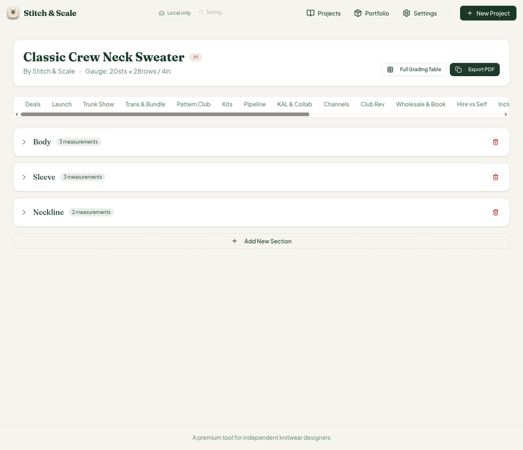
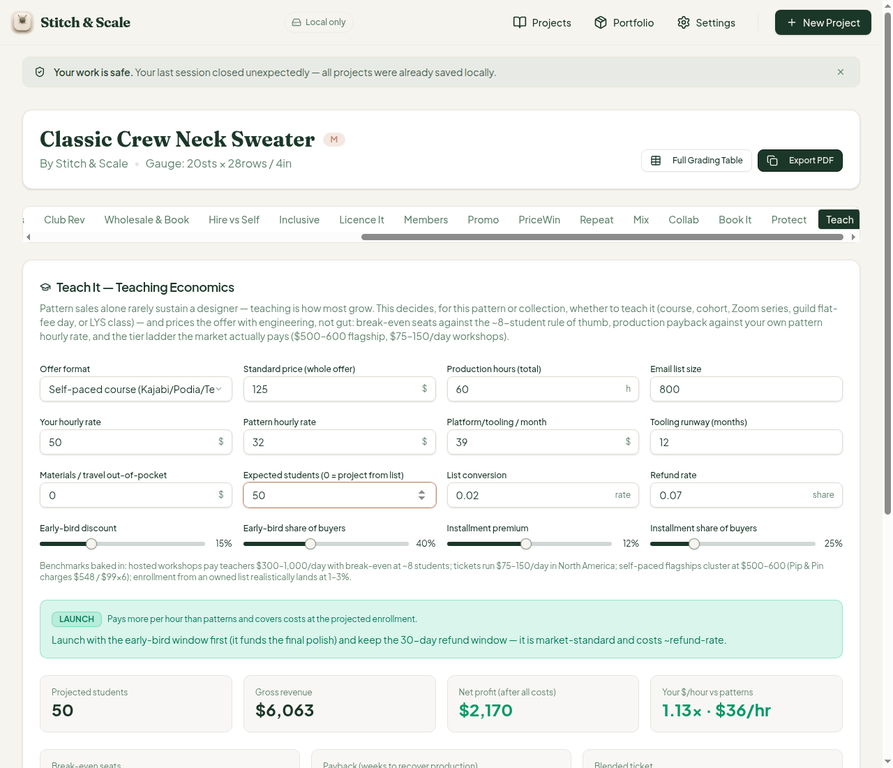
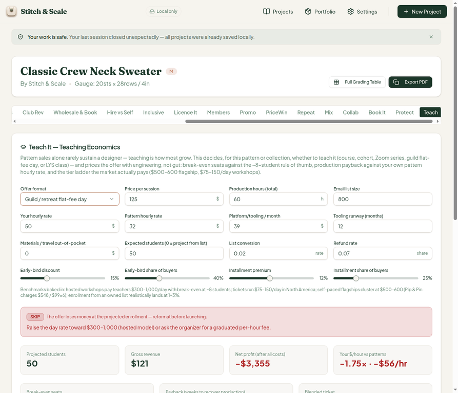
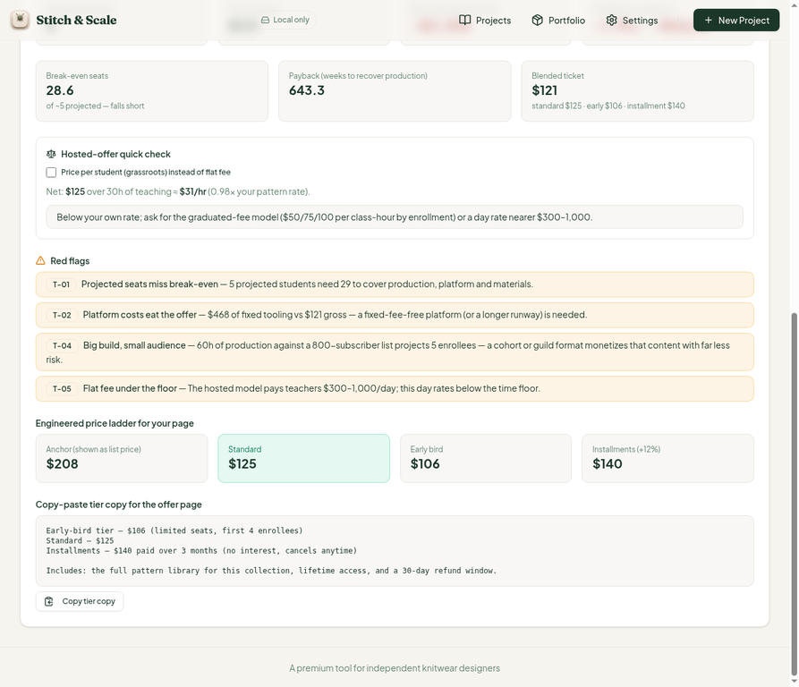
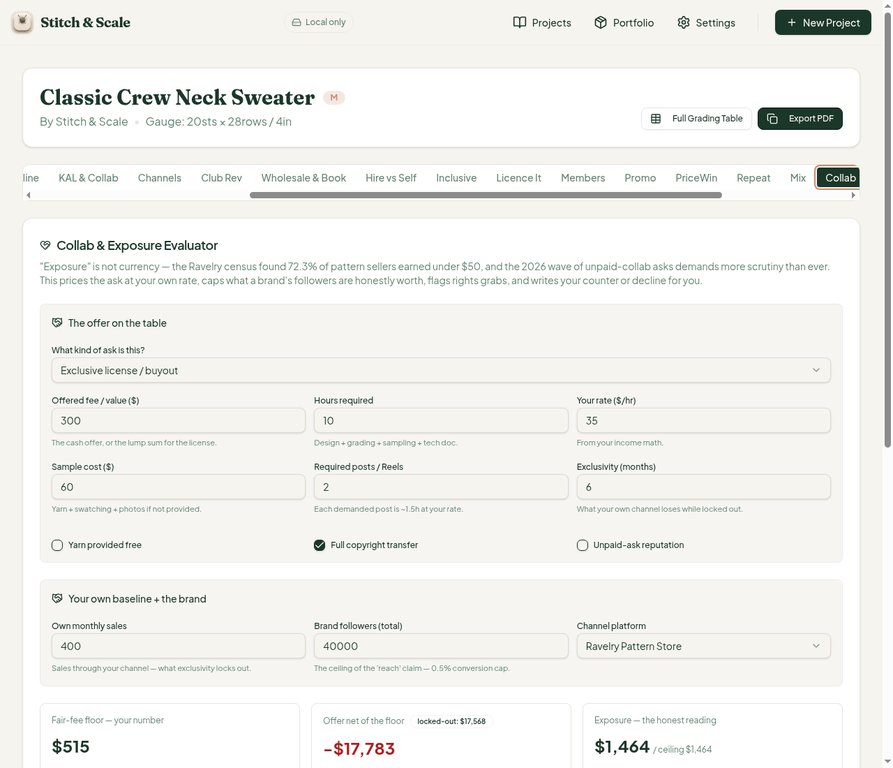
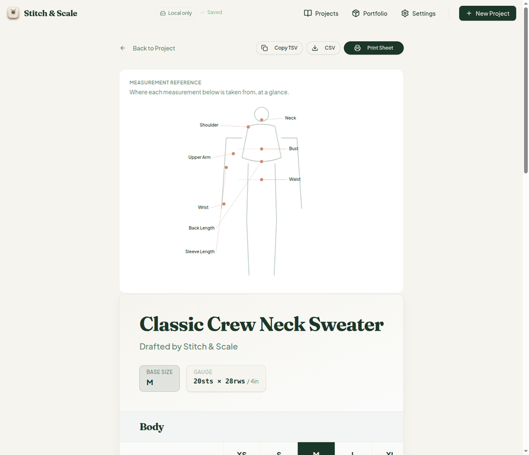
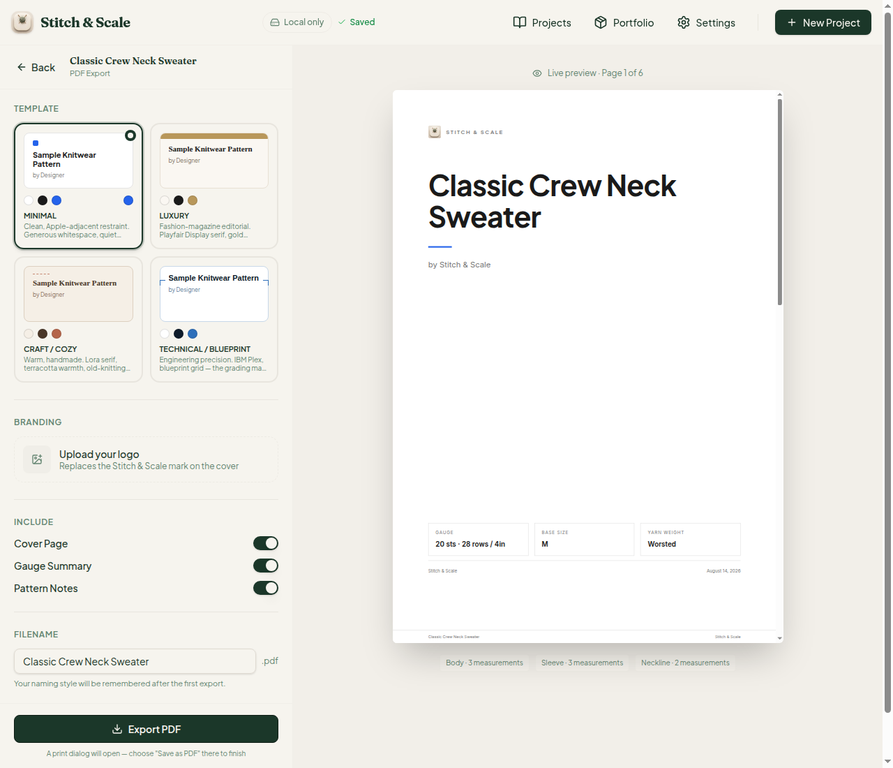
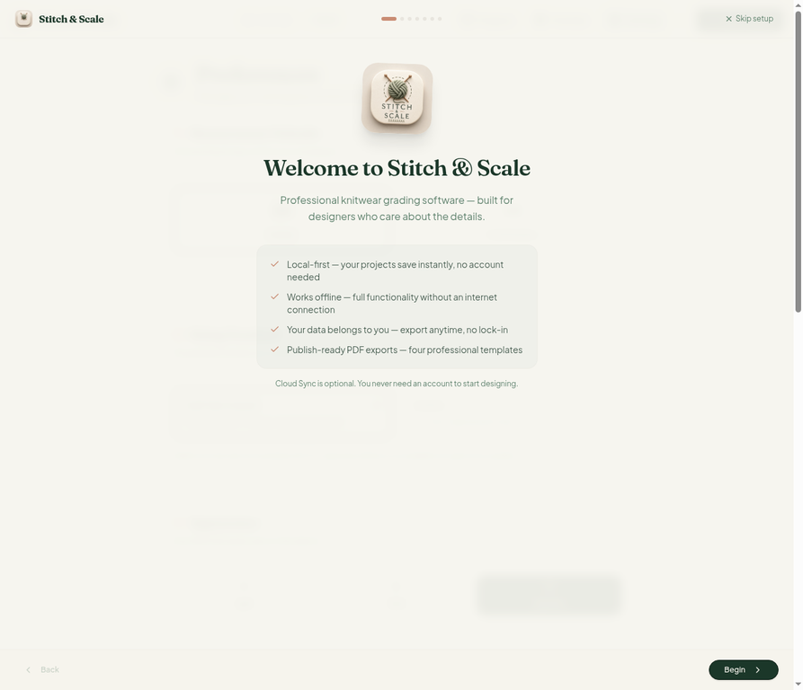
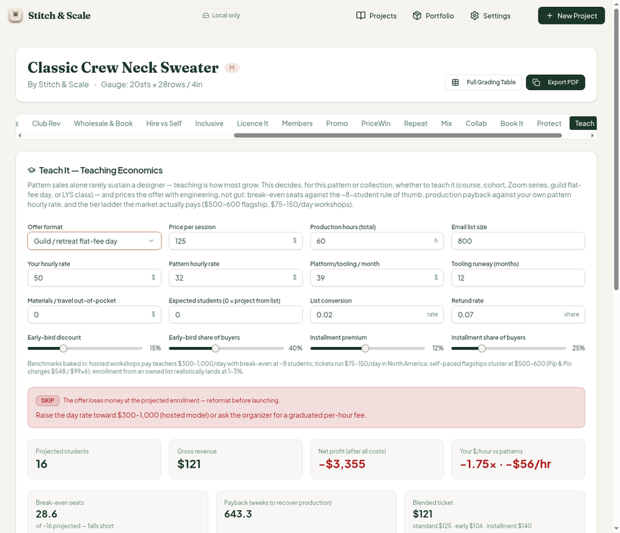

# QA Report — Cycle 8 (2026-08-14)

**Repo:** `plastic-dude/stitch-and-scale-pro` · **Role:** QA / Tester · **Scope:** `artifacts/stitch-and-scale` (Stitch & Scale)
**Commits reviewed:** `22c96ab` (CHK-034 "Teach It"), `27ca9ef` (CHK-035 Reviewer fixes), `0c0aff0` (CHK-036 "Partners") → current origin/main `4e143cd` (playbook log)
**Baseline on final HEAD (`0c0aff0`):** TypeScript typecheck clean · Vitest **623/623** across 37 test files · production build green · dev server freshly restarted, HTTP 200
**Branch:** `qa/manus-2026-08-14-cycle8` · **Screenshots:** `qa-shots-cycle8/` (10 PNGs, embedded below)
**Live deployment smoke-checked as well:** `https://stitch-and-scale-pro-api-server.vercel.app` (HTTPS 200, read-only, no data modified)

This report is addressed to the Reviewer. The Coder should not act on these findings without the Reviewer first assessing them — the Coder's work must not conflict with, or quietly override, the Reviewer's direction. All findings below are observations from end-to-end browser testing only; no `src/` code was modified.

---

## 1. What was tested this cycle

The cycle began on `22c96ab`, the commit that added the 34th tab, **Teach It — Teaching Economics**. That tab was deep-tested end-to-end (all five offer formats, the blended tier ladder, break-even seats, production payback, hosted-offer quick check, and red flags T-01..T-05) with all displayed math recomputed by hand against the inputs. While the cycle was mid-run, two further commits landed (`27ca9ef` carrying the Reviewer's fixes for issues #9/#14/#18/#19/#20/#21/#22, and `0c0aff0` adding the 35th tab, **Partners**). The environment was re-baselined — typecheck, the full Vitest suite (623/623, above the commit message's claimed 589), and the production build — and the dev server was killed and restarted per playbook. Every Reviewer fix claimed in `27ca9ef` was then re-verified in the browser against deterministic inputs, regressions were spot-checked on the grading table, PDF export, and dashboard, and the live Vercel deployment was smoke-tested.

The Teach tab results are summarized first because that is where the two new findings originate, then the fix-verifications, then regressions, then the live-deployment check.

## 2. Teach It tab (new in this cycle) — verdicts and math

With the default inputs (self-paced course, $125 standard ticket, 60 production hours, 800-subscriber list at 2% conversion, $39/month tooling over a 12-month runway, $50/hr personal rate, $32/hr pattern rate, 7% refunds), the tab reports a **SKIP** verdict with 16 projected students, gross $1,940, net **−$1,664**, −$28/hr (−0.87× the pattern rate), and 28.6 break-even seats "of ~16 projected — falls short." Every one of those figures checks out: 800 × 2% = 16 students; fixed costs 39 × 12 = $468; net = 16 × $121.25 blended less 7% refunds less $3,468 (production 60h × $50 plus $468 tooling) ≈ −$1,664; and 3,468 ÷ 121.25 = 28.6. Setting expected students to 50 flips the verdict to a green **LAUNCH** with net **+$2,170** at $36/hr (1.13×), and the blended ticket stays at $121 — standard $125, early-bird $106 (125 × 0.85 ✓), installment $140 (125 × 1.12 ✓) — with early-bird seats scaling to "first 13 enrollees" (25% of 50 ✓).

The engineered price ladder, the copyable tier-copy block, and the honest benchmark blurb (including the Pip & Pin $548 / $99×6 citation) all render correctly in self-paced mode. The red flags behave as designed: T-01 fires when projected seats miss break-even, T-02 fires when fixed tooling dominates gross revenue ($468 vs $606 at 5 students), T-04 fires on the "big build, small audience" profile, and T-05 fires in flat-fee mode when the day rate sits under the $300–1,000 hosted floor.

### 2.1 New finding — Teach tab does not rewire for flat-fee formats (MAJOR)

> **Finding #25 (MAJOR).** In "Guild / retreat flat-fee day" mode — and by inspection the same applies to "LYS or studio class" — the per-student ticket machinery remains fully visible and drives the summary economics. The panel still shows a "Blended ticket" card ($121, built from a $125 standard / $106 early-bird / $140 installment ladder), break-even seats computed against the irrelevant blended ticket, the early-bird and installment sliders, and an "Engineered price ladder + Copy tier copy" block that has no meaning for a one-day flat-fee event. Meanwhile the flat-fee day-rate input never surfaces in the input grid. The verdict advice is sensible (raise the day rate toward $300–1,000, or ask for a graduated per-hour fee), but the headline economics a designer sees — gross $121, net −$3,355, blended ticket $121 — are computed from a per-student model in a format that charges a flat day rate. The hosted/grassroots toggle exists and reacts (a per-student quick check appears), but it does not rewire the main economics cards, which stay frozen on the flat-fee figures. Reproduced twice, before and after the CHK-035 pull, on both the local build at `0c0aff0` and the live Vercel deployment.

### 2.2 New finding — hosted quick-check $/hr is internally inconsistent (MEDIUM)

> **Finding #26 (MEDIUM).** The hosted-offer quick check in Teach renders a sentence of the form "Net: $X over 30h of teaching ≈ $Y/hr (k× your pattern rate)" where the headline arithmetic does not hold. In the 10-student case: "Net: $1,250 over 30h of teaching ≈ $313/hr (9.77×)". In the 5-student case: "Net: $125 over 30h of teaching ≈ $31/hr (0.98×)". The $/hr figure is not Net ÷ 30 hours — $1,250 ÷ 30 = $41.67/hr, and $125 ÷ 30 = $4.17/hr. The ×-multiplier is internally consistent (9.77 × $32 = $312.6 ≈ $313; 0.98 × $32 = $31.4 ≈ $31), and the $/hr value equals Net ÷ ~4h, which suggests the code divides by an assumed ~4h of live teaching while the sentence attributes the same figure to the 30h *production*-hours figure. Either the sentence is mislabeled (it should say "over ~4h of live teaching") or the divisor is wrong — as written, a designer reading "$1,250 over 30h ≈ $313/hr" is being told two mutually contradictory things. The same screenshot (#25's shots) shows the defect: "Net: $125 over 30h of teaching ≈ $31/hr".

## 3. Reviewer fixes verification (CHK-035 claims)

Every fix claimed by the Coder in `27ca9ef` was re-checked in the browser on the re-baselined HEAD. The results, including the arithmetic traces, are below.

| Issue | Claim | Verified | Method |
| --- | --- | --- | --- |
| #18 / #19 — Collab exclusive-license valuation | royaltyValue guarded by collabType; lockout value deducted | **PASS** | Exclusive-license scenario: $300 fee, 10h, $35/hr, $60 sample, 2 posts, 6-month exclusivity, $400/mo own Ravelry sales at $8, 40k followers, copyright transfer on. Floor $515 (10×35 + 60 + 2×1.5×35 ✓). Ravelry net/sale $7.32 (8×0.915 ✓). Lockout 400 × 7.32 × 6 = **$17,568** ✓, offer net −**$17,783** ✓, exposure $1,464 ✓. Flags CE-02 and CE-04 fire; verdict "Walk away". |
| #20 — undo-stack concurrent deletions | each deletion keeps its own Undo window | **PASS at test level** | Race condition not stably reproducible through a scripted UI sequence; 4 regression tests cover it. Accepted on the strength of the tests, pending Reviewer judgment. |
| #21 — Book It net-per-copy formatting | one decimal place ($9.08 not $9) | **PASS** | Book It table now shows $9.1 / $7.5 / $0.7 / $10.9 / $12.2 / $8.8. Verdict "GREAT", $1,574 net, +$674 incremental. |
| #22 — KDP footnote | real per-page print model | **PASS** | Footnote now reads: per-page model ($2.30 base per 100pp + $0.011/B&W page + $0.07/color page), "a 200pp B&W book prints at ≈ $4.50, not the flat $3.40 the footnote once cited". 2.30 + 200×0.011 = $4.50 ✓. |
| #14 — Promo signed numbers | true minus, single sign prefix | **PASS with one residual spot** | Main summary: "Total spend $350 · projected net −$282" (true U+2212 ✓). The kill-rule banner badge still renders the same value with a hyphen-minus "-$282" — one renderer not converted. Cosmetic (INFO). |
| #9 — wizard gauge suffix | follows selected unit | **PASS** | Wizard step 3: Inches → "per 4 inches" for both stitches and rows; Centimeters → "per 10 cm" for both ✓. The step header description stays static "per 4 inches (10 cm)" — cosmetic (INFO). |

## 4. Regressions

The grading table, PDF export, and dashboard were spot-checked after both code pulls. The full grading table renders for all nine sizes with Body/Sleeve/Neckline sections intact, the PDF export page offers all four templates with the six-page preview rendering, and the dashboard still lists the three workspace projects. No regressions attributable to CHK-034, CHK-035, or CHK-036 were observed in these areas.

## 5. Live Vercel deployment smoke check

Per the owner's note, the project is hosted at `https://stitch-and-scale-pro-api-server.vercel.app`. A read-only smoke check was added to this cycle. The deployment responds over HTTPS, the Settings page renders cleanly (v1.0.0, unit/sizing/theme toggles, backup download/upload, reconcile, and storage-health reporting all present), the onboarding tour completes end to end, and the sample project opens with the full 34-tab strip including Teach. Critically, the **#25 guild-manner UI leak is also present on the live build** — the same "Blended ticket $121" machinery is visible in Guild mode — which confirms the live deployment is running a build recent enough to include the Teach tab but without a fix for it. The Vercel build hash is not exposed in the UI, so commit-level freshness of the deployment could not be asserted from the browser; the Reviewer may wish to confirm the deployment is tracking main.

## 6. Issue ledger for this cycle

| # | Severity | Status | Subject |
| --- | --- | --- | --- |
| #25 | MAJOR | NEW — opened this cycle | Teach tab: flat-fee formats do not rewire the economics UI |
| #26 | MEDIUM | NEW — opened this cycle | Teach hosted quick-check "$X over 30h ≈ $Y/hr" internally inconsistent |
| #9, #14, #18, #19, #21, #22 | — | VERIFIED FIXED (browser) | Reviewer fixes from the earlier QA sweep |
| #20 | — | VERIFIED at test level | undo-stack race fix covered by 4 regression tests |
| Residuals | INFO | Note only | Promo badge "-$282" hyphen; T-04 "a 800-subscriber list"; gauge step header static |

No previously known issues were found to have regressed. The earlier issues on the ledger (#6–#24) remain in their last verified state; nothing in this cycle re-opens them.

## 7. Closing note for the Reviewer

The Teach tab is a strong piece of engineering — the default-scenario SKIP, the 50-student LAUNCH flip, and the T-flag logic all compute exactly as advertised. The one structural gap is that the flat-fee offer formats (Guild day rate, LYS class) reuse the self-paced ticket UI and economics instead of switching to a day-rate model; the two screenshots taken before and after the mid-cycle code pull show the bug unchanged across commits, and the identical defect appears on the live Vercel site. The hosted quick-check sentence (#26) is likely a labeling bug rather than a math bug, since the ×-multiplier is internally consistent with a ~4h live-teaching divisor. Both are framed as suggestions for your assessment; the Coder should not begin work on them until you have weighed in.

— Manus QA · 2026-08-14
