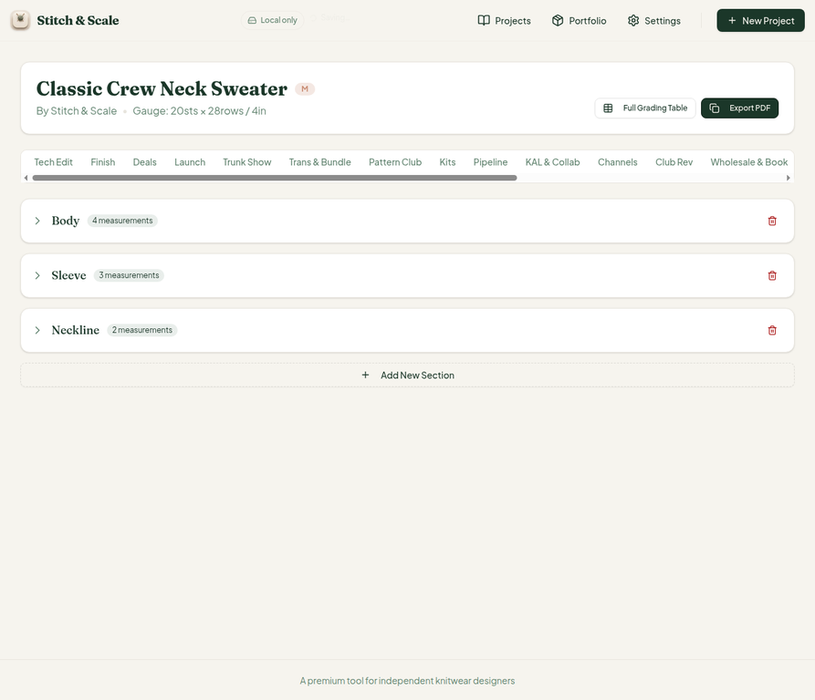
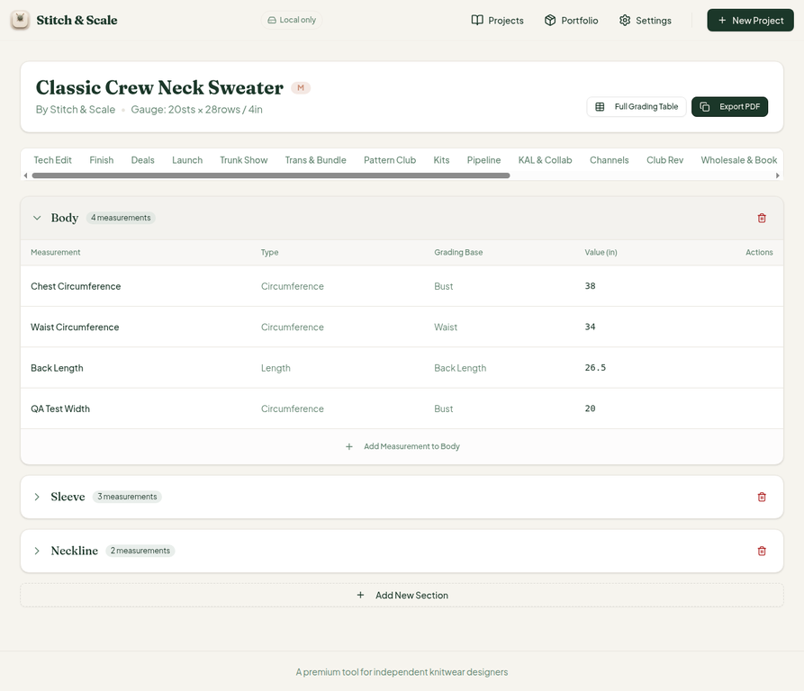
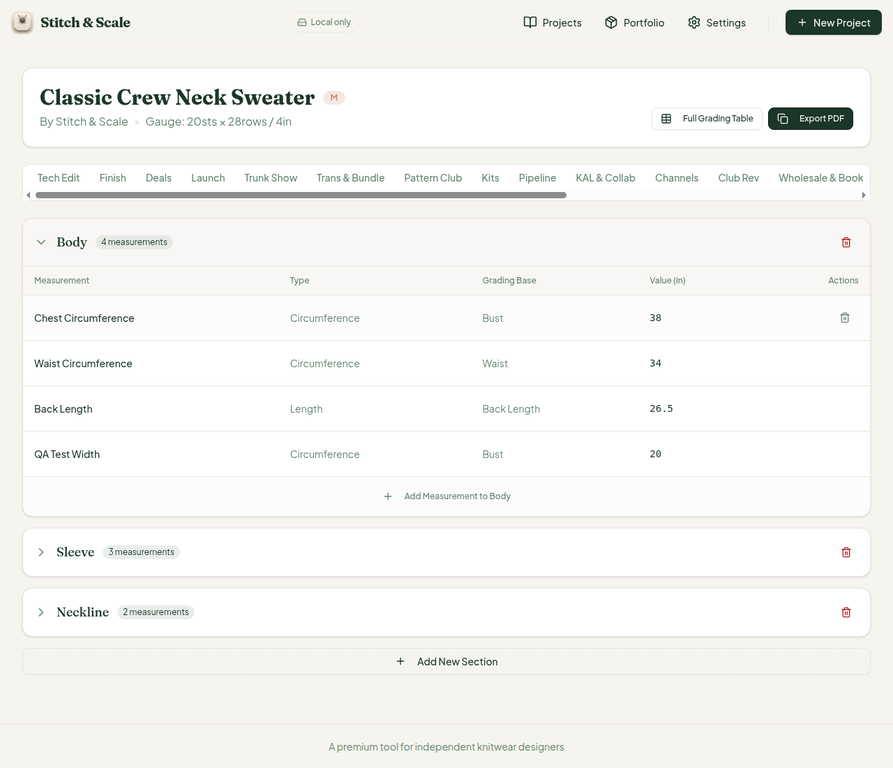
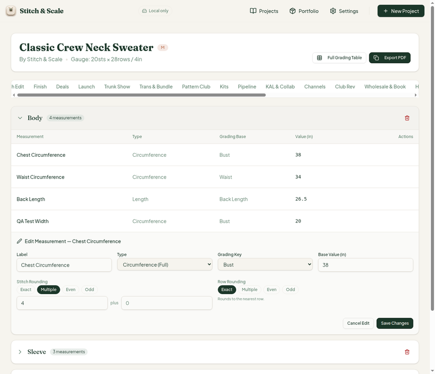
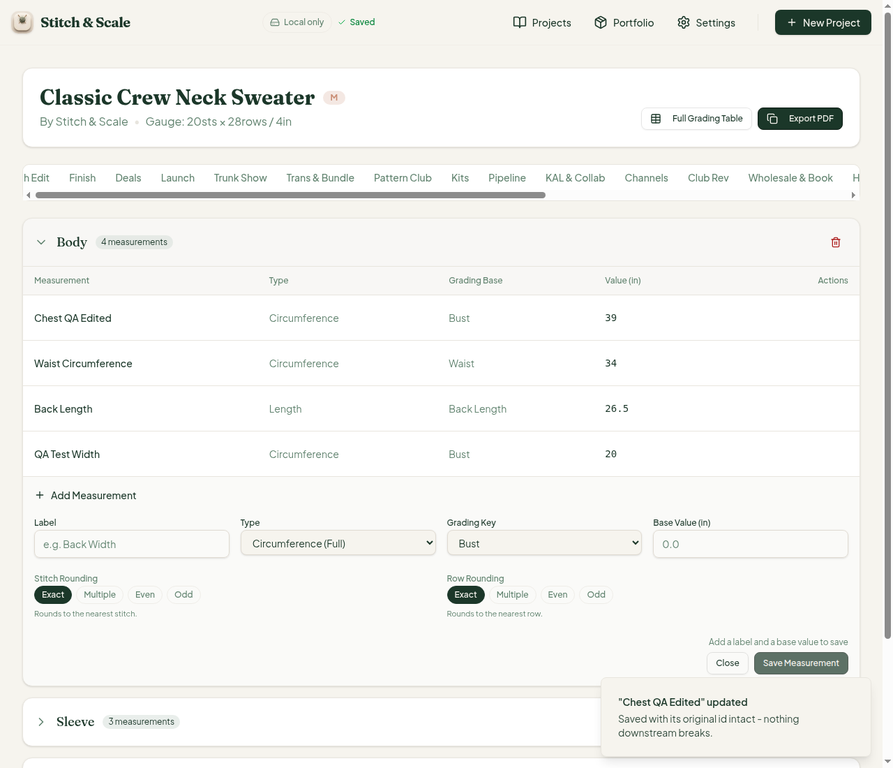
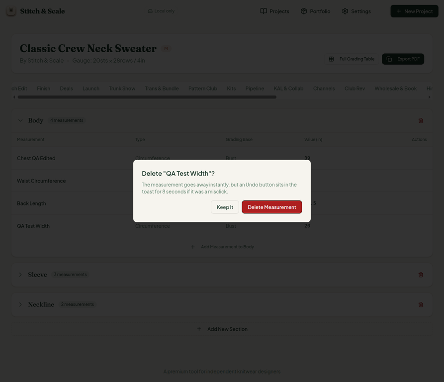
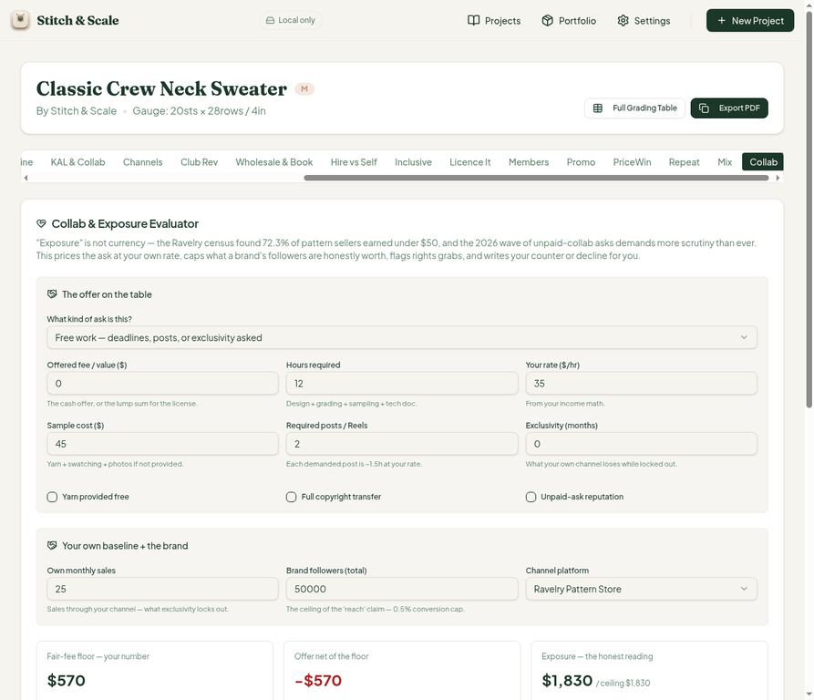
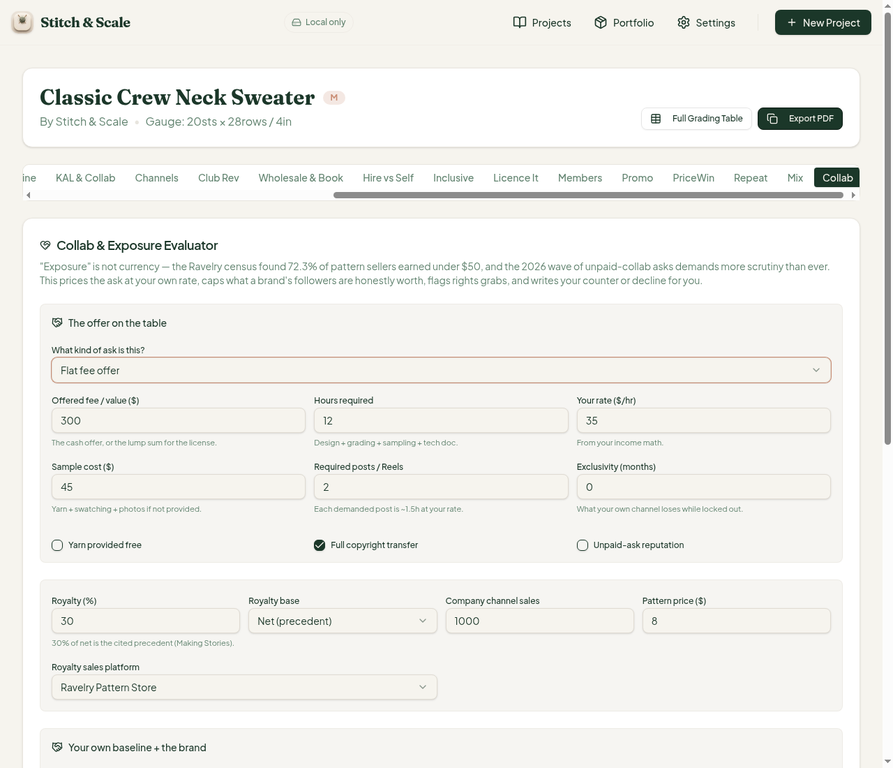
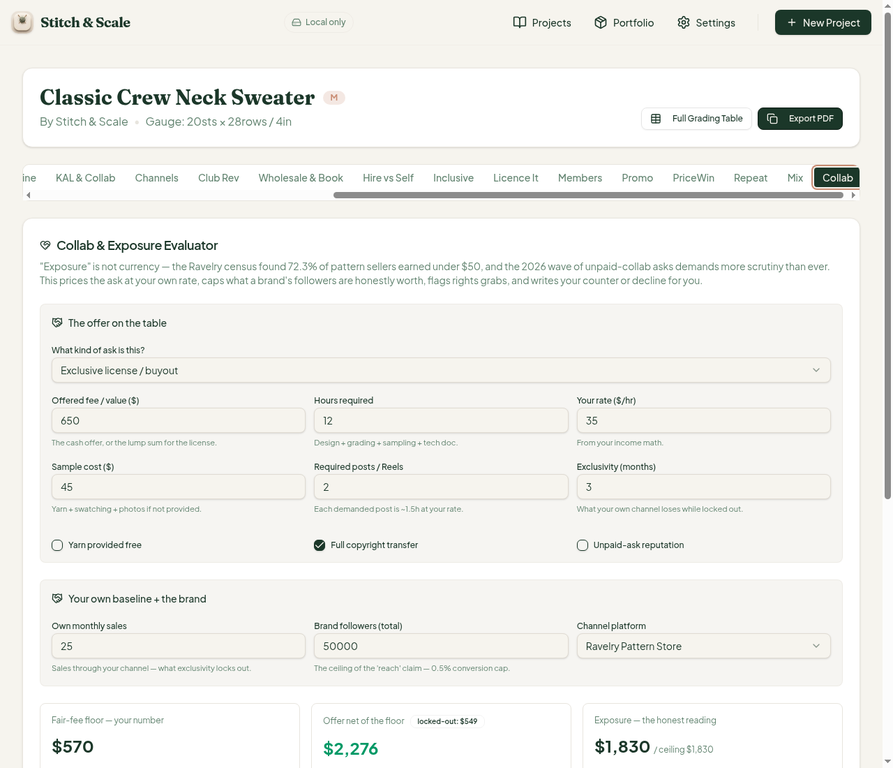
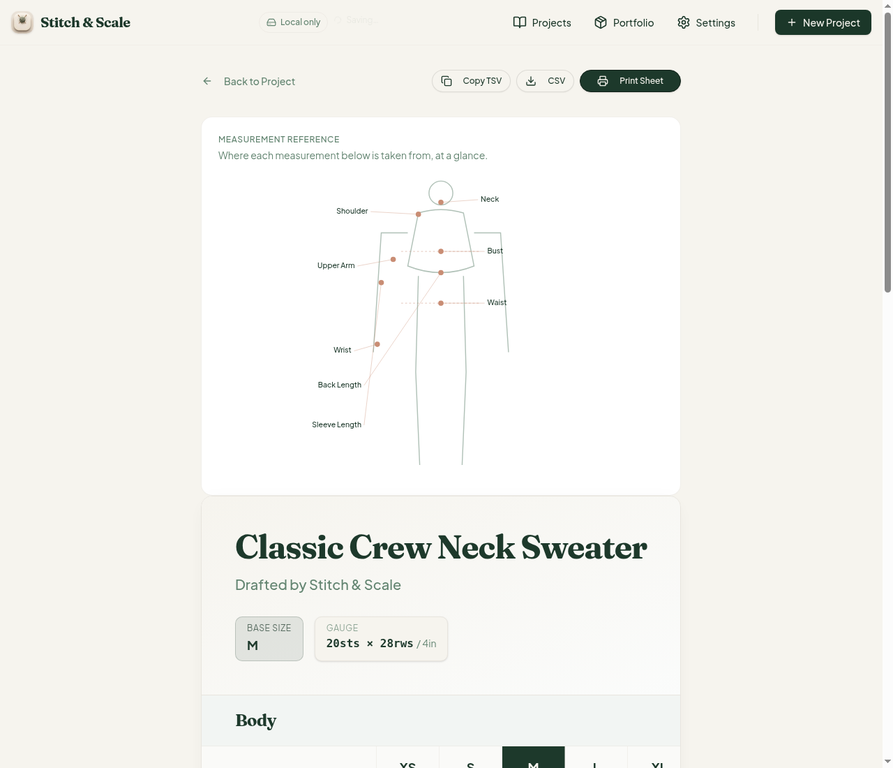

# QA Report — Cycle 5 (2026-08-14, ~04:43–04:55 UTC)

**This report is addressed to the Reviewer. The Coder should not act on this report; the Reviewer decides what to fix and how, and hands any fixes back to the Coder.**

Trigger: new code detected since cycle 4 — commit `143e430` ("[VERIFIED] Reviewer-issue fixes + Collab & Exposure Evaluator", 31st workspace tab **Collab**), with playbook log commit `b076d87` on `main`. Reviewed baseline: `b076d873611bf82e84a6f203b27930513057631f`.

Nothing was modified in `src/` during this cycle. All QA artifacts are on branch `qa/manus-2026-08-14-cycle5` only.

## 1. Baseline verification

| Check | Result |
| --- | --- |
| Typecheck (`pnpm typecheck`) | Clean |
| Vitest (`pnpm test`) | **529/529 pass** (was 504; Collab tests + 6 surfaces guard tests added) |
| Production build (`pnpm build`) | Pass (6.21s, chunk-size warning only, non-fatal) |
| Dev server | Freshly killed and restarted after `git pull` (HTTP 200) — the cycle-3 stale-server crash fix applied |

## 2. Fix verification (hand-tested in the live app)

### Fix #7 (measurement edit-in-place) — VERIFIED FIXED

The hover-revealed pencil icon now exists on every measurement row (it is `sm:opacity-0` at narrow viewports, so it appears faint — see shot 03). Clicking it opens a pre-filled "Edit Measurement" form; editing the label and base value and clicking **Save Changes** keeps the row's identity intact, and the toast explicitly confirms it.

*Shot 01 — Sections tab default state (Body 4, Sleeve 3, Neckline 2).*

*Shot 02 — Body section expanded with measurement rows.*

*Shot 03 — Measurement row showing the hover-revealed edit (pencil) and delete icons.*

*Shot 04 — Edit form opened with label/type/grading-key/base value pre-filled from the row.*

*Shot 05 — Save confirmed: "Chest QA Edited" now 39, toast states the row kept its original id.*

### Fix #6 (delete confirmation + 8s undo) — VERIFIED FIXED, with one residual limitation

Clicking the trash icon now opens a confirmation dialog naming the measurement, with **Keep It / Delete Measurement** choices. Deleting removes the row instantly and shows an 8-second undo toast with an **Undo** button. Undo inside the window restores the row ("Temp Undo QA" deleted→undone within ~1.2s: verified restored).

*Shot 06 — The new delete-confirmation dialog naming the measurement, with Keep It / Delete Measurement.*

**Residual limitation → new issue #20 (MINOR):** the undo stash is a single slot. A second deletion while a first undo is pending overwrites the stash ("Another deletion is mid-undo — finish that one first" with no Undo button) and the first item is permanently lost. This cost one of my test rows ("Chest QA Edited") during testing and cannot be repaired by the user. Recommended: an undo stack, or re-arming the Undo button while its item still exists.

### Fix #2 (royalty base honesty) — VERIFIED FIXED in the Collab tab

Both deal evaluators now honor Net vs Gross royalty base; the Collab tab computes royalty on platform-net revenue by default (Making Stories precedent): 30% × $7,320 net (1,000 sales × $8 less Ravelry's 8.5% effective fee) = $2,196, exactly matching the UI.

## 3. New tab #31 — Collab & Exposure Evaluator

Deep-tested all five ask types and every output. Fair-fee floor math, the cash-only verdict ladder, and all five red flags (CE-01 … CE-05) behave as specified; counter and accept letters render correctly and the Copy button works.

| Test | Inputs | Expected | Actual | Result |
| --- | --- | --- | --- | --- |
| Default unpaid work | 12h @ $35, 2 posts, $45 sample | Floor $570, net −$570, Walk away, CE-01 + CE-05 | Identical | Pass |
| Flat fee $300 | same + offered 300 | Counter, net −$270 | Identical | Pass |
| Flat fee $650 | same + offered 650 | Take it, net +$80 | Identical | Pass |
| Flat fee + 30% net royalty, 1,000 company sales @ $8 | | Royalty $2,196, total $2,496, net $1,926, exposure $1,830 | Identical | Pass |
| Copyright-transfer checkbox | flat fee | CE-02 flag | Fires | Pass |
| Exclusive license $400, 3-mo lockout, 25 own sales/mo | | Lockout $549, CE-04 flag | Identical | Pass |

*Shot 07 — Collab tab at defaults: unpaid-work ask, Walk away verdict, CE-01 and CE-05 flags.*

*Shot 08 — Offered $300 → Counter verdict with net −$270 and the counter letter.*

*Shot 09 — Flat fee offer with 30% net royalty, 1,000 company sales, $8 price.*

*Shot 10 — Exclusive license / buyout mode: offered $650, 3-month lockout, lockout badge visible (see findings #18–#19 — stale royalties still leak into this mode).*

*Shot 11 — Full Grading Table still renders correctly on the new code, including per-size stitch/row and physical values.*

## 4. New findings for the Reviewer

### #18 — MAJOR — Collab: stale royalty state leaks into exclusive-license / buyout mode

The royalty fields are only rendered for flat-fee and royalty asks, but the underlying state (`companySales`, `royaltyPct`) is retained when switching to exclusive-license mode, and `royaltyValue` is computed unconditionally whenever `royaltyPct > 0 && companySales > 0`. Result in testing: with stale state from a previous flat-fee test (1,000 company sales, 30% net), the exclusive-license screen showed an offer total of **$2,596** and verdict **Take it**, while its own red flag CE-04 simultaneously told the designer to **counter** ("the license fee is less than your locked-out sales"). A designer following the verdict would accept a deal the tool itself flags as below lockout value — the tool contradicts itself in its most consequential output. Fix: zero out or exclude stale royalty inputs when the ask type does not use royalties (or guard `royaltyValue` on `collabType`).

### #19 — MEDIUM — Collab: "Offer net of the floor" in exclusive-license mode does not deduct the lockout value

The exclusive-license screen shows a "locked-out: $549" badge beside the net figure, but the displayed totalOfferValue ($2,276 with offered $650 + stale royalties) does not subtract the lockout value; with royalties zeroed, $650 − $570 − $549 = **−$469** (the designer loses money) yet the badge-adjacent number reads as if it already accounted for the lockout. Either deduct `lockedOutValue` from the exclusive-license net and verdict input, or rephrase the label so it does not imply the deduction happened.

### #20 — MINOR — Fix #6 residual: undo is not retry-safe (single-stash)

Documented in §2 above. A second deletion while an undo is pending clobbers the first item permanently. Worth a small hardening pass (undo stack or re-armable Undo button).

## 5. Regression checks (unchanged areas)

The full grading table (TSV/CSV export, print sheet) and the PDF export page with all four templates render and behave as before; CSV export on the new code produced a well-formed file including all current measurements. The existing sample projects and localStorage data survived the new code (my own delete/undo testing removed one test row — documented in §2, restored rows where possible). Issues #6–#17 from earlier cycles were not re-opened; #6 and #7 are now marked **verified fixed** and #2 **verified fixed** in the Collab evaluator.

## 6. Housekeeping

`last-reviewed-sha.txt` updated to `b076d873611bf82e84a6f203b27930513057631f`. `main` untouched. New issues #18–#20 opened, each labeled `qa-report` and addressed to the Reviewer.
