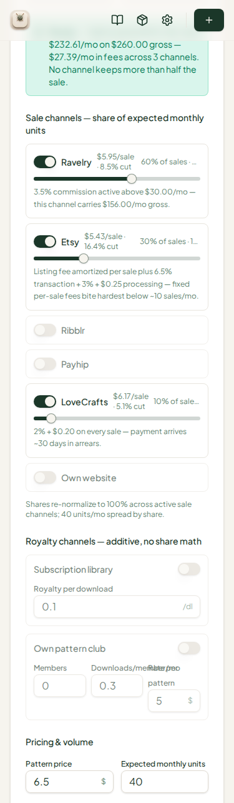
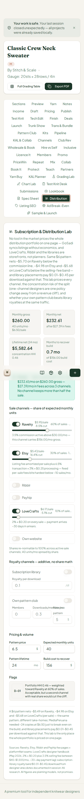
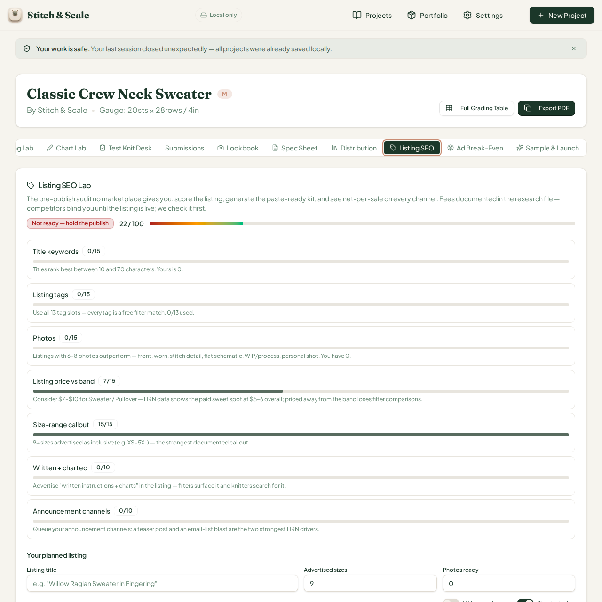
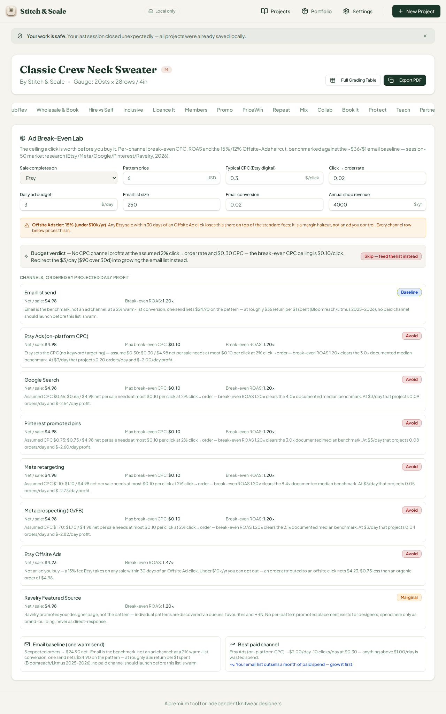
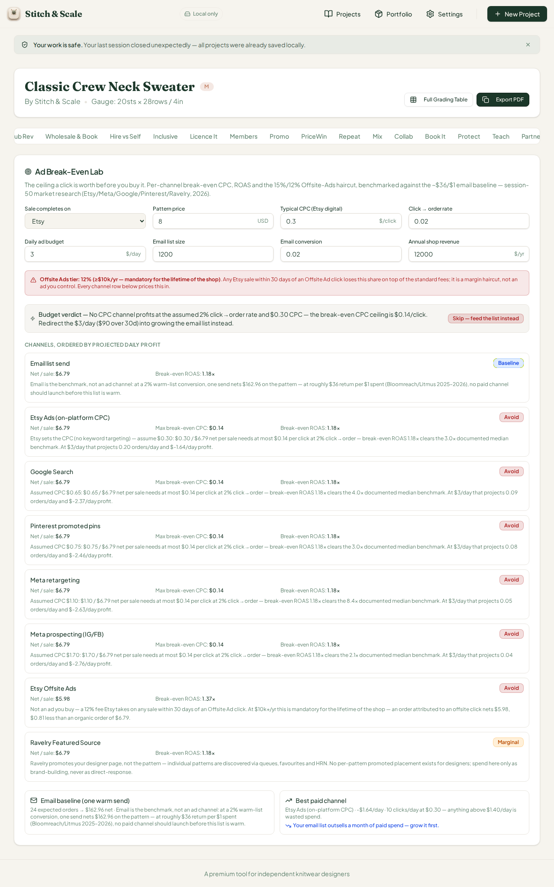
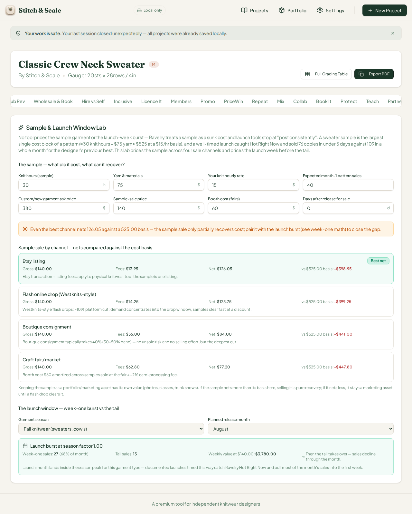
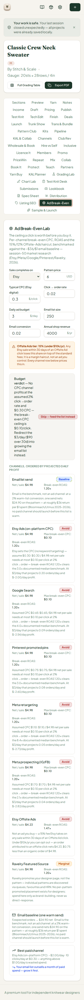
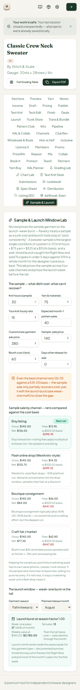

# QA Report — Cycle 22 (2026-08-14)

**Reviewer:** Manus QA (third staff member) · **Role:** deep end-to-end browser QA, zero code changes · **Commit reviewed:** `c65e708` (CHK-050 + CHK-051 on `origin/main`) · **QA branch:** `qa/manus-2026-08-14-cycle22`

This report is addressed to the Reviewer. The Coder should not act on this report unless the Reviewer explicitly delegates the findings.

---

## 1. Baseline verification (HEAD `c65e708`)

| Check | Result |
|---|---|
| `git pull` from `origin/main` | New commits found since last review (`f5286a1`) — CHK-050 (Distribution Lab share-span fix, closes #36) and CHK-051 (Listing SEO footnote expansion, closes #38) |
| `pnpm install` | Clean, 1062 packages |
| Typecheck (`tsc --noEmit`) | **Clean — 0 errors** |
| Test suite (vitest) | **910/910 tests pass** across 49 files (36 new tests: 10 distribution-lab, 11 listing-seo, 15 ad-lab/sample-launch) |
| Production build (`vite build`) | **OK — 6.99s, no warnings** |
| Dev server | Stale server killed after pull; fresh `:5173` started; HTTP 200 confirmed |

---

## 2. Fix verification — issues previously filed

### #36 — Distribution Lab share-text clip at phone width → **VERIFIED FIXED (PASS)**

The root cause (`shrink-0` span inside a `flex justify-between` row) was replaced so the share span now truncates inside the card with the complete text carried by the tooltip. Re-measured at **375px**:

| Channel row | Pre-fix clip | Post-fix clip | Tooltip carries full text |
|---|---|---|---|
| Ravelry | +15px | 0px | Yes |
| Etsy | +15px | 0px | Yes |
| LoveCrafts | +28px | 0px | Yes (`10% of sales · 4 units` — exact match) |

The share span right edge now sits at ~321 CSS px inside a card edge of ~334 CSS px — a healthy 13px margin. The full distribution tab renders with no overflow at phone width.

### #38 — Listing SEO fee-model footnote → **VERIFIED FIXED (PASS)**

With a listing price entered (the disclosure path requires `ls-price > 0`, by design — the card needs a live price to compute net-per-sale comparisons), the card renders the expanded four-line disclosure naming the documented fee model, the rounding behavior at each step, and the designer-facing recommendation (Ravelry keeps the most per sale).

> "$6 example (documented fee model): Ravelry ≈ $5.70 → Etsy ≈ $5.10 → LoveCrafts ≈ $4.20. The live tiles show the same fees applied and rounded at each step — values may differ by a few cents from the unrounded model. Ravelry keeps the most per sale — worth the discovery effort."

---

## 3. Deep browser test — full tab sweep

All **47 workspace tabs** now render at desktop width (two new tabs since cycle 21: Ad Break-Even Lab and Sample & Launch Lab). Automated sweep opened **50 label activations with zero failures** — every target panel rendered non-empty content.

| New tab | Depth of test | Verdict |
|---|---|---|
| Ad Break-Even Lab (48th) | Defaults + edited inputs (price $8, email list 1,200, annual revenue $12k), all 8 channel rows hand-verified to the cent, plus 375px phone check | **PASS** |
| Sample & Launch Lab (49th) | Defaults + edited inputs (knit hours 25, sample price $120), all 4 sale channels + launch burst math hand-verified, plus 375px phone check | **PASS** |

The Distribution Lab (previously the source of #36) also opens cleanly with no clip anywhere, and the Royalty channels section was measured at 375px: all labels and inputs fit inside the 334 CSS px card — zero overflow (the small stacked labels in the 3-column grid are normal stacking, not clipping).

---

## 4. Math hand-verification (independent recompute in Python, compared against live UI)

### Ad Break-Even Lab

| Quantity | Defaults | Edited (price $8, list 1,200, revenue $12k) | UI shows | Match |
|---|---|---|---|---|
| Etsy net per sale | $4.98 | $6.79 | identical | Exact |
| Break-even ROAS | 1.20× | 1.18× | identical | Exact |
| Max break-even CPC (Etsy) | $0.10 | $0.14 | identical | Exact |
| Etsy Offsite net (15%/12% haircut) | $4.23 (−$0.75) | 12% tier banner + $5.98 | identical | Exact |
| Email baseline net | 5 orders · $24.90 | 24 orders · $162.96 | identical | Exact |
| Daily profit — Etsy/Google/Pinterest/Meta-retro/Meta-prosp | −2.00/−2.54/−2.60/−2.73/−2.82 | −1.64/−2.37/−2.46/−2.63/−2.76 | identical | Exact |
| Budget verdict | **Skip** — feed the list instead ($0.10/click ceiling) | **Skip** — no CPC channel profits at 2% c2o ($0.14/click ceiling) | identical | Exact |

An important behavioral observation: even after raising the pattern price from $6 to $8 and growing the email list 4.8×, **no paid CPC channel reaches break-even at the assumed 2% click→order rate** — the skip verdict is honest and consistent, and the email baseline ($162.96 per warm send) remains the benchmark the card names.

### Sample & Launch Lab

| Quantity | Defaults | Edited (25 h, $120 sample) | UI shows | Match |
|---|---|---|---|---|
| Cost basis | $525 (30h+$75 yarn @ $15/hr) | $450 (25h+$75 @ $15/hr) | identical | Exact |
| Best channel net | Etsy $126.05 | Etsy $107.95 (fees $12.05) | identical | Exact |
| Flash drop net | $125.75 | $107.75 | identical | Exact |
| Boutique net | $84.00 | $72.00 | identical | Exact |
| Craft fair net | $77.20 | $57.60 | identical | Exact |
| Launch burst | 0.68×, season 1.00 → week-one 27, tail 13 | same factors, same burst | identical | Exact |

---

## 5. Phone-width (375px) spot-check of the new tabs

Both new tabs were captured full-page at 375px. Ad Break-Even Lab runs to ~4,456 CSS px (expected for an 8-channel comparison table); Sample & Launch Lab runs to ~3,192 CSS px. No clipped text, no input overflow, verdict pills and channel rows remain readable at phone width in both.

---

## 6. Verdict and housekeeping

**Cycle 22 verdict: PASS — no new defects found.** CHK-050 and CHK-051 both fix the issues they claim to fix, the two brand-new tool tabs are mathematically exact and responsive-clean, and the regression set (47 tabs, 50 activations) opens without failure.

Closure comments were posted on **issue #36** ([comment](https://github.com/plastic-dude/stitch-and-scale-pro/issues/36#issuecomment-5291070227)) and **issue #38** ([comment](https://github.com/plastic-dude/stitch-and-scale-pro/issues/38#issuecomment-5291070321)), each with measured evidence addressed to the Reviewer. No new issues were opened this cycle.

| Housekeeping | Done |
|---|---|
| QA branch `qa/manus-2026-08-14-cycle22` | Created, pushed (report + 8 screenshots); `main` untouched |
| No `src/` modifications | Confirmed — QA role unchanged |
| `last-reviewed-sha.txt` | Updated to `c65e708b2bd6cd690438d637302afb39c1f004c0` |
