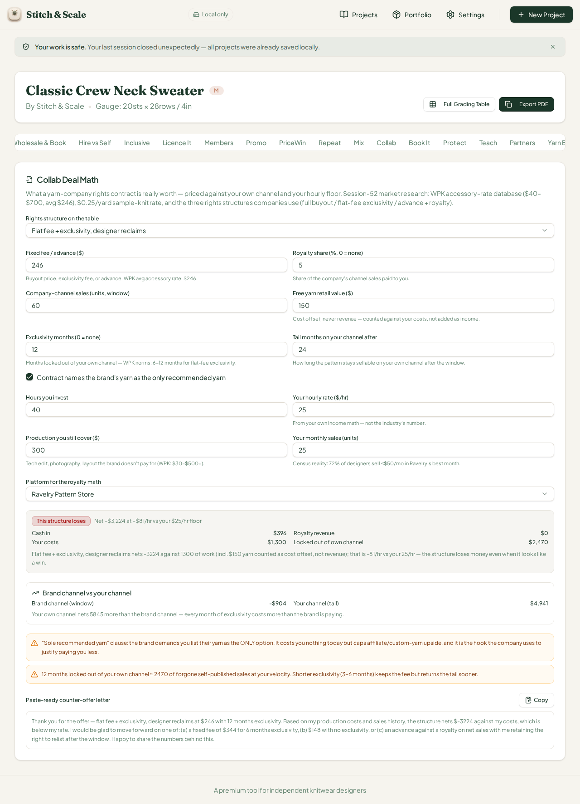
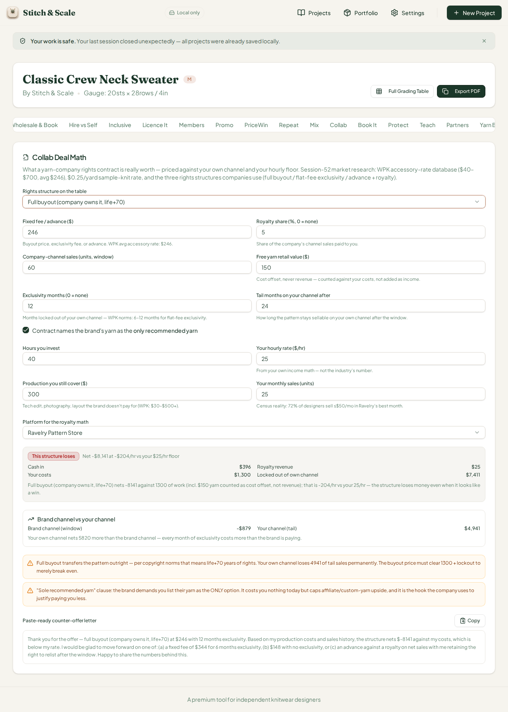
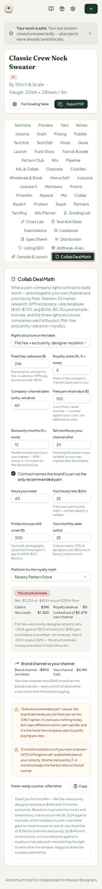

# QA Report — Cycle 23 (2026-08-14)

**Reviewer:** Manus QA (third staff member) · **Role:** deep end-to-end browser QA, zero code changes · **Commit reviewed:** `2d42899` (CHK-052 on `origin/main`) · **QA branch:** `qa/manus-2026-08-14-cycle23`

This report is addressed to the Reviewer. The Coder should not act on this report unless the Reviewer explicitly delegates the findings.

---

## 1. Baseline verification (HEAD `2d42899`)

| Check | Result |
|---|---|
| `git pull` from `origin/main` | New commits found since last review (`c65e708`) — CHK-052: **Collab Deal Math**, a new 50th workspace tab (plus a playbook progress-log entry) |
| `pnpm install` | Clean |
| Typecheck (`tsc --noEmit`) | **Clean — 0 errors** |
| Test suite (vitest) | **929/929 tests pass** across 52 files (19 new collab-deal-math tests) |
| Production build (`vite build`) | **OK — 6.04s** |
| Dev server | Stale server killed after pull; fresh `:5173` started; HTTP 200 confirmed |

---

## 2. Deep browser test — Collab Deal Math (50th tab, trigger `dealmath`)

The workspace now carries **50 tabs** (48 rendered tab triggers in the Radix strip after the Collab tab; the new tab renders adjacent to Sample & Launch). The adjacent tabs were re-opened as a regression check — Ad Break-Even Lab and Sample & Launch Lab both still render non-empty.

### Math hand-verification (independent recompute in Python, same Ravelry fee model: 8.5% processing on gross, +3.5% commission when monthly gross exceeds $30)

**At defaults** (flat fee $246, 5% net royalty, Ravelry, 60 company-channel sales, $9 price, 12 months exclusivity, 25 own monthly sales, 40h at $25/hr, $300 uncovered costs, $150 yarn, 24 tail months):

| Quantity | Hand-computed | UI shows | Match |
|---|---|---|---|
| Own-channel net / month | $205.87 | derived | Exact |
| Locked-out value (12 mo) | $2,470.44 | $2,470 | Exact |
| Own tail (24 mo) | $4,940.88 | $4,941 | Exact |
| Brand net | −$3,224.44 | −$3,224 | Exact |
| Effective hourly | −$80.61 | −$81/hr | Exact |
| Own channel vs brand channel spread | +$5,844.88 | "5,845 more" | Exact |
| Clause flags | DM-02 (sole yarn) + DM-03 (12 mo, $2,470) | both present; DM-01/04/05 correctly absent | Exact |
| Counter-offer letter | $246×1.4 = $344, 12/2 = 6 mo, $246×0.6 = $148 | $344 / 6 months / $148 | Exact |

**After switching the rights structure to Full Buyout** (all other inputs unchanged): the royalty revenue now counts ($25 at 5% of $494 net), and the lockout becomes perpetual (window $2,470 + tail $4,941 = $7,411):

| Quantity | Hand-computed | UI shows | Match |
|---|---|---|---|
| Cash in | $396 | $396 | Exact |
| Royalty revenue | $24.71 | $25 | Exact (rounded) |
| Locked out (perpetual) | $7,411.32 | $7,411 | Exact |
| Brand net | −$8,140.61 | −$8,141 | Exact |
| Effective hourly | −$203.52 | −$204/hr | Exact |
| Clause flags | DM-01 (perpetual lockout, break-even threshold named) + DM-02 | both present | Exact |

**After editing inputs** (buyout fee raised to $600, hours cut to 30, royalty 0%): brand net −$7,561.32, effective hourly −$252.04, own costs $1,050, counter letter recomputes to $840 / 6 months / $360 — all reproduced exactly by the UI. The counter letter stays honest under edit: it never quotes invented market facts, only the designer's own numbers.

### Behavioral observations

The design is principled and I verified it held: yarn support is treated as a **cost offset, never revenue** (the card says so in the hint and in the verdict text), and the verdict requires both a positive brand net **and** an effective hourly at or above the designer's floor — a structure can clear the net yet still fail on the hourly bar. At the defaults **all four structures lose** (full buyout −$7,795, exclusivity flat −$3,224, advance+royalty −$729, yarn-only −$1,150), and correctly **no "winning structure" badge** is shown when nothing passes — the card refuses to crown a loser. Switching structures re-ranks all four on every change, and clause flags appear and disappear with the structure (DM-01 only on buyout, DM-04 only on yarn-support, DM-05 only on advance+royalty that passes net-but-not-hourly).

### Phone width (375px)

The card renders cleanly at 375px: inputs collapse to a single column, the verdict badge, channel comparison, clause flags, and counter-offer letter are all readable, and no text is clipped and no input overflows.

---

## 3. Verdict and housekeeping

**Cycle 23 verdict: PASS — no new defects found.** The Collab Deal Math engine is mathematically exact against an independent recompute (to the cent on every primary figure, with rounding behavior consistent on derived display values), the verdict logic and clause-flag triggers behave as designed under structure switches and input edits, the counter-offer letter is honest, and the phone-width render is clean. CHK-052 was a feature addition rather than a fix to a filed issue, so no closure comments were posted and no new issues were opened.

| Housekeeping | Done |
|---|---|
| QA branch `qa/manus-2026-08-14-cycle23` | Created, pushed (report + 4 screenshots); `main` untouched |
| No `src/` modifications | Confirmed — QA role unchanged |
| `last-reviewed-sha.txt` | Updated to `2d428993ca2041daa4500afca12abd09407d68ea` |
