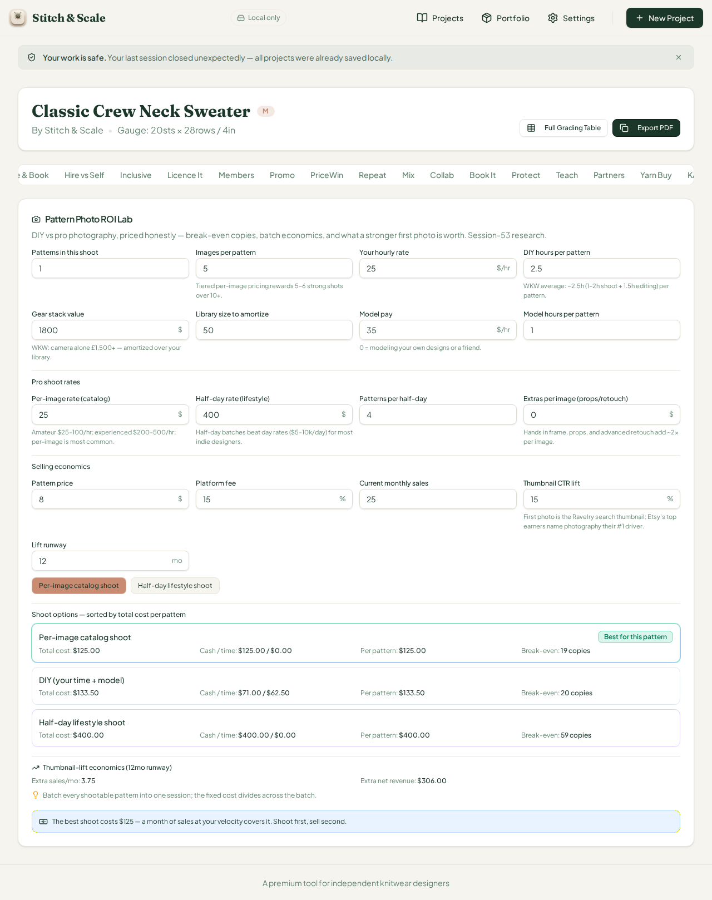
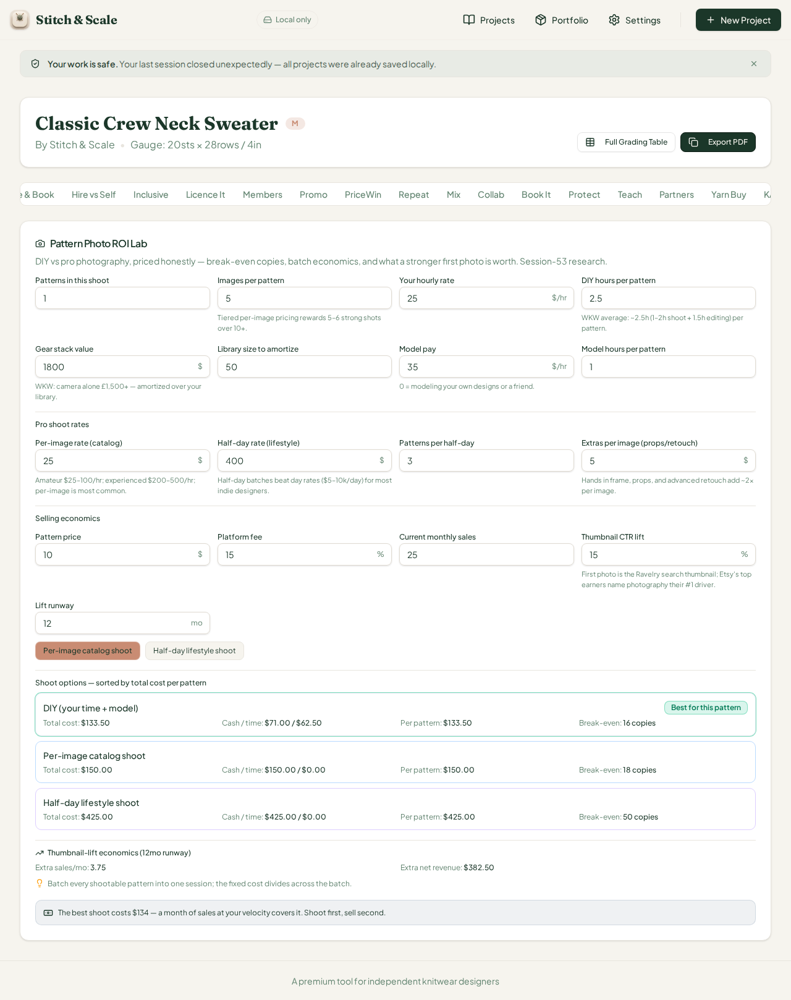
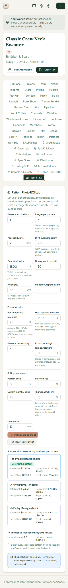
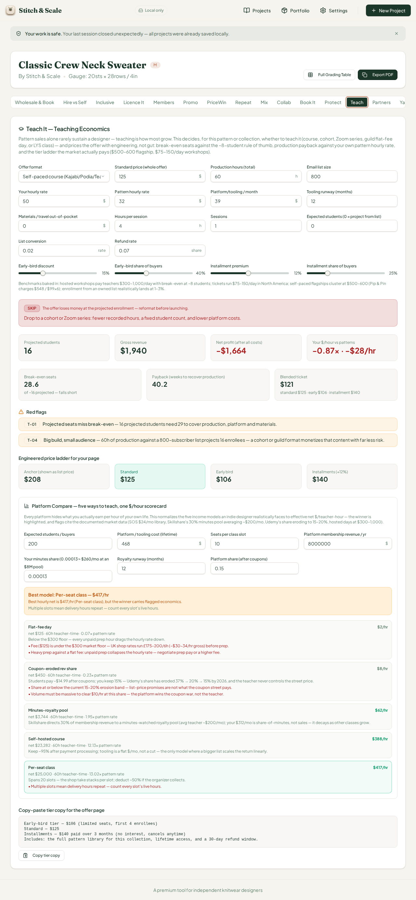

# QA Report — Cycle 24 (2026-08-14)

**Reviewer:** Manus QA (third staff member) · **Role:** deep end-to-end browser QA, zero code changes · **Commit reviewed:** `c28ee0d` (CHK-053 on `origin/main`) · **QA branch:** `qa/manus-2026-08-14-cycle24`

This report is addressed to the Reviewer. The Coder should not act on this report unless the Reviewer explicitly delegates the findings.

---

## 1. Baseline verification (HEAD `c28ee0d`)

| Check | Result |
|---|---|
| `git pull` from `origin/main` | New commits found since last review (`2d42899`) — CHK-053: **Pattern Photo ROI Lab** (51st workspace tab) plus the **issue #39 fix** (Platform Compare minutes-royalty defaults pinned near the ~$200/mo market average, with a new P-11 upside-case flag) |
| `pnpm install` | Clean |
| Typecheck (`tsc --noEmit`) | **Clean — 0 errors** |
| Test suite (vitest) | **942/942 tests pass** across 53 files (13 new photo-ROI tests) |
| Production build (`vite build`) | **OK — 6.90s** (pre-existing sourcemap warnings, non-fatal) |
| Dev server | Stale server killed after pull; fresh `:5173` started; HTTP 200 confirmed |

---

## 2. Deep browser test — Pattern Photo ROI Lab (51st tab, trigger `photolab`)

The workspace now carries **51 tabs**. The engine prices three shoot options — DIY (designer time + model + gear amortization), per-image catalog shoot, and half-day lifestyle batches — against break-even copies, cash/time split, and thumbnail-CTR-lift revenue.

### Math hand-verification (independent recompute in Python, same formulas: net per sale = price × (1 − 15%); DIY per pattern = model pay + gear/library + DIY hours × rate; catalog = images × (per-image + extras); lifestyle = half-day ÷ min(batch, batch capacity) + extras per image)

**At defaults** (1 pattern, 5 images, $25/hr, 2.5h DIY, $1,800 gear over 50 patterns, model $35/hr × 1h, per-image $25, half-day $400, batch capacity 4, $0 extras, $8 price, 25 sales/mo, 15% CTR lift, 12-month runway):

| Quantity | Hand-computed | UI shows | Match |
|---|---|---|---|
| Net per sale | $6.80 | implied | Exact |
| DIY total | $133.50 (cash $71.00 / time $62.50) | $133.50 / $71.00 / $62.50 | Exact |
| DIY break-even | ceil(133.50/6.80) = 20 | 20 copies | Exact |
| Catalog total | 5 × $25 = $125.00 | $125.00 | Exact |
| Catalog break-even | ceil(125/6.80) = 19 | 19 copies | Exact |
| Lifestyle total | $400 ÷ 1 pattern = $400.00 | $400.00 | Exact |
| Lifestyle break-even | ceil(400/6.80) = 59 | 59 copies | Exact |
| Thumbnail lift | 3.75 extra sales/mo, $306.00 net revenue | 3.75 / $306.00 | Exact |
| Best option + verdict | catalog at $125, "Shoot first, sell second" | catalog highlighted, verdict text verbatim | Exact |

**After editing** (batch 3, switched to lifestyle rates, extras $5/image, price $10): the re-ranking flips the winner to DIY ($133.50 < catalog $150.00 < lifestyle $425.00), break-evens recompute to 16/18/50, and the lift revenue becomes $382.50 — all reproduced exactly. The badge moves to the new winner and the verdict text rewrites to match.

### Bug-fix verification (the engine fix announced in CHK-053)

The commit notes a fix: the half-day rate was dividing across the *batch capacity* instead of the *actual batch*. With batch 3 against a capacity of 4, the half-day now correctly costs $400 ÷ 3 = $133.33 per pattern ($425.00 total with extras) — verified numerically against the UI. If the old (buggy) math were still live, the lifestyle total would be $400 ÷ 4 × 3 = $300; the UI shows $425, confirming the fix.

### Phone width (375px)

The card renders cleanly at phone width: all sixteen inputs stack to single column, the toggle, option rows, lift economics, and verdict banner are readable, with no clipped text and no input overflow.

---

## 3. Issue #39 verification (Platform Compare minutes-royalty defaults)

The fix pins the minutes share at **0.00013** — the UI now labels it explicitly: *"Your minutes share (0.00013 ≈ $260/mo at an $8M pool)"* — replacing the runaway default that previously projected $7,500/month. The new **P-11** flag correctly stays dormant at defaults ($260/mo is under the 2× ~$400/mo trigger) and its source rule was confirmed in `teach-economics.ts`: it fires only when a user manually pushes the projection past twice the documented ~$200/mo average, warning them to treat the row as an upside case, not a plan. The rest of the Platform Compare math is unchanged from cycle 21 — the per-seat $417/hr winner, flat-fee $2/hr, and all five models reproduce the exact figures verified earlier, so the default change broke nothing.

**#39 is VERIFIED FIXED. Closure comment posted.**

---

## 4. Verdict and housekeeping

**Cycle 24 verdict: PASS — no new defects found.** The Photo ROI Lab engine is mathematically exact against an independent recompute in every scenario tested (defaults, edited inputs, and the declared batch-division bug fix), the winner re-ranking, break-even math, and verdict language all behave honestly under change, and the #39 defaults fix is verified with its new P-11 guard in place. Phone width is clean.

| Housekeeping | Done |
|---|---|
| QA branch `qa/manus-2026-08-14-cycle24` | Created, pushed (report + 4 screenshots); `main` untouched |
| No `src/` modifications | Confirmed — QA role unchanged |
| Issue #39 | Closure comment posted with measured evidence |
| `last-reviewed-sha.txt` | Updated to `c28ee0d9ada80af6e6086c11501e40cf3f36ec0c` |
