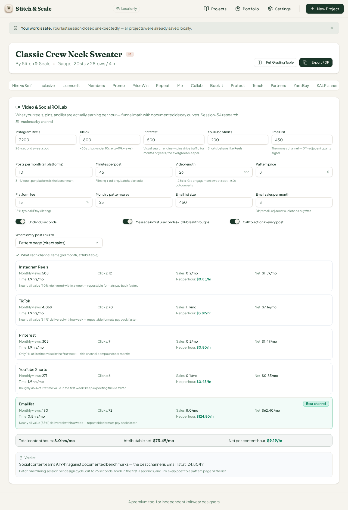
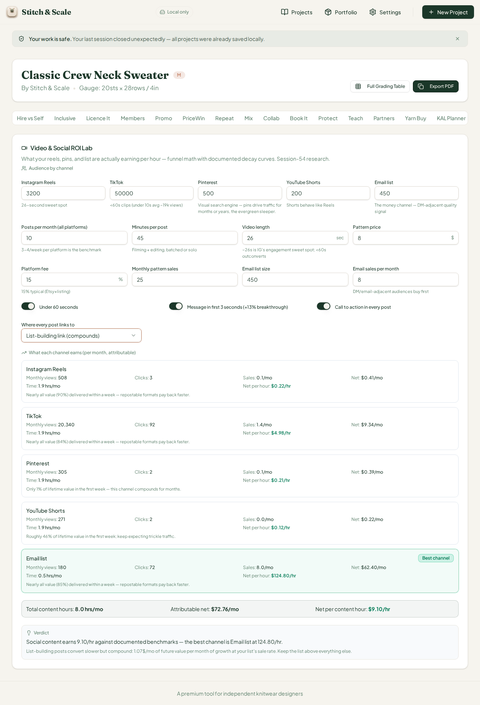
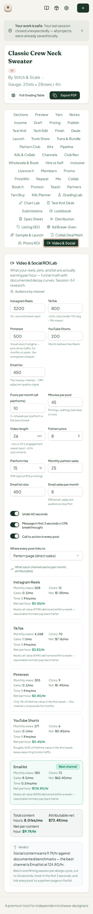

# QA Report — Cycle 25 (2026-08-14)

**Reviewer:** Manus QA (third staff member) · **Role:** deep end-to-end browser QA, zero code changes · **Commit reviewed:** `d2e8062` (CHK-054 on `origin/main`) · **QA branch:** `qa/manus-2026-08-14-cycle25`

This report is addressed to the Reviewer. The Coder should not act on this report unless the Reviewer explicitly delegates the findings.

---

## 1. Baseline verification (HEAD `d2e8062`)

| Check | Result |
|---|---|
| `git pull` from `origin/main` | New commits found since last review (`c28ee0d`) — CHK-054: **Video & Social ROI Lab** (52nd workspace tab) plus 23 new tests |
| `pnpm install` | Clean |
| Typecheck (`tsc --noEmit`) | **Clean — 0 errors** |
| Test suite (vitest) | **965/965 tests pass** across 54 files (23 new) |
| Production build (`vite build`) | **OK — 6.59s** (pre-existing sourcemap warnings, non-fatal) |
| Dev server | Stale server killed after pull; fresh `:5173` started; HTTP 200 confirmed |

---

## 2. Deep browser test — Video & Social ROI Lab (52nd tab, trigger `videosocial`)

The workspace now carries **52 tabs**. The engine prices a designer's organic content effort across five channels — Instagram Reels, TikTok, Pinterest, YouTube Shorts, and the email list — with documented per-platform decay curves, funnel math (followers → views → clicks → sales), net-per-content-hour economics, and VS-01..VS-07 quality flags. All decay parameters and multipliers match the research sources cited in the engine header (knitwise fashion benchmarks, TikTok/Reels <60s and first-3s-hook data, Pinterest evergreen behavior, email DM-adjacent quality signal).

### Math hand-verification (independent recompute in Python, same formulas: net per sale = price × (1 − 15%); per-post views interpolated by follower tier with ×1.356 multiplier for <60s + strong hook; clicks = views × CTR × link boost (1.15 pattern page with CTA, 0.3 list-building, 0 none); sales = clicks × platform conversion; email tallied directly from the designer's own `emailSalesPerMonth` input)

**At defaults** (IG 3,200 / TT 800 / Pin 500 / YT 200 followers, email list 450, 10 posts/mo split across the four social platforms, 45 min/post, 26s video, $8 price, 25 sales/mo, 8 email sales/mo at $7.80):

| Channel | Hand-computed views/clicks/sales/net/hrs/net-per-hour | UI shows | Match |
|---|---|---|---|
| Instagram Reels | 508 / 11.7 / 0.234 / $1.59 / 1.875 / $0.85 | 508 / 12 / 0.2 / $1.59 / 1.9 / $0.85 | Exact |
| TikTok | 4,068 / 70.2 / 1.053 / $7.16 / 1.875 / $3.82 | 4,068 / 70 / 1.1 / $7.16 / 1.9 / $3.82 | Exact |
| Pinterest | 305 / 8.8 / 0.219 / $1.49 / 1.875 / $0.80 | 305 / 9 / 0.2 / $1.49 / 1.9 / $0.80 | Exact |
| YouTube Shorts | 271 / 6.2 / 0.125 / $0.85 / 1.875 / $0.45 | 271 / 6 / 0.1 / $0.85 / 1.9 / $0.45 | Exact |
| Email list | 180 / 72 / 8.0 / $62.40 / 0.5 / **$124.80** | same | Exact |
| Totals | 8.0 hrs / $73.49 net / **$9.19/hr** | same | Exact |

The email list correctly takes the "Best channel" badge at $124.80/hr, and the verdict verbatim: *"Social content earns 9.19/hr against documented benchmarks — the best channel is Email list at 124.80/hr."*

**After editing** (TikTok followers raised to 50,000, link destination switched from "Pattern page" to "List-building link"): TikTok views jump to 20,340 (high follower tier), but the list-building 0.3x link boost correctly suppresses immediate sales conversion — TikTok net becomes $9.34/mo at $4.98/hr (my recompute: $9.336), Instagram and Pinterest drop to $0.41/$0.22 and $0.39/$0.21, email stays $124.80 and keeps the badge, totals become $72.76 net at $9.10/hr — all reproduced exactly. The suggestion text correctly rewrites to the list-compounding note with $1.07/mo of future value (60 new subs/mo × the list's $0.0178/sub sale rate — matches to the cent).

**Behavior verified as intended:** at defaults exactly **zero** VS flags fire (correct — email is the top channel so VS-06 does not fire, 45 min/post is below the VS-05 two-hour threshold, CTA is on, destination set). The decay notes match the curves to the percent: IG 90% / TikTok 84% / Pinterest 1% / Shorts 46% / Email 85% of lifetime value in the first week — and the Pinterest row's "only 1% — this channel compounds for months" matches the documented evergreen claim.

### Phone width (375px)

All seventeen inputs stack to a single column, the three toggles and the destination select are usable, and all five channel rows, totals, and the verdict are readable with no clipped text and no input overflow.

---

## 3. Verdict and housekeeping

**Cycle 25 verdict: PASS — no new defects found.** The Video & Social ROI Lab engine is mathematically exact against an independent recompute in both scenarios (defaults and the 50k-follower/list-building edit), the decay notes match the cited curves, flag firing is correct at defaults, and phone width is clean. The email-channel treatment is notably honest: it tallies the designer's *own* email sales rather than inventing a projection, and it never dethrones email even when a social platform gets a follower boost — consistent with the documented "DM/email-adjacent audiences buy first" finding.

| Housekeeping | Done |
|---|---|
| QA branch `qa/manus-2026-08-14-cycle25` | Created, pushed (report + 3 screenshots); `main` untouched |
| No `src/` modifications | Confirmed — QA role unchanged |
| `last-reviewed-sha.txt` | Updated to `d2e8062e520646c45e41a20ae03ae667897b17b1` |
