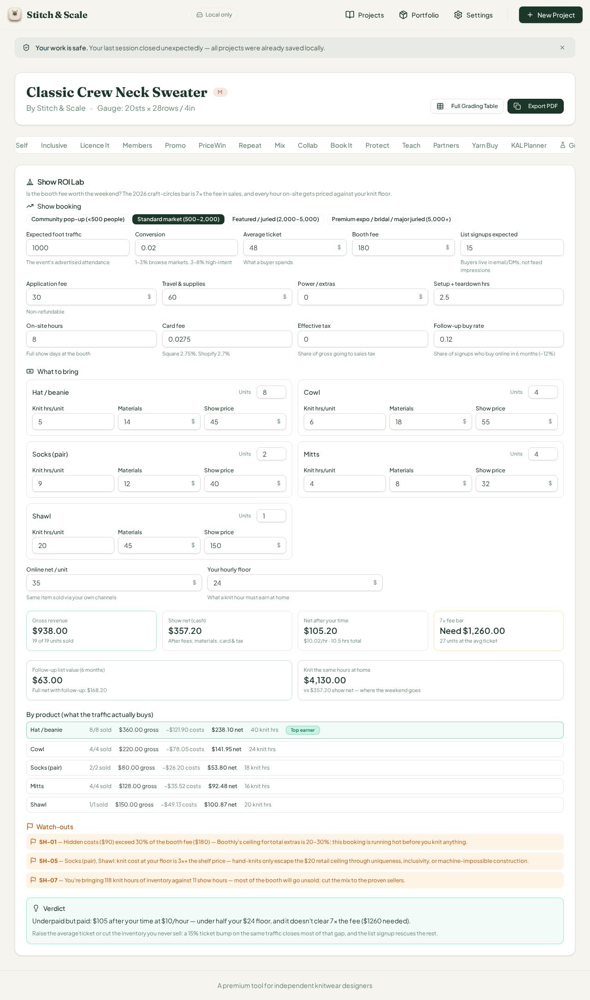
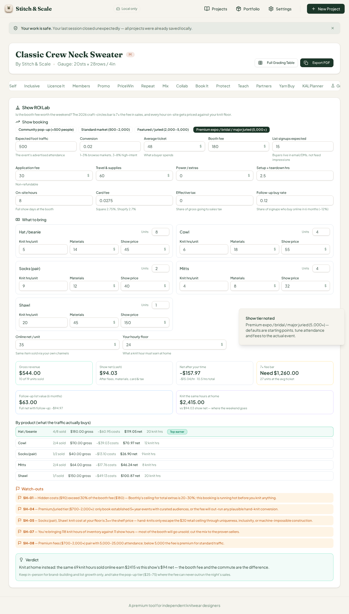
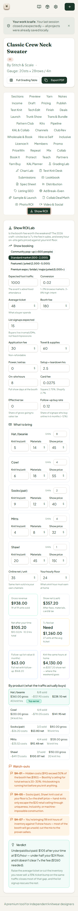

# QA Report — Cycle 26 (2026-08-14)

**Reviewer:** Manus QA (third staff member) · **Role:** deep end-to-end browser QA, zero code changes · **Commit reviewed:** `14b789f` (CHK-055 on `origin/main`) · **QA branch:** `qa/manus-2026-08-14-cycle26`

This report is addressed to the Reviewer. The Coder should not act on this report unless the Reviewer explicitly delegates the findings.

---

## 1. Baseline verification (HEAD `14b789f`)

| Check | Result |
|---|---|
| `git pull` from `origin/main` | New commits found since last review (`d2e8062`) — CHK-055: **Show ROI Lab** (53rd workspace tab) plus 22 new tests. A following commit (`a7bf30a`) is only the playbook progress log and carries no code changes. |
| `pnpm install` | Clean |
| Typecheck (`tsc --noEmit`) | **Clean — exit 0** |
| Test suite (vitest) | **987/987 tests pass** across 55 files (22 new) |
| Production build (`vite build`) | **OK** (pre-existing sourcemap warnings, non-fatal) |
| Dev server | Stale server killed after pull; fresh `:5173` started; HTTP 200 confirmed |

---

## 2. Deep browser test — Show ROI Lab (53rd tab, trigger `showroi`)

The workspace now carries **53 tabs**. The engine prices an in-person craft-fair or fiber-festival decision: attendance × conversion funnel, a weighted-by-units-bringed product mix, real costs (headline booth fee + application fee + travel/supplies + power extras + materials + card processing + tax), time priced against the designer's hourly floor, the craft-circles **7x rule** (gross must reach 7x the booth fee), a knit-at-home comparison, and follow-up list value — all sourced and cited in the engine header (Boothly 2026 pricing guide, SmartAsset, vendor forums).

### Math hand-verification (independent recompute in Python, same formulas and the same cent-rounding discipline, including the `Math.round(x*100)/100` card-fee rounding that makes $110 × 2.75% = $3.03 and $150 × 2.75% = $4.13 rather than naive decimals)

**At defaults** (standard market, 1,000 attendees, 2% conversion, $48 average ticket, $180 booth fee + $30 application + $60 travel, five-product mix of 8 hats / 4 cowls / 2 socks / 4 mitts / 1 shawl, 10.5 total hours at a $24 floor, 2.75% card fee, 15 list signups at a 12% follow-up buy rate, $35 online net):

| Metric | Hand-computed | UI shows | Match |
|---|---|---|---|
| Buyers / units sold | 20 buyers, all 19 units | 19 of 19 | Exact |
| Gross revenue | $938.00 | $938.00 | Exact |
| Show net (cash) | $357.20 | $357.20 | Exact |
| Net after time / net per hour | $105.20 / $10.02 (10.5 hrs) | $105.20 / $10.02 | Exact |
| 7x target / units needed | $1,260 / 27 units | $1,260 / 27 | Exact |
| Follow-up value / full net | $63.00 / $168.20 | $63.00 / $168.20 | Exact |
| Knit-at-home value (118 knit hrs × $35) | $4,130.00 | $4,130.00 | Exact |
| Product rows (revenue / materials / card fees / net / hours) | hat $360/$112/$9.90/$238.10/40; cowl $220/$72/$6.05/$141.95/24; socks $80/$24/$2.20/$53.80/18; mitts $128/$32/$3.52/$92.48/16; shawl $150/$45/$4.12/$100.88/20 | identical to the cent | Exact |

The flag logic is correct at defaults: **SH-01** fires (hidden extras $90 exceed 30% of the $180 fee — the booking is "running hot before you knit anything"), **SH-05** correctly names socks and the shawl as items whose knit cost at the floor exceeds 3x the shelf price, and **SH-07** catches the 118 knit hours of inventory against 11 show hours. The verdict matches the "Underpaid but paid" tier verbatim.

**After editing** (switched the tier badge to Premium expo, cut foot traffic to 500 to model an under-filled premium event): gross falls to $544.00 with only 10 of 19 units sold, the distribution of sold units across the mix reproduces exactly (hat 4 / cowl 2 / socks 1 / mitts 2 / shawl 1, with the hat earning the "Top earner" badge), card-fee rounding holds to the cent ($3.03 on the cowl, $4.13 on the shawl), and the engine flips to the losing branch: show net $94.03, net after time −$157.97 (−$15.04/hr), full net with follow-up −$94.97, knit-at-home value $2,415.00 on 69 knit hours — all reproduced to the cent, and the verdict switches to *"Knit at home instead: the same 69 knit hours sold online earn $2415 vs this show's $94 net"* with the documented advice to downgrade to pop-up tier fees.

The flag re-evaluation is also exact: **SH-01** drops away (extras $90 no longer exceed 30% of nothing higher), **SH-04** and **SH-08** now fire for the premium tier (the second specifically because 500 attendance is below the 5,000 floor), while **SH-05** and **SH-07** remain.

**Behavior verified as intended:** switching tiers patches only the tier itself — attendance, fees, and ticket stay as typed (the tier defaults are labeled as starting points, and the toast says so explicitly), which is honest design rather than silent overwriting. The 7x bar never softens the verdict: at defaults the show is cash-positive yet verdicted "underpaid" because $10/hr is below half the $24 floor and the 7x bar isn't cleared — the three verdict conditions compose exactly as documented.

### Phone width (375px)

All fifteen inputs stack to a single column, the four tier badges wrap to one line, result tiles stack vertically, and every product row and flag is readable with no clipped text and no input overflow.

---

## 3. Verdict and housekeeping

**Cycle 26 verdict: PASS — no new defects found.** The Show ROI Lab engine is mathematically exact against an independent recompute in both scenarios — including the product-mix weighting, per-row card-fee rounding, the 7x rule, the knit-at-home comparison, follow-up list value, and the flag/verdict logic — and phone width is clean. The honesty discipline continues to hold: the show that is cash-positive but underpaid is still verdicted against the designer's floor, and the losing premium scenario is verdicted against the real online alternative rather than flattered.

| Housekeeping | Done |
|---|---|
| QA branch `qa/manus-2026-08-14-cycle26` | Created, pushed (report + 3 screenshots); `main` untouched |
| No `src/` modifications | Confirmed — QA role unchanged |
| `last-reviewed-sha.txt` | Updated to `14b789f3a3bb6884d23d8080a4a71a76a7c23ab0` |

*Note: a "Your work is safe — your last session closed unexpectedly" banner appeared on first navigation. This is the pre-existing local-session recovery banner from earlier crash-simulation cycles, not a new defect.*
