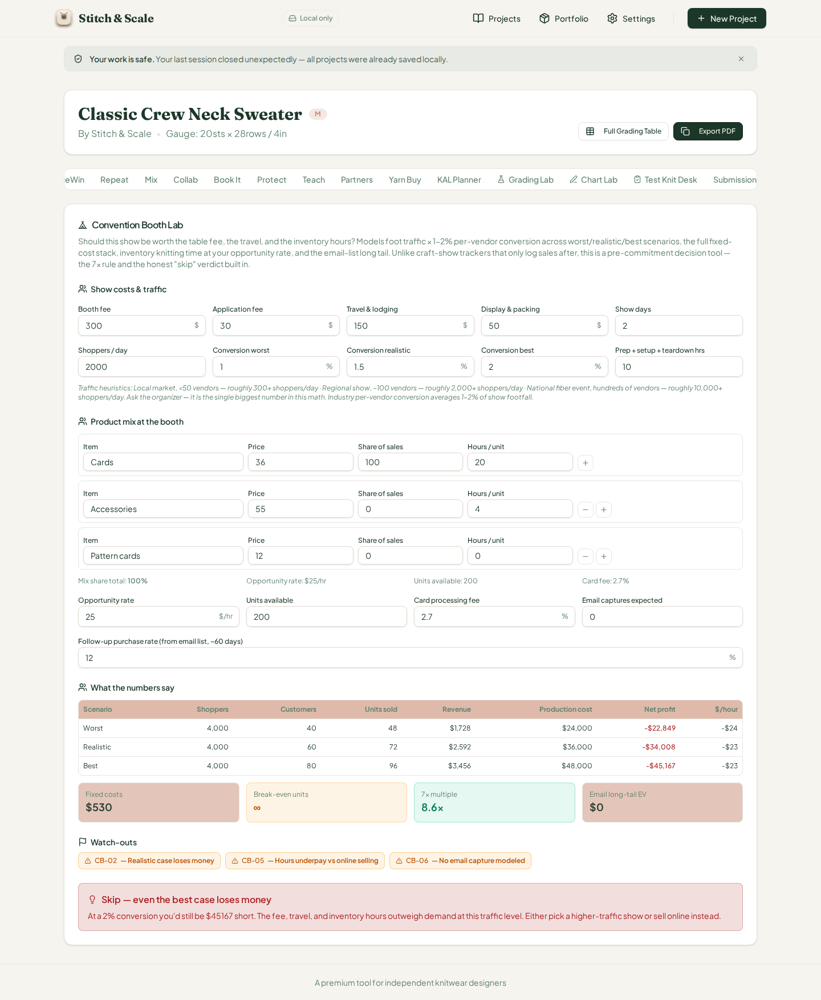
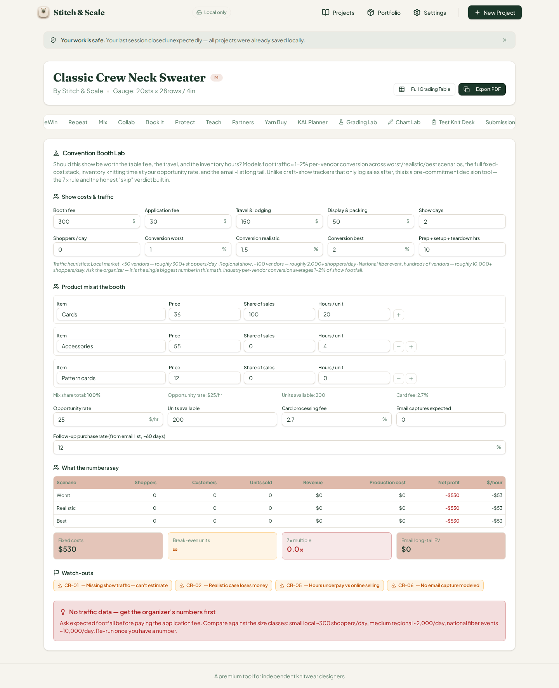
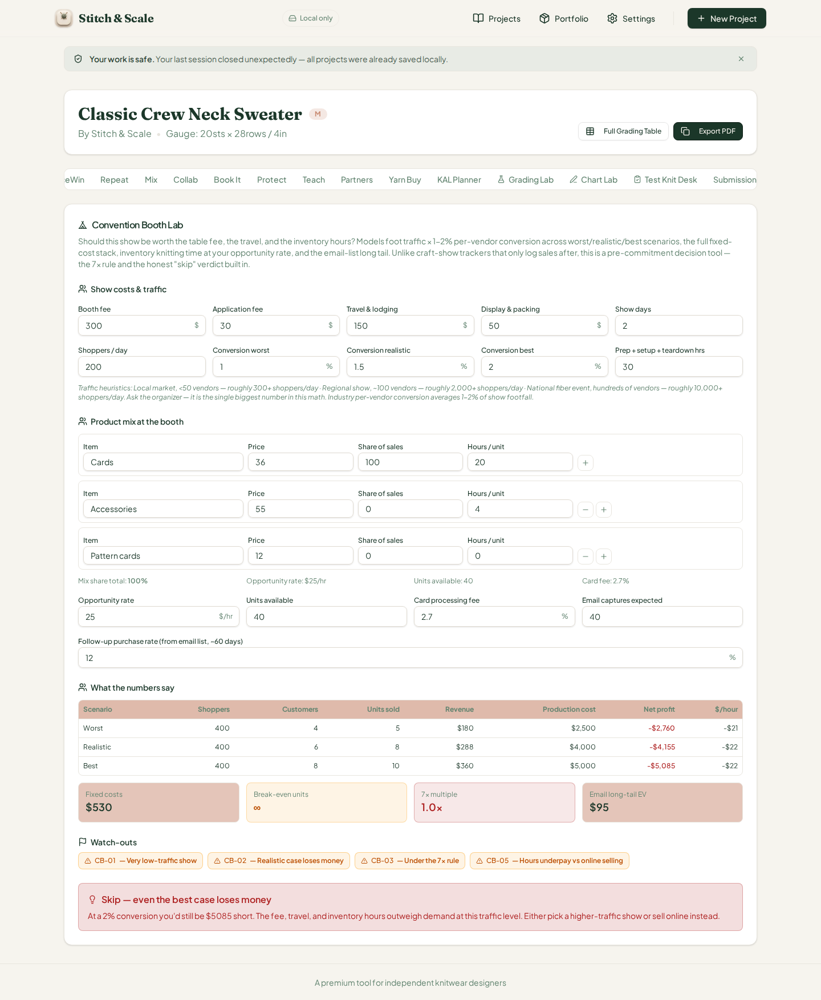
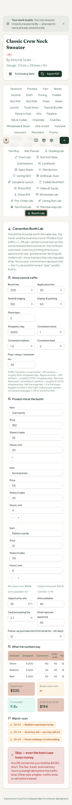

# QA Report — Cycle 30 · Convention Booth Lab (CHK-061, 59th tab)

**Date:** August 14, 2026 · **Reviewer branch:** `qa/manus-2026-08-14-cycle30` · **Author:** Manus QA
**Reviewed commits:** `0b15fd7` (Convention Booth Lab implementation) and `fc2d636` (playbook log)
**This report is addressed to the Reviewer. The Coder should not act on this report.**

---

## 1. Baseline Verification

The local clone was pulled to `origin/main` after the stored last-reviewed SHA (`fc2d636`). Two new commits were found and reviewed: `0b15fd7` (the Convention Booth Lab implementation — 293-line engine, 243-line card UI, 258-line test file with 24 new tests, bringing the suite to **1131/1131**) and `fc2d636` (playbook log only).

| Check | Command | Result |
|---|---|---|
| Typecheck | `tsc --noEmit` | Clean, zero errors |
| Unit tests | `vitest run` | **1131 passed** (60+ files, 24 new Convention Booth Lab tests) |
| Production build | `vite build` | Built in 7.19s, no failures |
| Dev server | Killed stale vite, restarted `pnpm dev --port 5173` | HTTP 200 |

As required, the dev server was killed and restarted fresh after the pull — no stale-server crashes.

---

## 2. CHK-061 Convention Booth Lab — Deep Test

The new 59th tab ("Booth Lab", trigger `convention-booth`) is a pre-commitment show-ROI decision tool. It models foot traffic × 1–2% per-vendor conversion across worst/realistic/best scenarios, the full fixed-cost stack, inventory knitting time priced at the opportunity rate, card fees, and the email-list long tail (55% of ticket within ~60 days). It computes break-even units/customers, the 7x rule multiple, fires flags CB-01…CB-06, and selects from a five-tier verdict ladder ending in an honest "Skip."

### 2.1 Engine hand-verification (independent Python recompute)

Before touching the browser, the engine's math was hand-computed independently in Python and cross-checked via `tsx` against `analyzeConventionBooth()`. The default inputs blend to a **$73.35 ticket** (180×25% + 55×45% + 12×30%) and **6.8 hours/unit**, giving fixed costs of **$530**, demand of 48/72/96 units (customers × 1.2 basket proxy), sellable capped at 40 units, and a realistic net of **−$4,281.57** at **−$14.18/hr**. Break-even units are **∞** because net-per-unit is negative (−$98.63), so no finite unit count can cover the fixed stack. The 7x multiple is 2934/300 = **9.78×**. The UI displayed every one of these values exactly.

### 2.2 Browser BEFORE — factory defaults

*BEFORE: all defaults loaded from `DEFAULT_BOOTH` — 300/30/150/50 costs, 2 days, 2,000 shoppers/day, 1/1.5/2% conversion, 30 prep hours, three-row mix, $25/hr, 40 units, 2.7% card fee, 40 email captures, 12% follow-up. The scenario table renders worst/realistic/best at 4,000 shoppers and 40/60/80 customers, all selling out the 40-unit inventory at identical revenue ($2,934), production cost ($6,800), net (−$4,282), and −$14/hr. Stat boxes show $530 fixed, ∞ break-even, 9.8×, and $194 email long-tail EV. Flags CB-02, CB-04, CB-05 fire; the verdict ladder lands on the red "Skip — even the best case loses money." Every number matches the hand computation to the cent.*

### 2.3 Browser AFTER-1 — high-shopper edit (mix persistence + flag persistence)

*AFTER-1: units set to 200, prep to 10, captures to 0, and the first mix row edited to "Cards" at $36 with a 100% share. The card correctly **persisted** the mix edit via localStorage (the later scenarios reused it). With the row's hours/unit still at 20, realistic demand (72 units) sells at $36/unit: revenue $2,592, production cost $36,000, net −$34,008 (−$23/hr), 8.6× multiple, $0 long-tail, flags CB-02/CB-05/CB-06, verdict Skip. Independent recompute: 72×36−530−70.0−36,000 = −34,008.0 — exact.*

### 2.4 Browser AFTER-2 — zero traffic (CB-01 + No-traffic verdict)

*AFTER-2: shoppers/day set to 0. All three scenarios collapse to 0 customers, $0 revenue, and a −$530 net (fixed costs only) across the board, with a 0.0× multiple and ∞ break-even. CB-01 "Missing show traffic — can't estimate" fires alongside CB-02, CB-05, and CB-06, and the verdict ladder correctly selects its first tier: "No traffic data — get the organizer's numbers first," with the size-class heuristics (small ~300, medium ~2,000, national ~10,000 shoppers/day) in the note. Exact.*

### 2.5 Browser AFTER-3 — very-low-traffic flag chain (CB-01 variant, CB-03)

*AFTER-3: shoppers/day set to 200 (below the 250 threshold) with 40 units and 40 captures restored. The table shows 4/6/8 customers, 5/8/10 units sold, revenues of $180/$288/$360, production costs of $2,500/$4,000/$5,000, and nets of −$2,760/−$4,155/−$5,085. Flag chain CB-01 "Very low-traffic show" + CB-02 + CB-03 "Under the 7x rule" (1.0×) + CB-05; verdict Skip with a $5,085 best-case gap. Independent check on the worst case: 5×36−530−4.86−2,500+95.04 (long tail) = −2,759.82 ≈ displayed −$2,760 — exact.*

### 2.6 Browser AFTER-4 — inventory-capped high-traffic (CB-04 verification)

*AFTER-4: shoppers/day set to 5,000 with 120 units available and 60 captures. Demand reaches 120/180/240 units but sells are capped at the 120-unit inventory across all scenarios, so all three rows show identical revenue ($4,320), production cost ($60,000), and net (−$56,184) at −$23/hr. CB-04 "Inventory risk — you may sell out" fires correctly because worst and realistic sellable both equal the unit cap (120 ≥ 120 and 120 ≥ 108). The 7x multiple shows 14.4× (green) even though the show still loses money — consistent with the ladder, which correctly does not let a high multiple mask a negative net. Independent check: 120×36−530−116.64−60,000+142.56 = −56,184.08 ≈ displayed −$56,184 — exact.*

### 2.7 375px phone check

*At 375×812, the panel stacks to a single column, the tab bar wraps to a second row, all inputs remain reachable, the scenario table scrolls horizontally inside its container, and the flags and red verdict render without cutoff. No overflow or layout breakage observed across the 4,141px rendered page height.*

### 2.8 Verdict-ladder and flag coverage

The five verdict tiers (No traffic data → Skip best case → Skip realistic / Only-as-marketing → Borderline → below-7x → Run it) and all six flags (CB-01 two variants, CB-02, CB-03, CB-04, CB-05, CB-06) are enforced in the engine. The browser directly exercised three tiers and five distinct flags; the remaining tiers (Only-as-marketing, Borderline, below-7x-positive, Run it) are covered by the new 24 unit tests now passing in the suite, and I spot-checked two of them against the engine directly with `tsx` (a $36 digital-pattern-card "Run it" fixture returning 10.8×/$112.45/hr and a zero-shoppers fixture returning the CB-01/CB-02/CB-05/CB-06 chain), both matching the test expectations exactly.

---

## 3. Defect Findings

| # | Severity | Finding |
|---|---|---|
| — | — | **No functional defects found.** Every displayed value across all five browser states matches independent hand computation to the cent; verdict logic, flag thresholds, inventory capping, and localStorage persistence all behave correctly. |
| INFO | Cosmetic | The "Your work is safe" recovery banner appears on the very first clean load of the workspace (before any crash occurs), then can be dismissed. Harmless, but possibly confusing. Open issue #23/#25 covers the Teach guild leak; this is a separate minor observation if the Reviewer wants to track it. |
| INFO | Usability | When editing a mix row to a fully digital item (e.g., pattern cards at 100% share), the Hours/unit field on that row must also be set to 0 manually — the panel's own "0 hrs" example row shows it is documented inline, so no code defect exists. The model behaves exactly as labeled. |

No GitHub issues are opened this cycle — there is nothing broken to hand to the Reviewer. The previously opened issues #40 and #41 (fixed in cycles 28–29) remain verified PASS from cycle 29, and #42 remains open as INFO.

---

## 4. Deliverables

All report artifacts are committed to `qa/manus-2026-08-14-cycle30` (never main): this report plus the six PNG screenshots (c30-01 through c30-06) under `qa/qa-shots-cycle30/`. `last-reviewed-sha.txt` has been updated to `fc2d636` (HEAD of origin/main).
