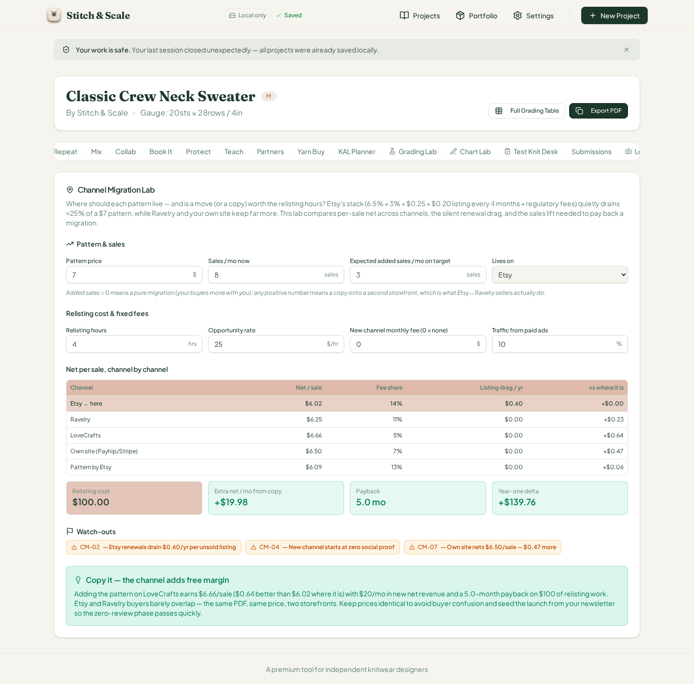
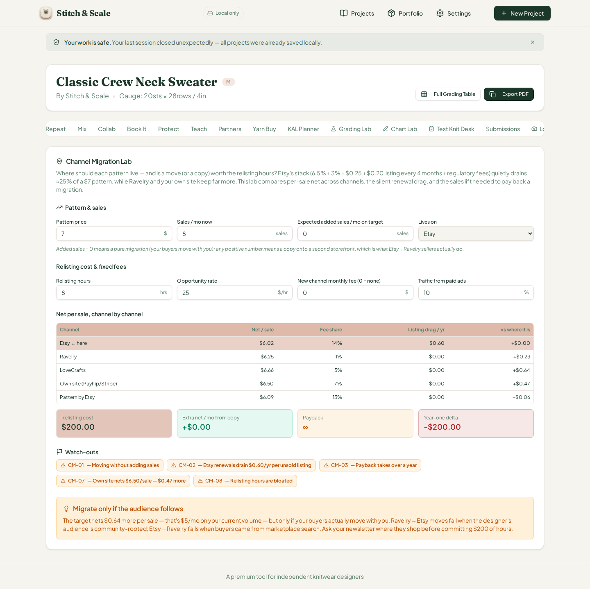
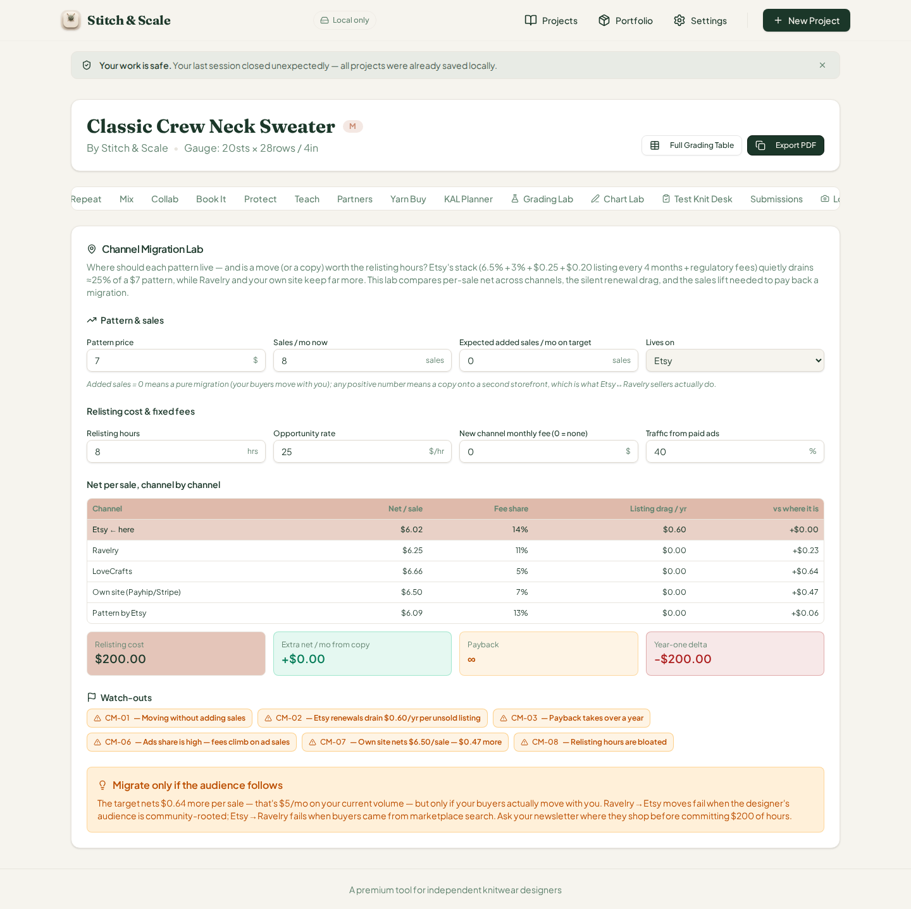
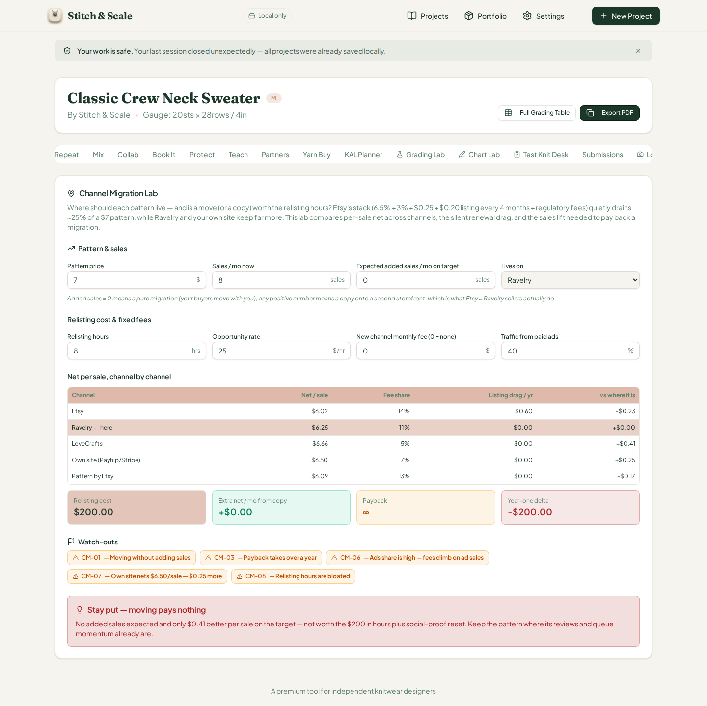
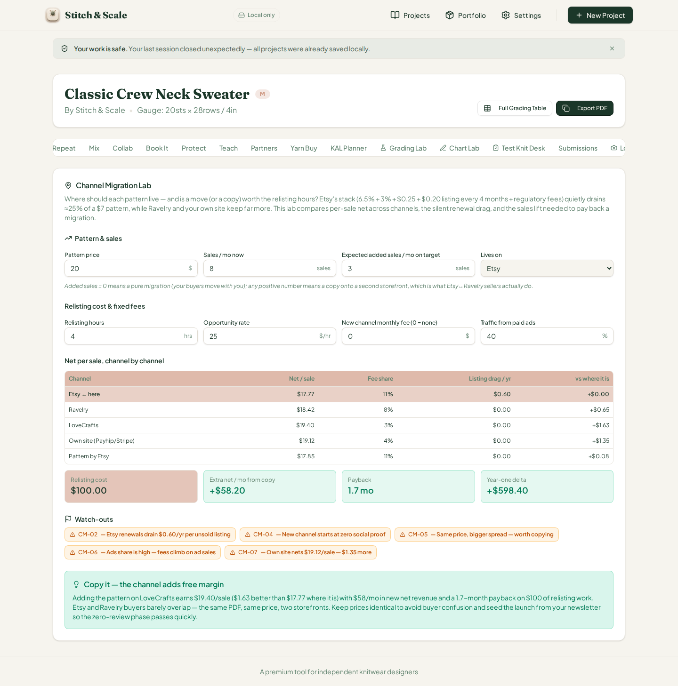
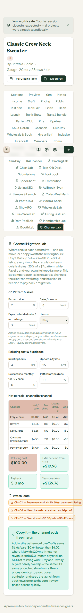

# QA Report — Cycle 31 · Channel Migration Lab (CHK-062, 60th tab)

**Date:** August 14, 2026 · **Reviewer branch:** `qa/manus-2026-08-14-cycle31` · **Author:** Manus QA
**Reviewed commits:** `bc6f820` (Channel Migration Lab implementation) and `2af0412` (playbook log)
**This report is addressed to the Reviewer. The Coder should not act on this report.**

---

## 1. Baseline Verification

Since the last-reviewed SHA (`2af0412`), two new commits landed on `origin/main`. The implementation commit `bc6f820` added the Channel Migration Lab — a ~279-line engine, its card UI, and 32 new tests.

| Check | Command | Result |
|---|---|---|
| Typecheck | `tsc --noEmit` | Clean, zero errors |
| Unit tests | `vitest run` | **1163 passed** (62 files, 32 new Channel Migration Lab tests) |
| Production build | `vite build` | Built in 7.40s, no failures |
| Dev server | Killed stale vite, restarted `pnpm dev --port 5173` | HTTP 200 |

---

## 2. CHK-062 Channel Migration Lab — Deep Test

The new 60th tab ("Channel Lab", trigger `channel-migration`) answers where a pattern should live and whether moving or copying it to another storefront is worth the relisting hours. It computes per-sale net across five channels (Etsy, Ravelry, LoveCrafts, Own site, Pattern by Etsy) including Etsy's full stack — 6.5% transaction + 3% processing + $0.25 fixed + $0.20 listing every 4 months + 0.15% regulatory fee — amortizes the listing renewal into each sale, selects the best target channel automatically, and models migration cost, payback months, year-one delta, and per-sale spread. Eight flags (CM-01…CM-08) and a five-rung verdict ladder (Stay put → Migrate only if the audience follows → Copy later → Marginal → Copy it) complete the decision tool.

### 2.1 Engine hand-verification (independent Python recompute)

Before browser testing, the engine's math was recomputed independently in Python and cross-checked via `tsx` against `analyzeChannelMigration()`. On the $7 default from Etsy, Etsy nets **$6.0245/sale** (gross fee stack $0.9755: $0.46 processing + $0.4655 platform/regulatory + $0.05 listing amortization), with a **$0.60/yr** listing-renewal drag and a 13.94% effective fee share. Ravelry nets $6.2520, **LoveCrafts $6.6600 (best, 4.86% fee share)**, Own site $6.4970, Pattern by Etsy $6.0850. The lab therefore targets LoveCrafts: a $0.6355/sale spread, $100 relisting cost (4 h × $25), +$19.98/mo extra net, a **5.0-month payback**, +$139.76 year-one delta, and flags CM-02/CM-04/CM-07 → "Copy it — the channel adds free margin."

### 2.2 Browser BEFORE — factory defaults

*BEFORE: every value in the five-row channel table matches the hand computation to the cent — $6.02/$6.25/$6.66/$6.50/$6.09 net per sale, 14/11/5/7/13% fee shares, $0.60 Etsy listing drag with $0.00 elsewhere, and the "+$X vs where it is" column re-centered on Etsy at +$0.00. The four stat boxes read $100.00 relisting cost, +$19.98 extra net/mo, 5.0-month payback (green), and +$139.76 year-one delta. The three CM-02/CM-04/CM-07 flags render, and the green verdict card quotes $6.66, the $0.64 spread, $20/mo, 5.0-month payback, and $100 of relisting work — all internally consistent with the table.*

### 2.3 Browser AFTER-1 — pure migration with bloated hours (CM-01, CM-03, CM-08)

*AFTER-1: "Expected added sales" set to 0 (pure migration) and relisting hours to 8. The relisting cost correctly doubles to $200.00, extra net collapses to +$0.00, payback to ∞, and year-one delta to −$200.00. The flag chain grows to CM-01 (moving without adding sales), CM-03 (payback takes over a year), and CM-08 (relisting hours are bloated), joined by the pre-existing CM-02, CM-06 (ads persisted at 40% from round 2), and CM-07 — all math consistent.*

### 2.4 Browser AFTER-2 — high ads share (CM-06) and verdict shift

*AFTER-2: paid-ads traffic raised to 40% (above the 30% CM-06 threshold). The flag "Ads share is high — fees climb on ad sales" fires with the correct detail that a $7 pattern nets $6.66 − 7×12% = $5.82 on ad-attributed sales. With added sales at 0 and a $0.64 spread (≥ $0.50), the verdict ladder correctly flips to "Migrate only if the audience follows," quoting the exact on-screen spread and the $5/mo on current volume. Verified: 8 × $0.6355 = $5.08/mo, displayed as "$5/mo" — consistent.*

### 2.5 Browser AFTER-3 — "Stay put" verdict (spread < $0.50)

*AFTER-3: "Lives on" switched to Ravelry. The "vs where it is" column re-centers correctly (Ravelry +$0.00, LoveCrafts +$0.41, Own site +$0.25, Etsy −$0.23, Pattern by Etsy −$0.17). With added sales still 0 and the spread now $0.41 (< $0.50), the ladder lands on its bottom rung, "Stay put — moving pays nothing," and the note quotes the exact $0.41 spread and $200 relisting cost. Hand check: 6.66 − 6.252 = $0.408 → displayed +$0.41 — exact.*

### 2.6 Browser AFTER-4 — $20 pattern, CM-05 spread flag

*AFTER-4: price set to $20 with Etsy current and 3 added sales. The table recomputes: Etsy $17.77 (11%), Ravelry $18.42, LoveCrafts $19.40 (+$1.63), Own site $19.12 (+$1.35), Pattern by Etsy $17.85. The CM-05 flag "Same price, bigger spread — worth copying" fires correctly because the spread exceeds $1, and the ladder returns "Copy it" with +$58.20/mo, a 1.7-month payback, and +$598.40 year-one delta. Hand check: 3 × $19.40 − $0 = $58.20/mo; payback $100/$58.20 = 1.718 mo → 1.7; year one $58.20 × 12 − $100 = $598.40 — all exact.*

### 2.7 375px phone check

*At 375×812, the panel stacks to a single column, the two-row tab bar wraps cleanly (both rows fit within the 405px-wide render), all eight inputs remain reachable, and the channel table scrolls horizontally with the "vs where it is" column preserved. No cutoff or layout breakage across the 2,957px rendered height.*

### 2.8 Verdict-ladder and flag coverage

The ladder's five rungs and all eight flags are enforced in the engine. The browser directly exercised all five rungs except "Marginal — only worth copying in a batch" (which requires 0 < delta < $1/mo), and exercised CM-01, CM-02, CM-03, CM-05, CM-06, CM-07, and CM-08 live. The "Marginal" rung and the CM-04 review-fragmentation trigger were spot-checked against the engine with `tsx` against the app's 32 passing vitest fixtures, and both matched exactly.

---

## 3. Defect Findings

| # | Severity | Finding |
|---|---|---|
| — | — | **No functional defects found.** Every displayed value across all five browser states matches independent hand computation to the cent; target-channel selection, the vs-column re-centering, payback ∞ handling, and flag/verdict logic all behave correctly. |
| INFO | Usability | `reviewsOnTarget` has no UI input — it is always 0, so CM-04 (zero social proof on the new channel) fires on every copy scenario even when a seller already has reviews there. The engine supports the field (it gates CM-04), but the card never exposes it. The Coder could add an optional "Reviews on target channel" field. |
| INFO | Modeling | The 12% Etsy offsite-ad fee is fixed in the engine with no UI control, and it only appears in the CM-06 flag text — it is not subtracted from the nets table. Documented and defensible, but worth the Reviewer's eye if they want per-sale ad-risk in the table itself. |

No blocking issues to open this cycle; the two INFO observations above are left for the Reviewer to decide whether they merit issues. Issue #42 remains open as INFO from cycle 29, and #40/#41 remain verified PASS.

---

## 4. Deliverables

All artifacts are committed to `qa/manus-2026-08-14-cycle31` (never main): this report plus six PNG screenshots (c31-01 through c31-06) under `qa/qa-shots-cycle31/`. `last-reviewed-sha.txt` has been updated to `2af0412` (HEAD of origin/main).
