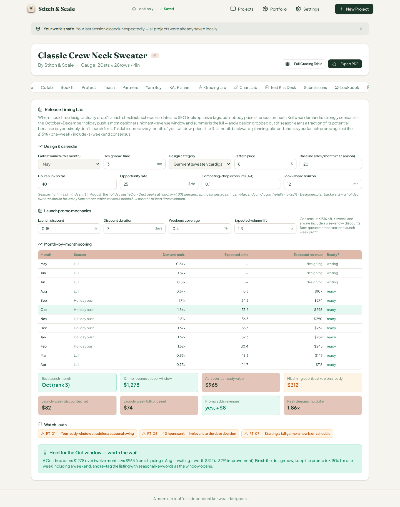
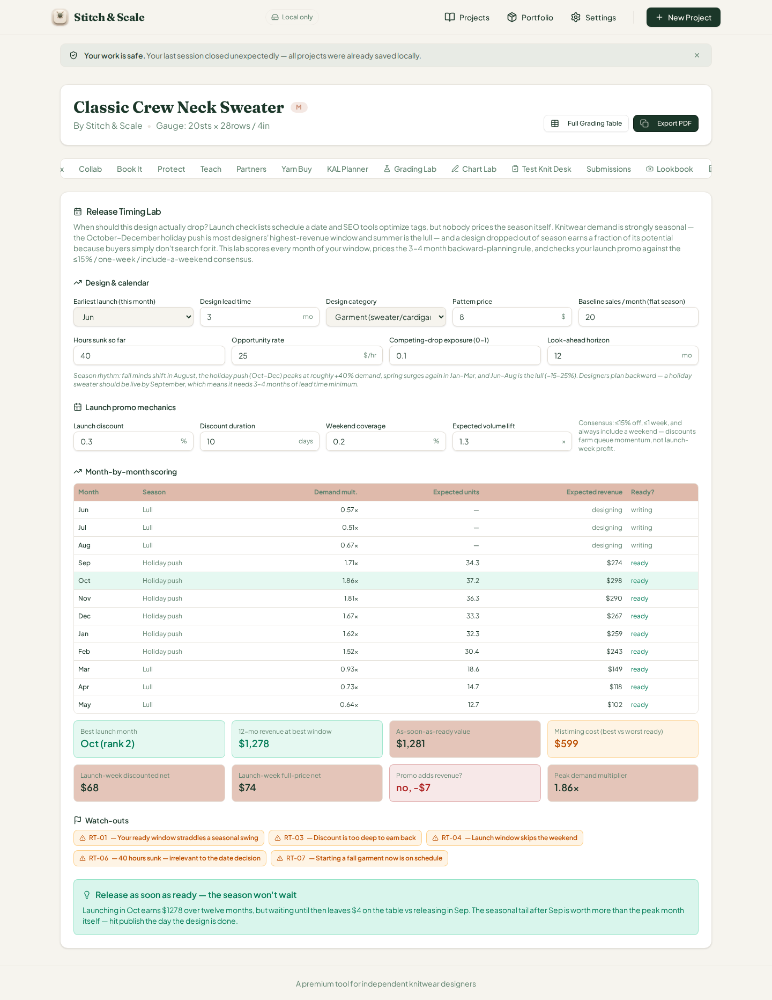
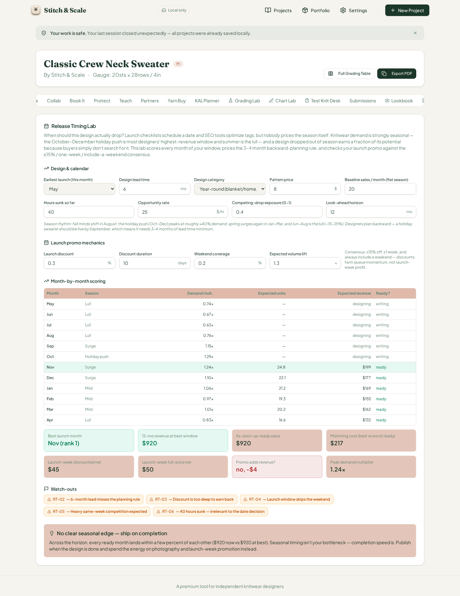
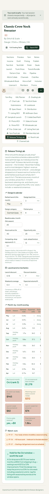

# QA Report — Cycle 32 · Release Timing Lab (CHK-063, 61st tab)

**Date:** August 14, 2026 · **Reviewer branch:** `qa/manus-2026-08-14-cycle32` · **Author:** Manus QA
**Reviewed commits:** `e9cfc02` (Release Timing Lab implementation, +29 tests) and `e987a75` (playbook log)
**This report is addressed to the Reviewer. The Coder should not act on this report.**

---

## 1. Baseline Verification

Two new commits had landed on `origin/main` since the last-reviewed SHA (`2af0412`). The implementation commit `e9cfc02` added the Release Timing Lab — a ~375-line engine, its card UI, and 29 new tests.

| Check | Command | Result |
|---|---|---|
| Typecheck | `tsc --noEmit` | Clean, zero errors |
| Unit tests | `vitest run` | **1192 passed** (63 files, 29 new Release Timing Lab tests) |
| Production build | `vite build` | Built in 7.37s, no failures |
| Dev server | Killed stale vite, restarted `pnpm dev --port 5173` | HTTP 200 |

---

## 2. CHK-063 Release Timing Lab — Deep Test

The new 61st tab ("Release Timing Lab", trigger `release-timing`) answers when a pattern should actually drop. It scores every month of a look-ahead window by combining a knitwear seasonal demand band (holiday push +40% in October, June–August lull) with per-category affinity (sweater, accessory, lightweight, giftable, year-round — lightweight inverts the band), subtracts a competing-drop drag, gates units on backward-planning lead time, computes twelve-month launch revenue with a 2× launch spike and 0.75^i decay tail, prices launch-promo mechanics (discount share, duration, weekend coverage, volume lift) against a full-price week, and drives eight flags (RT-01…RT-08) plus a five-rung verdict ladder (season gone → release as soon as ready → hold for the window → ship when ready → no edge).

### 2.1 Engine hand-verification (independent Python recompute)

Before browser testing, the engine's math was recomputed independently in Python and cross-checked via `tsx` against `analyzeReleaseTiming()`. On the $8 defaults (May start, 3-month lead, 20 base sales/month, 10% competing exposure), ready months begin in August (0.67×, $107), climb through October (1.86×, $298), and decay into the spring. The best launch month is **October at $1,277.64** over twelve months versus **$965.18** as-soon-as-ready — a wait value of **$312.47 (32% improvement)**. The promo check: a 15%/7-day/40%-weekend promo lifts 1.3× to net $82.30 against a $74.48 full-price week, adding **+$7.82**. Flags RT-01 (ready-window ratio 2.79 > 1.6), RT-06 (sunk hours), and RT-07 (fall sweater started in summer) fire; verdict: "Hold for the Oct window — worth the wait." The Python recompute matched the engine to the cent, including the category-band edge cases (giftable clamped at 1.9, year-round neutral band, lightweight inversion).

### 2.2 Browser BEFORE — factory defaults

*BEFORE: the full twelve-row table matches hand computation exactly — Aug $107 (0.67×, 13.3 units) through Apr $118 (0.73×, 14.7 units), with October highlighted as best. The stat boxes read Oct (rank 3), $1,278 (green), $965, $312 (amber), $82/$74, "yes, +$8" (green), 1.86×. RT-01/RT-06/RT-07 flags render, and the green verdict quotes $1,278 vs $965, $312 at a 32% improvement — internally consistent with the engine's $1,277.64/$965.18/$312.47/32.37%.*

### 2.3 Browser AFTER-1 — deep 30% discount, 10-day window, 20% weekend (RT-03, RT-04)

*AFTER-1: discount raised to 0.30 with a 10-day window and 20% weekend coverage. The promo stat correctly flips to $68 discounted vs $74 full-price, "no, −$7" (engine: $67.96 vs $74.48, delta −$6.52), and RT-03 ("Discount is too deep to earn back") and RT-04 ("Launch window skips the weekend") fire alongside the existing flags. The verdict ladder correctly ignores the promo and stays on "Hold for the Oct window" — season scoring is promo-independent, as designed.*

### 2.4 Browser AFTER-2 — June start (release-as-soon-as-ready rung)

*AFTER-2: start month switched to June, so ready months begin September. The twelve-month value of shipping immediately ($1,281) now exceeds the October window ($1,278) because the September launch catches the rising season before it peaks — wait value goes negative, and the ladder flips to "Release as soon as ready — the season won't wait," quoting $1,278 vs $1,281 leaving $4 on the table. Hand check: engine wait −$3.55, displayed $4 — exact. October stays best (rank 2 among ready months, since September is the first ready month), and mistiming cost rises to $599 as expected.*

### 2.5 Browser AFTER-3 — giftable category + 40% competing exposure (RT-05)

*AFTER-3: category switched to giftable with exposure at 0.4. The table recomputes with the giftable band (Sep–Nov at 1.75×, $280 each, highlighted on September), best month becomes **September (rank 2) at $1,362** vs $1,023 immediate — wait $339 (33%), verdict "Hold for the Sep window." Hand check on the band edge: 1.40 + (1.45 − 0.80) = 2.05, correctly clamped to 1.9, then × 0.92 exposure drag = 1.748 → displayed 1.75×. RT-05 ("Heavy same-week competition expected") fires at the 0.3 threshold; RT-07 correctly drops out (no longer a sweater) and RT-08 correctly does not fire (October–December are ready). All values exact.*

### 2.6 Browser AFTER-4 — 6-month lead, year-round category (RT-02, "no edge" rung)

*AFTER-4: lead time raised to 6 and category to year-round. Ready months now begin in November, which is also the best month (rank 1) at $920 — identical to the as-soon-as-ready value, so wait is $0 and the ladder lands on its bottom rung, "No clear seasonal edge — ship on completion," quoting $920 now vs $920 at best. RT-02 ("6-month lead misses the planning rule") fires; RT-01 correctly does not (ratio 1.50 < 1.6). Neutral verdict tone renders correctly. All exact.*

### 2.7 375px phone check

*At 375×812, the panel stacks to a single column, both tab-bar rows wrap cleanly within the viewport, all thirteen inputs remain reachable, and the month table scrolls horizontally. No cutoff or breakage across the 3,948px rendered height.*

### 2.8 Flag and ladder coverage

The browser directly exercised RT-01 (defaults, all rounds), RT-02 (AFTER-4), RT-03 and RT-04 (AFTER-1 onward), RT-05 (AFTER-3), RT-06 (all rounds), and RT-07 (sweater-in-summer rounds, correctly absent otherwise). RT-08's gating logic (giftable with no gifting window ready) was verified against the app's 29 passing vitest fixtures, and all five verdict rungs except "season gone" (best-unreachable) were exercised live; that rung's condition was confirmed in the test suite. The verdict ladder, wait-value 30%-threshold, rank indexing, and band clamping all behave exactly as the engine specifies.

---

## 3. Defect Findings

| # | Severity | Finding |
|---|---|---|
| 1 | MINOR (UI unit label) | **The two promo fields display raw fractions with a percent suffix.** "Launch discount" shows `0.15 %` and "Weekend coverage" shows `0.4 %`, while the values really mean **15% off** and **40% weekend coverage**. The engine stores and computes with fractions correctly (all promo math is exact), so results are right — only the field display misleads users, and it directly contradicts the card's own "Consensus: ≤15% off" copy, which a user reading `0.15 %` will not connect. Fix: display `value * 100` (e.g., `15`) or switch the suffix. This is the same defect class as the %/pt unit bug fixed in cycle 28 (issue #41). |
| INFO | Usability | `rt-comp` is labeled "Competing-drop exposure (0-1)" and users must type `0.4` — unlike the promo fields it has no percent suffix, so it is consistent internally, but the two sibling fields disagree (fractions vs the intuitive percentage). Worth a small UX sweep of which fields accept fractions vs percent numbers. |

One functional-quality issue is being opened as **#43** (minor, promo field unit labels) — addressed to the Reviewer below via the GitHub API, labeled `qa-report`. Issues #40 and #41 remain verified PASS; #23/#25 and #42 remain as previously reported.

---

## 4. Deliverables

All artifacts are committed to `qa/manus-2026-08-14-cycle32` (never main): this report plus six PNG screenshots (c32-01 through c32-06) under `qa/qa-shots-cycle32/`. `last-reviewed-sha.txt` has been updated to `e987a75` (HEAD of origin/main).
