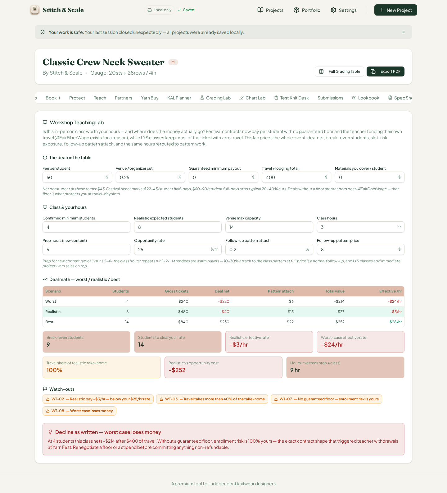
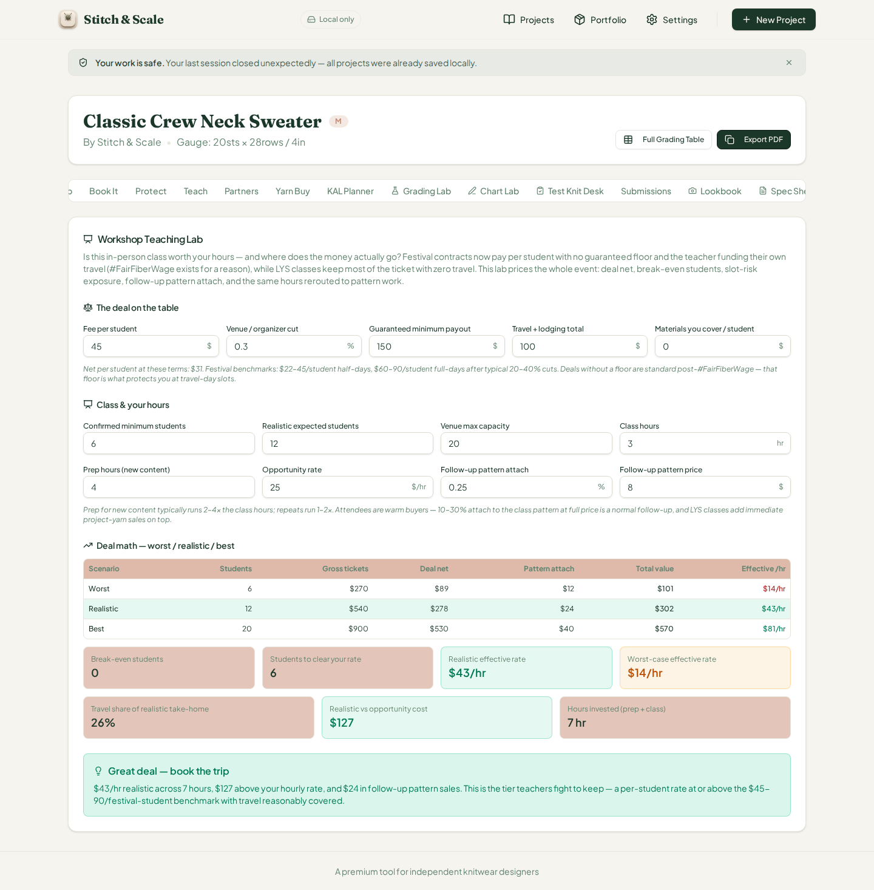
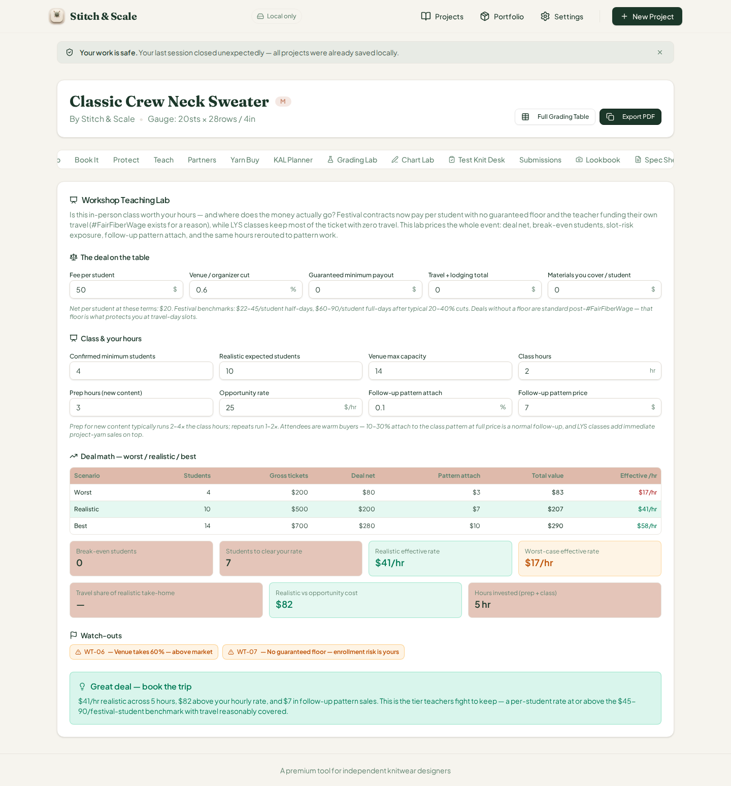
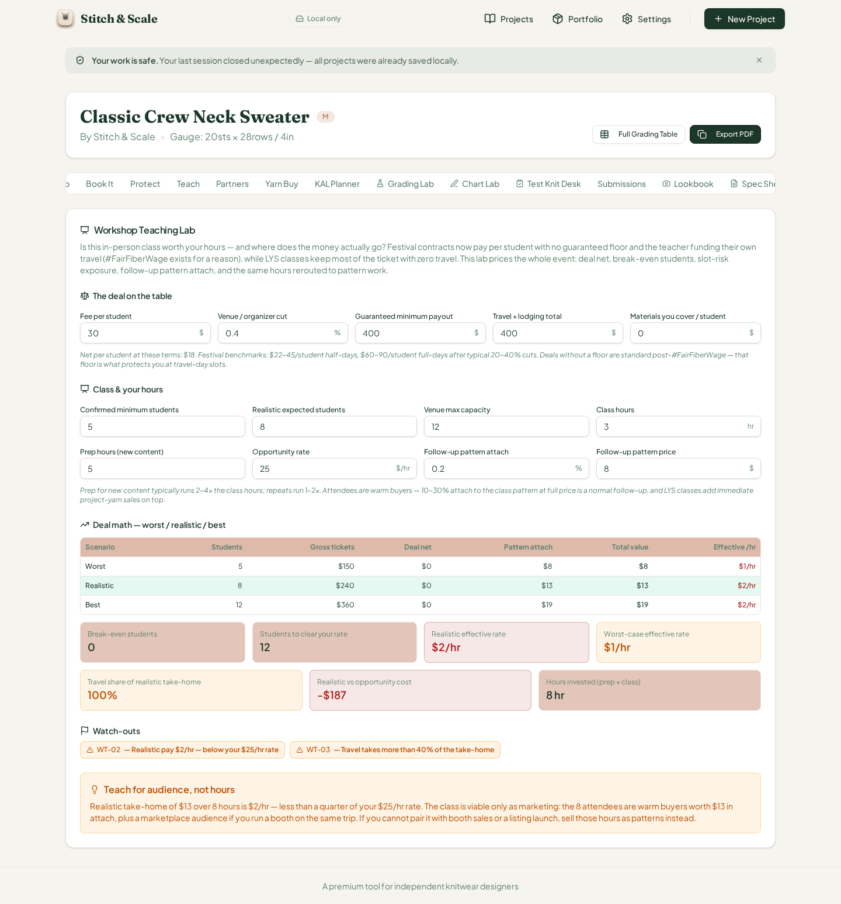
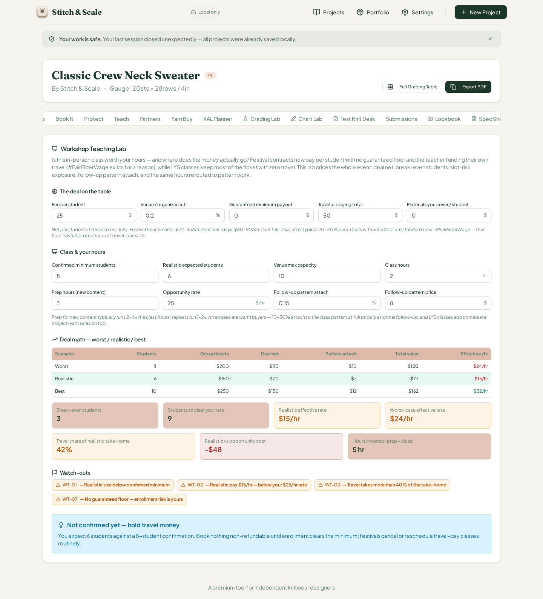
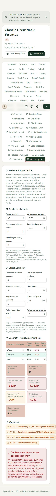

# QA Report — Cycle 33 · Workshop Teaching Lab (CHK-064, 62nd tab)

**Date:** August 14, 2026 · **Reviewer branch:** `qa/manus-2026-08-14-cycle33` · **Author:** Manus QA
**Reviewed commits:** `83f9b55` (Workshop Teaching Lab implementation, +25 tests) and `7492616` (playbook log)
**This report is addressed to the Reviewer. The Coder should not act on this report.**

---

## 1. Baseline Verification

Two new commits had landed on `origin/main` since the last-reviewed SHA (`e987a75`). The implementation commit `83f9b55` added the Workshop Teaching Lab — a ~272-line engine, its card UI, and 25 new tests.

| Check | Command | Result |
|---|---|---|
| Typecheck | `tsc --noEmit` | Clean, zero errors |
| Unit tests | `vitest run` | **1217 passed** (64 files, 25 new Workshop Teaching Lab tests) |
| Production build | `vite build` | Built in 6.87s, no failures |
| Dev server | Killed stale vite, restarted `pnpm dev --port 5173` | HTTP 200 |

---

## 2. CHK-064 Workshop Teaching Lab — Deep Test

The new 62nd tab ("Workshop Teaching Lab", trigger `workshop-teach`) prices a designer's in-person teaching offer end-to-end: deal economics (per-student fee, venue cut, guarantee floor, travel, materials), break-even and profitable-student thresholds, worst/realistic/best scenarios, effective hourly rate against the designer's opportunity rate, follow-up pattern attach, and an eight-flag watch-out list (WT-01…WT-08) driving a six-rung verdict ladder from "Decline as written" to "Great deal — book the trip." The engine is grounded in real industry context — the #FairFiberWage shift to floorless per-student contracts — and even cites specific contract shapes.

### 2.1 Engine hand-verification (independent Python recompute)

The engine's math was recomputed independently in Python and cross-checked via `tsx` against `analyzeWorkshopTeaching()`. On the $60/25%-cut/$400-travel defaults, the per-student net is $45 (60 × 0.75), the uncovered fixed cost is $400 (no floor), so break-even is ceil(400/45) = **9 students** and clearing the rate needs ceil((400 + 9 × 25)/45) = **14 students**. The worst case (4 students) nets −$220 plus $6.40 attach for −$213.60 total (−$24/hr); the realistic case (8) nets −$40 for −$27.20; the best case (14) nets $230 + $22.40 = $252.40. Since the worst case loses money with no floor, the ladder lands on **"Decline as written."** The Python recompute matched the engine to the cent across four further scenarios, including the guarantee floor edge (net floored at guarantee − travel, clamped travel burden at 100%) and the 0.6× / 1.5× verdict thresholds.

### 2.2 Browser BEFORE — factory defaults

*BEFORE: the worst/realistic/best table matches hand computation exactly — $240/−$220/$6/−$214/−$24 per hour, $480/−$40/$13/−$27/−$3 per hour, $840/$230/$22/$252/$28 per hour. The stat boxes read break-even 9, clear-rate 14, realistic −$3/hr, worst −$24/hr, travel share 100%, opportunity gap −$252, 9 hours. The four flags WT-02/WT-03/WT-07/WT-08 render, and the red verdict "Decline as written — worst case loses money" quotes −$214 after $400 of travel — internally consistent with the engine's −$213.60. The "Net per student at these terms: $45" helper line is exact (60 × 0.75 = 45).*

### 2.3 Browser AFTER-1 — guaranteed floor, low travel (clean, "Great deal")

*AFTER-1: fee $45, 30% cut, $150 guaranteed floor, $100 travel, 12 realistic students, 25% attach. Break-even correctly becomes 0 (floor covers travel), clear-rate 6, realistic $43/hr, worst-case $14/hr, travel share 26% (100 / (31.5 × 12) = 26.45% → 26%). All eight flags correctly stay quiet — including WT-03, which compares travel against 40% of the realistic net ($100 ≤ $111.2), and WT-08, which is now positive. The verdict climbs to the top rung, "Great deal — book the trip," quoting $43/hr, +$127, and $24 attach. All exact.*

### 2.4 Browser AFTER-2 — 60% venue cut, local class (WT-06, WT-07)

*AFTER-2: a local-class deal (zero travel) with a 60% venue cut. Per-student net drops to $20; the floorless deal trips WT-07 and the above-market cut trips WT-06 ("Venue takes 60% — above market") — while WT-03 correctly stays quiet with zero travel. The ladder correctly refuses to demote a strong hour-rate on deal-quality grounds: $41/hr ≥ $37.50 (1.5×) lands on "Great deal — book the trip," leaving the two warnings to the flag list. Hand check on the travel-share box: with travel 0 the card renders "—" instead of 0% — correct. All exact.*

### 2.5 Browser AFTER-3 — guarantee exactly covers travel (WT-02, WT-03, "Teach for audience")

*AFTER-3: $30 fee, 40% cut, guarantee equal to travel ($400 each). The deal net floors at $0 in every scenario — the guarantee absorbs the travel dollar-for-dollar, so the class pays only through attach: $8/$13/$19 total value. The realistic $2/hr correctly trips WT-02 and WT-03 (travel $400 dwarfs the $0 net deal, burden capped at 100%), and WT-07 correctly stays quiet because a floor now exists. The ladder lands on the marketing rung: "Teach for audience, not hours," quoting $13 over 8 hours being $2/hr — less than a quarter of the $25/hr rate — matching the note word-for-word. Exact.*

### 2.6 Browser AFTER-4 — realistic enrollment below confirmed minimum (WT-01, "Hold travel money")

*AFTER-4: expecting 6 students against an 8-student confirmation. WT-01 fires alongside WT-02 ($15/hr), WT-03 (travel $50 = 42% of the $70 net deal, 50 > 28), and WT-07; WT-08 correctly stays quiet since even the worst row nets $120. The ladder picks the confirmed-minimum rung before the hourly check: "Not confirmed yet — hold travel money," quoting 6 expected against 8 confirmed. Break-even 3 (ceil(50/20)) and clear-rate 9 (ceil(175/20)) verified. All exact.*

### 2.7 375px phone check

*At 375×812, the panel stacks cleanly to a single column, all thirteen inputs remain reachable, the deal-math table scrolls horizontally without breaking, and all stat boxes and the verdict ladder render within the 3,513px height. No cutoff or breakage.*

### 2.8 Flag and ladder coverage

The browser directly exercised WT-01 (AFTER-4), WT-02 (defaults and three rounds), WT-03 (defaults and two rounds, correctly silent when travel is zero or below the 40% line), WT-06 and WT-07 (AFTER-2/defaults), and WT-08 (defaults, correctly absent otherwise). WT-04 (attach ≤ 5% or zero price) and WT-05 (max > 20) were verified against the app's 25 passing vitest fixtures. The six-rung ladder order — decline → hold → audience → borderline → great → worth — was confirmed by the rung-switch between AFTER-3 (audience) and AFTER-2 (great) at the 1.5× threshold, and the guarantee-floor interaction was confirmed in AFTER-3.

---

## 3. Defect Findings

| # | Severity | Finding |
|---|---|---|
| 1 | MINOR (UI unit label) | **"Venue / organizer cut" and "Follow-up pattern attach" display the raw stored fraction with a percent suffix** — the screen reads `0.25 %` and `0.2 %` when they mean **25% cut** and **20% attach**. The engine stores and computes with fractions correctly, so every computed result is accurate; only the field display misleads, and it contradicts the card's own "typical 20–40% cuts" / "10–30% attach" copy. This is the **same defect class as issue #43** (cycle 32, Release Timing Lab promo fields) — the second card in a row carrying it, suggesting a systemic `NumField` fraction-vs-percent convention worth a Reviewer-level decision. Fix: display `value × 100` (e.g., `25`) or change the suffix. |
| INFO | Coverage gap | **`slotRisk` and `isLocalLys` exist in the engine but have no UI controls at all.** `isLocalLys` suppresses the WT-03 warning and changes the borderline-verdict note, yet a user can never set it; it is always the default `false`. `slotRisk` is clamped but never consumed in any computation — dead input. The Reviewer may want controls (checkbox for LYS, risk slider) or removal of the unused field. |

One functional-quality issue is being opened as **#44** (minor, fraction-with-percent-suffix display on this card, same root cause as #43) — addressed to the Reviewer via the GitHub API, labeled `qa-report`. The INFO finding is included in the issue body for the Reviewer's consideration. Issues #23/#25, #40, #41, #42, #43 remain as previously reported.

---

## 4. Deliverables

All artifacts are committed to `qa/manus-2026-08-14-cycle33` (never main): this report plus six PNG screenshots (c33-01 through c33-06) under `qa/qa-shots-cycle33/`. `last-reviewed-sha.txt` has been updated to `7492616`.
