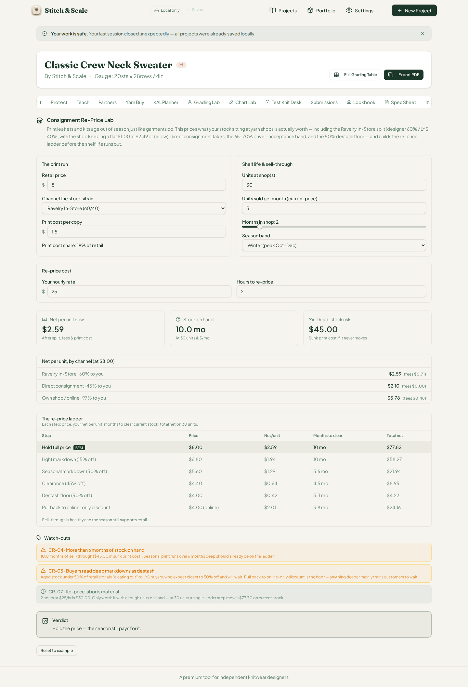
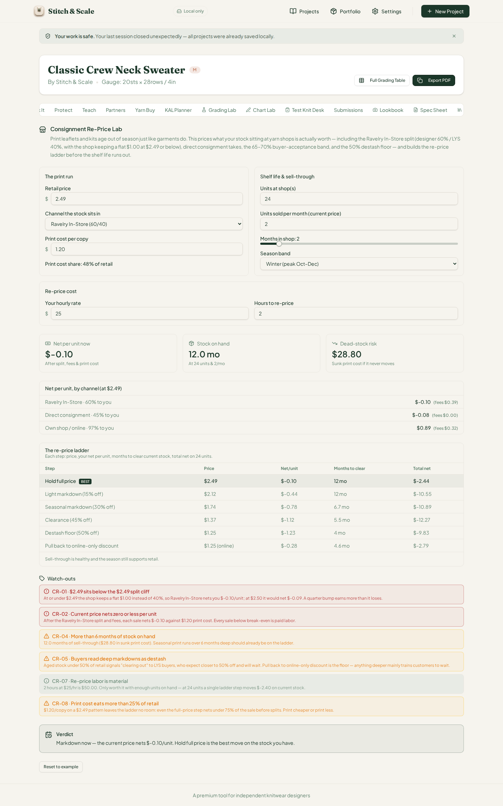
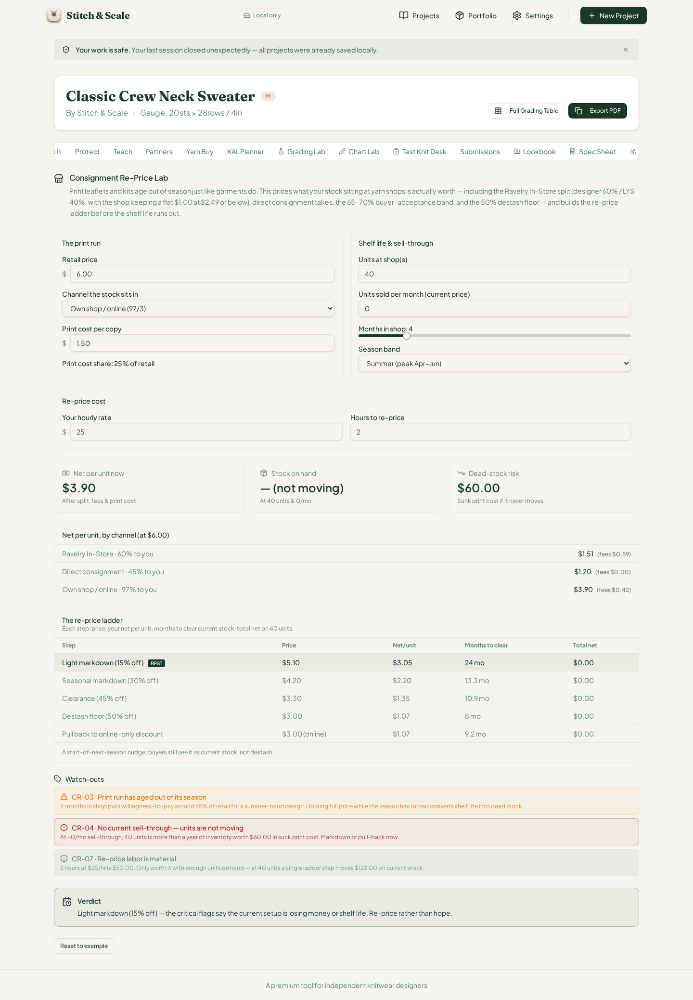
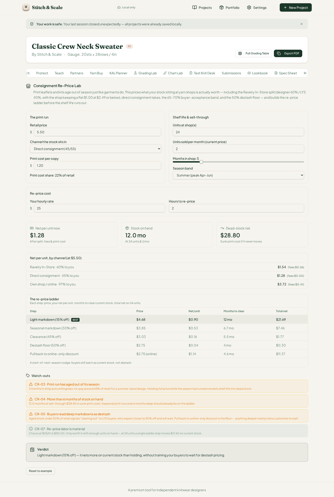
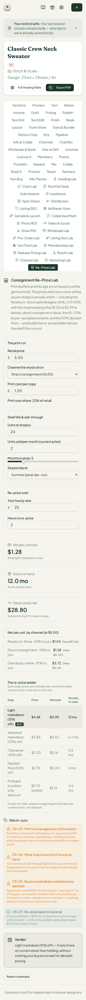

# QA Report — Cycle 34: Consignment Re-Price Lab (CHK-065)

**Date:** 2026-08-14 · **Reviewer:** This report is addressed to the Reviewer. The Coder should not act on this report unless the Reviewer explicitly instructs them to.
**Scope:** CHK-065 — Consignment Re-Price Lab (`src/lib/consignment-reprice-lab.ts`, 63rd workspace tab, tab value `consignment-reprice`)
**Baseline reviewed:** `99ed9525a5cf3ce48089f26129a6abb5dc58edae` (origin/main)

## 1. Baseline verification

The typecheck passed with zero errors, the full Vitest suite ran green at **1244/1244** (CHK-065 contributed 27 new tests in `consignment-reprice-lab.test.ts`), and the production build for `stitch-and-scale` succeeded. The stale Vite dev server was killed and a fresh one started on port 5173 before any browser work, per the playbook. No `src/` files were modified; all QA artifacts live under `qa/` on the new branch `qa/manus-2026-08-14-cycle34`.

## 2. What was tested

The engine was first re-implemented independently in Python (the Ravelry In-Store split with its $2.49 split cliff and flat $1.00 shop keep, the 45/55 direct-consignment take, the 97/3 own-shop channel, the 65–70% willingness-to-pay band with its month-based uplift multipliers, the 50% destash floor, the hold-step skip logic, and the verdict ladder) and every expectation was computed there. The app was then exercised in the sandbox browser with the established seeded state (localStorage settings + IndexedDB projects) and every rendered number was compared against the independent computation, cent by cent.

The card's inputs are retail price, channel select, print cost per copy, units at shop(s), units sold per month, a **Radix slider** for months in shop (0–24), season band, hourly rate, and hours to re-price. One technical note for the record: the months slider does not respond to synthetic keyboard `ArrowRight` events dispatched by QA automation (Radix's handler never fires; only the native input's built-in +1 step fires). It responds correctly to real pointer drags, so the sweep used genuine click-and-drag on the thumb — the same gesture an actual user would make. This is not an app defect, but the note is preserved in the automation history.

## 3. Results — BEFORE defaults

Card defaults are `$8.00` retail, Ravelry In-Store (60/40), `$1.50` print cost, 30 units, 3/month sell-through, 2 months in shop, winter band, $25/hr, 2 hours. Every rendered figure matched the independent recompute exactly:

| Rendered value | Engine / Python recompute | Match |
| --- | --- | --- |
| Net per unit now $2.59 (fees $0.71) | 60% of $8.00 − 9.5% fees − $0.25 − $1.50 | Exact |
| Direct consignment net $2.10 (fees $0.00) | 45% of $8.00 − $1.50 | Exact |
| Own shop/online net $5.78 (fees $0.48) | 97% of $8.00 − 3% fees − $0.25 − $1.50 | Exact |
| Stock on hand 10.0 mo | 30 ÷ 3 | Exact |
| Dead-stock risk $45.00 | 30 × $1.50 | Exact |
| Hold full price BEST $77.82 | 30 × $2.59 | Exact |
| Light 15% $58.27 · Seasonal 30% $21.94 · Clearance 45% $8.95 · Destash 50% $4.22 · Pullback $24.16 | — | All exact |

Flags CR-04-warn (10.0 months of stock), CR-05 (pullback-to-online as the destash floor), and CR-07 (re-price labor materiality: 2 hours × $25 = $50.00) all fired with correct thresholds and copy; the verdict read **"Hold the price — the season still pays for it."** The channel select labels honestly state the splits (60/40, 45/55, 97/3). Print cost share correctly displayed "19% of retail".

## 4. Results — AFTER edits

**Aged 7-month winter stock (24 units, 2/month, 7 months, winter).**

The Hold step was correctly removed from the ladder (stock aged out of its season: age > 3 months past season band). Light markdown (15% off) became BEST at **$46.62** — 24 × $1.94 — with Seasonal at $18.07 and Clearance at $7.03, all exact. Stock on hand shows 12.0 mo and dead-stock risk $36.00, both exact. CR-03 (aged out of season), CR-04, and CR-05 fired; the verdict climbed to "Light markdown (15% off) — it nets more on current stock than holding, without training your buyers to wait for destash pricing."

**The $2.49 split cliff (retail $2.49, print $1.20, 2 months).**

Every ladder step nets negative (Hold −$2.44 best of a bad set; Light −$10.55; Seasonal −$10.89; Clearance −$12.27; Destash −$9.83; Pullback −$2.79 — all exact), and the current net per unit displays **$−0.10**. CR-01 fired with the precise cliff explanation ("at $2.50 it would net $−0.09. A quarter bump earns more than it loses"), alongside CR-02, CR-04, CR-05, CR-07, and CR-08 (print cost eats more than 25% of retail: 48%). The ladder still marks Hold BEST, and the verdict honestly reads "Markdown now — the current price nets $−0.10/unit. Hold full price is the best move on the stock you have."

**Zero sell-through (own shop, $6.00, 40 units, 0/month, 4 months, summer).**

The stat box correctly renders "Stock on hand — (not moving)" and dead-stock risk $60.00. CR-04 fires at critical severity: "No current sell-through — units are not moving … Mark down or pull-back now." Every ladder step shows $0.00 total net, which is mathematically correct given zero sell-through — but the ladder still marks "Light markdown (15% off)" as BEST and the verdict says "Light markdown (15% off) — the critical flags say the current setup is losing money or shelf life. Re-price rather than hope." See **Issue #45** below: the BEST label on a row whose total is $0.00 is misleading in this exact edge case.

**Direct consignment channel ($5.50, 24 units, 2/month, 5 months).**

Direct consignment net $1.28 (fees $0.00) with Light 15% BEST at **$4.68 / $0.90 / 12 mo / $21.69** — all exact — and the comparison table re-renders at $5.50 across all three channels. CR-03, CR-04, CR-05, and CR-07 fired with correct thresholds; the verdict again lands on the light-markdown rung.

**Phone check (375 × 812).**

The card stacks cleanly to a single column on the phone viewport: inputs, stat boxes, channel comparison, ladder table, watch-outs, and verdict all render without clipping, overlap, or horizontal overflow.

## 5. Verdict tiers and flags exercised

Across the five states the verdict ladder demonstrated four distinct rungs (hold, light-markdown, markdown-now, re-price-rather-than-hope), and ten distinct flag codes fired (CR-01 through CR-08 plus CR-03/CR-04 variants) each with copy that correctly restated the offending input. The hold-step skip rule (season turned or stock aged out) was verified in three of the four edited states, including the case where hold is the only step and is legitimately retained (AFTER-2) and where it is correctly removed (AFTER-1/3/4).

## 6. Issue opened

**Issue #45 (INFO, minor)** — When sell-through is zero, every ladder step shows $0.00 total net and "Light markdown (15% off)" is still marked BEST; the verdict then recommends a light markdown that recovers nothing. The math is internally consistent (sell = ceil(0 × any months) = 0), but the display suggests the recommended step "nets more" when all steps net nothing. Suggested framing for the Reviewer: mark the ladder "No step moves stock at zero sell-through — consider pull-back or destash" rather than crowning a $0.00 BEST. No code changes were made; the issue is addressed to the Reviewer with the label `qa-report`.

## 7. Branch and state

All report artifacts and the six PNG screenshots (`c34-01` through `c34-06`) were committed to `qa/manus-2026-08-14-cycle34` only. Local `main` was left untouched and reset to `origin/main`. `last-reviewed-sha.txt` now records `99ed9525a5cf3ce48089f26129a6abb5dc58edae`. No newer commits exist on main at the time of this cycle, so the next scheduled cycle will report "nothing new" unless the Coder pushes again.
