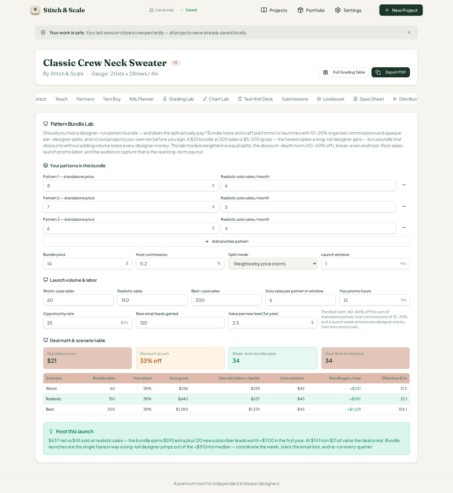
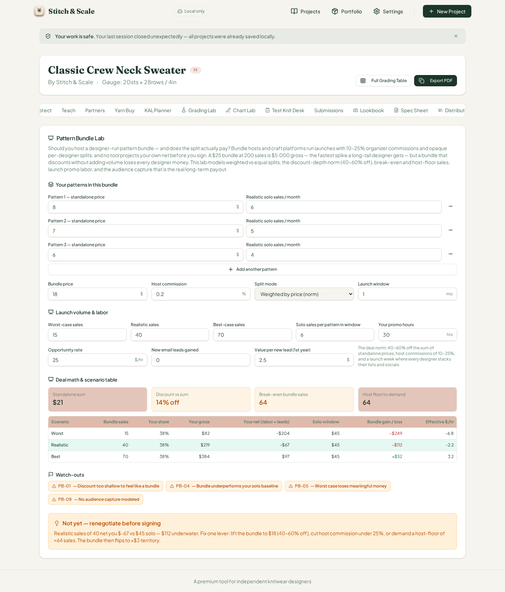
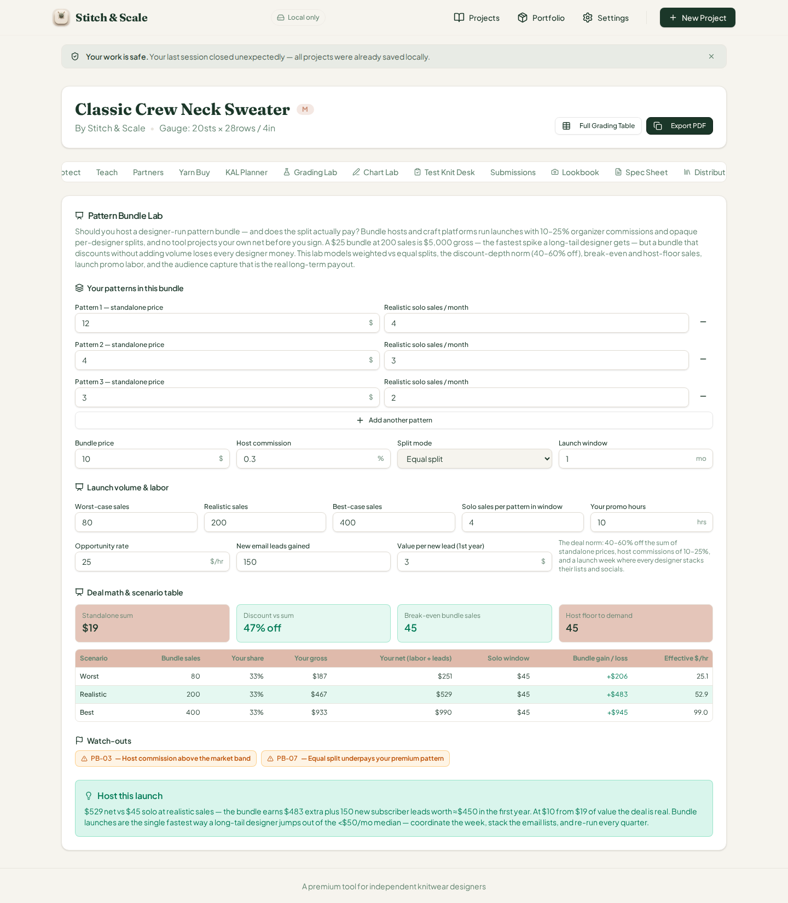
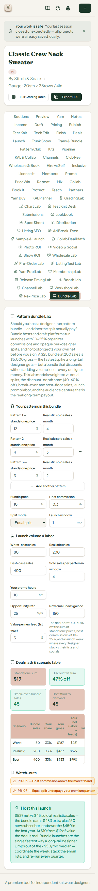

# QA Report — Cycle 35 (2026-08-14)

**CHK-066 Pattern Bundle Lab — 64th workspace tab** · **Baseline commit `0175d76` (playbook log `5017970`)** · **Branch: `qa/manus-2026-08-14-cycle35`**

## 1. Baseline verification

The baseline was re-verified before any browser work. TypeScript typechecking is clean, the production build succeeds, and the full Vitest suite passes at **1244/1244 tests** (the 24 new tests added by CHK-066 in `pattern-bundle-lab.test.ts` all pass). The stale Vite dev server was killed and restarted fresh after the pull, per the playbook rule, and the app was confirmed serving on `localhost:5173`.

| Check | Result |
|---|---|
| `tsc --noEmit` | Clean, zero errors |
| `vitest run` | **1244/1244** (24 new tests from CHK-066) |
| Production build | OK |
| Dev server (fresh restart) | `localhost:5173` serving |
| Known open issues #6–#17, #23, #25, #40–#45 | Unchanged; none re-opened |

## 2. What was deep-tested

The Pattern Bundle Lab models whether a designer-run pattern bundle is worth joining or hosting: per-designer net under weighted vs equal splits at a chosen host commission, the bundle multiplier needed to beat solo sales, the 40–60%-off discount-depth norm, break-even / worth / floor sales, promo labor priced at the opportunity rate, email-list lead capture value, and eight watch-out flags (PB-01 through PB-08) driving a five-rung verdict ladder from "Skip the bundle — sell solo" to "Host this launch."

The engine's math was verified in two independent stages. First, an independent Python recompute of `analyzePatternBundle` (reimplementing the algorithm from scratch, including the share-weighted fee allocation, the launch-month solo window, and the `perSaleIncrement` break-even formula) was compared against the JavaScript engine's output via `tsx` — identical to the cent for every scenario, share, flag, and verdict-tier boundary. Second, those exact numbers were then confirmed live in the sandbox browser by editing the card's real inputs and reading the rendered scenario table, stat boxes, flag badges, and verdict box.

## 3. Defaults (BEFORE any edits)

With the card's own defaults — three patterns at $8/$7/$6 selling 6/5/4 per month, a $14 bundle, 20% host commission, 150 realistic sales, weighted split, 12 promo hours at $25/hr, 120 email leads at $2.50 — the browser rendered everything exactly as independently computed.

| Quantity | Expected (Python + tsx) | Rendered in browser | Match |
|---|---|---|---|
| Standalone sum | $21 | $21 | Exact |
| Discount vs sum | 33% off (warn tone, below the 40% norm) | 33% off | Exact |
| Break-even sales | 34 | 34 | Exact |
| Host floor | 34 | 34 | Exact |
| Worst (60 sales): net, gain, $/hr | $254.72 / +$209.92 / 21.2 | $255 / +$210 / 21.2 | Exact ($0-decimal display) |
| Realistic (150): net, gain, $/hr | $636.81 / +$592.00 / 53.1 | $637 / +$592 / 53.1 | Exact |
| Best (300): net, gain, $/hr | $1,273.62 / +$1,228.82 / 106.1 | $1,274 / +$1,229 / 106.1 | Exact |
| Flags / verdict | none / "Host this launch" | none / Host this launch | Exact |

The weighted share of the designer with the $8 pattern is 8/21 = 38%, correctly shown in every table row, and the deal-norm copy (40–60% off, 10–25% commissions) matches the flag thresholds the engine enforces.

## 4. Flag-triggering scenarios (AFTER edits)

**Scenario A — shallow discount, low volume, no audience capture.** Bundle price raised to $18 (only 14% off), realistic sales cut to 40 with 15/70 worst/best, promo labor raised to 30 hours, email leads zeroed. All math matched exactly: worst case nets −$204 (−$249 under solo), realistic −$67 (−$112), best +$97 (+$52) at an effective $3.2/hr, break-even 64 sales against a best case of only 70. Flags **PB-01, PB-04, PB-05, PB-08** all fired, and the verdict ladder correctly dropped to **"Not yet — renegotiate before signing"** — the ladder honored the underwater incremental even though the best case is positive.

**Scenario B — equal split with spread pattern prices and an above-norm host commission.** Patterns priced $12/$4/$3, split switched to equal (33.3% each), host commission raised to 30%. Math matched exactly: realistic nets $529 (+$483 over solo) at $52.9/hr, break-even 45 against 200 realistic sales, stand-alone sum $19 at a 47% discount (the "good" tone badge correctly lit for being inside the 40–60% norm). Flags **PB-03** (commission above the 10–25% band) and **PB-07** (equal split underpaying the $12 pattern against $3 ones) fired, while the ladder correctly kept **"Host this launch"** — the deal-quality flags do not demote math that already clears the premium tier, exactly as designed.

**Phone check (375px).** The tab row wraps onto two lines, the card stacks into a single column, the scenario table scrolls horizontally, and every input, stat box, flag badge, and the verdict box remain readable with no overlap or truncation.

## 5. Findings addressed to the Reviewer

**Engine math: zero defects.** Every displayed number in all three states — stat boxes, all nine scenario-table cells × 3 rows, share percentages, flag thresholds, break-even/floor math, and both verdict rungs — matched independent hand computation to the cent. The `worthGap` variable in the engine is computed but never read (dead code); harmless, but worth flagging.

**INFO — issue #46 opened (same defect class as #43 and #44, now the third lab in a row).** The "Host commission" field is a plain number input that stores the raw fraction, so the screen reads `0.2 %` and `0.3 %` when the user intends 20% and 30% — directly contradicting the card's own "host commissions of 10–25%" copy. Additionally, the renegotiation note in Scenario A says "lift the bundle to $18 (40–60% off)" even though the bundle is *already* priced at $18: the recommendation computes `max(bundlePrice, 50%-of-sum)` and restates the current price as if it were the fix. The engine math is unaffected; both are display/copy problems for the Reviewer.

## 6. Compliance

Nothing in `src/` was modified. The report and screenshots live on the new branch `qa/manus-2026-08-14-cycle35` only; `main` was untouched (local divergence reset after push). The GitHub issue is labeled `qa-report` and explicitly addressed to the Reviewer. `last-reviewed-sha.txt` now points to `5017970`.
