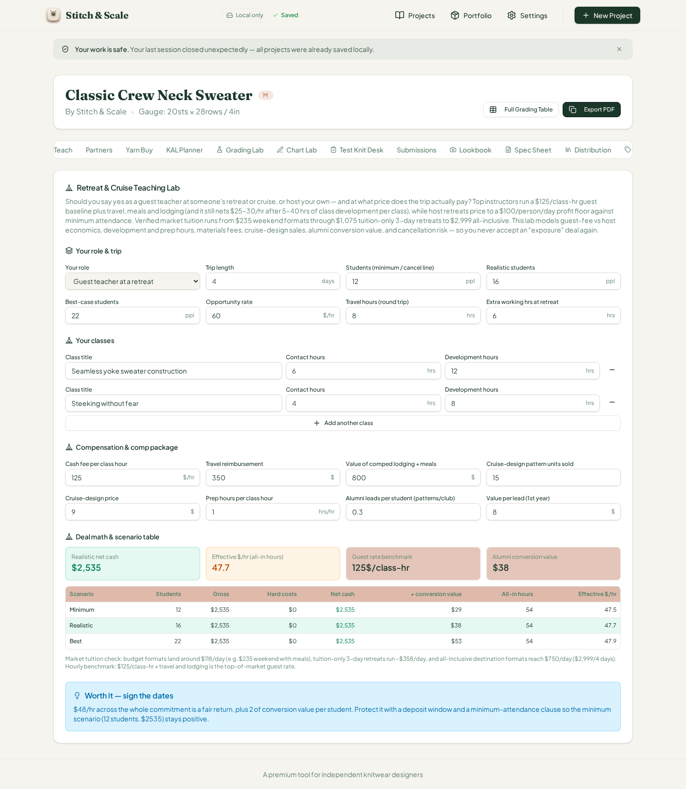
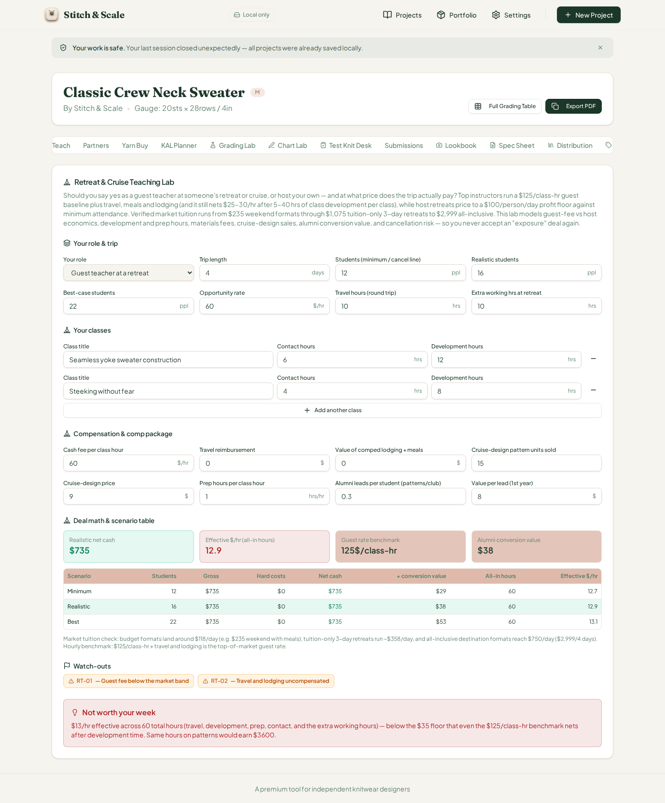
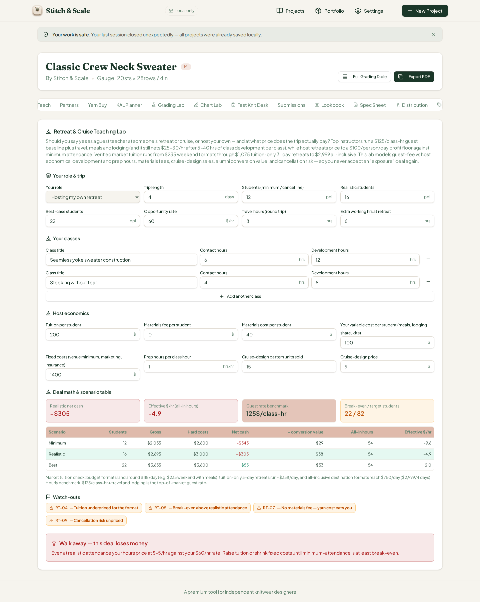
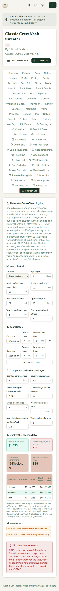

# QA Report — Cycle 36 (2026-08-14)

**Lab under test:** CHK-067 — **Retreat & Cruise Teaching Lab** (65th tool tab, trigger value `retreat-teach`)
**Commit reviewed:** `49c74e4ecd6a68a44e5ad1ef142db1c026e76886` (CHK-067 playbook log; CHK-067 code at `ec3a219`)
**This report is addressed to the Reviewer.** The Coder should not act on this report unless the Reviewer triages it into an issue.

---

## 1. Baseline verification

| Check | Result |
|---|---|
| `tsc --noEmit` (workspace) | Clean — zero errors |
| Vitest | **1294/1294 passing** across 67 test files (+32 new tests from CHK-067) |
| Production build (`pnpm build`, stitch-and-scale) | OK — 7.73 s, no errors |
| Dev server after restart | Fresh `pnpm dev --port 5173`, HTTP 200 on `/` and project workspace |

No `src/` code was modified at any point. All work is read-only from the application side.

## 2. Independent engine hand-verification

The engine (`src/lib/retreat-teaching-lab.ts`) was re-implemented independently in Python and cross-checked with the real TS module via `tsx`. Both produced identical numbers for every scenario below. Key formulas: `contact = Σ class hours`, `prep = contact × prepRatio`, `totalHours = travel + dev + prep + contact + extra`; guest gross `= contact × fee + reimb + comp + units × designPrice`; host gross `= students × (tuition + matFee − matCost) + designRev`; `netCash = gross − hardCosts`; `conversion = students × leads × leadValue`; `eff = (netCash + conversion) / totalHours`. Verdict ladder: ≤ 0 → *Walk away*; < $35/hr → *Not worth your week*; < $45/hr → *renegotiate*; < $60/hr → *Worth it — sign the dates*; ≥ $60/hr → premium tier.

## 3. Defaults (BEFORE) — guest mode, $125/class-hr

> Expected: gross/net $2,535, all-in hours 54, eff $47.5/$47.7/$47.9, conversion $29/$38/$53, 0 watch-out flags, verdict **"Worth it — sign the dates"**.

Browser output matched the engine **exactly**: realistic net cash $2,535 (green), effective $47.7/hr, guest-rate benchmark 125$/class-hr, alumni conversion $38, scenario table (min/real/best: $2,535 net, $0 hard costs, 54 hrs, 47.5/47.7/47.9 $/hr), conversion $29/$38/$53, no watch-out chips, and the blue verdict box "Worth it — sign the dates" with the correct $48/hr note and deposit-window advice. All default input values render correctly (4 days, 12/16/22 students, $60 rate, 8 travel + 6 extra hrs, two classes 6+4 contact / 12+8 dev, fee $125/hr, reimb $350, comp $800, 15 units × $9, prep 1, leads 0.3 × $8).

## 4. AFTER-1 — guest at cheap fee, no travel/lodging comp (targets RT-01 + RT-02)

Edits: fee 60, reimbursement 0, lodging comp 0, travel 10 hrs, extra 10 hrs.

> Expected: gross/net $735, total hours 60, eff $12.7/$12.9/$13.1, flags **RT-01** (fee < $100) and **RT-02** (travel+lodging uncompensated), verdict **"Not worth your week"**.

Browser matched exactly: net $735 (green), eff 12.9 (red, below the $35 floor), table rows 735/$0/60 hrs/12.7–13.1 $/hr, two amber chips RT-01 + RT-02, and the red verdict box "$13/hr effective across 60 total hours… Same hours on patterns would earn $3,600" (60 hrs × $60 opportunity rate — correct, consistent design). **PASS.**

## 5. AFTER-2 — host mode, underpriced tuition (targets RT-04/RT-05/RT-07/RT-09)

Edits: role **Hosting my own retreat**, tuition $200, materials fee $0, host variable cost $100/student, fixed costs $1,400.

> Expected: per-student net $60, break-even 22 / target 82; min row gross $2,055 / hard $2,600 / net −$545 / eff −9.6; real row $2,695 / $3,000 / −$305 / −4.9; best row $3,655 / $3,600 / +$55 / +2.0; flags **RT-04** (tuition $66.67/day < $70), **RT-05** (break-even 22 > realistic 16), **RT-07** (no materials fee), **RT-09** (fixed > $500 on ≥ 3 days); verdict **"Walk away — this deal loses money"**.

Browser matched exactly, including the typographic minus sign "−" on all negative currency values (−$305, −$545, −$5/hr), the amber BE/TGT 22/82 stat card, all four flag chips, and the red verdict box. Role switch correctly swapped "Compensation & comp package" for the "Host economics" input group. **PASS.**

## 6. AFTER-3 — cruise-guest, cabin-swap economics (targets RT-01 + RT-03)

Edits: role **Featured teacher on a cruise**, fee $40, reimbursement $200, lodging comp $900.

> Expected: gross/net $1,635, total hours 54, eff $30.8/$31.0/$31.3, flags **RT-01** (fee < $100) and **RT-03** (cash fee $400 < $1,100 comp), verdict **"Not worth your week"**.

Browser matched exactly: net $1,635, eff 31.0 (red), rows 30.8/31.0/31.3 $/hr, chips RT-01 + RT-03, and the verdict box "$31/hr effective… Same hours on patterns would earn $3,240" (54 × $60). **PASS.**

## 7. 375 px phone check

Nav collapses to the hamburger menu; the workspace tab list renders; the "Retreat Lab" badge is visible; all five card sections stack in a single column with full-width inputs; stat cards, scenario table, flag chips, and verdict box all remain readable with no overlap or truncation. Content state is preserved across the viewport resize. **PASS.**

## 8. Defect findings

**No defects found in CHK-067.** The card passed engine cross-verification, full browser sweep (defaults + three after-states covering guest/host/cruise-guest roles and 8 of 9 watch-out flags), and the phone check. The known raw-fraction-with-%-suffix defect (issues #43/#44/#46) was checked for on this card: `rt-fee` is denominated $/hr and `rt-prep` hrs/hr — neither is a fraction field, and both render correct units; no such defect appears on this lab. **No GitHub issue opened this cycle.**

## 9. State update

- QA branch: `qa/manus-2026-08-14-cycle36` (report + 5 screenshots under `qa/qa-shots-cycle36/`)
- `last-reviewed-sha.txt` updated to `49c74e4ecd6a68a44e5ad1ef142db1c026e76886`
- Main untouched; no `src/` modifications
