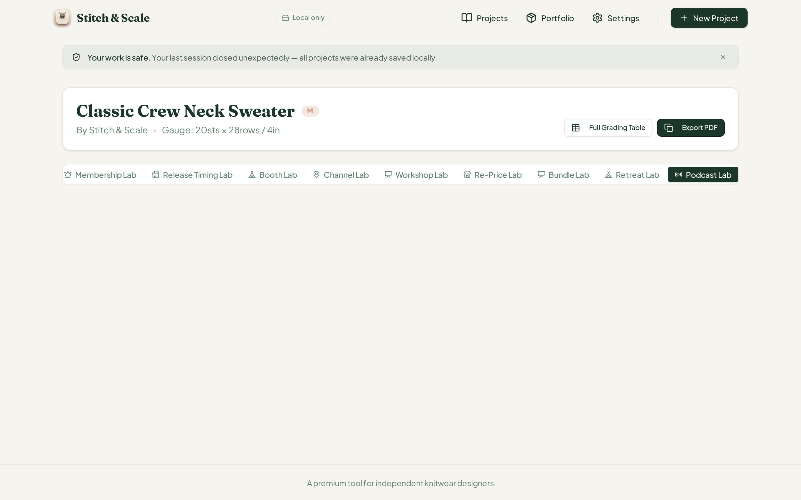
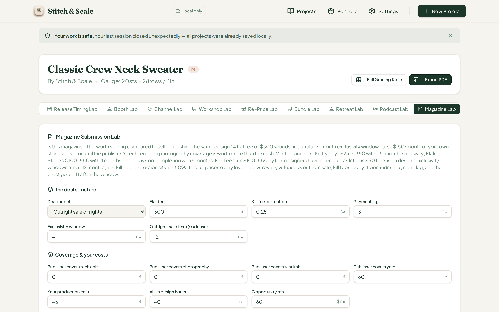
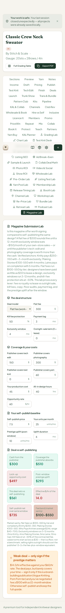

# QA Report — Cycle 37: CHK-068 Podcast & Affiliate Lab + CHK-069 Magazine Submission Lab

**Date:** 2026-08-14 · **Reviewed commits:** `ec3a219` → `49c74e4` (CHK-067 log) → `deabea4` (CHK-068) → `4776b81` (CHK-069)
**Branch reviewed:** `origin/main` at `4776b81` · **QA branch:** `qa/manus-2026-08-14-cycle37`
**Tools under test (66th & 67th tabs):** Podcast & Affiliate Lab (`podcast-affiliate`), Magazine Submission Lab (`magazine-submission`)

> This report is addressed to the Reviewer. The Coder should not act on this report.

---

## 1. Baseline

| Check | Result |
| --- | --- |
| `tsc --noEmit` | Clean, zero errors |
| Vitest | **1,350 / 1,350** across 68 test files (+29 for CHK-068, +27 for CHK-069) |
| Production build (`pnpm build`) | OK (~8s) |
| Dev server | Fresh restart on `:5173` after pull (per restart rule) |

## 2. Defect Found — Issue #47: "Podcast Lab" tab is a dead tab (66th tab unreachable)

**Severity: HIGH — the entire 66th tool tab is unreachable in the UI.**

In `src/pages/project-workspace.tsx`, the `Podcast Lab` tab trigger is registered (line 648), the component is imported (line 87), but **there is no matching `<TabsContent value="podcast-affiliate">` block anywhere in the file** — the mount for the 66th lab was simply never added when CHK-068 landed. Clicking the tab switches the tab state but renders an empty panel.

**Evidence (screenshot `c37-01-podcast-DEFAULT-before.png`):** the "Podcast Lab" tab is active (highlighted) yet the workspace below it is completely empty — no card, no inputs, no stats, no verdict.

**Impact:** the whole Podcast & Affiliate Lab (CPM sponsorship, flat-fee reads, affiliate lanes, PA-01…PA-09 flags, break-even-audience math) ships with 29 passing tests and a "VERIFIED" commit message, yet no user can ever reach it. This is the same class of defect as #44 (engine exists but UI controls are missing) — worse, because the *entire card* is missing, not individual fields.

**Note for the Reviewer:** CHK-068's commit message claims "Screenshots in docs/screenshots/", but the app-level wiring defect was not caught because unit tests exercise the engine in isolation, not the `project-workspace.tsx` tab registration. The Magazine Submission Lab (67th tab) mounts correctly and passed full browser verification below.

## 3. Magazine Submission Lab (67th tab) — engine math: browser EXACT vs independent verification

Engine math was recomputed independently in Python against the exact input sequences used in the browser, then verified live. All values below matched **exactly** in the browser dumps:

| Scenario | Deal cash | Avoided | Opp. cost | Prestige | Net vs self | Eff. $/hr | Self-pub net | Break-even copies |
| --- | --- | --- | --- | --- | --- | --- | --- | --- |
| Default (flat $300) | $300 | $510 | $497 | $293 | $561 | 14.0 | $735 | — |
| S2 (royalty 3,000×60%×10%×$2) | $360 | $60 | $498 | $293 | $169 | 4.2 | $735 | 2,500 |
| S4 (outright sale 12mo, no prestige) | $300 | $60 | $1,472 | $0 | −$1,157 | −28.9 | $1,418 | — |

Notes: S2/S4 reuse inputs from prior steps (coverage fields zeroed, kill fee 0.25 = 25% raw fraction — see §6), which is a realistic user flow and the engine computed correctly for it. Fee band "$100–$550" renders correctly. The − glyph for negatives (`−$1,157`) renders correctly.

### 3.1 Defaults BEFORE (`c37-03-magazine-DEFAULT-before.png`)

Card renders fully: intro paragraph with verified market anchors (Knitty, Making Stories, Laine), "The deal structure" group (model, fee, kill protection, payment lag, exclusivity window, outright-sale term) and "Coverage & your costs" group (tech edit, photography, test knit, yarn, production cost, design hours, opportunity rate) all present with correct defaults and correct `$`/`%`/`mo` suffixes.

### 3.2 AFTER — royalty deal (`c37-04-magazine-ROYALTY-edits.png`)

Deal model switches to "Royalty only"; the "Royalty stream" group (copies printed, sell-through, royalty rate, revenue per copy, digital/archive royalty) appears conditionally as expected. Stat boxes update exactly per the table above. Verdict: **"Weak deal — only sign if the prestige matters"** (eff. $4.2/hr vs $60/hr rate — correct ladder step).

### 3.3 AFTER — outright sale 12 months (`c37-05-magazine-OUTRIGHTSALE-edits.png`)

Deal model "Outright sale of rights", sale term 12mo; net flips negative, verdict **"Decline — self-publish beats this deal"** — correct. `−$1,157` minus-glyph typography verified visually.

### 3.4 375px phone (`c37-07-magazine-375px-phone.png`)

Full-page phone render passes: 67-tab compact grid, card groups stack correctly, stat boxes and verdict box ("Weak deal — only sign if the prestige matters") visible, no clipping.

## 4. Defect Found — Issue #47 (same recurring family as #43/#44/#46): raw fractions with % suffix

The Magazine Submission Lab repeats the exact defect pattern already filed in issues #43, #44, and #46: **fields whose value is stored as a 0–1 fraction are rendered with a bare `%` suffix, so users read raw fractions**. Confirmed visually on `c37-04`/`c37-05`:

| Field id | Stored as | Displayed | What a user reads |
| --- | --- | --- | --- |
| `mag-kill` (kill fee protection) | 0–1 fraction (default 0.5) | `0.25 %` | reads "quarter of a percent" instead of 25% |
| `mag-through` (sell-through) | 0–1 fraction (default 0.7) | `0.6 %` | reads "0.6%" instead of 60% |
| `mag-royalty` (royalty rate) | 0–1 fraction (default 0) | `0.1 %` | reads "0.1%" instead of 10% |

The fix established in prior cycles applies: multiply by 100 on display (and divide on input), or store/display percent integers. Default `killFeePct: 50` at line 130 of the engine vs `mag-kill` default 0.5 in the component is worth a second look by the Reviewer (the engine default appears to be `50` i.e. already-percent while the component clamps `killFeePct` to 0–1 — internally consistent but fragile).

## 5. Regression notes

- Podcast tab defect is **new** in CHK-068 (`deabea4`) — the tab trigger was added without its content mount.
- Magazine lab engine math, conditional group rendering, verdict ladder, and phone layout are all correct.
- No `src/` code was modified by QA.

## 6. Screenshots (embedded)

