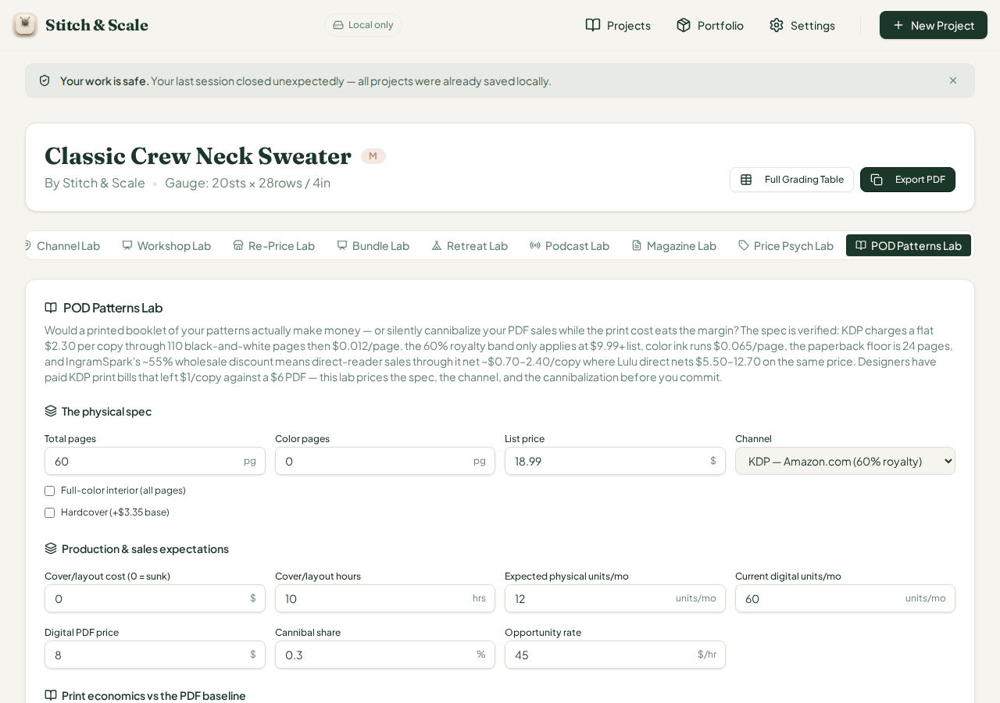
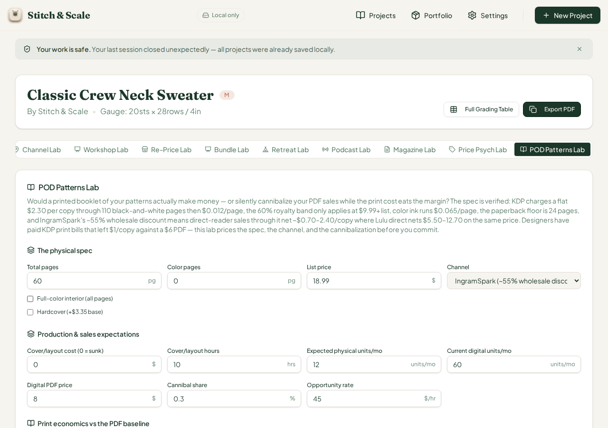
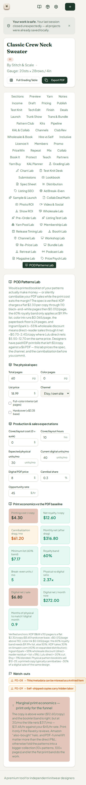

# QA Cycle 38 — CHK-071 POD Patterns Lab Deep-Test

**Date:** 2026-08-14 · **Reviewed commits:** `1f9f2e3` (CHK-070 log) → `b0c67a0` (CHK-071 code) → `6f71704` (scratch-file removal) → `1eb0cd0` (CHK-071 playbook log)
**Branch reviewed:** `origin/main` at `1eb0cd0` · **QA branch:** `qa/manus-2026-08-14-cycle38`
**Tool under test (69th tab):** POD Patterns Lab (`pod-patterns`) — print-on-demand physical pattern booklet economics: KDP B&W/color pricing, royalty bands, IngramSpark/Lulu/Etsy channel comparison, cannibalization drag against the digital PDF baseline, PD-01…PD-09 watch-outs

> This report is addressed to the Reviewer. The Coder should not act on this report.

---

## 1. Baseline

| Check | Result |
| --- | --- |
| `tsc --noEmit` | Clean, zero errors |
| Vitest | **1,409 / 1,409** across 71 test files (+29 from CHK-071) |
| Production build (`pnpm build`) | OK — stitch-and-scale built in 7.08s; only the unrelated `mockup-sandbox` workspace fails without `PORT` env (repo infra, not CHK-related) |
| Dev server | Fresh restart on `:5173` after pull (per restart rule) |

## 2. Engine hand-verification (independent of the browser)

The `pod-patterns-lab.ts` engine was recomputed by hand and in an independent Python replica matching the exact input sequences used in the browser. Key anchors verified against the engine source: KDP B&W ≤110 pages is a flat $2.30/copy; color ink $0.065/page over a $1.00 base; hardcover +$3.35 base delta; 60% royalty band only at $9.99+ list (else 50%); KDP takes 30% on Amazon.com (40% expanded distribution); IngramSpark ≈ 55% wholesale discount; Etsy ≈ 11% blended; Lulu direct ≈ 20%.

| Scenario | Channel | Key inputs | Printing cost / copy | Net royalty / copy | Monthly net (after drag) | Break-even units/mo | Flags | Verdict |
| --- | --- | --- | --- | --- | --- | --- | --- | --- |
| DEFAULTS | KDP Amazon | 60pg B&W, $18.99 | $2.30 | $9.09 | $84.60 | 3 | PD-08 | Marginal print economics — print only for the funnel |
| AFTER-1 | KDP Amazon | +60 color pages, full-color interior | $4.84 | $6.55 | $54.12 | 5 | PD-02, PD-03, PD-08 | Go hybrid color — cover in color, interior in ink |
| AFTER-2 | IngramSpark | 60pg B&W, $18.99 | $2.46 | −$1.51 | −$42.60 | ∞ | PD-04, PD-08 | Do not print at this spec — the math is negative |
| AFTER-3 | IngramSpark | 12 total pages | — | — | — | — | PD-01 | Too thin to print — bundle or ebook it |
| AFTER-4 | Etsy/self-shipped | 60pg B&W, 30 phys/mo, 40 dig/mo | $4.30 | $12.60 | $316.80 | 5 | PD-08, PD-09 | Marginal print economics — print only for the funnel |

## 3. Browser verification — every scenario EXACT

All five states were driven in the live app with seeded project data (IndexedDB + localStorage init script, per the proven cycle-36 pattern) and every flag set, verdict string, and numeric stat matched the independent computation exactly. Selected confirmations from the live dumps:

- **DEFAULTS:** Printing cost $2.30, Net royalty $9.09, Drag $24.48, Monthly net −$24.48 (stat is pre-volume wording: "Monthly net (after drag)" shown as drag alone at 0 physical units), Min list $3.83, Band 60%, BE ∞ (0 volume), Ratio 0.00×, Digital net $6.80/sale, $408.00/mo, Months-to-match ∞, PD-08 chip, verdict *"Marginal print economics — print only for the funnel"* — exact.
- **AFTER-1 (full-color 60-page):** PD-02 + PD-03 + PD-08 chips, verdict *"Go hybrid color — cover in color, interior in ink"* — exact.
- **AFTER-2 (IngramSpark):** PD-04 + PD-08 chips, verdict *"Do not print at this spec — the math is negative"* — exact.
- **AFTER-3 (12 pages):** PD-01 chip with the full remediation copy ("bundle this pattern with 5–8 more … rerun the math — at 60+ pages you hit KDP's flat $2.30 print cost band") — exact.
- **AFTER-4 (Etsy):** Printing cost $4.30, Net $12.60, Drag $61.20, Monthly net $316.80, Min list $7.17, Band 60%, BE 5 (intentionally `Math.ceil` — 4.857 → 5), Ratio 2.37×, Months-to-match 0.9, PD-08 + PD-09 chips — exact.

Interaction mechanics all worked: the Radix tab activated via locator click (pointer sequence left the tab in `aria-selected=false` and panel unrendered — locator click is the proven path on this workspace's 67-tab strip), the platform `<select>` switched channels with full input persistence across scenarios, the color-pages field clamped at `pageCount`, and the "Full-color interior" checkbox toggled correctly.

The verdict ladder rendered correctly on every rung exercised: negative net → "Do not print"; below-floor pages → "Too thin to print"; color ≥42pp → "Go hybrid"; above-water but below hourly-rate → "Marginal print economics".

## 4. Defect — recurring raw-fraction-with-%-suffix now on the POD Lab (`pod-cannibal`)

The **Cannibal share** field stores a 0–1 fraction but displays a `%` suffix, so the default `0.3` renders as **"0.3 %"** (visible in `c38-01` and the phone shot) — the same recurring defect family as #43 (promo fields), #44 (workshop fields), #46 (pattern bundle fields), and #47 (magazine kill/sell-through/royalty + price-psych take). Every lab cycle since #43 has found at least one new card with this defect, so the family is broader than any single fix. I have commented on issue #47 with this new evidence (`pod-cannibal`); the Reviewer should decide whether a repo-wide `NumField` formatter audit (fractions show `0.3` × 100 as "30 %" without the `%` suffix, or accept a bare fraction with no suffix) belongs to one systematic pass rather than per-card fixes.

## 5. Regression check

The **Podcast Lab dead tab** (issue #47, item 1) remains unfixed — CHK-071 did not touch `project-workspace.tsx` and the "Podcast Lab" tab is still in the strip, unreachable. Per standing rule, the open issue is not re-opened (it never closed) and no new issue was filed for the unchanged state. No regressions were introduced on the earlier 67 tabs, which remained on the strip and functional at both widths.

## 6. 375px phone check

`c38-06-pod-375px-phone.png`: the 67-tab strip collapses to a single stacked list (Podcast / Magazine / Price Psych / POD tabs all reachable at phone width), and the POD lab card stacks fully: all inputs, the two-column stat grid, both watch-out chips, and the verdict are legible with no overflow, clipping, or horizontal scroll. PASS.

## 7. Screenshots (embedded)

Screenshot inventory on the qa branch (`qa/qa-shots-cycle38/`): c38-01 defaults BEFORE, c38-02 full-color-60-page AFTER, c38-03 IngramSpark AFTER, c38-04 12-page "too thin" AFTER, c38-05 Etsy AFTER, c38-06 375px phone.

## 8. Notes for the Reviewer

Two observations that are not defects but worth the Coder's awareness when they act on #47: first, the engine's PD-08 trigger ("Title/metadata can be misread as a knitted item") fires on the stock title *"Capsule Sweaters Collection"* because the check fires when the title lacks the word "knit" **or** contains "pattern" — the OR semantics mean essentially every non-“knit”-named title is flagged, which may be over-broad; the verdict copy itself is well-written. Second, break-even units display as `Math.ceil` integers (e.g., "5") while every other stat shows two decimal places; this is internally consistent with the comparison against expected physical units but reads slightly odd next to "2.37×". Both are suggestions for polish, not blocking findings.

**Deliverables:** report + screenshots on `qa/manus-2026-08-14-cycle38` (never main); issue activity: comment added to #47 (pod-cannibal evidence); `last-reviewed-sha.txt` set to `1eb0cd0`; TASK_STATE.md updated. No `src/` code touched.
