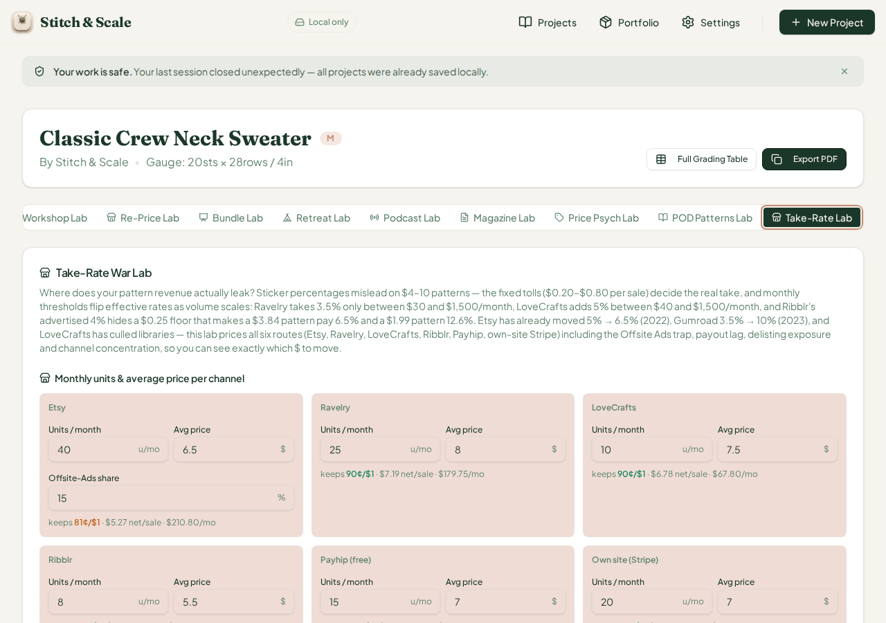
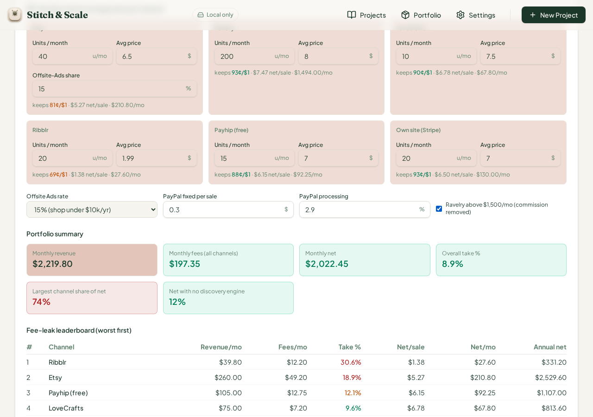
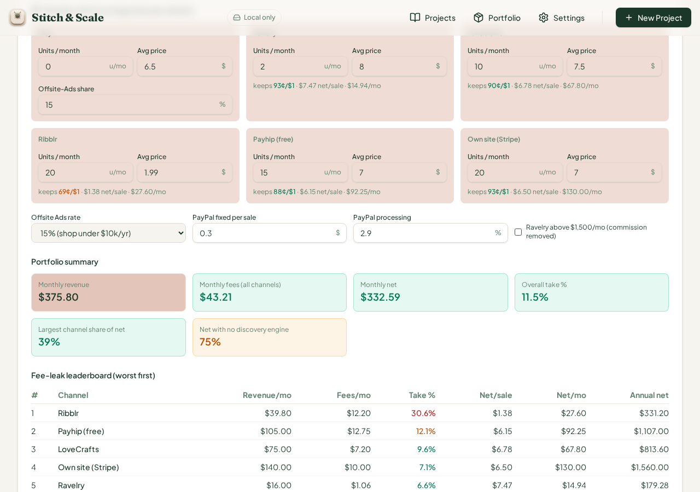
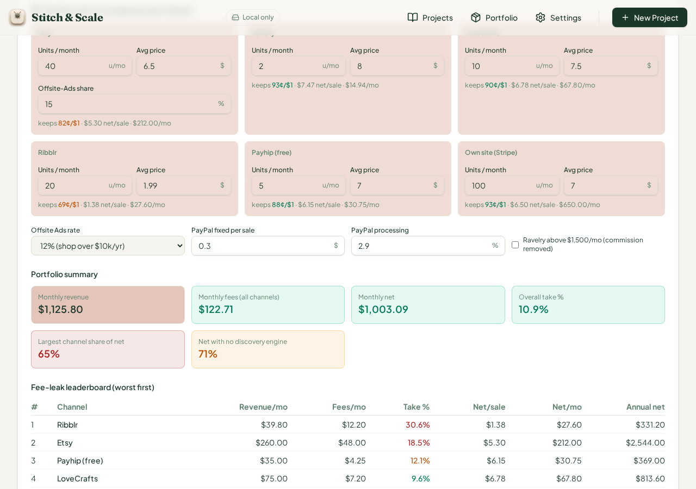
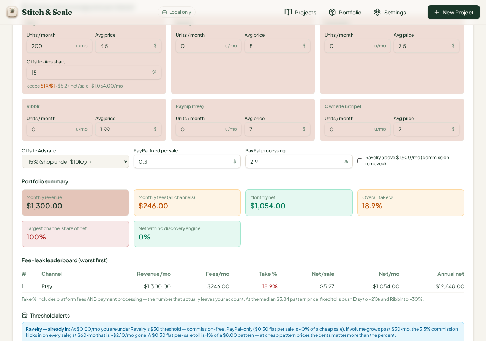
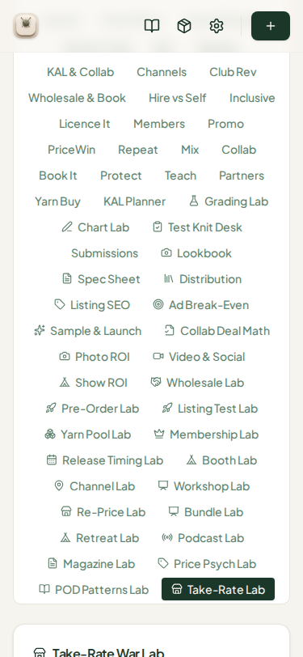

# QA Cycle 39 — CHK-072 Take-Rate War Lab (70th tab)

**Date:** 2026-08-14 · **Reviewed commits:** `a2a0faf` (CHK-072 Take-Rate War Lab code) → `1fde947` (scratch-file removal) → `4f84c6b` (CHK-072 playbook log)
**Branch reviewed:** `origin/main` at `4f84c6b` · **QA branch:** `qa/manus-2026-08-14-cycle39`
**Tool under test (70th tab):** Take-Rate War Lab (`marketplace-takerate`) — six-channel pattern revenue fee math: Etsy, Ravelry, LoveCrafts, Ribblr, Payhip, own-site Stripe; per-sale and per-month fee schedules with fixed tolls, payout lags, offsite-ads trap, Ravelry/LoveCrafts monthly thresholds, channel concentration, discovery-free share, TR-01…TR-09 watch-outs, and a four-rung verdict ladder.

> This report is addressed to the Reviewer. The Coder should not act on this report.

---

## 1. Baseline

| Check | Result |
| --- | --- |
| `tsc --noEmit` | Clean, zero errors |
| Vitest | **1,431 / 1,431** across 72 test files (+22 from CHK-072) |
| Production build (`pnpm build`) | OK — stitch-and-scale built in 7.44s; only the unrelated `mockup-sandbox` workspace fails without `PORT` env (repo infra, not CHK-related) |
| Dev server | Fresh restart on `:5173` after pull (per restart rule) |

## 2. Engine hand-verification (independent of the browser)

The `marketplace-takerate-lab.ts` engine was recomputed independently in Python (file `handcheck_tr39.py`) and then cross-checked by running the real engine function directly under tsx with the exact cumulative input sequences used in the browser. Fee schedule anchors verified against the engine source: Etsy $0.20 listing + 6.5% transaction + 0.21% regulatory + 3% + $0.25 processing + offsite ads on the ads-share slice; Ravelry 3.5% only between $30 and $1,500/mo with PayPal 2.9% + $0.30; LoveCrafts 2% + $0.20 plus a 5% extra between $40 and $1,500/mo; Ribblr max(4%, $0.25) + Stripe 2.9% + $0.30; Payhip 5% + Stripe; own-site Stripe only (2.9% + $0.30).

| Scenario | Key inputs | Monthly revenue | Monthly fees | Monthly net | Overall take | Concentration | Discovery-free | Verdict |
| --- | --- | --- | --- | --- | --- | --- | --- | --- |
| DEFAULTS | all six channels at stock values | $824.00 | $105.08 | $718.92 | 12.75% | 29% (Etsy) | 36% | Balanced portfolio — protect and grow |
| AFTER-1 | Ribblr $1.99 × 20u (floor test) | $819.80 | $111.60 | $708.20 | 13.6% | 30% | 35% | Move revenue from the leak channel |
| AFTER-2 | Ravelry 200u × $8 + high-tier checkbox | $2,219.80 | $197.35 | $2,022.45 | 8.9% | 74% (Ravelry) | 12% | Move revenue from the leak channel |
| AFTER-3 | Etsy 0u, Ravelry 2u | $375.80 | $43.21 | $332.59 | 11.5% | 39% | 75% | Move revenue from the leak channel |
| AFTER-4 | Own-site 100u, Payhip 5u, ads 12% | $1,125.80 | $122.71 | $1,003.09 | 10.9% | 65% (Own site) | 71% | Move revenue from the leak channel |
| AFTER-5 | Etsy-only 200u × $6.50 | $1,300.00 | $246.00 | $1,054.00 | 18.9% | 100% | 0% | Too dependent on one channel — diversify |

## 3. Browser verification — every scenario EXACT

All six states were driven in the live app with seeded project data (IndexedDB + localStorage init script, per the proven cycle-36 pattern) and every flag set, verdict string, per-channel stat, and leaderboard row matched the independent computation exactly. Selected confirmations from the live panel dumps:

- **DEFAULTS:** Etsy keeps 81¢/$1 · $5.27 net/sale · $210.80/mo at 18.9% take; Ravelry $7.19/$179.75 (10.1% — the $200/mo revenue correctly sits in the "entering" $30–$1,500 commission band); LoveCrafts $6.78/$67.80 (9.6%, 45-day lag); Ribblr $4.79/$38.32 (12.9%, $0.45/sale fixed toll, 30-day lag, TR-08 floor 5%); Payhip $6.15/$92.25 (12.1%); Own site $6.50/$130.00 (7.1%, best margin) — overall take 12.8% displayed (12.75% engine, 1dp display), concentration 29%, discovery-free 36%, leak ranking worst→best Etsy/Ribblr/Payhip/Ravelry/LoveCrafts/Own site, annual nets $2,529.60 … $1,560.00 — all exact. Verdict *"Balanced portfolio — protect and grow"*.
- **AFTER-1 (Ribblr $1.99):** Ribblr take jumps to 30.6% ($1.38 net/sale — the $0.25 floor does its stated work), TR-01 chip added, verdict switches to *"Move revenue from the leak channel — the gap pays for itself"* — exact.
- **AFTER-2 (Ravelry 200u + high tier):** Ravelry at $1,600/mo above the $1,500 ceiling correctly drops to commission-free ($7.47 net/sale), overall take falls to 8.9%, concentration hits 74% → TR-06 fires and the verdict ladder's "conc > 50" rung returns *"Too dependent on one channel — diversify before the next fee hike"* — exact.
- **AFTER-3 (Etsy 0u):** TR-09 correctly fires for the zero-volume Etsy channel with audience; Ravelry at $16/mo correctly renders the "already in: under $30" threshold alert (commission-free, $0.30 flat PayPal toll); verdict switches to *"Move revenue from the leak channel"* — exact.
- **AFTER-4 (concentration + 12% ads):** Own site carries 65% → TR-06; 71% discovery-free → TR-07; Etsy offsite select at 12% updates the TR-02 chip copy ("15% of sales pay 12%") — all exact.
- **AFTER-5 (Etsy-only):** $1,300 revenue / $246 fees / $1,054 net / 18.9% take, 100% concentration → TR-06, offsite leak → TR-02, delisting → TR-04, fee-inflation → TR-05, zero-volume audience channels → TR-09, verdict *"Too dependent on one channel — diversify before the next fee hike"* — exact.

Interaction mechanics all worked: the Radix tab activated via pointer-sequence dispatch, all six units/price inputs and the offsite-ads-share field accepted edits with live recomputation, the offsite-ads-rate `<select>` switched between the 15% and 12% tiers, the high-tier checkbox toggled the Ravelry commission correctly in both directions, and no tab-switch left the panel partially unrendered.

## 4. Fraction-field defect family — Take-Rate Lab is CLEAN

Checked this card specifically for the recurring raw-fraction-with-%-suffix defect (#43/#44/#46/#47 family). The two fraction-stored rate fields are implemented correctly: **Offsite-Ads share** stores 0–1 and displays ×100 with the % suffix (stock 0.15 → "15 %"), and **PayPal processing** stores 0.029 and displays "2.9 %" — both verified in the screenshots at stock and edited values. The Payhip channel label also correctly shows "(free)" vs the fee table's 5% line. No new card joins the defect family this cycle.

One minor observation worth noting for the Reviewer (not filing an issue): the TR-08 Ribblr floor chip still fires when Ribblr units are 0, since the flag keys off the catalog price alone (`price < 6.25`) rather than requiring volume. The flagged math remains accurate and the detail text reads as catalog guidance, so this is treated as a cosmetic observation only — the Coder can decide whether a zero-units guard belongs on the chip.

## 5. Regression check

All previously open issues remain in their established state. Issue #47 (Podcast dead tab + fraction family) remains open and unremediated on the unchanged code paths — CHK-072 did not touch `project-workspace.tsx`, so the dead Podcast Lab tab is still unreachable on desktop; per standing rule the open issue is not re-opened and no new issue was filed. Issues #6–#25, #40–#46 unchanged. Vitest grew by exactly the 22 CHK-072 tests with no failures, so the existing 1,409 tests continue to pass — no regressions detected.

## 6. 375px phone check

`c39-07-takerate-375px-phone.png`: the 70-tab strip collapses to the same stacked list as previous cycles, and the Take-Rate Lab card stacks fully at phone width — all six channel blocks, the footer selects, the portfolio summary grid, the fee-leak leaderboard, threshold alerts, flag chips, and the verdict are legible with no overflow, clipping, or horizontal scroll. PASS.

## 7. Verdict on this cycle

**CHK-072 Take-Rate War Lab PASSES QA.** The engine math, flag triggers, threshold alerts, fee-leak leaderboard, and verdict ladder were verified against an independent replica for six cumulative scenarios and matched exactly; the card is free of the recurring fraction defect; the phone layout is clean. No new GitHub issue was opened this cycle.

## 8. Screenshots (embedded)

