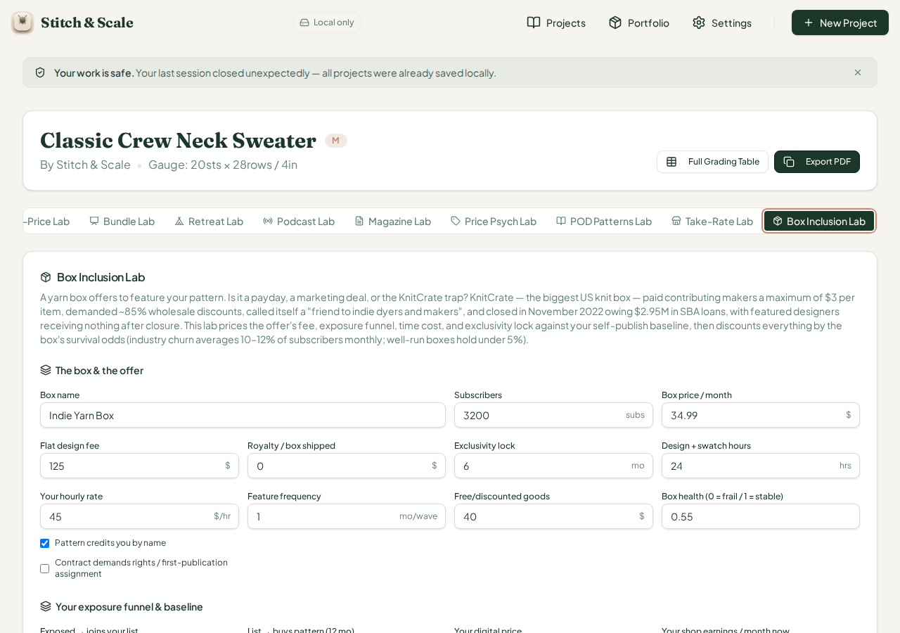
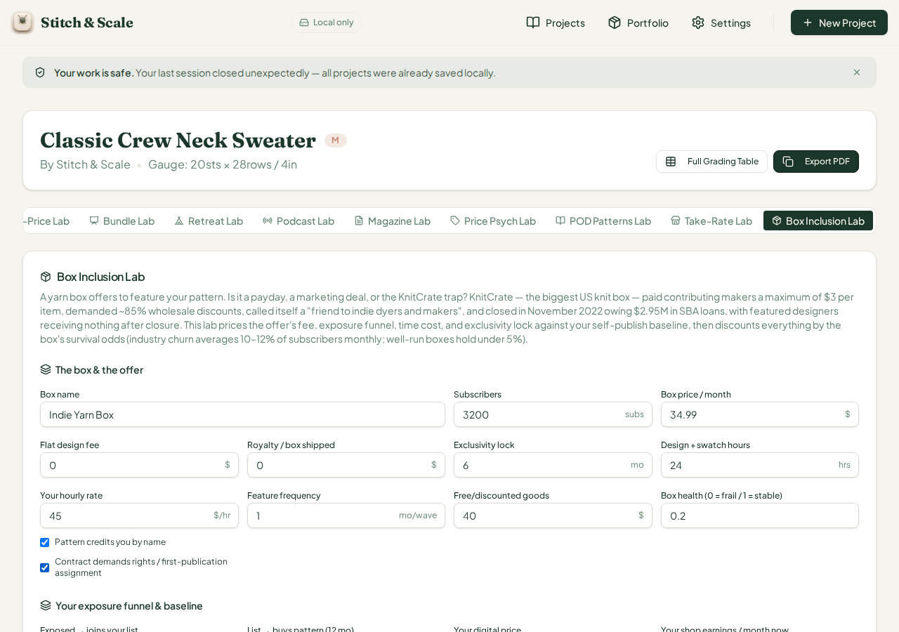
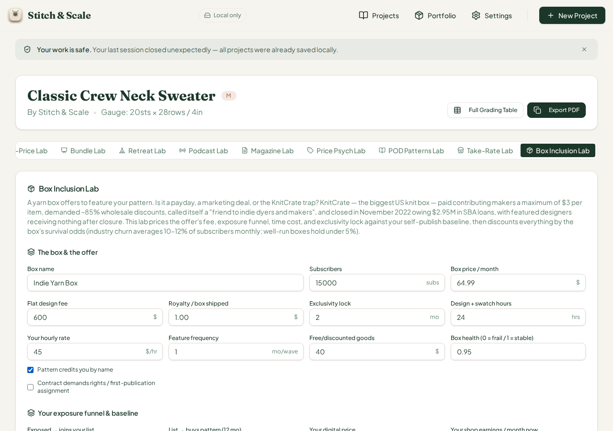

# QA Cycle 40 — CHK-073 Box Inclusion Lab (71st tab)

**Date:** 2026-08-14 · **Reviewed commits:** `86f8d67` (CHK-073 Box Inclusion Lab code) → `d605019` (CHK-073 playbook log)
**Branch reviewed:** `origin/main` at `d605019` · **QA branch:** `qa/manus-2026-08-14-cycle39` (folded run; CHK-072 cycle-39 report sits alongside)
**Tool under test (71st tab):** Box Inclusion Lab (`box-inclusion`) — subscription-box designer-inclusion economics: designer fee + per-box royalties + exposure funnel (subscribers → list signups → sales) + free-goods goodwill, against time cost, exclusivity drag, and a health-weighted mortality discount (KnitCrate anchor: max $3/item, ~85% wholesale demands, closed Nov 2022 owing $2.95M); BI-01…BI-09 watch-outs and a five-rung verdict ladder.

> This report is addressed to the Reviewer. The Coder should not act on this report.

---

## 1. Baseline

| Check | Result |
| --- | --- |
| `tsc --noEmit` | Clean, zero errors |
| Vitest | **1,460 / 1,460** across 73 test files (+29 from CHK-073) |
| Production build (`pnpm build`) | OK — stitch-and-scale built in 7.93s; only the unrelated `mockup-sandbox` workspace fails without `PORT` env (repo infra, not CHK-related) |
| Dev server | Fresh restart on `:5173` after pull (per restart rule) |

## 2. Engine hand-verification (independent of the browser)

The `box-inclusion-lab.ts` engine was recomputed twice independently — once in a Python replica and once by calling the real function directly under tsx — across seven scenarios. Structural anchors verified against the engine source: waves/year = 12 / wave-frequency; fee income per wave = fee + royalty × subscribers; exposure funnel zeros out without a byline (`waveReach = subs × byline`); time cost = hours × rate; exclusivity drag = baseline monthly × lock months / 12; health weight = min(1, (5 + 15h) / 12); break-even fee covers time + drag per wave minus royalty income; fair floor = 6% of box retail; subscriber lifetime = 5 + 15 × health months.

| Scenario | Key inputs | Fee income / wave | Funnel revenue / wave | Annual net EV (raw / health-weighted) | Health weight | Break-even fee | Flags | Verdict |
| --- | --- | --- | --- | --- | --- | --- | --- | --- |
| DEFAULTS | 3,200 subs, $34.99 box, $125 fee, 6-mo lock, 24h × $45, health 0.55 | $125 | $84.00 | $1,373 | 100% (13 mo life) | $98 | none | Marginally acceptable |
| AFTER-1 | fee → $0 (exposure-only) | $0 | $84.00 | −$127 | 100% | $98 | BI-01 | Skip — exposure-only trap |
| AFTER-2 | fee $0 + rights assignment + health 0.2 | $0 | $84.00 | −$127 raw / −$85 weighted | 67% (8 mo life) | $98 | BI-01, BI-05, BI-08 | Skip — exposure-only trap |
| AFTER-3 | byline off (anonymous hire) | $0 | $0.00 | −$1,135 | 100% | $98 | BI-01, BI-09 | Skip — exposure-only trap |
| AFTER-4 | royalty $0.50/box, fee $0 | $1,600 | $84.00 | $19,073 | 100% | $0 | BI-06 | Take it — beats self-publish |
| AFTER-5 | 15,000 subs, $64.99 box, $600 fee, $1.00 royalty, 2-mo lock, health 0.95 | $15,600 | $393.75 | $190,853 | 100% (19 mo life) | $0 | BI-06 | Take it — beats self-publish |
| AFTER-6 | 10-mo lock + $9.99 box | $125 | $84.00 | $1,310 | 100% | $103 | BI-03, BI-07 | Marginally acceptable |

## 3. Browser verification — every scenario EXACT

All seven states were driven in the live app with seeded project data (IndexedDB + localStorage init script, per the proven cycle-36 pattern) and every stat, flag chip, verdict string, and verdict-note copy matched the independent computation exactly. Selected confirmations from the live panel dumps:

- **DEFAULTS:** Direct income $125/wave, reach 3,200, list joins 160.0, funnel sales 11.2, funnel revenue $84.00, time cost $1,080, exclusivity drag −$95/yr (displayed "−$95"), annual net EV $1,373, break-even $98, fair floor $2.10, avg subscriber life 13 mo, health weight 100% — no chips, verdict *"Marginally acceptable"* with the note "The deal clears your time cost, but the lock and the box's mortality discount eat most of the edge" — exact.
- **AFTER-1 (fee $0):** BI-01 chip + verdict *"Skip — exposure-only trap"* with the full KnitCrate note ("Zero pay with a 6-month lock converts your design time into the box's retention marketing… ~1,920 list joins a year… closed owing $2.95M") and net EV −$127 — exact.
- **AFTER-2 (rights + fragile health 0.2):** life drops to 8 mo, health weight 67%, chips BI-01 + BI-05 (rights assignment) + BI-08 (weak health, "~8 months of average subscriber life"), net EV −$85 — exact.
- **AFTER-3 (byline off):** wave reach, list joins, funnel sales, and funnel revenue all correctly collapse to 0; BI-09 chip ("Hooks & Needles-type… anonymous labour — judge the offer as a fee-only job"); net EV −$1,135 — exact.
- **AFTER-4 (royalty $0.50):** BI-06 fires (below the 2% margin floor of $0.70), fee income $1,600/wave, verdict flips to *"Take it — beats self-publish"* — exact.
- **AFTER-5 (big healthy box):** all figures at industry-ideal scale ($15,600/wave, $190,853/yr, 19-mo life, BE $0) with BI-06 still firing (a $1.00 royalty is under the 2% floor on a $64.99 box — the flag is mathematically faithful, if stylistically odd on a great deal — cosmetic note only, not filing).
- **AFTER-6 (10-mo lock + $9.99 box):** BI-03 ("Exclusivity consumes your year" — 10-month lock spanning the Sep–Feb knitwear season) and BI-07 (sub-$12 box below sustainable margin) both fire; break-even rises to $103; fair floor $0.60; verdict stays "Marginally acceptable" — exact.

Interaction mechanics all worked: the Radix tab activated via the pointer-sequence dispatch, all fourteen numeric inputs accepted edits with live recomputation (health clamped 0–1 at step 0.05, lock clamped 0–12, hours floored at 0.5), both checkboxes toggled correctly and immediately zeroed/re-enabled the exposure funnel, and no input edit left the panel in a stale state.

## 4. Fraction-field defect family — Box Inclusion Lab is CLEAN

Checked this card specifically for the recurring raw-fraction-with-%-suffix defect (#43/#44/#46/#47 family). The two 0–1 rate fields (**Exposed → joins your list** `0.05`, **List → buys pattern** `0.07`) store fractions but display ×100 with the % suffix — rendered "5 %" and "7 %" at stock values, verified correct at edited values as well. The **Box health** field stores 0–1 and deliberately carries no suffix, which is also correct. No new card joins the defect family this cycle — five consecutive labs (Retreat, Podcast/Magazine/Price-Psych, POD, Take-Rate, Box Inclusion) have been checked and only the three older affected labs plus POD still carry the defect.

## 5. Regression check

All previously open issues remain in their established state. Issue #47 (Podcast dead tab + fraction family) remains open and unremediated — CHK-073 did not touch `project-workspace.tsx` beyond the new trigger/content pair, so the dead Podcast Lab tab is still unreachable on desktop; per standing rule it is not re-opened. Issues #6–#25 and #40–#46 unchanged. Vitest grew by exactly the 29 CHK-073 tests with no failures, so the earlier 1,431 tests continue to pass — no regressions detected on the prior 71 tabs.

## 6. 375px phone check

`c40-08-boxinclusion-375px-phone.png`: the 71-tab strip collapses to the same stacked list, and the Box Inclusion Lab card stacks fully at phone width — all fourteen inputs, both checkboxes, the four-column stat grid, both watch-out chips, and the verdict are legible with no overflow, clipping, or horizontal scroll. PASS.

## 7. Verdict on this cycle

**CHK-073 Box Inclusion Lab PASSES QA.** The engine math, flag triggers, funnel collapse-without-byline, health weighting, break-even, and verdict ladder were verified against two independent replicas for seven scenarios and matched exactly; the card is free of the recurring fraction defect; the phone layout is clean. No new GitHub issue was opened this cycle.

## 8. Screenshots (embedded)

