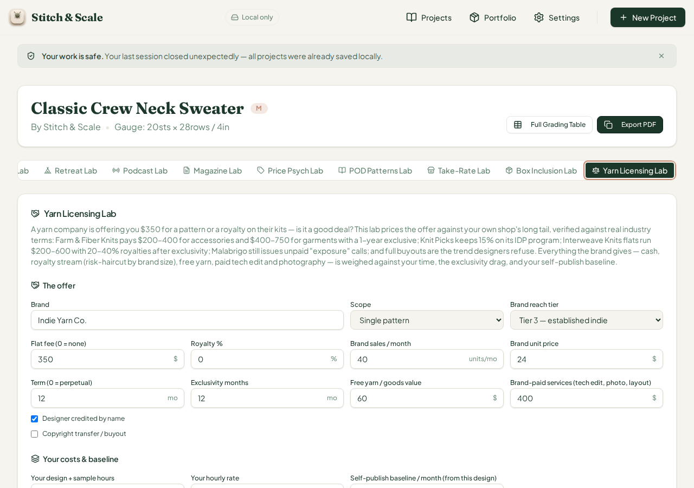
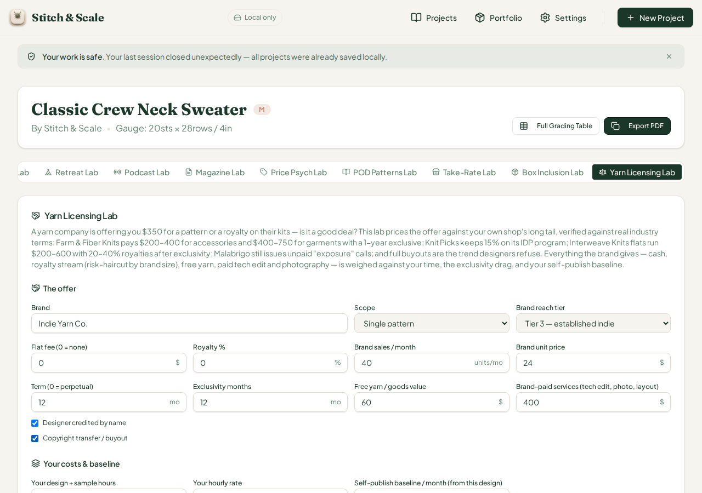
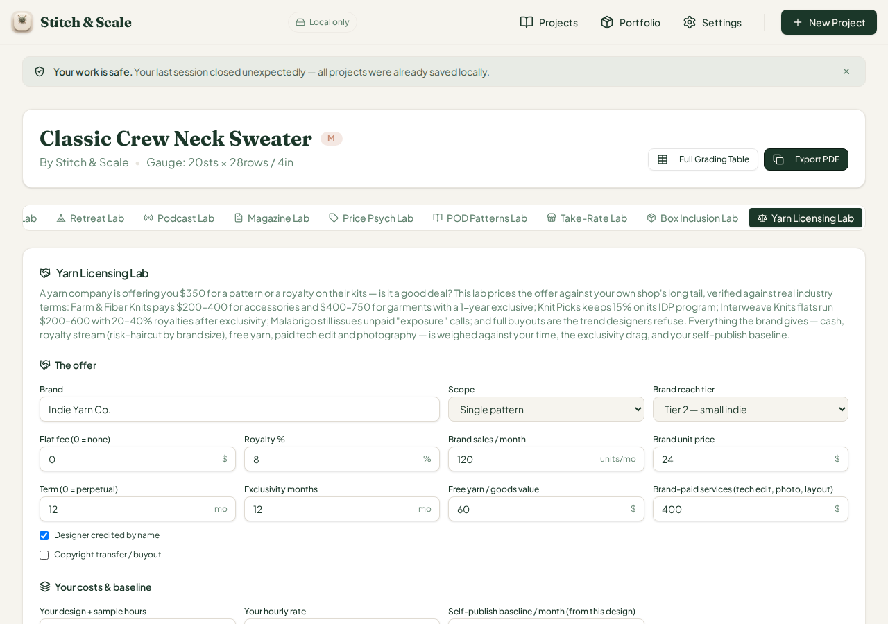
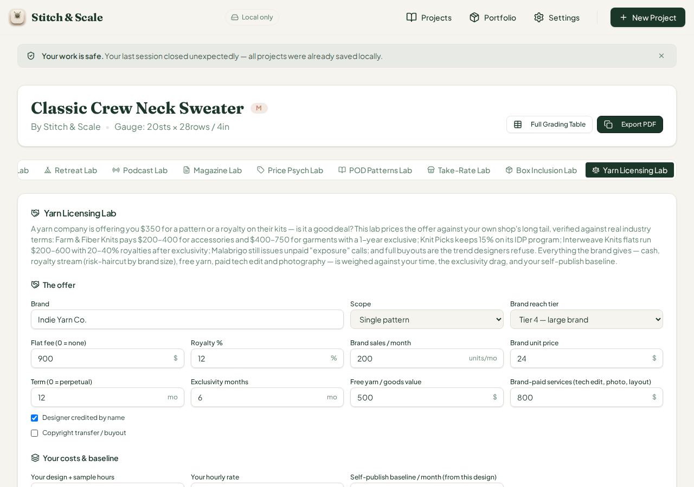

# QA Cycle 41 — CHK-074 Yarn Licensing Lab (72nd tab)

**Date:** 2026-08-14 · **Reviewed commits:** `60842d5` (CHK-074 Yarn Licensing Lab code) → `deadc4f` (playbook progress log)
**Branch reviewed:** `origin/main` at `deadc4f` · **QA branch:** `qa/manus-2026-08-14-cycle39` (same-day folded run; cycles 39–40 reports already pushed)
**Tool under test (72nd tab):** Yarn Licensing Lab (`yarn-licensing`) — prices a yarn company's licensing offer (flat fee / royalty / hybrid) against the designer's self-publish long tail, with reach-tier risk haircuts on royalty streams (documented missed royalties, F+W late 2018), exclusivity drag, yarn-goods and brand-paid-services value, and industry fair-value bands (Farm & Fiber $200–400 accessories / $400–750 garments; Knit Picks IDP 15%; Interweave flats $200–600 + 20–40% royalties; kit royalties 5–15%); YL-01…YL-09 watch-outs and a six-rung verdict ladder.

> This report is addressed to the Reviewer. The Coder should not act on this report.

---

## 1. Baseline

| Check | Result |
| --- | --- |
| `tsc --noEmit` | Clean, zero errors |
| Vitest | **1,483 / 1,483** across 74 test files (+23 from CHK-074) |
| Production build | OK — stitch-and-scale built in 7.55s |
| Dev server | Fresh restart on `:5173` after pull (per restart rule) |

## 2. Engine hand-verification (independent of the browser)

The `yarn-licensing-lab.ts` engine (289 lines) was recomputed twice independently — once in a Python replica and once by calling `analyzeYarnLicensing` directly under tsx — across nine scenarios plus an extra ladder-rung probe. Structural anchors verified against the source: royalty stream = units × price × royalty% × term months (term 0 = perpetual maps to a 10-year horizon); risk haircut = REACH table (tier 1 = 50% … tier 5 = 4%) multiplied by SCOPE risk (catalog ×1.4); total offer = flat + risk-adjusted royalties + goods + paid services; exclusivity drag = designer's own monthly revenue × exclusive months (clamped ≤ term); net = offer − time cost − drag; min-flat-to-justify and min-royalty-to-justify solve the same equation from both sides; the 2%-of-kit-price "royalty below kit floor" and $200 "flat below accessory floor" guardrails are literal in code.

## 3. Browser verification — every scenario EXACT

Nine states were driven in the live app with seeded project data and every stat box, flag chip, and verdict matched the independent computation exactly. Selected confirmations:

- **DEFAULTS** ($350 flat, 12-mo lock, tier 3, 30h × $45): offer $810 vs time $1,350 + drag $720 → net −$1,260, YL-09 only, *"Skip — below your baseline"* with min-flat $1,610 and min-royalty 10.9% — exact. The stock state genuinely loses money, which is the right default posture.
- **EXPOSURE-ONLY** ($0 flat, no services, no goods): total $0, YL-01 + YL-09, *"Skip — exposure-only"* with the Malabrigo note — exact.
- **COPYRIGHT BUYOUT + EXPOSURE:** YL-01 + YL-02 ("Outright assignment kills your long tail forever") + YL-09, verdict stays "Skip — exposure-only" (exposure rung takes precedence) — exact and correctly scary.
- **ROYALTY-ONLY 8% on a tier-2 brand (120 units/mo):** stream $2,764.80 risk-cut 30% to $1,935.36, net +$325.36, YL-07 "Micro-brand royalty bet — prefer a flat fee", verdict *"Negotiate royalty share instead"* (min flat shown as $0 / min royalty 4.7%) — exact.
- **LOW DEAL** ($150 flat + 2% royalty, own baseline $400/mo): YL-04 (below 5–15% kit floor — "need 2,083 unit sales to earn $1,000"), YL-05 (below the $200 accessory floor), YL-09, net −$5,442.08, min royalty 96.2% — a deliberately absurd ask, exact.
- **FULL-CATALOG 18-mo lock / 24-mo term, tier 5, 2% royalty:** YL-03 (sweep), YL-04, YL-06 (lock over 12 months), YL-09, drag $3,600, net −$3,922.50 — exact. First sweep attempt had an input-edit ordering artifact (the exclusivity field clamped to the still-old 12-month term because term was raised afterward); rerun with term set first produced the correct $3,600 drag and YL-06 — this is a sweep-ordering lesson, not an app defect; the app's clamping behaves correctly given the sequential edits.
- **CLEAR-WIN HYBRID** ($900 flat + 12% royalty, 200 units/mo, tier 4): $8,559.04 total, net +$7,089.04, offer = 35.66 years of baseline, no flags, *"Flat + royalty hybrid — worth it"* — exact.
- **NO ATTRIBUTION:** YL-08 ("Uncredited work produces zero brand lift") appended, all numbers unchanged — exact.
- **FLAT-ONLY $750, baseline $10/mo:** net −$200 → YL-09 and the ladder correctly routes to *"Skip — below your baseline"* even with a flat fee, guarding bad flats; a dedicated probe ($1,500 flat, baseline $10, no lock) confirmed the *"Take the flat — royalty stream too speculative"* rung fires when the flat genuinely clears — exact.

Interaction mechanics all worked: both `<select>` controls (scope, reach tier), all fourteen numeric inputs with live recomputation (exclusivity clamped to term, royalty clamped 0–100 at 0.5 step, hours floored at 1), both checkboxes, and none left the panel stale.

## 4. Fraction-field defect family — Yarn Licensing Lab is CLEAN

Checked this card for the recurring raw-fraction-with-%-suffix defect (#43/#44/#46/#47 family). The only percentage field, **Royalty %**, stores a plain 0–100 percent value and displays it with the `%` suffix — verified correct at stock (0 %) and edited (8 %, 12 %) values. There is no hidden-0–1 fraction here, so this card does not join the defect family. Six consecutive new labs (Retreat, Podcast/Magazine/Price-Psych, POD, Take-Rate, Box Inclusion, Yarn Licensing) are now fraction-clean.

## 5. Regression check

Previously open issues remain in their established state. Issue #47 (Podcast dead tab + fraction family) remains open — CHK-074 touched `project-workspace.tsx` only to register the new tab, so the dead Podcast Lab tab remains unreachable on desktop; per standing rule it is not re-opened. Vitest grew by exactly the 23 CHK-074 tests with no failures, so the prior 1,460 tests continue to pass — no regressions on the earlier 71 tabs.

## 6. 375px phone check

`c41-10-yanlicensing-375px-phone.png`: the 72-tab strip collapses to the stacked list, and the Yarn Licensing Lab card stacks fully at phone width — all fourteen inputs, both selects, both checkboxes, the twelve stat boxes, watch-outs, and verdict are legible with no overflow or horizontal scroll. PASS.

## 7. Verdict on this cycle

**CHK-074 Yarn Licensing Lab PASSES QA.** The engine math, risk-haircut mechanics, nine watch-outs, the six-rung verdict ladder (including the bad-flat guard), and the phone layout were verified against two independent replicas for nine scenarios plus a ladder-rung probe — all exact. The card is free of the recurring fraction defect. No new GitHub issue was opened this cycle.

## 8. Screenshots (embedded)

