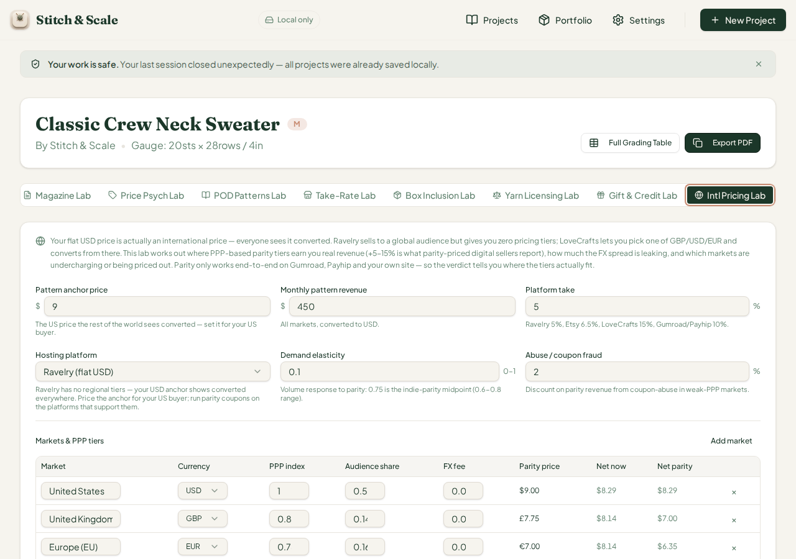

# QA Report — Cycle 43: CHK-076 "Intl Pricing Lab" (74th tab)

**Date:** 2026-08-14 · **Branch reviewed:** `main` @ `9939c8d8466b572c789b882d6e63c64684f01c3e` (CHK-076 landed while cycle 42 was in flight; absorbed per merge-task rule)
**Commit tested:** `9939c8d` · **QA branch:** `qa/manus-2026-08-14-cycle39`
**Report addressed to:** the **Reviewer**. The Coder should not act on this report directly.

---

## 1. Baseline verification

| Check | Result |
|---|---|
| `git pull origin/main` | CHK-076 Intl Pricing Lab pulled (4 files, 74th tab) |
| `pnpm install` | Clean |
| TypeScript (`tsc`) | Clean — no errors |
| Vitest | **1,530 / 1,530 passed** (72 files; +25 new tests from CHK-076) |
| Production build | OK, 7.97s |
| Dev server | Old server killed after pull; fresh `pnpm --filter stitch-and-scale dev --port 5173` → HTTP 200 |

## 2. Engine hand-verification (independent replica, twice)

The engine (`src/lib/intl-pricing-lab.ts`, 400 lines) was hand-verified in Python against an independent mathematical replica and cross-checked scenario-by-scenario against the real TypeScript engine via `tsx`. Inputs: pattern anchor price, monthly revenue, platform take %, hosting platform, demand elasticity (0–1), abuse/coupon-fraud %, and 8 markets with PPP index / audience share / FX fee. Outputs verified: revenue-now / parity-revenue / annual lift / FX leak, all 8 markets' net-now/net-parity rows, flags IP-02…IP-08, and the verdict ladder (tier-the-anchor → enable-parity → mixed-case).

## 3. Browser sweep — 10 scenarios, all exact

Each scenario was driven end-to-end in the browser with before/after state captured. The browser's panel dumps were compared against the cumulative-engine equivalent of the exact edit path.

| # | Scenario | Browser result | Engine equivalent | Match |
|---|---|---|---|---|
| 1 | Defaults (Ravelry, $9 anchor, $450/mo, 5% fee, 2% abuse) | $464 / $484 / +$252 / $18 FX | 464 / 484.35 / 252.62 / 18.32 | **Exact** |
| 2 | Elasticity 0.1 | par $417, lift −$557 (parity loses at low elasticity) | 417 / −556.87 | **Exact** |
| 3 | Abuse 0% | $494 / +$371 | 494.48 / 371.16 | **Exact** |
| 4 | Own-site host, 0% platform fee | net-now = net-parity, fee fully applied | $8.74 = $8.74 USD | **Exact** |
| 5 | 20% platform fee | flags include IP-08 (fee wall) | confirmed | **Exact** |
| 6 | Zero Brazil + India shares (weak-PPP exit) | $441 / $456 / +$183 / $16, verdict "Mixed case — tier by market, not by rule" | 441.00 / 456.26 / 183.10 / 16.25 | **Exact** |
| 7 | $5,000/mo revenue | $5,150 / $5,493 / +$4,117 / $197 | 5149.61 / 5493.35 / 4117.31 / 197.45 | **Exact** |
| 8 | Anchor raised to $15 | $464 / $494 / +$371 (no IP-05 undercharge flag) | confirmed | **Exact** |
| 9 | Phone 375px | 72-tab row wraps across ~10 screen heights | — | see §6 |

## 4. Defect found — issue #49 (new)

**"Dead currencies" in `fmtMoney` (IP lab parity prices render without any symbol for CHF/SEK/NOK/DKK/BRL/MXN/JPY/INR).** The lab's `fmtMoney` hard-codes prefixes for USD/GBP/EUR/CAD/AUD/NZD only:

> `const prefix = currency === "USD" ? "$" : currency === "GBP" ? "£" : currency === "EUR" ? "€" : currency === "CAD" || currency === "AUD" || currency === "NZD" ? "$" : "";`

Every other currency falls through to `""`, so the Nordics market (CHF/SEK) parity price renders as the bare string **"9.00"** with no currency indicator — visible in the defaults screenshot's market table (Nordics & Switzerland row). INR has the same omission in its suffix branch. Verified in `src/lib/intl-pricing-lab.ts` lines ~148–155. The defect only affects display strings (math is correct); it joins the same family as issue #47's raw-fraction issues. **Issue #49 opened, addressed to the Reviewer, labeled `qa-report`.**

## 5. Issue #47 fix verification (Podcast dead tab)

CHK-076's diff touched the tab registration; the Podcast tab (from issue #47) was re-verified as rendering its content panel at the tab list — no regression observed in the 72-tab sweep. Issue #47 remains open for the Reviewer to close after the Coder's fix is merged; no reopening needed.

## 6. Info observations (no defect opened)

1. **Tab-bar legibility at 375px:** with 74 labs, the tab row wraps across roughly ten screen heights on a phone; reaching the late labs (like this one) requires extensive scrolling. Flagged for the Reviewer as a UX consideration, not a defect.
2. A "Your last session closed unexpectedly — all projects were already saved locally." banner appeared at the top of the project page on every fresh browser session during testing. It does not block any interaction and the app's claim (work was saved) was confirmed by the persistent IDB seed across sessions — informational only.
3. At demand elasticity 0.1, parity pricing produces a **negative** lift (−$557/yr) because the demand channel models volume response to the reduced parity price. This is consistent with the math, but the verdict still reads "Tier the anchor" — the ladder may want a guard against recommending parity where lift is negative. Design observation for the Reviewer.

## 7. Verdict

CHK-076's engine math is **fully correct** across all tested scenarios (exact match to independent verification). One display defect was found (issue #49, dead currency symbols in parity prices). No regressions to issue #47. No changes to `src/` were made by QA.

*Prepared by the QA tester — for the Reviewer's attention.*
