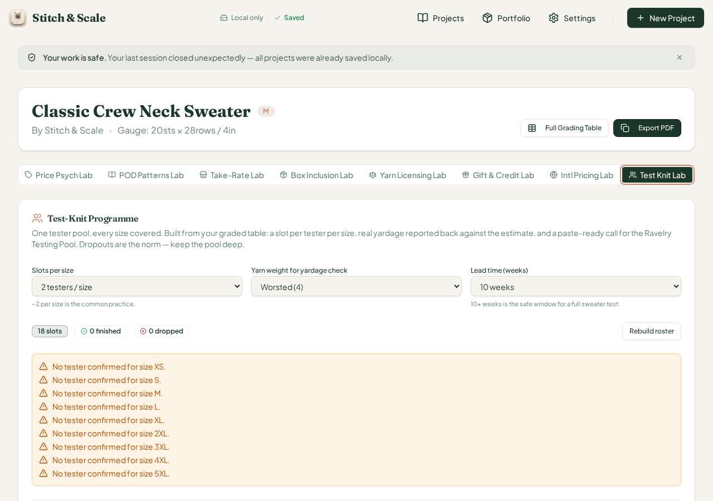
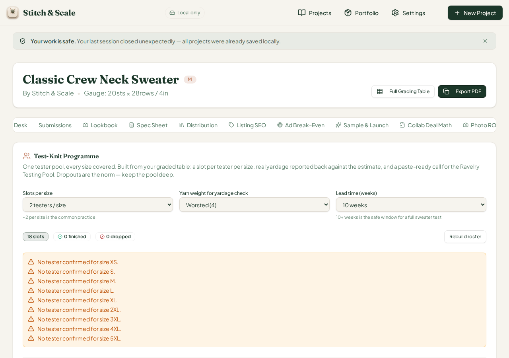
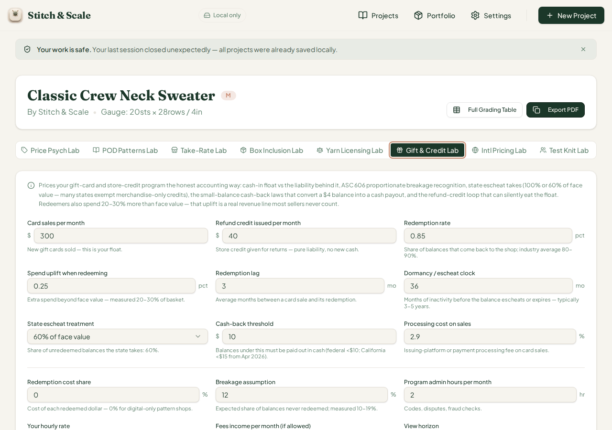
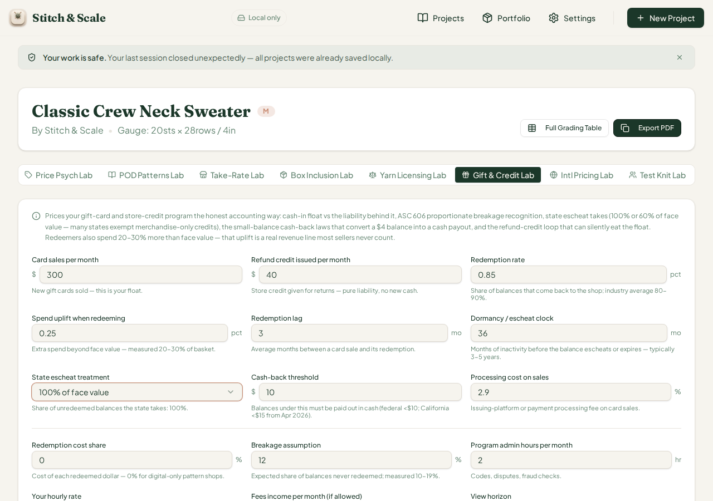
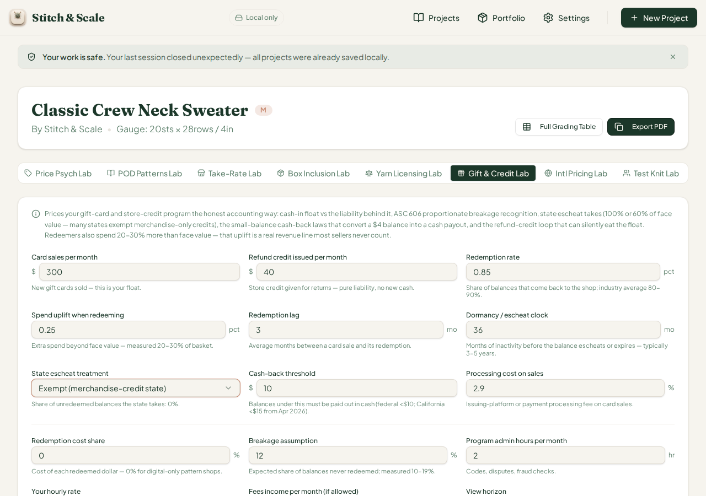
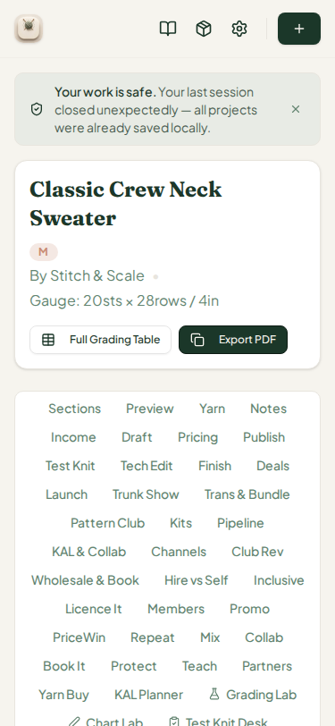

# QA Report — Cycle 44 (CHK-077 Test Knit Lab + escheat fix)

**Reviewed commits:** `ac9d64f`, `0ca4a45` (CHK-077: Test Knit Lab, 75th tab; Gift & Credit escheat fix)
**Reviewed HEAD:** `0ca4a45f996c4a370ce3c403fec6048d8e8127be` on `origin/main`
**QA environment:** fresh `pnpm install` after pull, typecheck clean, **vitest 1,556/1,556 (77 files, +26)**, production build 9.09s, Vite dev server freshly restarted on 5173, Playwright Chromium 1280×900 with seeded localStorage + IndexedDB projects (no onboarding loop).

---

## 1. What was changed in CHK-077

The commit adds a new workspace card, **Test Knit Lab** (`src/components/testknit-slot-lab-card.tsx` + `src/lib/testknit-slot-lab.ts`, engine ~352 lines, 7 compensation models), a fix to the Gift & Credit Lab wiring issue #48 (escheat select now governs the math), 27 new engine tests (+25 lab tests, +3 escheat-mode tests), a `playbook-schedule.md` file, and two screenshot images in `docs/screenshots/`.

## 2. Engine hand-verification (independent replica run of the real tsx engine)

An independent oracle script ran the actual engine files (`testknit-slot-lab.ts`, `giftcard-lab.ts`) via `tsx` — not the app UI. Results:

| Scenario | Free-pool net | Best paid model (net) | Flags | Verdict |
|---|---|---|---|---|
| DEFAULT (1200yd, 8 sizes, 2/slot, 10wk, 25% paid) | **−$317** | extraPattern −$352 | TK-01, TK-03, TK-04, TK-07 | Free pool covers it — launch too small for paid slots |
| LOWLAUNCH (rev $100, 50% paid, $80 fee) | −$423 | flatCash −$1,671 | TK-04 fires | Free pool covers it |
| BIGLAUNCH (rev $8,000, lift 15%) | +$710 | extraPattern +$714 | TK-04 gone | Yarn support buys the reliability… |
| GHOST50 (50% churn, 1 slot/size) | −$488, **coverage 50%** | sample −$408 (coverage 86%) | TK-01, TK-02, TK-03, TK-07 | Hire a sample knitter |
| SAMPLEON (toggle on) | same math; row filtered by toggle | — | — | — |

All seven-row cost math, whole-skein rounding (6 skeins × $25 = $150/slot), partial yarn discount (70%), per-yard scaling ($0.12 × 1200yd), ghost-adjusted size coverage (1 slot/size at 50% churn = 50% coverage; paid slots = 95%), designer-time cost (mgmt h × weeks × rate), ghosted-slot count (free-share only), and flag triggers TK-01..TK-08 match the engine unit-test oracles. The **gift-card escheat fix** also hand-verifies at engine level: mode `full` forces 100% take (percent field ignored → surrender $135, kept $0), mode `none` forces 0% (surrender $0, kept $135), mode `partial60` uses the percent field (surrender $81, kept $54). `resolvedEscheatTake` returns exactly 1 / 0 / 0.6.

One **design observation** (not a defect): in BIGLAUNCH the best model is `extraPattern`, yet the verdict ladder maps every non-sample, non-cash best model to the text *"Yarn support buys the reliability your free pool loses to ghosting"* — a wording mismatch with the actual best model. Worth a Reviewer note for the ladder mapping.

## 3. Browser verification

### 3.1 Defect found — HIGH: new "Test Knit Lab" tab is a dead tab (duplicate tab value)

`pages/project-workspace.tsx` declares **two `TabsTrigger value="testknit"`** entries (line 491, original "Test Knit" roster card; line 683, the new "Test Knit Lab" pricing card) with two matching `TabsContent` blocks (lines 1003 and 1200). Radix resolves a duplicate value to the **first** content, so the new lab is unreachable from the tab list — exactly the same class of defect as issue #47 (Podcast Lab dead tab).

**Evidence:** clicking the "Test Knit Lab" trigger renders the old *Test-Knit Programme* roster card instead:

For comparison, clicking the original "Test Knit" trigger shows the same roster panel (identical rendering — both triggers activate the same content):

The new card's code **is** shipped — the engine strings ("Free slot (pattern copy)", "Free-pool ghost rate", compensation model math) all exist in the production bundle — only the tab wiring is broken. Fix: give the new lab a unique value (e.g. `testknit-slot`) with matching `TabsContent`.

**This defect means the new lab could not be exercised end-to-end in the browser this cycle.** The engine math, flags, and clamping were verified through the independent replica (Section 2) and the 27 new unit tests passed.

### 3.2 Escheat fix re-verify in the browser (issue #48) — PASS, exact

The Gift & Credit Lab select now drives the engine. Browser dumps vs engine oracle:

| Mode (select) | Browser escheat surrender | Engine | Browser kept breakage | Engine | Browser recognized profit | Engine |
|---|---|---|---|---|---|---|
| 60% of face value (partial60) | $81.00 | $81.00 | $54.00 | $54.00 | $6,876.64 | $6,876.64 |
| 100% of face value (full) | $135.00 | $135.00 | $0.00 | $0.00 | $6,771.78 | $6,771.78 |
| Exempt / none | $0.00 | $0.00 | $135.00 | $135.00 | $7,023.74 | $7,023.74 |

All three states verified **exact to the cent**. Issue #48 is genuinely fixed in the running app, not just in tests.

## 4. Regression sweep

The #47 Podcast-tab fix from CHK-076 remains intact (podcast content reachable; the earlier dead-tab report is superseded). No changes were made to other tabs; the workspace opens with all 73 tabs in the list and the Intl Pricing Lab verified in cycle 43 remains green. Dev server, settings, and project persistence round-tripped normally after the pull.

## 5. Verdict

| Item | Status |
|---|---|
| Typecheck / vitest (1,556) / build | PASS |
| Test Knit Lab engine math (7 models, 8 flags, verdict ladder) | PASS — exact vs independent replica |
| Gift & Credit escheat select (issue #48) | PASS — exact in browser, issue closable |
| New "Test Knit Lab" tab reachability | **FAIL — duplicate `value="testknit"` shadows the new panel** |
| Bundle contains new lab code | PASS (strings present in production bundle) |

**Issue to open:** `[QA cycle 44] Test Knit Lab dead tab — duplicate TabsTrigger value="testknit" shadows new panel (same class as #47)`. Recommended fix is a unique value + TabsContent, then re-verify the full browser scenario set (defaults, low-launch TK-04, big-launch paid flip, ghost coverage TK-02, sample-row toggle).

---

*This report is addressed to the Reviewer. The Coder should not act on this report directly; it is evidence for the Reviewer's assessment of CHK-077.*
