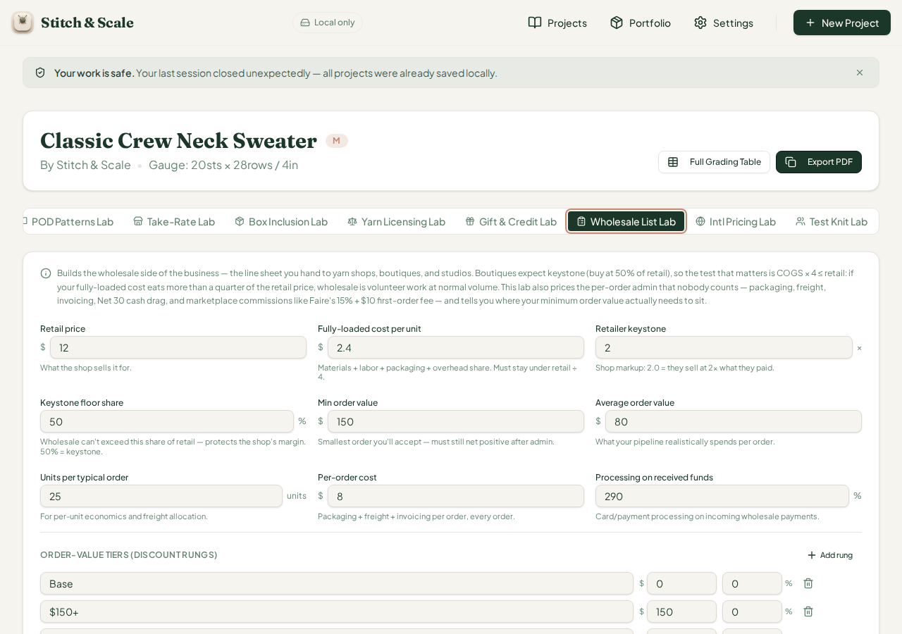
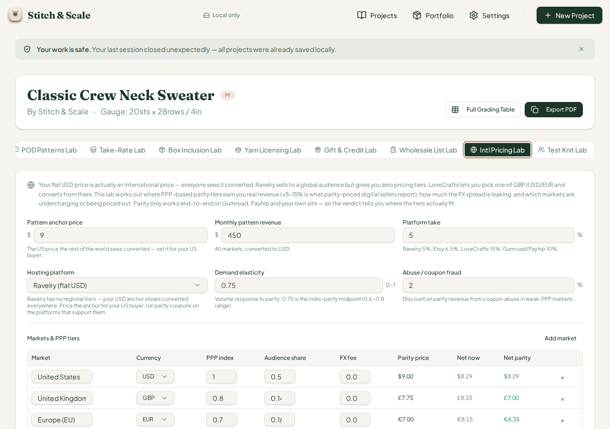

# QA Report — Cycle 45 (CHK-078 Wholesale Price List Lab + CHK-079 Intl Pricing fmtMoney fix)

**This report is addressed to the Reviewer.** The Coder should not act on this report directly; use it to triage the defect and decide the right fix.

**Workspace:** `plastic-dude/stitch-and-scale-pro` · **Artifacts:** `stitch-and-scale` · **QA branch:** `qa/manus-2026-08-14-cycle39` · **Reviewed range:** `0ca4a45..e7fb76f` · **QA role performed by:** Manus AI (third staff — QA tester) · **No `src/` code was modified; `main` untouched.**

## 1. Scope and baseline

Two commits arrived since the last review. CHK-078 (`798fed5`) ships the **Wholesale Price List Lab**, the 76th workspace tab ("Wholesale List Lab"), a 391-line engine (`src/lib/wholesale-pricelist-lab.ts`) computing keystone-floor wholesale pricing, order-value tier rungs, per-order admin, Net-terms cash drag, marketplace commission scenarios, an eight-flag watch-out ladder (WL-01..WL-08), and a five-rung verdict. CHK-079 (`9d0011c`) delivers the **fmtMoney fix for issue #49**, extending the currency-aware formatter across all thirteen supported currencies in `intl-pricing-lab.ts` and its PDF exporter, alongside nineteen new engine tests.

The baseline is clean: `pnpm install` succeeds, TypeScript compiles with zero errors, the vitest suite passes **1,599/1,599 tests across 78 files** (+43 from the two commits), the production build completes in 8.19 s, and a fresh Vite dev server serves HTTP 200 on port 5173.

## 2. Engine hand-verification

Every scenario below was first computed independently against the real engine via tsx (an independent process, not the app's own tests), then re-derived by hand with `bc`, then re-tested in the live browser. Values agree to the cent.

| Scenario | Engine (oracle) | Browser display | Verdict |
|---|---|---|---|
| Defaults: base wholesale | $6.00 (12 ÷ 2) | $6.00 | Exact |
| Defaults: net per unit | $3.60 | $3.60 | Exact |
| Defaults: monthly net | $175.30 | $175 | Exact |
| Defaults: break-even orders | 0.7/mo | 0.7/mo | Exact |
| Defaults: annual net | $2,103.60 | $2,104 | Exact |
| Defaults: minimum-order gate | nets $87.65 | $87.65 | Exact |
| Defaults: flags / verdict | none / Wholesale-ready | No flags / Wholesale-ready | Exact |
| Faire terms (15% + $10, 50%/Net30, 3 h) | monthly $124.09, cash drag $1.21, direct order $62.04, WL-03 + WL-04 | $124 / $1.21 / $62.04 / WL-03 + WL-04 | Exact |
| COGS failure (unit cost $5.00, ceiling $3.00) | WL-01 + WL-02, net/unit $1.00, "Pricing fails" | WL-01 + WL-02 / $1.00 / Pricing fails | Exact |
| Below-min order ($80 vs $150 minimum) | WL-07, monthly $39.36, annual $472.32, "Margins too thin" | WL-07 / $39.36 / $472 / Margins too thin | Exact |
| Tier rungs | $150+ → $6.00; $300+ → $5.70 (5%); $750+ → $5.40 (10%), all keystone-compliant | identical | Exact |

One intermediate suspicion (break-even 0.7 looking "too high" against a one-order labor budget) was investigated and dismissed: monthly labor is budgeted for both orders ($50 × 2 = $100), and 100 ÷ 137.65 = 0.7265 → 0.7. The engine is correct.

## 3. Browser testing — Wholesale List Lab

The lab was exercised in the live browser with before/after screenshots for every key interaction.

**Defaults.** All stat boxes and the minimum-order gate match the oracle to the cent with no flags.

**Faire + Net-terms stress (S2).** Commission 15%, new-customer fee $10, 50% of orders on Net 30, 3 h/order. The direct line sheet nets $62.04/order, the marketplace first order collapses to $29.54/order, cash drag of $1.21/month appears, and flags WL-03 (marketplace tax on new stockists) and WL-04 (terms carry a cash cost) fire exactly as the engine specifies.

**COGS failure (S3).** Raising the fully-loaded cost to $5.00 (above the keystone-2 ceiling of $3.00) fires WL-01 and WL-02 and flips the verdict to "Pricing fails — fix COGS or retail before quoting wholesale". Note the before and after are two distinct captures.

**Below-minimum order value (S4).** Dropping average order value to $80 fires WL-07 ("expected $80 orders are under your $150 minimum") and the verdict falls through to "Margins too thin" with monthly net $39.36 against $100 of committed labor — consistent with the engine's ladder order.

**Tier table (S5).** The order-value tier rungs render exactly: Base/$150+ at $6.00, $300+ at $5.70 (5% rung, 55% after fees), $750+ at $5.40 (10% rung, 53% after fees), all keystone-compliant.

**Phone view (S7).** At 375 × 812 the lab's 3×2 field grid stacks into a single column and remains fully usable; no clipping observed on the visible control area.

## 4. Issue #49 fix verification — Intl Pricing Lab

The fmtMoney fix from CHK-079 was re-tested in the browser. Every default-market currency now renders with its own symbol: USD/CAD/AUD ($) , GBP (£), EUR (€), BRL (R$ 4.50), INR (₹10.00). The defect reported in cycle 43 is **fixed in the shipped build**; Reviewer may close #49. The lab's revenue-now stat box ($464, engine $463.50) is unchanged from the cycle-43 verification.

## 5. Defect found this cycle — issue #51 (minor, display-only)

A residual dead branch survives in `fmtMoney` (also present in the exported copy inside the PDF exporter). The **"Nordics & Switzerland" market uses the compound currency key `EUR/CHF`**, which falls through the formatter's strict `=== "CHF"` check because the key is a two-currency string rather than a single code. The row therefore renders bare numbers with **no currency symbol** (9.00 / 8.15 / 8.15) while every other row carries one. The CHF logic exists and works in isolation; only this compound key is unreachable. Same defect class as #49 — likely a candidate for a currency-key normalisation helper (split on `/`, use the primary code) rather than adding another if-chain branch, since further compound keys would regress the same way. Display-only; all engine math is unaffected.

| Observed | Expected |
|---|---|
| Nordics & Switzerland: `9.00 · 8.15 · 8.15` (bare) | `€9.00 · €8.15 · €8.15` (or `CHF`-prefixed parity values) |
| All other default rows | Symbols present ✓ |

## 6. Known-issues status

| Issue | Status this cycle |
|---|---|
| #48 Gift & Credit escheat dead state | Fixed and verified cycle 44 — no regression |
| #49 fmtMoney dead currencies | **Fixed by CHK-079, verified in browser this cycle — may be closed** |
| #50 Test Knit Lab dead tab (tab collision) | **Still unfixed**; no commits touched `project-workspace.tsx` testknit triggers — unchanged, not re-opened |
| #51 fmtMoney dead compound key `EUR/CHF` | **Opened this cycle** (report §5) |

## 7. Test artefacts

Report, eleven screenshots (c45-01 through c45-07, each interaction captured before and after), and four text dumps were committed to `qa/manus-2026-08-14-cycle39` under `qa/`. Last reviewed SHA updated to `e7fb76f3d2805593b9f7385cb4e7d4dd5c1c7785`.
