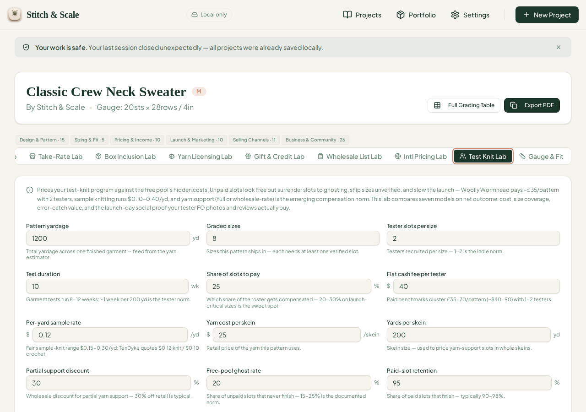
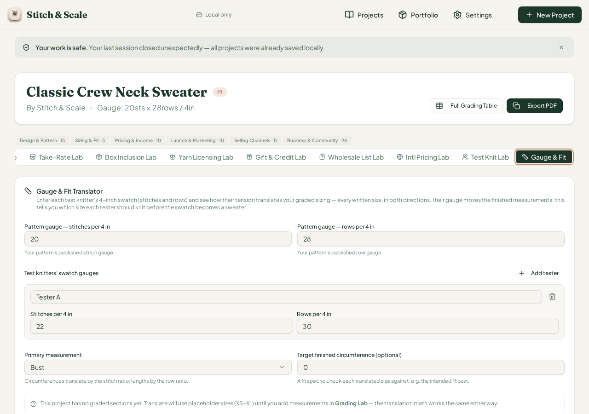
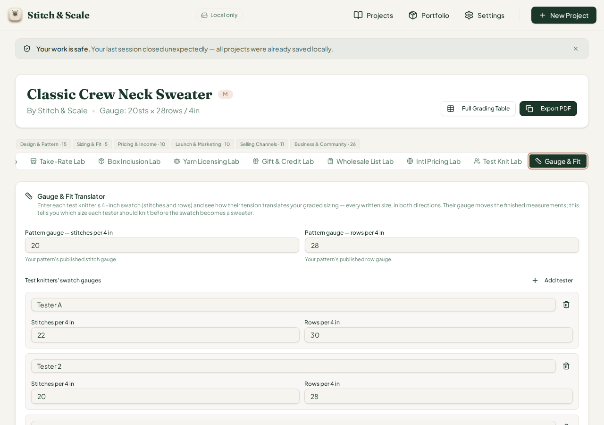
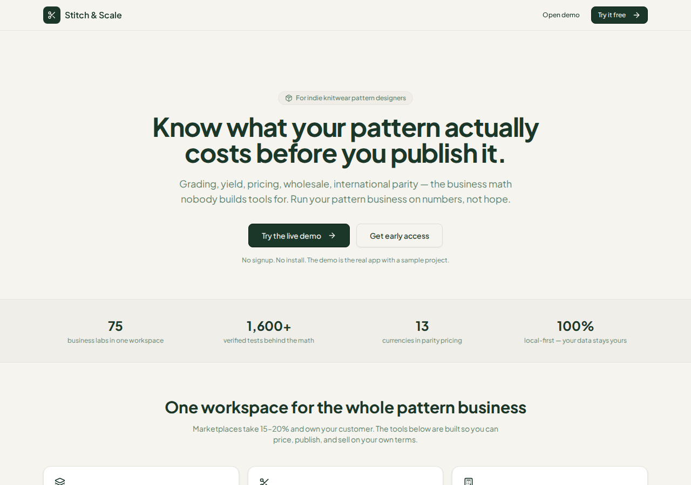
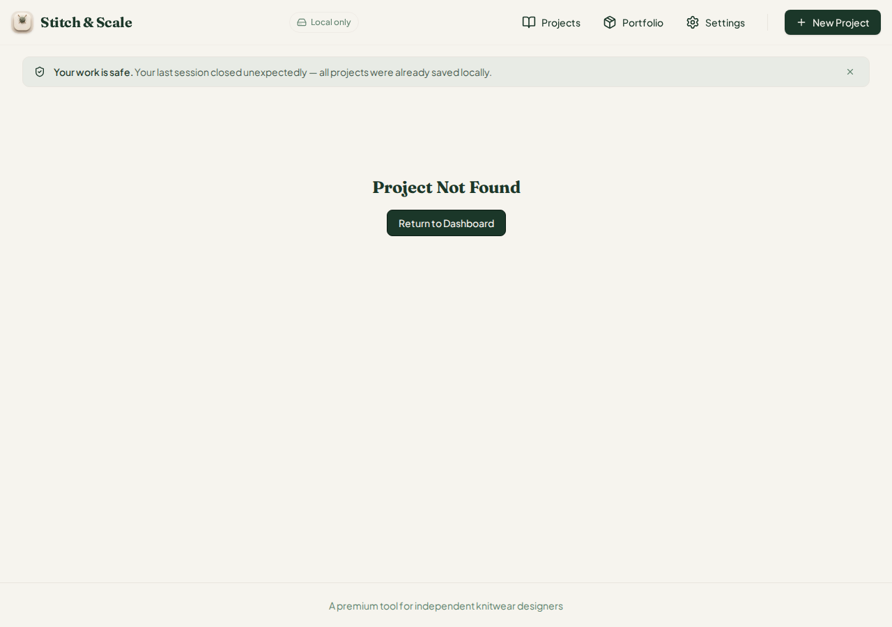
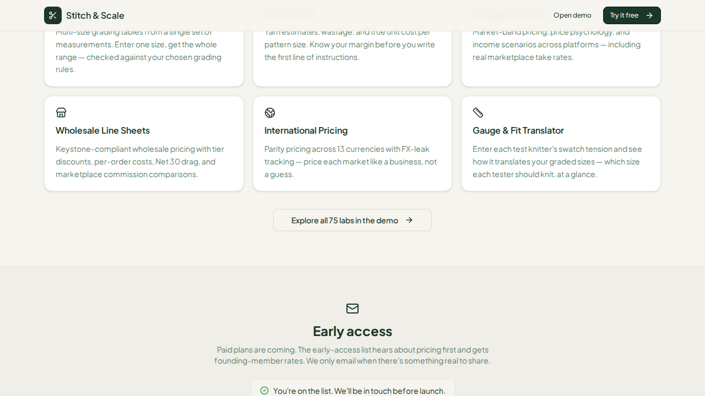
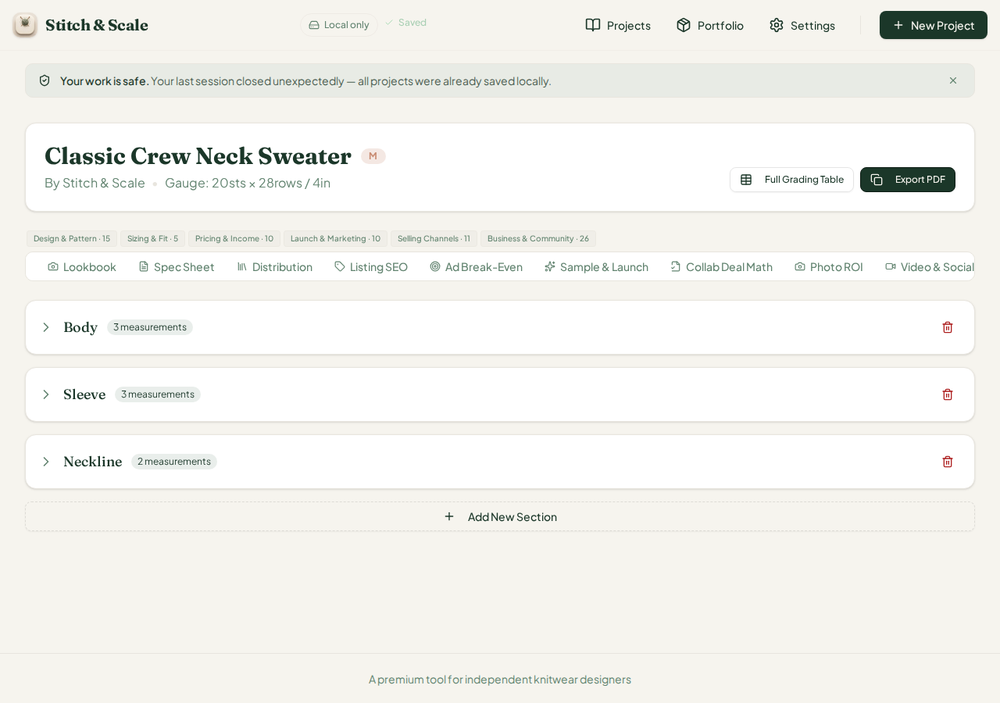
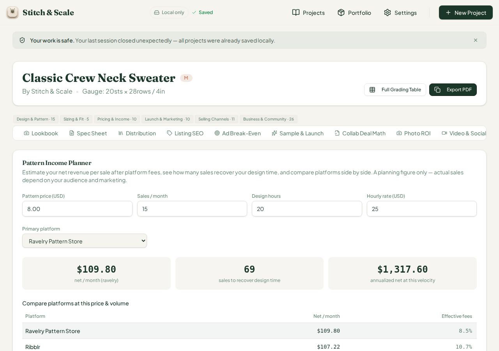
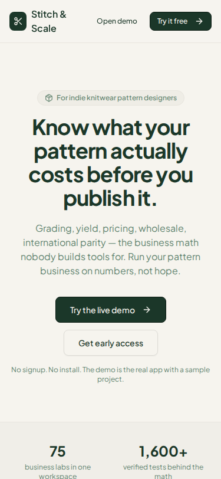
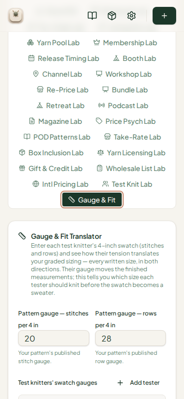

# QA Report — Cycle 46 (CHK-080: Gauge & Fit Translator, #50 fix, tab classification, /landing)

**This report is addressed to the Reviewer.** The Coder should not act on this report directly; use it to triage the defect and decide the right fix.

**Workspace:** `plastic-dude/stitch-and-scale-pro` · **Artifacts:** `stitch-and-scale` · **QA branch:** `qa/manus-2026-08-14-cycle39` · **Reviewed range:** `e7fb76f..2d1f4ad` · **QA role performed by:** Manus AI (third staff — QA tester) · **No `src/` code was modified; `main` untouched.**

## 1. Scope and baseline

CHK-080 (`bf1fb7d`) ships four pieces of work: the **Gauge & Fit Translator**, the 77th workspace tab, a weakness-conversion of the stitchscale.app rival's gauge-matcher with per-tester tension translation, size recommendations, and GF-01..GF-05 flags (`src/lib/gauge-fit-translator.ts`, 266 lines, plus a 417-line card and a new `projectStorage('gaugefit')` seam); the **fix for QA issue #50**, which renames the new Test Knit Lab's trigger to `testknitlab` so it no longer collides with the old Test-Knit Programme tab; **workspace tab classification** (`workspace-tab-groups.ts`, six groups with clickable legend chips); and a **/landing page** with hero, capability grid, live-demo CTA, and an early-access email queue to localStorage until Supabase wires in (`pages/landing.tsx`, 261 lines). Commit `2d1f4ad` is a playbook log only.

The baseline is clean: typecheck passes with zero errors, vitest **1,614/1,614 tests across 79 files** (+15 from this commit), production build completes in 7.90 s, and a fresh Vite dev server serves HTTP 200 on port 5173.

## 2. Engine hand-verification — Gauge & Fit Translator

The engine was executed independently via tsx against the real source, then each value was re-derived by hand. The mathematics are correct: widths and circumferences scale by the stitch ratio (tester sts ÷ pattern sts), lengths by the row ratio, and the recommendation picks the size whose translated value stays closest to its own nominal intent.

| Scenario | Engine (oracle) | Browser display | Match |
|---|---|---|---|
| Default: pattern 20/28, Tester A 22/30 | sr 1.100, rr 1.071, GF-01, "All testers off gauge" | sr 1.100 · rr 1.071, GF-01 banner | Exact |
| Three testers A 22/30, B 20/28, C 18/26 | A GF-01; B no flags; C sr 0.900, rr 0.929, GF-02; "Mixed tensions" | A GF-01; B clean; C 0.900/0.929 GF-02; "Mixed tensions" | Exact |
| Severe 24/35 | sr 1.200, rr 1.250, GF-01 + GF-05 | — (engine only) | Exact |
| Tight 18/26 | sr 0.900, GF-02 (5–10% band) | — (engine only) | Exact |
| Empty testers | verdict "Add at least one tester's gauge" | — (engine only) | Exact |

The sample project has no per-size graded rows by design, so the card correctly shows the placeholder path ("Translate will use placeholder sizes (XS–XL) until you add measurements in Grading Lab — the translation math works the same either way") and each tester's recommended size defaults to M. This is the intended behaviour, not a defect.

## 3. Browser testing

**Issue #50 fix — re-verified PASS in the live browser.** The workspace now carries three distinct trigger values (`testknit`, `testknitlab`, `gaugefit`) and clicking the "Test Knit Lab" tab opens the new pricing-lab panel rather than the old Test-Knit Programme roster. A QA-verified comment was posted on issue #50 recommending closure.

**Gauge & Fit Translator.** Defaults render with the pattern-gauge fields (20 sts / 28 rows) and a single Tester A at 22/30, firing GF-01 exactly as the engine specifies.

After adding two testers (B 20/28 on-gauge, C 18/26 tight), the panel shows three per-tester ratio readouts and flags exactly matching the oracle, with the "Mixed tensions — size recommendations diverge" verdict.

**/landing page.** The hero ("Know what your pattern actually costs before you publish it."), capability grid, and stats strip (75 business labs / 1,600+ verified tests / 13 currencies / 100% local-first) render, the email input is present, and the "Try the live demo" CTA routes to the demo project at `/project/mss5osqd88j6fdyvtdu`. Submitting a valid email queues it to `stitch-and-scale-early-access-queue-v1` as JSON with a timestamp, exactly as the code promises.

**Tab-group legend chips.** The six chips render above the strip (Design & Pattern · 15, Sizing & Fit · 5, Pricing & Income · 10, Launch & Marketing · 10, Selling Channels · 11, Business & Community · 26) and clicking "Pricing" scrolled the tab strip to the Pattern Income Planner as intended.

**Phone view (375 × 812).** The landing page fits cleanly with no horizontal clipping, and the translator card stacks into a single column with its group chip visible between the tab rows. The multi-row tab-wrap legibility observation from cycle 43 persists on the workspace generally but is unchanged by this commit.

## 4. Defect found this cycle — issue #52 (minor, display-only)

The new legend chips compute their counts from the static `TAB_GROUPS` list (59 entries) rather than from the live `TabsTrigger` elements in the workspace (75). Two consequences were verified programmatically against HEAD 2d1f4ad. First, **four stale entries** ("circumference", "direct", "length", "width") remain in the group list though their tabs no longer exist, so the chips over-count by 4 — they display 77 total while the strip renders 75 tabs. Second, **twenty live tabs are missing from the classification entirely**, including the brand-new `gaugefit`, `giftcard`, `intl-pricing`, `wholesale-pricelist`, and `pricing-psychology`; per `groupFor()` these silently fall into the "business" group, inflating "Business & Community" and leaving those tabs without a group divider. Suggested direction: derive chip counts from the live trigger list at render time, or add a unit test asserting full coverage, since every future lab will regress the same way the current list did.

| Observed | Expected |
|---|---|
| Chips total 77 (15/5/10/10/11/26) | Chips should total 75 (live trigger count) |
| 20 live tabs unclassified (default to "business") | Every live tab should have an explicit group |

## 5. Known-issues status

| Issue | Status this cycle |
|---|---|
| #48 Gift & Credit escheat dead state | Fixed cycle 44, verified — no regression |
| #49 fmtMoney dead currencies | Fixed CHK-079, verified cycle 45 — no regression |
| #50 Test Knit Lab dead tab | **FIXED by CHK-080 — verified in browser; QA-verified comment posted; may be closed** |
| #51 fmtMoney dead compound key `EUR/CHF` | Still unfixed — no code changed; not re-opened |
| #52 Tab-group legend stale counts / unclassified tabs | **Opened this cycle** (report §4) |

## 6. Test artefacts

Report, eleven screenshots (c46-01 through c46-11, each key interaction captured before and after), and four text dumps were committed to `qa/manus-2026-08-14-cycle39` under `qa/`. Last reviewed SHA updated to `2d1f4ad2c6aba76ec1fd34ed198c8903813020f5`.
